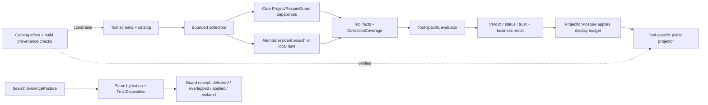

# Alembic 五个知识工具深度审计与修复 Requirement Design

Design Key: alembic-five-knowledge-tools-deep-audit-2026-07-11
Date: 2026-07-11
Status: design-complete-not-delivered
Owner Window: Design
Receiving Window: Wakeflow

## Confirmed Goal

以最新五仓源码为事实源，对 `alembic_search`、`alembic_recipe_map`、`alembic_prime`、`alembic_code_guard`、`alembic_graph` 做完整的契约—路由—核心能力—公开投影—消费者—测试链审计，区分已经修复的历史症状与仍存在的主线缺陷，并给出真实可落地、按风险排序、可用运行证据验收的修复设计。

Original Plan: `Design/docs/current/alembic-five-knowledge-tools-deep-audit-original-plan-2026-07-11.md`

## Design Principles

1. **Truth before convenience**：没有完成检查、证据不足、范围被截断时，宁可 `partial/degraded/blocked`，不能伪装 `ready/passed`。
2. **Limit affects presentation, not truth**：预算和 limit 可以缩短输出，但不能先删数据再计算 rollup、覆盖率或 verdict。
3. **Trust requires relevance plus provenance**：分数高不等于可信，源锚真实也不等于与当前任务相关；Prime 的 obey/use 层必须同时满足相关性与证据门。
4. **ProjectScope identity is structural**：跨仓节点 id、统计和 source ref 必须携带 repo/source-folder 身份，不能靠裸 package/target 名猜归属。
5. **Public contract mirrors failure semantics**：内层已经知道 missing/unreadable/partial/max-round/uncertain，公开投影不得把它们丢掉。
6. **Repository ownership stays real**：Plugin 负责 Codex MCP；Core 只负责共享确定性能力；Alembic 只负责 resident provider；Agent/Dashboard 不为形式覆盖制造改动。
7. **Architecture must land with consumers**：只允许增加共享叶子值对象、纯判定函数和真实收集器；禁止重建已经退役的统一 `KnowledgeContextToolOutput`、万能中间层或没有同阶段工具消费者的空抽象。
8. **Acceptance needs two project modes and a fresh host process**：AlembicWorkspace 多仓与 BiliDili 独立真实知识项目分别验收；MCP 更新后的证据只能来自加载新 dist 的临时 Codex 进程，且 host/selected/active project 必须一致。

## Final Completion Definition

Wakeflow 可接受本需求的必要条件如下：

- 五工具对 success/empty/partial/degraded/blocked/failure 的状态定义一致且有机器测试。
- 任何 `ready`、`passed`、`trusted-to-obey` 都能追溯到实际输入、完整覆盖、真实源证据和未被隐藏的错误。
- 五仓 ProjectScope 不再被固定 4-folder cap 截断；若用户预算主动限制，输出必须列出 omitted repos 和 `truncated=true`。
- Graph 节点 id 不会因跨仓同名 package/target 合并；relation 端点仍能 round-trip。
- Recipe map 的 total/mounted/deferred/uncovered/omitted 数量在 200+ Recipes 和 mount limit 下仍守恒。
- Search auto 的最终 top-N 来自跨 lane 合流后的统一排序；detail 操作携带与 search 同源 freshness。
- Prime 的 Guard rule、Recipe 和 region evidence 都经过明确的 trust gate；弱匹配只能进入 requires-verification。
- Code Guard 不会因为文件缺失、不可读、达到轮次上限或只运行单文件检查而给出误导性通过。
- 主仓不再维护会被误认为“实时 MCP schema”的无消费者影子；运行产物报告 source commit/build id。
- 多仓模式以 AlembicWorkspace 的五个产品仓为一个 project revision vector；Graph/Map/Search/Prime/Guard 的结果只引用该 project 的 repo/knowledge，不读取 BiliDili 事实。
- 独立项目模式以 BiliDili 的真实 Swift/SPM 源码和真实知识快照为语义验收；当前 75 条快照用于真实链，205+ 边界只在隔离扩展副本验证。
- stale、aligned、cross-project mismatch 三种姿态都有预期结果；stale/mismatch 不得成为 `ready`，aligned positive 不得在 revision/provenance 未对齐时启动。
- 所有相关产品测试通过，并完成双模式隔离 Test matrix 与 MCP fresh-process readback；原始截图只作为历史回归输入，不作为验收证据。

## User Scenario

- Actor: 希望理解、使用或维护 Alembic 的开发者/Host Agent。
- Starting state: Test 分别进入 AlembicWorkspace 多仓 project 与 BiliDili 独立 project；每个都有自己的源码 revision manifest、knowledge snapshot、selected/active identity 和 fresh MCP process，可处于 aligned、stale 或 intentional mismatch 姿态。
- Action: 开发者调用五个工具做搜索、结构导航、Recipe 挂载、写码前 Prime 和写码后 Guard。
- Expected result: 每个工具返回与真实执行一致的范围、证据、状态、遗漏和下一步；跨工具引用可追踪，错误不会被降成成功。
- Failure visibility: 文件/仓库/Recipe/语义 lane/freshness/ProjectContext 不可用时，返回具体、可恢复、不会被公开投影吞掉的诊断。

## Functional Loop

| Part | Description |
| --- | --- |
| Input | 明确 query、focus/ref、projectRoot、files/code、task requirement 和可选 budget/freshness。 |
| Producer | Plugin 公共 MCP handler；Core Search/ProjectContext/RecipeContext/Guard 能力；Alembic resident search provider。 |
| State/Data Change | 四个读取工具不产生持久写；Guard 只有明确声明的 violations/feedback 写。 |
| Consumer | Codex host、后续 `alembic_search get/expand`、Guard、开发者；Agent 仅是共享 Core 回归消费者。 |
| Output | 结构化 status、coverage、items/nodes/mounts/violations、evidence refs、diagnostics、next actions。 |
| Failure Path | invalid input / missing scope / stale / unavailable / truncated / unreadable / partial / internal failure 明确分支。 |
| User Verification | 两个 project 的 source/knowledge/runtime manifests、原始 MCP JSON、ProjectScope 列表、filesystem diff、fresh-window status readback 和 Test acceptance report。 |

## Latest-Code Reconciliation With Historical Screenshots

| Historical Observation | Latest-Code Finding | Current Conclusion |
| --- | --- | --- |
| Swift/Package.swift 仓库被错误归属或无法解析。 | Core `4d6bbc4`、`15ce811`、`59dc046` 与 Plugin `cc03c17`、`b98923e` 已补 Swift parser、SPM package/local package、target path 和 graph file-flow。 | 历史根因已部分修复，不再列为当前缺陷；必须用新五仓场景回归。 |
| 大量跨仓文件 graph parse 失败，图只能导航。 | 最新代码对 broad parser warning 有意抑制，Graph 明示 `sourceOfTruth:false`；但仍固定只取前 4 个 folders、节点 id 无 repo scope。 | “图不能证明调用关系”仍是正确边界；当前主要缺陷从 parser 支持转为完整性、身份和错误语义。 |
| Plugin 内部 schema 错误。 | 最近提交已修多处严格输出 schema 漂移；但 `CodeGuardInput` 一处公开 `primeRef`、另一处 description 又声称 primeRef 不公开。 | 旧炸链不能直接复述，但 schema/description/handler 单源仍未完成。 |
| Guard 显式文件模式仍能运行。 | 真实 handler 会静默过滤不存在路径、吞读取错误、projectRoot 级轮次 cap 后 force-pass。 | “能运行”不等于“检查完成”；存在当前主线 P0 假通过问题。 |
| host workspace 与 selected/active project mismatch，拒绝调用知识工具。 | 当前 Alembic 项目交接门仍报告 mismatch；本轮因此不把 BiliDili 知识当 AlembicWorkspace 事实。 | 这是安全边界，不是五工具产品 bug；真实 Test 必须分别覆盖 aligned 和 mismatch。 |

## Current Architecture And Ownership

| Layer | Real Owner | Five-Tool Responsibility |
| --- | --- | --- |
| Codex MCP catalog/schema/router/output | `AlembicPlugin` | 五工具唯一公共入口与公开语义所有者。 |
| SearchEngine / ProjectContext / RecipeContext / GuardCheckEngine | `AlembicCore` | 跨宿主共享的确定性能力与公共 package exports。 |
| resident semantic HTTP | `Alembic` | `/api/v1/search` provider；返回 Core search telemetry，不拥有 MCP 输出。 |
| in-process AI tool runtime | `AlembicAgent` | 有独立 `knowledge.search/prime`；不是 MCP `alembic_prime`，只做 shared-Core 回归。 |
| frontend | `AlembicDashboard` | 展示后端 Recipes/Guard/knowledge graph；不消费 Codex 五工具 MCP contract。 |
| real-project Test fixture | `BiliDili` | 独立 Swift/SPM source + real knowledge consumer；不拥有 Alembic 实现，只用于隔离验收。 |

## Confirmed Call Chains

### `alembic_search`

`McpServer` → `tool-router.routeSearchTool` → `handlers/search.search` → resident `/api/v1/search` + local Recipe region vectors + embedded Core `SearchEngine` → Plugin candidate/relevance projector → `AlembicSearchOutput`。

### `alembic_recipe_map`

`McpServer` → `tool-router.routeRecipeMapTool` → `handlers/recipe-map.recipeMap` → Plugin `ProjectGraphProvider.resolveProjectContextRegion` + Core `RecipeContextService` → deterministic mounting/rollup → `AlembicRecipeMapOutput`。

### `alembic_graph`

`McpServer` → `tool-router.routeGraphTool` → Plugin `ProjectGraphProvider` → Core `ProjectContextCapabilities.execute`（space/repo/map/module/file-flow/...）→ graph selection/output。

### `alembic_prime`

`McpServer` → `agent-public-tools.primeHandler` → Plugin `PrimeSearchPipeline` over Core `SearchEngine` + local Recipe region/locator evidence → `PrimeKnowledgeMaterial` trust layers → public Prime package/receipt。

### `alembic_code_guard`

`McpServer` → `agent-public-tools.codeGuardHandler` → inline `guardCheck` 或 files `guardReview` → Core `GuardCheckEngine` → Plugin Recipe enrichment / checkpoint / feedback → strict public Guard projection。

## Source Evidence Anchors

Line anchors are from the audited commits and must be refreshed if implementation starts from later HEADs.

| Finding Cluster | Current Source Anchor |
| --- | --- |
| Search lane merge and pre-ranking limit | `AlembicPlugin/lib/host-runtime/mcp/handlers/search.ts:325-343`, `:669-704`, `:793-804`, `:965-995` |
| Search detail freshness omission | `AlembicPlugin/lib/host-runtime/mcp/handlers/search.ts:176-186`, `:875-962` |
| Search hardcoded tool-quality intent | `AlembicPlugin/lib/host-runtime/mcp/handlers/search.ts:1410-1449` |
| Graph four-folder cap | `AlembicPlugin/lib/service/project-knowledge-context/project/ProjectGraphProvider.ts:483-519` |
| Graph unscoped package/target ids and first-wins store | `AlembicPlugin/lib/service/project-knowledge-context/project/ProjectGraphProvider.ts:854-896`, `:1571-1581`, `:2331-2346` |
| Graph status shadowing | `AlembicPlugin/lib/service/project-knowledge-context/project/ProjectGraphProvider.ts:3612-3628` |
| Graph public inputs | `AlembicPlugin/lib/shared/schemas/mcp-tools.ts:504-582`; provider usage scan found no behavior reads for freshness/detail/token/content/matrix/symbol inputs except `sourceEvidenceRefs` presence at provider `:3154-3164`. |
| Recipe map dropped focus/radius/detail behavior | `AlembicPlugin/lib/host-runtime/mcp/handlers/recipe-map.ts:116-165` |
| Recipe map one-page list | `AlembicPlugin/lib/host-runtime/mcp/handlers/recipe-map.ts:187-217` |
| Recipe map truncation before rollup | `AlembicPlugin/lib/service/project-knowledge-context/recipe-map/RecipeMapProvider.ts:80-118`, `:431-476` |
| Recipe map read operation writes/removes transport | `AlembicPlugin/lib/service/project-knowledge-context/recipe-map/RecipeMapProvider.ts:157-176`; `AlembicCore/src/service/plan/facts/transientTransport.ts:18-43` |
| Renamed/unknown ref semantics | `AlembicPlugin/lib/service/project-knowledge-context/recipe-map/mounting.ts:74-98`, `:282-345` |
| Prime raw Guard acceptance | `AlembicPlugin/lib/service/task/PrimeKnowledgeMaterial.ts:224-285`, `:346-380`, `:456-463` |
| Prime source-ref 200 cap | `AlembicPlugin/lib/host-runtime/mcp/handlers/agent-public-tools.ts:1350-1408` |
| Prime region kind/source loss | `AlembicPlugin/lib/host-runtime/mcp/handlers/agent-public-tools.ts:1600-1653` |
| Guard false pass / force pass / unreadable pass | `AlembicPlugin/lib/host-runtime/mcp/handlers/guard.ts:341-408`, `:418-489` |
| Guard public route and projection loss | `AlembicPlugin/lib/host-runtime/mcp/handlers/agent-public-tools.ts:892-955`; `AlembicPlugin/lib/host-runtime/mcp/public-tools/output.ts:199-210`, `:729-771` |
| Core cross-file ability exists | `AlembicCore/src/service/guard/GuardCheckEngine.ts:1669-1757`; Core tests call `auditFiles`, while Plugin public review calls `auditFile` per file. |
| Core Recipe pagination already exists | `AlembicCore/src/domain/recipe-context/RecipeContextContracts.ts:89-93`; `src/service/recipe-context/handlers/list.ts:11-29`; `src/recipe-context-capabilities.ts:129-159` expose `page/pageSize/total` and `listRecipes`. |
| Core repo-scoped ProjectContext identity already exists | `AlembicCore/src/domain/project-context/ProjectContextRefs.ts:49-63`; `src/service/project-context/map/map.ts:257-340` derive refs/ids from `repoId/sourceFolder`. |
| Plugin leaf/output boundary already exists | `AlembicPlugin/lib/service/project-knowledge-context/contracts/ToolOutputPrimitives.ts:1-74` retains small shared leaves while explicitly retiring the unified envelope; tool-local projectors remain under `lib/host-runtime/mcp/knowledge-context-tools/` and `public-tools/output.ts`. |
| Plugin catalog owns effect declarations | `AlembicPlugin/lib/host-runtime/mcp/PluginToolSurfaceCatalog.ts:108-193`, `:302-326` centralizes annotations for Map/Search/Graph/Prime/Guard. |
| Main shadow schema | `Alembic/lib/shared/schemas/mcp-tools.ts:146-169`, `:224-272`, `:592-612`; repository usage scan found production import count 0 and test-only imports. |
| Agent intentional internal prime | `AlembicAgent/src/tools/runtime/handlers/knowledge.ts:290-378` |
| Alembic resident provider | `Alembic/lib/http/routes/search.ts:122-230`, `:360-426`; Plugin ownership boundary at `AlembicPlugin/lib/host-runtime/policy/ServiceRequestBoundary.ts:15-52`. |
| AlembicWorkspace real knowledge/mismatch baseline | Read-only `alembic_status` structured output on 2026-07-11: 96 total / 91 active / 5 deprecated, host project mismatch, pure-local route. Raw repo lookup found the reported checkpoint commit only in `Alembic`, not as a five-repo vector. |
| BiliDili real knowledge/stale baseline | Read-only `alembic_status` plus raw git on 2026-07-11: 75 total / 68 active / 7 staging; clean HEAD `e25b2908a8b5`; checkpoint `adfb1bf...` is four commits/66 paths behind. |
| BiliDili five-source identity fixture | `BiliDili/README.md:37-52`, `:99-109`, `:129-131`; `BiliDili/Package.swift:24-27`, `:198-200`; `BiliDili/Packages/AOXPlayer/Package.swift:27-29`; raw submodule status records four package repos. |

## Problem Register

Severity meanings: P0 = can produce a false safety/trust conclusion; P1 = materially wrong/omitted result; P2 = contract/diagnostic debt that increases misuse; P3 = maintainability/provenance improvement.

### A. `alembic_code_guard`

| ID | Severity | Current Fact | User Impact | Required Repair |
| --- | --- | --- | --- | --- |
| G-01 | P0 | `guardReview` filters paths with `existsSync`; if all disappear, returns `passed:true` and “No changed source files detected”. | Typo/missing path is reported as clean code. | Resolve every requested path into coverage rows; missing/not-file/out-of-root blocks verdict; `passed` requires all requested files checked. |
| G-02 | P0 | read failure becomes a file result with `error` and zero violations; aggregate `passed = totalViolations === 0`. | Permission/encoding/read errors become pass. | Any file error makes status `incomplete`/`blocked`; expose fileErrors and checked/requested counts. |
| G-03 | P0 | round counter is keyed only by projectRoot; round >5 force-passes and clears violations. | Unrelated work shares rounds; unresolved violations disappear. | Scope counter by guard/work ref and content digest, or make calls stateless; round cap returns blocked/max-rounds, never passed. |
| G-04 | P1 | public review loops `auditFile`; Core `auditFiles` cross-file checks are not called. | Architecture/cycle/layer violations can never appear through public Guard. | Read files first, invoke one `auditFiles`, then enrich per-file and cross-file results. |
| G-05 | P0 | inner result has `passed`, `reviewRound`, `maxRoundsReached`, per-file errors and uncertainty; public projector drops them and outer status is always `ready` after handler return. | Host cannot distinguish clean, partial, forced or unreadable result. | Add public `verdict`, `coverage`, `fileErrors`, `reviewRound`, `maxRoundsReached`, `uncertain`, `crossFileViolations`; derive outer status from them. |
| G-06 | P1 | input says `operation=check` requires code and `review` requires files, but handler never reads `operation`; code presence wins. | Accepted input can execute a different mode than declared. | Add Zod cross-field refine and enforce mode in router; conflicting code/files returns invalid-input. |
| G-07 | P2 | `primeAlignment` increments adoption from suffix path overlap on every call, without idempotency or proof the rule influenced verdict. | Ranking/feedback can be inflated by repeated checks. | Record one receipt-bound feedback event only after checked coverage and explicit applied/used evidence; make event idempotent. |
| G-08 | P2 | schema publishes `primeRef`, but the same schema description and public-tool non-goal say primeRef is not public. | Host guidance and actual schema disagree. | Generate description/non-goals from the same public field registry and add honesty test. |

### B. `alembic_graph`

| ID | Severity | Current Fact | User Impact | Required Repair |
| --- | --- | --- | --- | --- |
| GR-01 | P0/P1 | repo collection executes `folders.slice(0, 4)` with no omitted-repo diagnostic. | A five-repo workspace necessarily drops at least one repo while output can appear complete. | Process all configured folders under bounded concurrency; if user budget caps repos, return `repoCoverage` and omitted ids. |
| GR-02 | P1 | ids such as `package:${name}` and `target:${name}` omit repo id; `NodeStore` keeps first duplicate. | Same-name nodes across repos silently merge; relations attach to the wrong owner or disappear. | Canonical id = project/repo/sourceFolder + local kind/name; relation builders consume canonical ids; add duplicate-name fixtures. |
| GR-03 | P1 | schema advertises `freshnessPolicy`, `detailLevel`, `symbolName`, `sourceEvidenceRefs` and budget fields such as token/content/matrix limits; provider ignores most, and `sourceEvidenceRefs` only changes “focused” detection. | Input looks supported but does not change result. | Implement each field with observable output/limits, or remove it in the same breaking cleanup; add input-effect tests. |
| GR-04 | P1 | normal error recording sets `partial=true`; `deriveGraphStatus` checks partial before errorCount, so degraded is effectively shadowed. | Parser/execution errors look like ordinary partial/no-match. | Separate `truncated/no-match` from `execution-error`; errors derive `degraded`, fatal build errors derive `failed`. |
| GR-05 | P2 | broad query weighting contains AlembicCore-specific path recognition. | A reusable plugin ranks its own repo layout specially and can suppress equivalent paths in other projects. | Replace product-name heuristic with ProjectContext ref kinds/ownership/entrypoint signals. |
| GR-06 | P2 | broad scans suppress non-explicit file-flow/file-symbol errors by design. | Graph is useful navigation but unsafe as call proof if caller misses the boundary. | Preserve `sourceOfTruth:false`, add coverage/error counters and required source-verification next action; never market map output as call proof. |
| GR-07 | P2 | multiple ProjectContext requests run sequentially without a provider-local deadline/concurrency budget. | Large multi-repo query can time out or hang before returning bounded partial evidence. | Add bounded pool, per-request timeout and deterministic partial aggregation. |

### C. `alembic_recipe_map`

| ID | Severity | Current Fact | User Impact | Required Repair |
| --- | --- | --- | --- | --- |
| RM-01 | P1 | handler builds `rawFocus` with repoId/moduleName/sourceRef, but `RegionFocus` only passes kind/refId/filePath/line; radius is never sent to region resolver; detailLevel is echo-only. | Valid inputs appear accepted but do not focus or resize the map. | Resolve repo/module/sourceRef to canonical ProjectContext ref and pass normalized radius; implement detail levels or remove fields. |
| RM-02 | P0/P1 | mounts are sorted/sliced to `recipeMountLimit` before rollups and node counts are computed. | Rollup counts describe the output slice, not the real region. | Keep `allMounts` for truth calculation; derive rollups/counts first; slice only `recipeMounts` presentation and report omitted count. |
| RM-03 | P1 | RecipeContext `list` uses pageSize 200 once. | 201st+ Recipe is absent from mounts, uncovered counts and totals. | Exhaust deterministic pagination or add Core batch/direct-id API if public pagination cannot guarantee completion. |
| RM-04 | P1 | `renamed` row stores `newPath` but mount selection uses old `filePath`; unknown statuses normalize to active. | Renamed Recipe can mount to old/wrong node; future status values are trusted silently. | Use newPath as effective path for renamed refs; unknown status -> unresolved + diagnostic, never active. |
| RM-05 | P1 | catalog says read-only; large output writes `.asd/tmp/recipe-map-<projecthash>.json`, small output removes it. | Read call mutates local state and invalidates a prior `fullMapRef`. | Make map truly read-only: deterministic pagination/continuation and recomputation; if export is needed, create a separate explicit local-write operation/tool. |
| RM-06 | P1 | one filename per project means concurrent/serial large calls overwrite each other; returned ref can contain a local filesystem path. | A ref can open a different request’s result and leak non-portable path data. | Remove singleton transient file from read path; use opaque request-bound continuation or immutable content-addressed artifact with truthful annotation. |
| RM-07 | P1 | map uses Graph’s 4-folder region. | Recipe mounts inherit missing repo coverage. | Fix GR-01 first; map exposes the same repoCoverage. |

### D. `alembic_search`

| ID | Severity | Current Fact | User Impact | Required Repair |
| --- | --- | --- | --- | --- |
| S-01 | P1 | auto merge inserts embedded keyword items before semantic items; Map dedupe preserves insertion order; pipeline slices to limit before later candidate ranking. | High-value semantic-only result can be dropped behind lower-value keyword items. | Merge all lane candidates, normalize lane scores or use stable RRF, globally rank, then limit; keep lane provenance. |
| S-02 | P1 | search builds git-diff checkpoint posture; get/expand directly returns knowledge-service detail and never evaluates checkpoint freshness. | Caller can retrieve stale exact knowledge as `ready` without warning immediately after search said stale. | Apply shared retrieval posture to all operations; exact detail may return data but status must be partial/degraded with stale evidence. |
| S-03 | P2 | special “MCP tool quality intent” logic hardcodes four tools and Alembic-specific terms, excluding code_guard. | Intent admission requires ongoing hand-maintained product-name exceptions. | Replace with generic structured intent anchors and tool catalog metadata; test arbitrary current/future tool sets. |
| S-04 | P2 | activeFile/module/source context is intentionally ignored for ranking and only returned under `ignoredInputs`/follow-up guidance. | Host may assume locality affects retrieval when it does not. | Keep ignoredInputs prominent and adjust descriptions; only add locality ranking if backed by a separate confirmed design. |
| S-05 | P2 | schema source uses `.passthrough()` while routed wrapper tests expect strict unknown-field rejection. | Implementation works through outer strict wrapper, but source comment/shape obscures the true boundary. | Make strictness explicit at the canonical schema and keep one honesty test at the actual router boundary. |

### E. `alembic_prime`

| ID | Severity | Current Fact | User Impact | Required Repair |
| --- | --- | --- | --- | --- |
| P-01 | P0 | related knowledge needs trusted evidence and score >=0.45; raw Guard rules only need the search pipeline’s >=0.3 filter, then all become acceptedGuards/trusted-to-obey. | Weak or unanchored rule can be presented as mandatory. | Give rules the same relevance+provenance gate; weak/unanchored rules go to requires-verification. |
| P-02 | P1 | local region hit projection hardcodes `kind:'pattern'`, empties sourceRefs and promotes semantic region evidence to accepted knowledge. | Rule/fact identity is lost; host cannot verify source while trust layer says use it. | Batch hydrate recipe metadata/source refs by id before trust; missing metadata stays verification-only. |
| P-03 | P1 | source-ref locator fallback and hit locator each list only first 200 Recipes. | Valid hit after row 200 can degrade to no trusted evidence. | Use direct ids/batched lookup or full pagination. |
| P-04 | P2 | local-only pipeline failures still emit `resident-unavailable` and “structure-first” legacy wording. | Debugging points to a removed lane and wrong repair action. | Rename reasons to actual local-search/region/locator failure and include failing lane. |
| P-05 | P1/P2 | remembered Prime record contains acceptedKnowledge but not acceptedGuards; Guard adoption uses path overlap rather than actual applied rule. | Prime→Guard receipt is incomplete and feedback does not prove adoption. | Persist both trust layers in bounded session record; Guard reports delivered/applied/violated ids separately. |
| P-06 | P2 | PrimeSearchPipeline compares raw scores across auto search routes with fixed 0.3/relative/gap thresholds. | Route score calibration changes can alter trust admission unexpectedly. | Normalize or use route-aware thresholds; tests cover lexical, FWS/RRF and semantic score bands. |

### F. Cross-Repository And Runtime

| ID | Severity | Current Fact | User Impact | Required Repair |
| --- | --- | --- | --- | --- |
| X-01 | P1/P2 | `Alembic/lib/shared/schemas/mcp-tools.ts` describes old search/recipe-graph/`alembic_guard`; production imports were not found, but tests call it the live served surface. | Maintainers can audit or fix the wrong schema and produce duplicate truth. | Import/consumer scan; remove dead MCP map or rename to an explicit historical fixture; actual public contract remains Plugin-owned. |
| X-02 | P2 | loaded refresh metadata records source gitHead and entry hash, but dist has no independently checked source-commit manifest; current HEAD can move after build. | Historical runtime reports cannot prove exactly which source was executed. | Emit build provenance `{repo, commit, builtAt, coreCommit}` into dist and status/diagnostics; validate on dev refresh. |
| X-03 | boundary | Agent internal `knowledge.prime` intentionally lacks host trust receipt/checkpoint and uses top scores directly. | Shared SearchEngine changes may affect a second consumer differently. | Keep intentional boundary; add consumer regression when Core search semantics change, not MCP contract unification. |
| X-04 | no-task | Dashboard graph/search/guard UI consumes Alembic HTTP, not Codex MCP five-tool outputs. | Forcing Dashboard work would create an unused contract. | Dashboard remains no-task unless a confirmed HTTP/UI effect appears. |
| X-05 | boundary | Current host/active project mismatch makes project knowledge unsafe as evidence. | A “live” audit from this workspace could cite BiliDili facts as AlembicWorkspace facts. | Preserve fail-closed gate; run aligned/mismatch cases only in later isolated Test. |
| X-06 | P0/P1 | 2026-07-11 status probe reports both projects `freshness=current`, but BiliDili knowledge checkpoint is 4 commits/66 files behind its clean HEAD; AlembicWorkspace uses one checkpoint commit that belongs only to the `Alembic` repo rather than a five-repo vector. | Stale or partially aligned knowledge can be presented as current, invalidating Search/Prime/Map conclusions and real-Test setup. | Add project-scoped `SourceRevisionManifest`; aligned requires every configured repo/submodule and knowledge snapshot to match, while stale/unknown derives degraded/blocked. Keep current observations as negative fixtures, not positive evidence. |

## Root-Cause Clusters

1. **Truth computed after truncation**: Graph repo cap, map mount cap, 200-row lists and Search pre-ranking limit all discard data before a truth-bearing conclusion.
2. **Inner failure semantics lost at public projection**: Guard is the strongest case; Graph status and map input echo have the same pattern.
3. **Trust layers are asymmetric**: Prime applies evidence and score gates to Recipes but not Guard rules; region evidence changes type/anchor semantics.
4. **Scope identity is under-modeled**: repo id absent from graph node ids; projectRoot-only Guard round state; one map artifact filename per project.
5. **Duplicate or aspirational contracts**: schema fields are accepted but not consumed; main repo shadows Plugin schemas; annotations disagree with side effects.
6. **Freshness is scalar in a revision-vector world**: one checkpoint/status label cannot prove a five-repo or root-plus-submodules project is aligned.

## Architecture Repair Versus Targeted Repair

### Classification Rules

| Repair Mode | Use When | Must Not Become |
| --- | --- | --- |
| `architecture` | 同一错误模式跨越两个以上工具，或涉及结论强度、ProjectScope 身份、信任、所有权、持久副作用等系统语义。 | 统一大信封、万能 service、跨仓职责迁移或无消费者基础层。 |
| `hybrid` | 需要共享机制封住复发路径，同时仍有明确的 handler/provider 局部缺陷必须改。 | 只建共享类型不迁移工具，或只修一处让其它工具继续复发。 |
| `targeted` | 单一模块的分支、字段、循环、文案或启发式错误，现有架构足以表达正确行为。 | 借机重构无关模块或扩大产品能力。 |
| `preserve / no-change` | 当前行为是正确边界，或仓库没有真实消费者。 | 为了“覆盖五仓”制造任务。 |

严重度与修复模式是两个维度：P0 缺陷可以是 targeted，P2 问题也可能必须用 architecture 解决。

### Architecture / Hybrid Clusters

| Architecture ID | Problem IDs | Why Local Patches Are Insufficient | Shared Mechanism | First Real Consumers |
| --- | --- | --- | --- | --- |
| A-01 Conclusion Integrity | G-01/G-02/G-03/G-05, GR-04, S-02 | 每个工具各自派生 ready/pass/degraded，内层错误很容易在下一层再次丢失。 | 共享叶子 `CollectionCoverage` / `Completeness` / `ConclusionDisposition` 和纯状态判定；各工具仍保留自己的 output schema。 | Guard verdict 与 Graph status 必须与机制同阶段迁移。 |
| A-02 Fact Collection vs Presentation | GR-01/GR-07, RM-02/RM-03/RM-07, S-01, P-03 | repo/page/candidate 在计算真相前被 cap；修一个 slice 不会阻止其它入口重复。 | `FactCollectionResult<T>` 记录完整度、失败、遗漏、continuation；`ProjectionLimit` 只在结论完成后裁展示。 | Graph repo collection、Recipe Map pagination/rollup、Search lane fusion。 |
| A-03 Project-Scoped Identity | GR-02 | 裸 package/target 名无法在多仓空间唯一；继续在 Plugin 造第二套身份会与 Core 漂移。 | 复用 Core 已有 `ProjectContextRef.id` 与 `scope.repoId/sourceFolder`；Plugin 公共 node id 由 ref/scope 派生。 | Graph node/relation；Map 继续 round-trip 相同 refs。 |
| A-04 Retrieval Evidence And Trust | P-01/P-02/P-05/P-06, G-07 | Search score、source locator、Recipe kind、drift 和 Guard adoption 现在分散判断，导致 obey/use 不对称。 | `RetrievalEvidence` → metadata/source hydration → `TrustDisposition` → receipt/application evidence；分开 delivered/overlapped/applied/violated。 | Search evidence projection、Prime trust、Guard receipt feedback。 |
| A-05 Contract, Effect And Provenance | G-08, GR-03, RM-01/RM-05/RM-06, S-05, X-01/X-02/X-06 | schema、description、handler、annotation、output、project revision 与 dist commit 各自维护，局部改动会再次形成“接受但不生效”“只读但写盘”或“单仓 checkpoint 假装多仓 current”。 | 以 Plugin tool catalog 为索引的字段消费/效果/输出 honesty checks；read-only 零写测试；project `SourceRevisionManifest` + build provenance；主仓影子删除规则。 | Recipe Map effect、Graph/Map inputs、Guard primeRef、两个 project mode 的实际 dist/status。 |

### Targeted-Only Repairs

| Targeted ID | Problem IDs | Local Repair | Why No New Architecture Is Needed |
| --- | --- | --- | --- |
| T-01 Guard execution mechanics | G-04/G-06 | files 路径一次读入后调用 Core `auditFiles`；Zod/handler 强制 check↔code、review↔files。 | Core 已有 `auditFiles`，Plugin 现有 schema/refine 和 handler seam 足够。 |
| T-02 Graph heuristic cleanup | GR-05/GR-06 | 删除 AlembicCore 特判；保留 `sourceOfTruth:false` 并强化 source verification next action。 | 这是局部 ranking/guidance 规则，不需要共享服务。 |
| T-03 Recipe ref state mapping | RM-04 | renamed 使用 `newPath`；未知 status 归 unresolved 并给诊断。 | Core 已经交付 status/newPath，问题仅在 Plugin normalizer/selector。 |
| T-04 Search intent honesty | S-03/S-04 | 删除硬编码四工具质量意图例外；让 schema/ignoredInputs 明说 activeFile/module 不参与排序。 | 不改变 retrieval architecture，只修 admission/description。 |
| T-05 Prime diagnostics | P-04 | 用真实 local-search/region/locator failure code 替换 resident/structure-first 旧文案。 | 纯错误分类和文案修复。 |
| T-06 Repository boundary preservation | X-03/X-04/X-05 | Agent 仅做共享 Core 回归；Dashboard no-task；保留 host mismatch fail-closed。 | 当前边界本身正确，不能用新架构覆盖。 |

### Unified Judgment

- 不能把所有问题都升级成“架构重构”：`auditFiles` 未接、`newPath` 未用、旧文案和硬编码属于明确的局部缺陷，应直接修。
- 也不能把所有问题都拆成点补丁：完整度、结论、身份、信任和副作用契约已经跨工具重复，继续局部修会再次产生 schema/handler/output 不一致。
- 最终方案是 **5 个共享完整性机制 + 每工具局部闭环**。共享机制只提供叶子类型、纯规则和有界收集器；每个机制在同一阶段至少接入一个真实工具并通过工具级验收。

## Option Planning

### Decision To Make

需要决定的是：在不移动现有仓库职责、不减少用户能力的前提下，是只封堵最高危症状，还是重建五工具共同的“完整覆盖后再下结论”语义；以及公共 MCP 契约是否继续由 Plugin 单独拥有。

### Option 1: 最高危点补丁

- Summary: 只修 Guard missing/unreadable/force-pass，并给 Graph 四仓 cap 增加 warning；其余 contract、排序、分页和 transport 保持现状。
- User-visible behavior: 最危险的假通过消失，Graph 至少声明可能漏仓；Search/Prime/Map 的结果仍可能不完整或失真。
- Repositories/windows: 仅 AlembicPlugin。
- Interfaces/contracts: Guard 公共输出增加 verdict/coverage；Graph 只增加诊断，不改变 id/region。
- Data or state ownership: 不变。
- Validation path: Guard 失败分支测试、Graph 5-repo warning 测试。
- Rollout or migration: 最小、可快速落地；不涉及 ref 迁移。
- Risks: 把系统性缺陷留到后续；map 错误 rollup、Search semantic 淘汰、Prime 弱 rule 信任仍然存在。
- Reversibility: 高。
- Open decisions: 是否把它作为紧急 P0 独立提交，而不是完整需求的终点。
- Fit: 只适合作为推荐方案的第一阶段；不能满足本需求最终完成定义。

### Option 2: 分阶段 Truth-First 修复（推荐）

- Summary: 先修 Guard 结论门，再修 Graph/Map 完整性，再修 Search/Prime 证据与信任，最后清理影子契约和构建 provenance；每阶段都保持现有工具名和主要用户入口。
- User-visible behavior: 五工具从“尽量给结果”变为“只有覆盖和证据充分才给强结论”，否则明确 partial/degraded/blocked。
- Repositories/windows: Plugin 主责；Core 仅为实际缺少的共享 API；Alembic 负责 resident compatibility、影子清理和 provenance；Agent 回归；Dashboard 默认 no-task。
- Interfaces/contracts: 扩展 Guard verdict/coverage、Graph repoCoverage、Map conservation、Search freshness、Prime trust evidence；删掉或实现 no-op 字段。
- Data or state ownership: 知识/ProjectContext/Guard 数据仍归现有 Core/Alembic；Plugin 只拥有 host MCP 投影与短期 session receipt。Map read path 去掉可变临时文件。
- Validation path: 产品契约/单测先行，随后在 fresh MCP processes 中运行 AlembicWorkspace 多仓与 BiliDili 独立真实知识双模式、205+ boundary、filesystem/alignment/isolation matrix。
- Rollout or migration: P0-P4 分阶段；Graph id 改动提供只读兼容解析器，确认无真实旧 ref 消费者后删除；Map continuation 先落地再移除 fullMap 文件。
- Risks: Plugin 改动面大；id/continuation 兼容需要真实消费者证据；排序变化需要对抗性 fixture。
- Reversibility: 中高；阶段与提交可独立回滚，数据所有权不迁移。
- Open decisions: Test 环境和 fresh-window 方法已由用户确认；controller 仍需确认 phase promotion、隔离 data-root 绑定方案，并由实现证据证明是否真需 Core API 变更。
- Fit: 唯一同时满足完整性、真实性、职责边界和可验证性的方案。

### Option 3: 将五工具下沉到 Core 或 Alembic 主仓

- Summary: 把公共 schema/handler/output 从 Plugin 移入 Core 或 Alembic，以消除跨仓适配层。
- User-visible behavior: 理论上减少一层投影，但 Codex host、resident HTTP 与共享 Core 被耦合在一起。
- Repositories/windows: Core/Alembic/Plugin 全面迁移，Agent/Dashboard 受共享包/API 震荡影响。
- Interfaces/contracts: MCP host 语义进入 headless Core 或 daemon 主体；需要新适配、兼容与发布路径。
- Data or state ownership: 容易把 host session/receipt/skill policy 错放到共享或 resident 层。
- Validation path: 全量 package、daemon、Plugin、Agent、Dashboard 回归和发布兼容测试。
- Rollout or migration: 高风险双写/双路由迁移，删除旧 Plugin 路由前必须维持两个真相源。
- Risks: 违反现有明确职责，形成更大耦合和新影子契约，修复周期远超问题本身。
- Reversibility: 低。
- Open decisions: 只有用户明确要求重构产品边界时才有讨论价值。
- Fit: rejected；与当前仓库规则和用户“不扩产品能力”的完成定义冲突。

### Option 4: 降级或关闭复杂能力

- Summary: Graph 正式只支持最多四仓，Map 不提供 oversized 完整结果，Prime 不交付 Guard rules，Guard 达轮次后只停止。
- User-visible behavior: 部分风险通过减少能力规避，但五仓分析、完整 map 和 Prime 规范注入被降级。
- Repositories/windows: 主要是 Plugin 文档/schema/行为删除。
- Interfaces/contracts: 删除输入/输出面，可能破坏真实消费者。
- Data or state ownership: 简化，但没有修正底层事实。
- Validation path: 删除/降级兼容测试与用户可见行为确认。
- Rollout or migration: 必须先找到所有消费者并取得用户明确降级授权。
- Risks: 用能力缩水替代正确性；直接违背本需求“五仓深入检查和真实修复”。
- Reversibility: 中，但恢复需要重新实现被删能力。
- Open decisions: 无当前授权。
- Fit: rejected。

### Recommendation And Invalidation Evidence

Design 推荐 Option 2，并把 Option 1 作为其 P0 紧急安全阶段，而不是独立终点。以下证据会迫使方案重新评估：

- 实现时证明某个当前 schema 字段、旧 graph id 或 `fullMapRef` 路径存在不可迁移的真实消费者；
- Core 当前公共 exports 无法支持完整分页、ProjectContext scope 或 `auditFiles`，且在 Plugin 内补救会复制确定性能力；
- 同 commit 真机证据推翻本设计中的关键调用链或证明当前问题只存在于未加载的 source、而不在实际 runtime。

该选择不需要新增产品 ADR：Plugin 拥有 Codex MCP 已是现有硬边界。若未来用户决定迁移所有权，再单独形成 ADR 候选。

## Unified Knowledge Tool Integrity Architecture

本需求采用 **Knowledge Tool Integrity Architecture** 作为五工具的统一修复骨架。它不是第六个工具、统一大信封或新的跨仓服务，而是落在 `AlembicPlugin` 现有 tool catalog、service、handler 和 output projector 之间的一组共享叶子事实、纯判定规则与有界收集器。五个工具继续保留各自 schema、业务输出和用户语义。

### System Invariants

| ID | Invariant | Observable Failure If Violated |
| --- | --- | --- |
| I-01 | 结论强度不得超过证据完整度：`passed` / `ready` / `trusted-to-obey` 只能由 complete evidence 支持。 | 未读取文件仍通过、部分仓库仍 ready、弱规则仍 obey。 |
| I-02 | 只有 collection complete 时才能给 exact total；partial/unknown 只能给 lower bound 或 unknown。 | 先截断后汇总却返回精确数量。 |
| I-03 | presentation limit 只能裁剪返回视图，不得改变候选事实、rollup、verdict 或 trust 判断。 | `limit` 改变真相而不只是展示。 |
| I-04 | ProjectScope 公共身份必须派生自 Core `ProjectContextRef.id` 与 `scope.repoId/sourceFolder`，不得仅用裸名称。 | 不同仓库同名 package/target 合并。 |
| I-05 | `trusted-to-obey` 必须同时满足 relevance、hydrated kind、active source provenance 和 non-degraded retrieval。 | semantic region 的弱 Guard hit 被直接执行。 |
| I-06 | 外层 public projector 不得丢掉内层 failure、coverage、freshness 或 uncertainty。 | Core/handler 已失败，MCP 外层仍显示成功。 |
| I-07 | catalog 标记为 read-only 的工具必须在测试中证明零持久/临时文件写入；有写入的动作必须改为显式 effect。 | Recipe Map 一边声明只读一边创建/删除单例文件。 |
| I-08 | 每次验收必须核对 project-scoped source revision vector、knowledge snapshot/checkpoint、实际加载的 Plugin/Core commits、build time 和 entry hash。 | 单仓 checkpoint 被误当成五仓 current，或 source 已修复但 host 仍运行旧 dist。 |

### Concrete Shared Leaves And Existing Seams

| Shared Leaf / Pure Policy | Existing Seam To Extend | Concrete Fields / Rule | First Consumers | Explicit Boundary |
| --- | --- | --- | --- | --- |
| `CollectionCoverage` | Plugin `ToolOutputPrimitives.ts` + tool-local collectors | scope、discovered、attempted、succeeded、failed、omitted、`complete\|partial\|unknown`、optional continuation | Guard、Graph | 不包含工具业务结果，不成为通用 output envelope。 |
| `ProjectionPosture` | Plugin per-tool output projector + output budget | truth count posture、returned、omitted、truncated、reason；先算真相再裁展示 | Graph、Recipe Map、Search | 不改变 Core 数据所有权，不隐藏 tool-specific limits。 |
| `ConclusionDisposition` | Tool-local status/verdict/trust projector | 输入 coverage/failure/evidence，纯函数输出允许的最高结论 | Guard、Graph，随后 Prime | 不用一个统一 status 替代各工具的 verdict/status/trust。 |
| `EvidencePosture` | Search evidence projection、Prime hydration、Guard receipt | lane、relevance、source provenance、source status、freshness、trust disposition | Search → Prime → Guard | session receipt 仍是 Plugin 短期状态，不进入 Core 持久层。 |
| `EffectPosture` | `PluginToolSurfaceCatalog.ts` annotations + contract tests | read-only/local-write、字段消费证明、零写断言 | Recipe Map、Graph、Guard | 不为保持旧 annotation 而隐藏副作用。 |
| `SourceRevisionManifest` | project registration/status + ProjectContext repo scope | projectId、每个 repoId/sourceFolder 的 commit/dirty fingerprint、knowledge snapshot/checkpoint/scannedAt | Graph、Search/Prime/Map freshness + Test preflight | 多仓不能用任意单一 repo commit 代表全项目；不把 `freshness=current` 文案当 manifest。 |
| `BuildProvenance` | Plugin build/status surface + Alembic runtime status where applicable | pluginCommit、coreCommit、builtAt、entryHash、fresh-process-startedAt | actual host/runtime + Test | 不把 refresh metadata 或旧 Codex 进程猜测成 source/runtime 一致性证明。 |

Core 当前已经公开 RecipeContext `page/pageSize/total`、repo-scoped `ProjectContextRef` 和 `GuardCheckEngine.auditFiles`。因此这些共享叶子默认只在 Plugin 组合现有能力；**不创建第二套 Core pagination、identity 或 Guard engine**。只有实现窗口用可复核代码/测试证明当前 public export 无法支持真实消费者时，才把 Core 变更升级为待用户/controller 复核的条件任务。

### End-To-End Data And Decision Flow



关键顺序是 `collect → reconcile coverage → decide → project`，而不是 `collect → slice → decide`。Search、Prime、Guard 之间只共享证据与 receipt 语义，不共享一个万能 service；Graph 与 Recipe Map 共享 ProjectScope identity/coverage 语义，但仍独立计算自己的 nodes、mounts 和 rollup。

### Tool-Level Architecture And Targeted Closure

| Tool | Architecture / Hybrid Work | Targeted Work | Binary Acceptance |
| --- | --- | --- | --- |
| `alembic_code_guard` | 接入 A-01/A-04/A-05；coverage 驱动 verdict，Prime receipt 区分 delivered/overlapped/applied/violated，public projector 保留内层失败。 | 一次校验所有路径后调用现有 Core `auditFiles`；强制 operation↔files/code；删除 round-cap force-pass。 | 任一 missing/unreadable/out-of-root/mandatory uncertainty 或跨文件失败均不能 `passed`；read/check 集合逐项守恒。 |
| `alembic_graph` | 接入 A-01/A-02/A-03/A-05；全 ProjectScope collection、Core ref-derived ids、partial/omitted status、真实 effect。 | 删除 `folders.slice(0, 4)`、Core 特判和无效输入；解析失败与 no-match 分开。 | 五仓全部出现或逐仓列出失败/省略；重复名称 id 不冲突；每个保留输入改变结果。 |
| `alembic_recipe_map` | 接入 A-02/A-03/A-05；候选全集与展示投影分离，opaque continuation request-bound 且只读。 | 透传 focus/radius；循环现有 Core page API；renamed 用 `newPath`，unknown → unresolved；移除单例 fullMap 写盘。 | 205+ Recipes 与低 mount limit 下 conservation 恒成立；两次并发大请求互不覆盖；filesystem 零写。 |
| `alembic_search` | 接入 A-01/A-02/A-04/A-05；各 lane 收集后归一证据、去重、全局融合排序，再投影 limit；search/get/expand freshness 一致。 | 删除四工具硬编码意图例外；activeFile/module 要么真实参与排序，要么拒绝/标 ignored。 | keyword 饱和时高价值 semantic-only 结果仍可进入 top-N；stale detail 明确 degraded。 |
| `alembic_prime` | 接入 A-02/A-04；Search evidence 先 hydration，再由同一 trust policy 处理 Recipe 与 Guard Rule。 | 循环 locator/page；修正 local lane diagnostics；为未校验 kind/source 的 region hit 降级。 | 0.3 弱 Guard 永不 `trusted-to-obey`；只有 active hydrated Rule 越过 gate；>200 refs 不静默遗漏。 |
| Cross-repository | A-05 contract/effect/provenance；Plugin 是 live MCP 真相源。 | Alembic 旧 schema 在 consumer scan 后删除/降级；Agent 仅在 Core 真变更时回归；Dashboard no-task；保留 project mismatch fail-closed。 | live schema 唯一、加载 commit 可验证、无假性五仓任务。 |

### Anti-Abstraction And Migration Rules

- 不恢复已退役的 `KnowledgeContextToolOutput` 统一中间层，不创建 universal knowledge service，不新增持久化。
- 共享 leaf 必须与至少一个真实消费者、失败 fixture 和 public output assertion 同一提交/阶段落地；禁止“先建层，后续再接”。
- P0 紧急修复直接采用最终 `CollectionCoverage` / `ConclusionDisposition` 形状，后续阶段不得再平行造 temporary verdict 类型。
- `SourceRevisionManifest` 是 A-05 provenance 的 project-scoped 叶子，不是新的项目数据库；standalone 也记录 root/submodule vector，多仓记录五产品仓 vector。
- Graph id 兼容只为实施时发现的真实存量消费者提供有界只读解析；没有消费者证据就不保留永久双 id。
- Recipe Map 的 oversized 读取使用只读重算或 request-bound opaque continuation。若未来真实消费者需要导出文件，必须另建显式 local-write action 并重新确认 scope，不能藏在 map read path。
- 每个 schema 字段必须有 handler 消费测试或明确 compatibility/ignored marker；没有真实行为且无兼容消费者的字段删除。

## Real Landing Plan

### Phase Candidates

Phases are candidates for later controller review. They are not task packages and are not authorized for dispatch by this document.

| Phase | Goal | Producer / Consumer Order | Completion Signal |
| --- | --- | --- | --- |
| P0 Safety containment with final leaves | 先封住 false pass/ready/trust：Guard 文件/轮次失败、Graph omitted repo、Prime weak Rule 均 fail-closed。 | Plugin 先扩展最小 coverage/conclusion leaves，并让 Guard、Graph、Prime 的高危分支直接消费；不等待其它重构。 | 缺文件、第五仓遗漏、弱 Rule 都不能成为强结论；P0 没有临时平行 contract。 |
| P1 Integrity spine + structural consumers | 完成 A-01/A-02/A-03 基础规则；Guard/Graph 全量迁移；Map 完整收集、Core identity 和 presentation 分离。 | Plugin 复用 Core 现有 `auditFiles`、pagination、ProjectContext refs；Graph identity/coverage 先于 Map region/ref round-trip。 | 5+ repo、重复名称、205+ Recipes 均满足 coverage/count conservation；Core 无重复能力。 |
| P2 Retrieval and trust chain | 完成 A-04：Search 全局融合/freshness → Prime hydration/对称 trust → Guard receipt feedback。 | Alembic resident provider 契约先保持兼容；Plugin Search evidence 是 Prime 输入，Prime receipt 是 Guard 反馈输入。 | semantic top result 不被前置 limit 淘汰；stale 明确降级；弱 Guard 永不 obey；反馈事实不混为 adoption。 |
| P3 Contract, effect and provenance | 完成 A-05 与 remaining targeted repairs：字段生效/删除、Map 零写 continuation、catalog honesty、主仓 shadow 清理、build provenance。 | 先做真实 consumer/import scan，再删影子；Plugin dist provenance 与 Alembic runtime status 在真实加载链核对。 | 一个 live MCP schema 真相源；read-only 零写；所有保留字段有行为证据；runtime 与 source commit 可核验。 |
| P4 Dual-mode fresh-process acceptance | 产品仓自检后，刷新 MCP，并在两个新临时 Codex 窗口分别运行 AlembicWorkspace 多仓与 BiliDili 独立项目 matrix。 | Plugin/Alembic 自检；Core/Agent 仅在 Core 真变更时回归；每个 mode 先切 selected/active project，再开对应 cwd 的 fresh window，最后 Test 复核。 | 两个 mode 的 raw MCP JSON、cross-project isolation、filesystem、ProjectScope、trust、revision/build provenance 全部满足 final definition。 |

### Per-Window Landing Breakdown

| Window / Repository | Recommended Status | designIntent | Expected Change | Dependency / Consumer |
| --- | --- | --- | --- | --- |
| `AlembicPlugin` | participates | `truth-before-convenience-without-universal-layer` | 在一个后续 combined package 内自排序 P0→P3：落共享 leaves/policies 及全部五工具真实消费者，完成局部 handler/projector 修复和 Plugin build provenance。 | Consumes current Core exports and Alembic resident APIs; Codex host is downstream. |
| `AlembicCore` | observing / conditional | `reuse-existing-deterministic-capabilities` | 默认不改代码：现有 `auditFiles`、Recipe pagination 和 repo-scoped ProjectContext refs 已足够；仅在 Plugin owner 以失败测试证明 public export 缺陷后升级。 | No producer task by default; any escalation requires controller/user boundary review before Plugin dependency is created. |
| `Alembic` | participates | `resident-provider-shadow-cleanup-and-runtime-proof` | 保持 `/api/v1/search` telemetry/filters；fresh scan 后删除/降级 dead MCP shadow；在实际 runtime 侧暴露/核对 build provenance。 | Plugin resident client; cleanup follows live-contract stabilization and consumer proof. |
| `AlembicAgent` | no-task / conditional regression | `preserve-intentional-in-process-boundary` | 无 MCP 实现；只有 Core 实际发生共享搜索/DTO 变更时才运行 `knowledge.search/prime` focused regression。 | No current code-change dependency. |
| `AlembicDashboard` | no-task | `do-not-conflate-knowledge-graph` | No change unless later evidence proves an Alembic HTTP response used by UI changed. | Consumes Alembic HTTP only. |
| `BiliDili` | future-test-fixture / no product task | `real-standalone-knowledge-ground-truth` | 提供 clean Swift/SPM source、root+4 submodules 与真实 knowledge snapshot；Test 只使用 demand-owned source/data copy，不修改产品源码或 live knowledge。 | Independent acceptance mode after Plugin product self-checks and fresh-process gate. |
| Design | design-complete | `evidence-led-requirement` | Maintain this design and decision ledger only. | No implementation authority. |
| Test | future-participates | `dual-mode-real-project-proof` | Run the confirmed AlembicWorkspace + BiliDili matrix after product self-checks and MCP refresh. | Environment is user-confirmed; requires demand-owned snapshots and same-commit fresh-process artifacts. |
| Wakeflow/controller | future-review | `acceptance-not-assumption` | Intake, phase confirmation, one combined package per participating repo, raw-evidence acceptance. | Not invoked in this turn. |

## Code-Level Implementation Guide

This section turns the phase candidates into implementation-ready vertical slices. It does not authorize dispatch. If controller intake is later confirmed, `AlembicPlugin` still receives **one combined repository package** and self-sequences the slices below; the slice ids are checkpoints and acceptance units, not simultaneous tasks.

### Implementation Order And Change Discipline

1. Add the failing tool-specific fixture first and prove that it fails for the audited reason.
2. Add or extend the smallest existing contract leaf in `lib/service/project-knowledge-context/contracts/ToolOutputPrimitives.ts`; do not introduce a new universal envelope or service.
3. Fix collection/decision code before changing presentation. A projector may expose facts but may not manufacture coverage, trust, freshness or success.
4. Update the public output schema/projector and `PluginToolSurfaceCatalog` in the same slice whenever visible behavior changes.
5. Run the slice command and inspect structured assertions. Snapshot-only or prose-only evidence is insufficient.
6. At each phase boundary run the repository gate. Do not start the next phase while any earlier binary acceptance row is red.
7. Core stays unchanged unless a Plugin consumer test proves that the current public export cannot provide the required behavior. If that happens, stop at the repository boundary and obtain controller/user approval before adding a Core producer change.

### P0 — Safety Containment

| Slice | Problems | Real Code Seam | Required Code Change | Required Tests | Binary Exit |
| --- | --- | --- | --- | --- | --- |
| `P0-GUARD-VERDICT` | G-01, G-02, G-03, G-05 | `AlembicPlugin/lib/host-runtime/mcp/handlers/guard.ts` `guardReview`; `lib/host-runtime/mcp/handlers/agent-public-tools.ts` `buildCodeGuardReadyOutput`; `lib/host-runtime/mcp/public-tools/output.ts` `projectGuardPublicResult`; `lib/shared/schemas/mcp-tools.ts` | Replace `existsSync` filtering with one coverage row per requested path; classify missing/not-file/out-of-root/unreadable; never turn round cap into pass; derive `verdict` and outer status from coverage/errors/violations; preserve `reviewRound`, `maxRoundsReached`, uncertainty and file errors through the public projector. Scope any retained round state by project + work/guard ref + content digest, otherwise remove it. | Extend `GuardScopeFiltering.test.ts`, `AgentPublicToolsActive.test.ts`, `AgentPublicToolsContract.test.ts`; add a focused verdict table for missing, unreadable, empty, out-of-root, violation, max-round and clean cases. | `passed` occurs only when requested > 0 and checked = requested with no blocking error/violation; every other fixture returns `failed`, `incomplete` or `blocked`; outer `ready` is impossible for incomplete coverage. |
| `P0-GRAPH-COVERAGE` | GR-01, GR-04 | `lib/service/project-knowledge-context/project/ProjectGraphProvider.ts` `collectGraphRepoContexts`, `buildProjectContextGraphFacts`, `deriveGraphStatus`; `contracts/AlembicGraphOutput.ts`; `knowledge-context-tools/graph-output.ts` | Remove `folders.slice(0, 4)` as an implicit truth cap. Execute all discovered repos with a bounded worker pool; record discovered/attempted/succeeded/failed/omitted and timeout counts. Distinguish no-match/truncation from execution error; an omitted or failed repo can never produce a complete `ready`. | Extend `ProjectGraphTool.test.ts` with exactly five and six repo fixtures, one repo failure and one timeout; assert coverage rows and status, not only node count. | Five discovered repos are all attempted; any configured cap names omitted repo ids and degrades the conclusion; execution errors yield `degraded`/`failed`, never ordinary `partial` or unconditional `ready`. |
| `P0-PRIME-RULE-TRUST` | P-01 | `lib/service/task/PrimeKnowledgeMaterial.ts` `buildPrimeKnowledgeMaterial`/`projectAcceptedGuard`; `PrimeSearchPipeline.ts`; `agent-public-tools.ts` Prime projection | Run Guard rules through the same explicit relevance, kind, source and freshness gate as trusted Recipe knowledge, with a rule-specific threshold. Hydrated active evidence may enter `trusted-to-obey`; weak, unanchored, drifted, unresolved or degraded rules enter `requires-verification`. | Extend `PrimeRegionEvidence.test.ts` and `AgentPublicToolsActive.test.ts` with strong/weak/unanchored/drifted rule fixtures and public Trust Receipt assertions. | No rule below the threshold or without active evidence appears in `acceptedGuards` or `trusted-to-obey`; it remains visible only as verification evidence. |
| `P0-REVISION-FAIL-CLOSED` | X-06 containment | `lib/host-runtime/status/StatusService.ts`; `lib/host-runtime/status/OnboardingContract.ts`; `lib/host-runtime/mcp/handlers/retrieval-checkpoint-diagnostics.ts`; Search/Map/Prime checkpoint attachments | Until the full revision vector lands in P3, treat a scalar checkpoint as `unknown` for multi-repo ProjectScope and treat checkpoint-vs-HEAD mismatch as stale. Reuse one posture function for status, Search, Map and Prime. | Extend `CodexStatusService.test.ts` and `RetrievalCheckpointDiagnostics.test.ts` with scalar-multi-repo, behind-HEAD and unknown checkpoint fixtures. | The two audited stale/scalar shapes cannot report `freshness=current`; affected knowledge tools surface degraded/blocked posture and a bounded repair action. |

P0 phase gate:

```sh
cd AlembicPlugin
npm run test:unit -- test/unit/GuardScopeFiltering.test.ts test/unit/AgentPublicToolsActive.test.ts test/unit/AgentPublicToolsContract.test.ts test/unit/ProjectGraphTool.test.ts test/unit/PrimeRegionEvidence.test.ts test/unit/RetrievalCheckpointDiagnostics.test.ts test/unit/CodexStatusService.test.ts
npm run build:check
```

P0 is complete only when all four slices pass together and a review of the public JSON fixtures confirms there is no false pass, false ready, false trust or silent omitted repo. A green compile alone is not completion.

### P1 — Structural Integrity And Complete Collection

| Slice | Problems | Real Code Seam | Required Code Change | Required Tests | Binary Exit |
| --- | --- | --- | --- | --- | --- |
| `P1-GUARD-ENGINE` | G-04, G-06 | `handlers/guard.ts` `GuardEngineLike`/`guardReview`; `agent-public-tools.ts` `resolveCodeGuardScope`/`executeScopedCodeGuard`; `shared/schemas/mcp-tools.ts` `CodeGuardInput` | Read all covered files once and call Core `GuardCheckEngine.auditFiles` once so cross-file findings survive. Enforce `operation=check` => inline `code` only and `operation=review` => explicit/workRef files only; reject conflicts at the canonical Zod boundary. | Add cross-file architecture/cycle fixture to `GuardAppliedRulesModes.test.ts`; extend schema honesty and active-tool tests for valid/invalid operation shapes. | Public output contains the injected cross-file violation; conflicting or incomplete operation inputs fail before engine execution. |
| `P1-GRAPH-IDENTITY` | GR-02, RM-07 | `ProjectGraphProvider.ts` `addRepoContextNodes`, `packageNodeId`, target/symbol/file id builders, `NodeStore`; `ProjectContextRegion.test.ts`; Map region consumer | Construct ids from canonical ProjectContext repo/source-folder scope plus local kind/name, preferably the existing Core ref id. Update every relation builder and region projection to consume the canonical id. Add only a bounded legacy-id resolver if an implementation-time consumer scan finds a real current consumer. | Add duplicate package/target/symbol names in two repos to `ProjectGraphTool.test.ts` and graph↔map round-trip assertions in `RecipeMapTool.test.ts`. | Duplicate labels remain two nodes with different ids and correct repo-owned relations; Map mounts round-trip to the same scoped graph ref. |
| `P1-GRAPH-FIELD-EFFECT` | GR-03 structural subset | `lib/shared/schemas/mcp-tools.ts` graph schema; `PluginToolSurfaceCatalog.ts`; `ProjectGraphProvider.ts` normalization/selection/budgets | Bind `symbolName`, source evidence refs and supported budgets to concrete selection/limits. For `freshnessPolicy`, `detailLevel`, token/content/matrix fields: implement an observable effect and report applied values, or remove/reject the field in the same change. | Add table-driven input-effect cases to `McpToolSchemaHonesty.test.ts`, `McpEntrypointEffects.test.ts` and `ProjectGraphTool.test.ts`. | Every accepted field changes collection/selection/projection or appears as explicit ignored compatibility metadata; no accepted silent no-op remains. |
| `P1-MAP-FOCUS` | RM-01 | `handlers/recipe-map.ts` `normalizeRecipeMapRequest`; `ProjectGraphProvider.resolveProjectContextRegion`; `RecipeMapProvider.ts` request/limits | Resolve repoId/moduleName/sourceRef to one canonical ProjectContext ref before region collection; pass normalized radius into region selection; either implement three distinct detail projections or remove `detailLevel`. Invalid focus must be explicit, not silently converted to `space`. | Extend `RecipeMapTool.test.ts` with repo/module/source-ref focus, radius delta, invalid focus and detail-level effect cases. | Each retained focus/radius/detail field has an observable region/output effect; invalid focus returns diagnostic/blocked posture and cannot widen to space. |
| `P1-MAP-CONSERVATION` | RM-02, RM-03 | `handlers/recipe-map.ts` `buildRecipeMapDeps.listRecipes`; `RecipeMapProvider.ts` `resolveRecipeMap`, `buildRollups`, `recipeCountsForNode`; Core list cursor/page contract | Exhaust Core list pagination deterministically into `candidateRecipes`; compute all mounts, deferred/uncovered and rollups before slicing the displayed mounts. Return total/displayed/omitted counters and a collection completion marker. | Add 199/200/201/205 Recipe fixtures and display limits 0/1/50 to `RecipeMapTool.test.ts`; assert the conservation equation and stable totals. | `candidateRecipes = mountedTotal + deferredTotal + uncoveredTotal`; changing `recipeMountLimit` changes only displayed/omitted values, never truth totals or rollups. |
| `P1-MAP-REF-TRUTH` | RM-04 | `recipe-map/mounting.ts` `normalizeRecipeRef`, `selectMountTarget` | For `renamed`, use normalized `newPath` as the effective lookup path while retaining original path as provenance. Map unknown statuses to unresolved with a diagnostic; never default them to active. | Add old/new path, missing newPath and future unknown-status fixtures to `RecipeMapTool.test.ts`. | Renamed refs mount at the new path; unknown/malformed status never earns an active mount or clean status. |
| `P1-MAP-READONLY` | RM-05, RM-06 | `RecipeMapProvider.ts` `budgetRecipeMapOutput`; Core `service/plan/facts/transientTransport.ts`; `AlembicRecipeMapOutput.ts` | Remove `writeTransientTransport`/`removeTransientTransportIfPresent` from the read path. Return deterministic inline pages or a request-bound opaque continuation that recomputes from immutable request inputs. Do not expose local absolute paths. A future export is a separately confirmed write action. | Add filesystem-spy and two-concurrent-large-call tests to `RecipeMapTool.test.ts` and `McpEntrypointEffects.test.ts`. | Before/after filesystem manifests are identical for small and oversized reads; two continuations cannot overwrite/cross-read; output contains no local path. |
| `P1-PRIME-HYDRATE` | P-02, P-03 | `agent-public-tools.ts` `mapRegionHitsToPrimeEvidence`, `queryPrimeSourceRefLocatorEvidence`, `queryPrimeHitRecipeLocatorEvidence`; `PrimeKnowledgeMaterial.ts` evidence projection | Collect hit ids first, hydrate kind/title/lifecycle/source refs by direct/batched lookup or complete pagination, then apply trust. Remove hardcoded `kind:'pattern'` and empty-source promotion. Missing metadata remains verification-only. | Extend `PrimeRegionEvidence.test.ts` with rule/fact/pattern identities, missing metadata and a hit after row 200. | A 201st+ hit can be hydrated; kind/source refs match stored Recipe facts; unhydrated region evidence never enters either trusted layer. |

P1 phase gate:

```sh
cd AlembicPlugin
npm run test:unit -- test/unit/GuardAppliedRulesModes.test.ts test/unit/GuardScopeFiltering.test.ts test/unit/ProjectGraphTool.test.ts test/unit/ProjectContextRegion.test.ts test/unit/RecipeMapTool.test.ts test/unit/PrimeRegionEvidence.test.ts test/unit/McpToolSchemaHonesty.test.ts test/unit/McpEntrypointEffects.test.ts
npm run check
```

If a failing Plugin test proves a missing Core public capability, the only permitted escalation is a minimal Core export/handler change followed by `cd AlembicCore && npm run check` and the same Plugin consumer test. Otherwise P1 must finish with no Core diff.

### P2 — Retrieval, Trust And Feedback

| Slice | Problems | Real Code Seam | Required Code Change | Required Tests | Binary Exit |
| --- | --- | --- | --- | --- | --- |
| `P2-SEARCH-FUSION` | S-01 | `handlers/search.ts` `resolveSearchResult`, `runSearchPipeline`, `buildKnowledgeCandidates`, `mergeKnowledgeCandidates` | Collect bounded recall from keyword/resident/local-region lanes, retain lane provenance, dedupe by stable id, apply filters, deterministic RRF or calibrated score normalization, globally rank, then apply caller limit once. Remove the early `items.slice(0, execution.limit)` from the truth path. | Extend `SearchHandlerResidentSearch.test.ts` with adversarial keyword-first/semantic-top, duplicate-id and stable-tie fixtures. | The predeclared semantic top candidate survives at limit 1; repeated runs return the same order; each item retains every contributing lane and drift marker. |
| `P2-SEARCH-FRESHNESS` | S-02 | `handlers/search.ts` `projectDetailOperation`; `retrieval-checkpoint-diagnostics.ts` | Attach the same project-scoped checkpoint posture to search/get/expand. Exact detail may be returned when stale, but status and diagnostics must not claim ready/current. | Extend `RetrievalCheckpointDiagnostics.test.ts` and detail cases in `SearchHandlerResidentSearch.test.ts`. | Stale search, get and expand all expose the same snapshot/checkpoint reason and degraded posture. |
| `P2-SEARCH-HONESTY` | S-03, S-04, S-05 | `handlers/search.ts` `hasMcpToolQualityIntent`, `ignoredSearchInputs`; `shared/schemas/mcp-tools.ts`; `PluginToolSurfaceCatalog.ts` | Replace hardcoded Alembic/four-tool admission with structured query/filter/tool-catalog anchors. Keep activeFile/module explicitly ignored unless a separate locality design is confirmed. Make the canonical public schema strict and test the real routed boundary. | Add arbitrary future-tool and code_guard cases, ignored locality cases and unknown-field rejection to `SearchHandlerResidentSearch.test.ts`/`McpToolSchemaHonesty.test.ts`. | Admission does not depend on a four-tool name list; ignored inputs are visible; unknown fields are rejected at the same schema used by the router. |
| `P2-PRIME-CALIBRATION` | P-04, P-06 | `PrimeSearchPipeline.ts` thresholds/filter; `agent-public-tools.ts` degraded reasons | Replace raw cross-route score comparison with route-aware normalized evidence or RRF bands. Emit the actual failing local lane and remove obsolete resident/structure-first wording. | Add lexical/FWS/RRF/semantic band and lane-failure fixtures to `AgentPublicToolsActive.test.ts` and `PrimeRegionEvidence.test.ts`. | Equivalent relevance across routes has stable trust classification; diagnostics name only attempted/current lanes. |
| `P2-PRIME-GUARD-RECEIPT` | G-07, G-08, P-05 | `agent-public-tools.ts` `rememberPrimeDelivery`, `buildPrimeAlignment`, `recordPrimeAdoptionSignals`; `public-tools/output.ts`; `mcp-tools.ts`; `PluginToolSurfaceCatalog.ts` | Persist accepted Knowledge and accepted Guards in the bounded Prime record. Guard output separates delivered/overlapped/applied/violated ids. Record one idempotent feedback event only for checked coverage with explicit applied/violated evidence. Generate the `primeRef` schema description/non-goal from one public field registry. | Extend `AgentPublicToolsActive.test.ts`, `AgentPublicToolsContract.test.ts`, `GuardAppliedRulesModes.test.ts`, and `McpToolSchemaHonesty.test.ts` with repeat-call idempotency and delivered-vs-applied cases. | Repeating the same receipt does not increment feedback; suffix overlap alone is never adoption; public schema and catalog agree that `primeRef` is supported. |
| `P2-GRAPH-BOUNDARY` | GR-05, GR-06, GR-07 | `ProjectGraphProvider.ts` broad-query weighting, error suppression, request loops | Replace AlembicCore path special cases with generic ProjectContext ownership/entrypoint/ref signals. Run requests through the same bounded pool/deadline; keep suppressed parser/error counts visible and require source verification for call claims. | Extend `ProjectGraphTool.test.ts` with equivalent non-Alembic paths, timeout/error and broad-call-proof cases. | Equivalent project shapes rank equivalently; timeout returns deterministic partial coverage; broad graph explicitly remains `sourceOfTruth:false` with verification next action. |

P2 phase gate:

```sh
cd AlembicPlugin
npm run test:unit -- test/unit/SearchHandlerResidentSearch.test.ts test/unit/SearchOutputDetach.test.ts test/unit/RetrievalCheckpointDiagnostics.test.ts test/unit/PrimeRegionEvidence.test.ts test/unit/PrimeDriftAnnotation.test.ts test/unit/SearchPrimeIsolationBoundary.test.ts test/unit/AgentPublicToolsActive.test.ts test/unit/AgentPublicToolsContract.test.ts test/unit/GuardAppliedRulesModes.test.ts test/unit/ProjectGraphTool.test.ts test/unit/McpToolSchemaHonesty.test.ts
npm run check
```

P2 is complete only when Search evidence is the input to Prime trust and the resulting Prime receipt is the only permitted evidence source for Guard feedback. Three green isolated tool tests without this call-chain proof do not satisfy the phase.

### P3 — Contract, Effect And Runtime Provenance

| Slice | Problems | Real Code Seam | Required Code Change | Required Tests | Binary Exit |
| --- | --- | --- | --- | --- | --- |
| `P3-CONTRACT-EFFECT` | GR-03/RM-01 remaining honesty | `lib/shared/schemas/mcp-tools.ts`; `PluginToolSurfaceCatalog.ts`; all five handlers/projectors | Build a catalog-indexed table that invokes every accepted field against a controlled fixture. Retain only fields with observable behavior or explicit compatibility/ignored semantics; reject/remove silent no-ops. | Expand `McpToolSchemaHonesty.test.ts` and `McpEntrypointEffects.test.ts` into a five-tool table. | Every accepted field has a passing effect assertion; the catalog, schema and handler contain the same public field set. |
| `P3-SHADOW-CLEANUP` | X-01 | `Alembic/lib/shared/schemas/mcp-tools.ts`; Alembic imports/tests | Run a fresh production import/package/runtime consumer scan. If no consumer exists, delete or rename the map as a historical test fixture and fix misleading tests/comments. If a real consumer exists, stop and request a boundary decision instead of maintaining two live schemas. | Alembic schema/import test plus `npm run build:check`; preserve resident `/api/v1/search` contract tests. | Exactly one live Codex MCP schema source remains Plugin-owned; the Alembic resident HTTP schema remains independently named and tested. |
| `P3-SOURCE-REVISION-MANIFEST` | X-06 full | Plugin status/checkpoint services plus the Alembic project registry/runtime control that supplies selected/active project identity | Introduce a project-scoped manifest with one row per configured repo or standalone root/submodule. Compare knowledge checkpoint vector with current commit vector and dirty state. Status and five tools consume the same alignment decision; scalar checkpoint is compatibility metadata only. | Plugin status/checkpoint tests for five repos, root+submodules, dirty/stale/unknown/mismatch; Alembic `ProjectRuntimeControl.test.ts` only if its response contract changes. | `current` requires every manifest row exact and host=selected=active; one missing/stale/dirty row degrades/blocks and names the row. |
| `P3-BUILD-PROVENANCE` | X-02 | `AlembicPlugin/scripts/postbuild.mjs`, `prepare-codex-runtime-package.mjs`, cache sync/verify scripts; `lib/host-runtime/diagnostics/Diagnostics.ts`; status projection; Alembic runtime readback only where it actually serves identity | Extend the existing `.build-manifest.json`/runtime boundary with Plugin commit, Core commit, source hash, dist content hash, builtAt and public entry hash. Cache sync copies it unchanged; status/probe reads the loaded artifact rather than current checkout HEAD. | Extend `RuntimePackFreshness.test.ts`, `CodexPluginCacheSync.test.ts`, `CodexDevReloadScript.test.ts`, `CodexStatusService.test.ts`; add stale-HEAD-after-build fixture. | A moved source HEAD cannot masquerade as the loaded build; source/dist/cache entry hashes agree; mismatch invalidates runtime evidence. |
| `P3-PRESERVE-BOUNDARIES` | X-03, X-04, X-05 | `AlembicAgent/src/tools/runtime/handlers/knowledge.ts`; Dashboard HTTP consumers; Plugin `HostProjectAlignment.ts` | Do not unify Agent’s internal Prime with host Trust Receipt, do not add Dashboard work, and do not weaken project mismatch. Run conditional regressions only if a shared Core or Alembic HTTP contract actually changed. | Agent `npm run check` only on a Core change; Dashboard `npm run check` only on an HTTP contract change; Plugin mismatch tests always run. | No unneeded product diff; mismatch still returns zero foreign project knowledge; conditional consumers pass when triggered. |

P3 phase gate:

```sh
cd AlembicPlugin
npm run test:unit -- test/unit/McpToolSchemaHonesty.test.ts test/unit/McpEntrypointEffects.test.ts test/unit/RuntimePackFreshness.test.ts test/unit/CodexPluginCacheSync.test.ts test/unit/CodexDevReloadScript.test.ts test/unit/CodexStatusService.test.ts
npm run check
npm run build
npm run prepare:codex-runtime-package
npm run check:runtime-pack-freshness -- --require-prepared
npm run verify:codex-runtime-package
npm run verify:plugin-distribution

cd ../Alembic
npm run build:check
npm run test:unit -- test/unit/ProjectRuntimeControl.test.ts
```

The Alembic focused test path is conditional on touched files; the full Alembic `npm run check` is required before repository completion. Agent/Core/Dashboard checks follow the conditional boundary above. P3 is not complete until the built/cached runtime provenance is read back from the artifact that will actually be loaded.

### P4 — Dual-Mode Fresh-Process Acceptance

P4 contains no planned product implementation. It validates the completed products using the already confirmed `MR-ALEMBIC` and `SP-BILIDILI` Test Environment Spec.

| Step | Execution | Pass Standard | Failure Routing |
| --- | --- | --- | --- |
| `P4-01 freeze` | Create demand-owned clean source and copied knowledge roots; emit source/knowledge/runtime manifests before any public tool call. | All repo/submodule rows, lifecycle counts, checkpoint vector and build hashes are present; live roots remain untouched. | Missing environment fact returns to controller/Test setup, not product code. |
| `P4-02 stale negatives` | Run only the predeclared stale/scalar lanes in each mode. | They degrade/block with the exact stale row and never satisfy positive completion. | False current returns to Plugin/Alembic revision slice. |
| `P4-03 align` | Use the supported refresh/rescan only in copied data roots; freeze the aligned manifest. | Every repo/submodule checkpoint matches clean source; host/selected/active project agree. | Rescan/setup defects are classified before tool tests; no live-data workaround. |
| `P4-04 refresh` | Build/sync/refresh MCP, select and activate the intended project, then open one new temporary Codex window per mode/cwd. | First status/provenance response in each new process shows exact Plugin/Core commit, entry hash, process start after build, and project alignment. | Old-process or wrong-project evidence is invalid and the window is recreated. |
| `P4-05 five tools` | Execute the predeclared oracle cards and failure fixtures for Search, Graph, Recipe Map, Prime and Guard. | Every row in the dual-mode matrix and Binary Completion Standard passes with raw JSON. | Product defect returns to the owning slice/repository; no broad retest until the same chain is repaired. |
| `P4-06 isolation/repeatability` | Run symmetric mismatch probes, concurrent Map continuations, repeated Search/Prime/Guard receipt calls and filesystem before/after hashes. | Zero foreign ids/refs, deterministic ranking/counts, idempotent feedback and zero read-tool writes. | Cross-project or write defect is a release blocker. |

P4 acceptance requires two complete evidence packs, not one combined narrative. The multi-repo mode cannot stand in for standalone behavior and BiliDili cannot prove five-repo coverage.

### Complete Problem-To-Slice Traceability

| Problem ids | Owning slice(s) |
| --- | --- |
| G-01, G-02, G-03, G-05 | `P0-GUARD-VERDICT` |
| G-04, G-06 | `P1-GUARD-ENGINE` |
| G-07, G-08 | `P2-PRIME-GUARD-RECEIPT` |
| GR-01, GR-04 | `P0-GRAPH-COVERAGE` |
| GR-02 | `P1-GRAPH-IDENTITY` |
| GR-03 | `P1-GRAPH-FIELD-EFFECT`, `P3-CONTRACT-EFFECT` |
| GR-05, GR-06, GR-07 | `P2-GRAPH-BOUNDARY` |
| RM-01 | `P1-MAP-FOCUS`, `P3-CONTRACT-EFFECT` |
| RM-02, RM-03 | `P1-MAP-CONSERVATION` |
| RM-04 | `P1-MAP-REF-TRUTH` |
| RM-05, RM-06 | `P1-MAP-READONLY` |
| RM-07 | `P0-GRAPH-COVERAGE`, `P1-GRAPH-IDENTITY` |
| S-01 | `P2-SEARCH-FUSION` |
| S-02 | `P2-SEARCH-FRESHNESS` |
| S-03, S-04, S-05 | `P2-SEARCH-HONESTY` |
| P-01 | `P0-PRIME-RULE-TRUST` |
| P-02, P-03 | `P1-PRIME-HYDRATE` |
| P-04, P-06 | `P2-PRIME-CALIBRATION` |
| P-05 | `P2-PRIME-GUARD-RECEIPT` |
| X-01 | `P3-SHADOW-CLEANUP` |
| X-02 | `P3-BUILD-PROVENANCE` |
| X-03, X-04, X-05 | `P3-PRESERVE-BOUNDARIES`, `P4-06 isolation/repeatability` |
| X-06 | `P0-REVISION-FAIL-CLOSED`, `P3-SOURCE-REVISION-MANIFEST`, P4 stale/aligned gates |

### Repository Completion Evidence

Each participating repository must return one reviewable evidence bundle containing: touched file/symbol list, failing-before/passing-after targeted test output, phase gate output, final commit hash, public JSON samples for every changed conclusion, and explicit non-effects on other repositories. Plugin additionally includes filesystem hashes for read-only tools and the built/cache provenance manifest. Alembic additionally includes the production consumer scan for the shadow schema. Conditional no-task repositories record the condition checked and why no diff was required.

## Detailed Repair Contracts

### Guard Verdict Contract

Proposed public shape (conceptual, not an implementation schema):

```text
verdict: passed | failed | incomplete | blocked
coverage: requested / checked / missing / unreadable / outOfRoot / unsupported
review: round / maxRounds / maxRoundsReached
violations: file + crossFile
uncertainty: count + bounded samples
sideEffects: violationsRecorded / feedbackRecorded
```

Rules:

- `passed` iff requested > 0, checked = requested, no file errors, no error-severity violations, no cross-file violations requiring failure, and no unresolved mandatory uncertainty.
- `maxRoundsReached` never changes failed/incomplete to passed.
- Missing and unreadable paths are inputs/results, not silently filtered implementation details.
- Outer tool status derives from verdict: passed/failed can be `ready` only when coverage complete; incomplete is `degraded`; invalid scope is `blocked`.

### Graph Coverage Contract

```text
repoCoverage: discovered / attempted / succeeded / failed / omitted
nodeIdentity: projectId + repoId/sourceFolder + local node kind/name
projectContext: requestKinds / errorCount / timeoutCount / partial / sourceOfTruth=false
limits: requested vs applied, plus truncation reasons
```

- Product budgets cannot silently cap repositories.
- Same label may repeat; canonical id may not.
- Parser errors and no-match are different states.
- Broad graph remains navigation evidence; call-chain claims require source refs/readback.

### Recipe Map Conservation Contract

For a fixed region:

```text
candidateRecipes = mountedTotal + deferredTotal + uncoveredTotal
displayedMounts <= mountedTotal
omittedMounts = mountedTotal - displayedMounts
```

- Counts use the complete paginated candidate set.
- `recipeMountLimit` only affects displayedMounts.
- `renamed` uses newPath; unknown status goes unresolved.
- A read-only map returns inline pages/opaque continuation and never writes a mutable singleton file.

### Search Merge Contract

- Collect bounded recall from keyword, resident semantic and local region semantic lanes.
- Normalize lane evidence; use a deterministic fusion/ranking policy that does not compare incomparable raw scores without calibration.
- Deduplicate by stable Recipe id while retaining all lane routes/drift evidence.
- Apply filters and global ranking before user limit.
- get/expand attach the same checkpoint posture as search.

### Prime Trust Contract

| Layer | Required Evidence |
| --- | --- |
| `trusted-to-obey` | Rule is relevant above rule threshold, active/non-unresolved source evidence exists, kind is verified as rule, retrieval is not degraded. |
| `trusted-to-use` | Recipe/pattern relevant above threshold plus trusted locator/region/source evidence. |
| `context-only` | Host intent and query framing only. |
| `requires-verification` | Weak score, semantic region without hydrated metadata, drifted/unresolved source, or uncalibrated lane. |
| `not-available-or-degraded` | Required search/region/locator lane unavailable or material gate blocked. |

Guard feedback may say a Prime item was delivered, overlapped, applied or violated; these are separate facts and must not be collapsed into one adoption counter.

## Confirmed Dual-Mode Test Facts

The following facts were checked read-only on 2026-07-11. Counts and commits are baseline evidence, not permanent constants; each Test run must capture a new manifest before calling any of the five tools.

| Mode | Source Shape | Real Knowledge Baseline | Current Posture | What It Proves |
| --- | --- | --- | --- | --- |
| `MR-ALEMBIC` | Workspace-relative `Alembic/`, `AlembicCore/`, `AlembicPlugin/`, `AlembicAgent/`, `AlembicDashboard/`; recorded heads are `8a9592238b7f`, `6b60bcd159e9`, `4146ac4db07c`, `8aa184b88cbe`, `f26427682f45`. | 96 total / 91 active / 5 deprecated. | Host root is AlembicWorkspace but selected/active is BiliDili. The reported scalar checkpoint resolves only in `Alembic`, not as a five-repo revision vector. This is a mismatch/stale negative, not positive evidence. | True five-product-repo coverage, TypeScript/Swift structure, per-repo identity/revision, and zero BiliDili leakage. |
| `SP-BILIDILI` | One registered BiliDili project with clean root HEAD `e25b2908a8b5`, 98 root-tracked Swift files, and four real package submodules. Root `Package.swift:198-200` and `Packages/AOXPlayer/Package.swift:27-29` both define `AOXPlayerTests`. | 75 total / 68 active / 7 staging. | Knowledge checkpoint `adfb1bf...` is an ancestor four commits behind current source, with 66 changed paths. This is a real stale negative; aligned positive requires an isolated rescan/copy. | Real Swift/SPM semantic retrieval, duplicate target identity, real Recipe trust, and standalone-project behavior. |

Both modes currently use the supported pure-local route; an active resident runtime is not a precondition for real-project acceptance. Alembic resident HTTP compatibility remains an Alembic product self-test. No tracked document records the local ghost data-root path or temporary window identifiers.

### Source Revision Manifest Contract

Each mode produces one immutable preflight manifest before testing:

```text
modeId / projectId / projectRootKind
repos[]: repoId / workspaceRelativeRoot / commit / dirty / submoduleVector
knowledge: snapshotId / lifecycleCounts / checkpointVector / scannedAt
runtime: pluginCommit / coreCommit / builtAt / entryHash / processStartedAt
alignment: hostProject / selectedProject / activeProject / aligned
```

- Positive tests require `dirty=false`, a complete checkpoint vector for every configured repo/submodule, exact Plugin/Core provenance and `aligned=true`.
- A scalar checkpoint is retained only as compatibility metadata; it cannot prove multi-repo freshness.
- Stale and mismatch manifests are valid negative fixtures, but their outputs can never satisfy positive completion.
- Any manifest change after the first public tool call invalidates that run and requires a fresh window/run.

## Validation Strategy

### Architecture Conformance Suite

在逐工具测试之外，Plugin 需要一组 table-driven conformance tests，把五工具的 tool-local projector/handler 放入同一不变量矩阵。该套件验证共享规则是否真正封住复发路径，但不强迫五工具返回同一种 output。

| Invariant | Fixtures / Assertion |
| --- | --- |
| Conclusion ≤ completeness | 对 Guard/Graph/Map/Search/Prime 分别注入 partial/unknown coverage；断言不能产生 `passed`、无条件 `ready`、exact total 或 `trusted-to-obey`。 |
| Collection before projection | 同一事实集使用不同 display limits；断言 verdict、trust、rollup 和 truth count posture 不变，仅 returned/omitted 改变。 |
| Public failure preservation | 在 Core/resident/local collector 注入 timeout/error/unreadable；断言 tool-specific public output 均保留失败类型、scope 和 next action。 |
| Project-scoped identity | 两仓提供相同 package/target 名；断言 public id 不冲突，relation/ref round-trip 不换仓。 |
| Trust symmetry | 相同 relevance/source/freshness 的 Recipe 和 Guard Rule 经 hydration 后遵守各自阈值，未 hydration 的 Rule 永不提升为 obey。 |
| Contract/effect honesty | catalog 每个输入有行为差异或 explicit ignored/rejected marker；全部 read-only 工具在 filesystem spy 下零写。 |
| Runtime provenance | status/build manifest 的 Plugin/Core commits 与实际加载 entry hash 匹配；任一不一致使 runtime evidence invalid。 |

Conformance suite 必须与 tool-specific assertions 并存：它证明系统不变量，后者证明具体业务结果。不能用一组通用 snapshot 替代 Guard cross-file、Map conservation、Search ranking 等真实失败场景。

### Product Repository Self-Verification

- Plugin targeted tests:
  - Guard missing/unreadable/out-of-root, round cap, operation conflict, cross-file, public verdict projection.
  - Graph 5+ repos, duplicate package/target names, input-effect/freshness/status.
  - Recipe map 205+ pagination, mount limit conservation, renamed/unknown refs, no write/readOnly behavior, concurrency.
  - Search keyword-vs-semantic rank-before-limit and stale get/expand.
  - Prime weak Guard, unhydrated region, >200 locator and trust-layer feedback.
  - Project revision vector, scalar-checkpoint rejection, symmetric project mismatch isolation and build-provenance projection.
- Core targeted tests only if Core changes:
  - public pagination/direct lookup, ProjectContext/Guard public entrypoint and consumer compatibility.
- Alembic targeted tests:
  - `/api/v1/search` telemetry and filters remain compatible; old MCP schema has no production consumer; project-selection/status revision manifest and runtime provenance are truthful.
- Agent targeted tests only if Core search changes:
  - `knowledge.search/prime` still returns bounded correct results and does not inherit host-only contract assumptions.
- Dashboard: no test task unless HTTP contract changes.

### Test Handoff Decision

- Test handoff required: **yes, later**.
- Test Environment Spec confirmation: **confirmed by the user on 2026-07-11** for both `MR-ALEMBIC` and `SP-BILIDILI`, including fresh temporary Codex windows after MCP refresh.
- Not authorized now: user explicitly required current-window-only research and no dispatch.
- Real scenario required because:
  - ProjectScope folder discovery, per-repo revision and duplicate ids depend on real filesystem/repo identity.
  - Guard missing/unreadable and map file side effects need filesystem observation.
  - loaded dist/source parity and host alignment need actual runtime state.
  - semantic/keyword fusion and >200 Recipes need populated knowledge data, while project isolation must prove results do not cross the two real knowledge bases.
- BiliDili Xcode build is **not** an acceptance gate because this demand does not change BiliDili source. A non-clean BiliDili source diff is instead an invalid Test run.

### Confirmed Test Environment Spec

| Dimension | `MR-ALEMBIC` Multi-Repo Mode | `SP-BILIDILI` Standalone Mode |
| --- | --- | --- |
| Source isolation | One demand-owned clean worktree for each of the five product repos; no Design/Test/Wakeflow source mixed into ProjectScope. | One demand-owned clean BiliDili worktree with the exact four submodule commits; live checkout remains untouched. |
| Knowledge isolation | Copy the real 96-row workspace snapshot to a demand-owned data root. Never reuse the currently selected BiliDili data root. | Copy the real 75-row BiliDili snapshot to a demand-owned data root. Never rescan or inject fixtures into the user's live knowledge root. |
| Stale negative lane | Preserve the current scalar/single-repo checkpoint posture before alignment; assert it cannot prove five-repo `current`. | Preserve the current four-commit-behind snapshot before alignment; assert stale evidence degrades Search/get/expand/Prime/Map where relevant. |
| Aligned real lane | Use the supported refresh/rescan path only inside the isolated data root, then freeze a five-repo checkpoint vector. | Use the supported refresh/rescan path only inside the isolated data root, then freeze root+submodule vector and real Recipe list. |
| Boundary-extension lane | Clone the aligned data snapshot and add explicitly test-only, project-scoped Recipes until active count ≥205, including active/staging/deprecated/renamed/unresolved cases. | Same rule; synthetic rows are pagination/status fixtures only and may not be cited as proof of real BiliDili semantic quality. |
| ProjectScope | Exactly the five product repos under configured high-enough budgets; TypeScript and Swift facts remain repo-scoped. | BiliDili root + four package submodules; real duplicate `AOXPlayerTests` target names must remain distinct. |
| Guard overlay | Demand-owned files under a test-only overlay: valid pair, known cross-file violation, missing path, directory, outside-root path, OS-verified unreadable file, repeated round-cap calls. | Same shape using Swift files and a test-only Guard Recipe in the isolated knowledge clone; never modify BiliDili product files. |
| Runtime | Plugin dist rebuilt/refreshed from exact Plugin/Core commits; pure-local route required. Resident compatibility comes from Alembic product tests. | Same Plugin/Core artifact; pure-local real knowledge path required. |
| Positive identity | host=selected=active=`MR-ALEMBIC`, with no BiliDili Recipe/source refs. | host=selected=active=`SP-BILIDILI`, with no AlembicWorkspace Recipe/source refs. |
| Negative identity | Intentionally keep/select BiliDili while host is AlembicWorkspace; all project knowledge calls fail closed without leakage. | Intentionally select AlembicWorkspace while host is BiliDili; symmetric fail-closed behavior. |

If the official supported route cannot bind an isolated data root without touching the user's live knowledge, Test stops as `environment-invalid` and returns to the controller; it must not silently test against live mutable data.

### MCP Refresh And Fresh Temporary Window Protocol

This protocol is a completion gate whenever Plugin/Core MCP code or dist changes:

1. Product owner windows finish targeted tests and record exact Plugin/Core source commits.
2. Refresh/reinstall the MCP through the supported product mechanism and record the generated entry hash/build manifest.
3. Select/activate the target Alembic project for `MR-ALEMBIC` outside Codex through the supported project-selection surface. A new Codex window alone does not switch selected/active project.
4. Open a **new temporary Codex window** whose cwd is the isolated AlembicWorkspace project root. Its first Alembic call is status/provenance only.
5. Continue only if host=selected=active, the mode's `SourceRevisionManifest` is complete, and loaded Plugin/Core commits plus entry hash equal the refreshed build. Otherwise mark `environment-invalid`, close the probe and do not run five-tool acceptance.
6. Run the `MR-ALEMBIC` matrix and preserve raw results outside tracked source repositories.
7. Select/activate the isolated BiliDili project, then open a second new temporary Codex window rooted there and repeat steps 4-6 for `SP-BILIDILI`.
8. Do not reuse either old implementation window or the first mode's process for the second mode. Temporary thread ids remain local runtime data and never enter tracked Design/Test reports.

### Test Execution Order

1. **Product gate**: Plugin conformance + targeted tests, Alembic compatibility/provenance tests, and conditional Core/Agent tests all pass before real projects.
2. **Freeze inputs**: copy source/data, record both revision manifests, lifecycle counts and before-hashes; verify live checkouts/data roots are not the test targets.
3. **Run stale negatives first**: preserve each current stale/misaligned snapshot and prove strong conclusions are withheld.
4. **Align isolated copies**: run only the supported non-destructive refresh/rescan against the demand-owned data roots; freeze new aligned manifests.
5. **Build independent oracles**: before calling public tools, enumerate Recipe ids/kinds/status/source refs via the underlying snapshot/Core list seam, and create six signed query cards per mode: two exact id/trigger, two semantic paraphrases, one stale/ref-drift, one Guard-rule trust case. Public Search/Prime/Map outputs may not define their own oracle.
6. **Run fresh-window read tools**: Search, Graph, Recipe Map and Prime in each positive mode, then repeat with low/high limits and get/expand/detail paths.
7. **Run Guard overlay**: valid, invalid, unreadable, cross-file and round-cap cases only on the isolated overlay/data clone; capture declared side effects.
8. **Run concurrency and isolation**: two concurrent large map calls with different focus, then the two symmetric host/selected mismatch cases.
9. **Repeatability pass**: rerun deterministic cases once; after removing timestamps/trace ids, business results and ordering must match.
10. **Controller review**: Test returns the raw evidence pack; target summaries alone cannot satisfy acceptance.

### Dual-Mode Five-Tool Matrix

| Tool / Gate | `MR-ALEMBIC` Required Proof | `SP-BILIDILI` Required Proof |
| --- | --- | --- |
| Preflight | Five product repo commits and workspace knowledge snapshot form one complete manifest; scalar Alembic-only checkpoint is rejected. | Root/submodule vector and real knowledge snapshot align; four-commit-behind snapshot is visibly stale. |
| `alembic_search` | Query cards span all five repo owners across real + scoped boundary data; global rank happens before limit; no BiliDili ids/refs. | Six real-knowledge cards pass; exact and semantic target ids survive global limit; stale search/get/expand degrade consistently. |
| `alembic_graph` | All five configured repos are discovered/attempted/succeeded under the acceptance budget; repo-scoped ids and failures are explicit. | Swift/SPM root and four submodules resolve; the two real `AOXPlayerTests` targets have different canonical ids. |
| `alembic_recipe_map` | Real snapshot counts and ≥205 extension both conserve; focus/radius changes region; limit only changes presentation. | Same conservation; real BiliDili focus cards cover VideoPlay, ModuleKit and networking; no singleton file write. |
| `alembic_prime` | Hydrated Recipe/Rule kinds and repo refs remain project-scoped; stale/unanchored rules never enter obey. | Real relevant active rule/Recipe follows the oracle trust ceiling; weak/stale/unhydrated Rule is verification-only. |
| `alembic_code_guard` | Multi-file and cross-file results expose requested/checked/errors/verdict; no missing/unreadable/round-cap false pass. | Same public contract on Swift overlay; Prime receipt distinguishes delivered/overlapped/applied/violated and is idempotent. |
| Cross-mode isolation | With BiliDili selected, all five project-knowledge calls block/skip before returning workspace facts. | With AlembicWorkspace selected, symmetric block/skip and zero foreign ids/source refs. |
| Fresh process | First status in the new workspace-rooted window proves loaded build and aligned project. | First status in the separately created BiliDili-rooted window proves the same build and aligned project. |

### Required Evidence Pack

| Artifact | Required Content |
| --- | --- |
| `environment-manifest-<mode>.json` | Source revision vector, clean state, knowledge snapshot/lifecycle/checkpoint vector, host/selected/active identity, Plugin/Core commits, build time, entry hash, process start time. |
| `oracle-cards-<mode>.json` | Query/task card, expected Recipe/Rule ids, kind, source refs, allowed trust ceiling and expected stale posture; produced before public calls. |
| `raw-mcp/<mode>/<case>.json` | Unedited structured output for every status/search/get/expand/graph/map/prime/guard call, including diagnostics and refs. |
| `filesystem-diff-<mode>.json` | Before/after hashes for source worktree and isolated knowledge/data paths; read tools must have zero non-allowlisted writes. |
| `concurrency-and-isolation.json` | Parallel request ids/focus/continuations, readback content hashes, and both mismatch results with foreign-ref scan. |
| `product-test-logs/` | Exact commands, exit codes and logs for Plugin/Alembic and conditional Core/Agent validation. |
| `acceptance-matrix.md` | One row per completion criterion with pass/fail/environment-invalid, raw artifact refs and reviewer conclusion; no aggregate score may hide a failed row. |

### Binary Completion Standard

The demand is complete only when every applicable row below is `pass`; `environment-invalid`, skipped, partial evidence or an average pass rate is not completion.

| AC ID | Pass Condition |
| --- | --- |
| AC-ENV-01 | Both mode manifests are complete and immutable during the run; positive lanes are clean/aligned, stale/mismatch lanes are explicitly negative. |
| AC-ENV-02 | Two separate post-refresh temporary Codex processes report the exact expected Plugin/Core commits and entry hash before any five-tool call. |
| AC-ISO-01 | Every positive output contains only its mode's Recipe ids, project refs and source roots; both symmetric mismatch runs return zero foreign knowledge/source refs. |
| AC-SEARCH-01 | Every predeclared exact/semantic oracle card in both modes meets its target-id/allowed-rank expectation; the adversarial semantic-only top candidate survives a saturated keyword lane and final limit. |
| AC-SEARCH-02 | Stale posture is the same for search/get/expand and cannot be `ready` without a matching source revision manifest. |
| AC-GRAPH-01 | `MR-ALEMBIC` reports 5 discovered, 5 attempted, 5 succeeded and 0 silent omitted repos under the acceptance budget; any real parser failure makes the case non-pass with repo/error detail. |
| AC-GRAPH-02 | BiliDili root + four submodules are represented and duplicate `AOXPlayerTests` targets have distinct ids/relation endpoints. |
| AC-MAP-01 | In each mode and both real/boundary snapshots, `candidate = mounted + deferred + uncovered`; low/high display limit changes only returned/omitted presentation, never truth totals. |
| AC-MAP-02 | Two concurrent large calls retain request-bound continuations/content hashes; all read-tool filesystem diffs are empty outside the Test harness artifact directory. |
| AC-PRIME-01 | Relevant hydrated active Rules/Recipes never exceed their oracle trust ceiling; weak, stale, unresolved or unhydrated Rule is never `trusted-to-obey`. |
| AC-GUARD-01 | Every requested file has exactly one coverage disposition; missing, directory, outside-root, OS-verified unreadable, cross-file violation, mandatory uncertainty or max-round state can never return `passed`. |
| AC-GUARD-02 | Prime feedback records delivered/overlapped/applied/violated separately and repeated receipt processing is idempotent. |
| AC-CONTRACT-01 | Every retained public input changes observable behavior or is explicitly rejected/marked ignored; annotations match effects; live MCP schema has one owner. |
| AC-REPEAT-01 | Repeated deterministic cases match after removing allowed nondeterministic metadata; no result depends on prior map/Guard call leakage. |
| AC-PRODUCT-01 | Required product repository checks pass and no unreviewed P0/P1 defect remains; conditional Core/Agent rows are either proven not applicable or pass. |
| AC-SAFETY-01 | Live AlembicWorkspace/BiliDili source and knowledge roots have no test-caused changes; all writes are confined to recorded demand-owned copies. |

### Result Classification And Stop Conditions

- **Product failure**: environment is valid/aligned and any binary criterion fails. Return to the owning product repository; Test does not patch it.
- **Expected negative**: stale or mismatch returns degraded/blocked/empty with complete diagnostics and no leakage. This is a pass for that negative case, not a positive result.
- **Environment invalid**: wrong selected project, incomplete revision vector, dirty positive source, wrong/old dist, inability to prove isolated data root, or unreadable fixture that is actually readable. Fix the environment and rerun; do not label product pass/fail.
- **Immediate stop**: any write targets a live knowledge root or product checkout, any temporary window cannot prove build provenance, project identity changes mid-run, or raw output contains foreign-project/private path data.
- This matrix cannot prove semantic correctness for every natural-language query, complete compiler correctness, BiliDili product runtime behavior, or source relations not independently read/validated. Graph remains orientation evidence rather than call-chain proof.

## Test Coverage Gaps To Add

| Gap ID | Test Must Prove |
| --- | --- |
| T-G1 | Missing/unreadable inputs never pass and are visible publicly. |
| T-G2 | Cross-file Core violation reaches public MCP output. |
| T-G3 | Round limit blocks without clearing unresolved evidence. |
| T-GR1 | All five repos appear or omitted list is explicit; duplicate names remain separate. |
| T-GR2 | Each advertised graph input changes behavior or is rejected/removed. |
| T-RM1 | Counts conserve with 205+ Recipes and mount limit. |
| T-RM2 | Read-only map performs no filesystem writes and continuation is request-bound. |
| T-S1 | High-value semantic-only candidate survives keyword lane saturation. |
| T-S2 | Stale checkpoint appears on search/get/expand. |
| T-P1 | 0.3 weak Guard cannot become trusted-to-obey; hydrated active rule can. |
| T-P2 | Region hit keeps real kind/source or stays verification-only. |
| T-X1 | Actual runtime reports the same commits that built Plugin/Core dist. |
| T-X2 | Multi-repo/standalone freshness derives from a complete repo/submodule revision vector, not a scalar checkpoint or status label. |
| T-X3 | AlembicWorkspace and BiliDili symmetric mismatch cases return zero foreign Recipe ids/source refs. |
| T-X4 | After MCP refresh, only a new temporary Codex process with matching entry hash can produce acceptance evidence. |
| T-A1 | Five tool-local projectors all enforce conclusion ≤ completeness without sharing a universal envelope. |
| T-A2 | Changing only presentation limit never changes truth-bearing verdict/count/trust. |
| T-A3 | All catalog read-only surfaces produce zero filesystem writes and every accepted input has proven behavior or an explicit compatibility marker. |
| T-DM1 | Every one of the five tools has required evidence in both `MR-ALEMBIC` and `SP-BILIDILI`; one mode cannot substitute for the other. |

## TODO / Backlog Candidates

These are design candidates only. They are not added to a controller TODO in this turn.

| ID | Repair Mode | Priority | Owner Candidate | Concrete Scope | Dependency / Mainline Relation |
| --- | --- | --- | --- | --- | --- |
| FK-INTEGRITY-LEAVES | architecture | P0/P1 | AlembicPlugin | `CollectionCoverage`、projection/conclusion pure policies 与 conformance matrix；Guard/Graph 首批消费者。 | parent spine；blocks trustworthy five-tool conclusions |
| FK-COLLECTION-PROJECTION | architecture | P1/P2 | AlembicPlugin | Graph/Map/Search 全量收集与 presentation limit 分离。 | consumes integrity leaves；parents scope/map/fusion closures |
| FK-PROJECT-IDENTITY | architecture | P1 | AlembicPlugin | 公共 Graph/Map id/ref 复用 Core ProjectContext scope。 | no Core task by default；precedes id/ref validation |
| FK-PROJECT-REVISION-MANIFEST | architecture | P1/P3 | AlembicPlugin + Alembic | project-scoped repo/submodule commit vector、knowledge snapshot/checkpoint 与 public freshness；不能用单 commit 假装多仓 current。 | consumes existing ProjectContext scope；before dual-mode Test |
| FK-TRUST-CHAIN | architecture | P0/P2 | AlembicPlugin | Search evidence → Prime hydration/trust → Guard receipt 语义。 | Search producer before Prime/Guard consumers |
| FK-CONTRACT-EFFECT-PROVENANCE | architecture | P1/P3 | AlembicPlugin + Alembic | catalog 字段/效果诚实、Map 零写、live schema 唯一、build provenance。 | consumer scan before deletion；before Test |
| FK-GUARD-TRUTH | hybrid/targeted | P0 | AlembicPlugin | 接入 coverage/verdict；路径逐项处理、`auditFiles`、operation gate、无 force-pass。 | first consumer of integrity leaves |
| FK-GRAPH-MAP-CLOSURE | hybrid/targeted | P0/P1 | AlembicPlugin | 移除四仓 cap、namespaced id、完整 Recipe pagination/count、renamed/unknown、request-bound continuation。 | consumes coverage/projection/identity |
| FK-SEARCH-PRIME-CLOSURE | hybrid/targeted | P0/P2 | AlembicPlugin | 全局融合、freshness、字段 honesty、对称 trust、真实 diagnostics。 | consumes trust chain；Search precedes Prime |
| FK-MAIN-SHADOW | targeted cleanup | P3 | Alembic | fresh consumer scan 后删除/降级误导性的旧 MCP schema。 | live Plugin contract stable first |
| FK-DUAL-MODE-ACCEPTANCE | Test candidate | P4 | Test + BiliDili fixture | 两个隔离 project mode、两个 fresh Codex processes、stale/aligned/mismatch/205+ matrix 和 raw evidence pack。 | user-confirmed environment；after product gates/MCP refresh |
| FK-CORE-ESCALATION | preserve/conditional | none by default | AlembicCore | 仅当失败测试证明现有 public export 缺陷时另行评审；不是预置任务。 | requires new evidence and boundary review |
| FK-AGENT-REGRESSION | preserve/conditional | none by default | AlembicAgent | 仅在 Core 实际变更时保护 intentional in-process consumer。 | no current task |

## Risks And Decisions

### Confirmed Decisions

- Latest source wins over screenshot wording.
- Plugin is the only Codex MCP owner; do not move public tool semantics into Core/Alembic/Agent/Dashboard.
- A tool may return bounded results, but any truth-bearing count/verdict must be computed before presentation truncation.
- Graph output is not source-of-truth for call relationships.
- Test is required eventually, but no Test work is created now.
- User confirmed that the demand must distinguish architecture, hybrid, targeted and preserve/no-change repairs and unify them into one executable design.
- The selected architecture is five shared integrity mechanisms plus tool-local closures; it explicitly rejects a universal output envelope/service and requires a real consumer in the same phase.
- Current Core public Recipe pagination, ProjectContext scope and `auditFiles` are sufficient for the designed Plugin repairs; Core is observing/conditional, not a default implementation owner.
- The user confirmed both AlembicWorkspace multi-repo mode and BiliDili standalone real-knowledge mode as mandatory acceptance environments; neither can substitute for the other.
- The user confirmed post-refresh temporary Codex windows as the MCP reload proof. Project selection/activation remains an explicit precondition; a new window alone is not alignment.
- Real project/knowledge snapshots are read-only inputs. Stale snapshots run as negative cases; aligned and ≥205 boundary cases use demand-owned copies only.
- The user confirmed that Design must provide code-level implementation guidance and a binary acceptance gate for every phase; all 39 registered problems are therefore mapped to named slices, real source seams and required fixtures.
- The user explicitly authorized controller intake and unattended P0→P4 progression on 2026-07-11. This authorizes Auto Claim but does not waive controller package construction, raw-evidence review, Test isolation or acceptance gates.

### Pending Execution Decisions

- Controller must preserve the confirmed P0→P4 dependency order; changing scope or phase semantics requires renewed review. Conditional Core work may be proposed only if implementation supplies a failing consumer test against current exports.
- Any deletion of Alembic main shadow schemas requires a fresh import/package consumer scan during implementation.
- Controller/Test must choose the supported isolated-data-root binding mechanism and prove it before any rescan; inability to isolate is a hard environment blocker, not permission to use live data.

### Risks

- A large all-in-one Plugin change could mix safety fixes and ranking changes; phase commits and focused tests are required.
- Namespaced graph ids can affect stored/copy-pasted refs; provide a bounded compatibility resolver only for real current consumers.
- Removing map transient files may change how callers access oversized results; continuation semantics must be implemented before deletion.
- Route-aware score calibration can change search ordering; preserve lane evidence and add golden + adversarial fixtures.
- Runtime tests against the wrong selected project would invalidate all knowledge conclusions.
- Current `freshness=current` labels conflict with raw revision facts in both confirmed environments; keep them only as negative baselines until a complete revision manifest is produced.
- A fresh Codex process can still point at the wrong selected project; status/provenance must be the first call and a hard gate.
- Synthetic ≥205 Recipes can accidentally be cited as real knowledge quality; prefix, isolate and report them as pagination/status fixtures only.

### Non-Goals And Forbidden Shortcuts

- No docs-only completion, static mock-only acceptance, empty schema, unused adapter or single happy-path test.
- No force-pass, silent filter, “partial but ready”, or hidden error to preserve convenience.
- No Dashboard task without a real HTTP/UI consumer change.
- No Agent MCP unification without a separate confirmed product decision.
- No use of BiliDili knowledge as AlembicWorkspace facts, and no use of AlembicWorkspace knowledge as BiliDili facts; BiliDili is an explicitly confirmed independent Test mode.
- No universal knowledge-output envelope, universal service, duplicate Core identity/pagination model or shared layer without a same-phase tool consumer.
- No BiliDili product code change, live knowledge mutation, destructive bootstrap, login/network/UI acceptance or Xcode build gate for this Alembic-tool demand.

## S1 Exit-Gate Assessment

| Gate | Status | Evidence |
| --- | --- | --- |
| Code-fact reconciliation | complete | Latest five repo HEADs, old screenshot reconciliation, live source/test call chains. |
| Landing plan + designIntent | complete | Five integrity mechanisms, tool-local closure matrix, per-window table, P0-P4 dependency order and code-level vertical slices. |
| Non-goals | complete | Explicit implementation, scope, graph-proof, UI/Agent and dispatch boundaries. |
| User-confirmation ledger | complete; controller intake authorized | Audit scope, dual-mode Test roots, fresh-window method, code-level phase guidance and unattended P0→P4 controller progression confirmed. |
| Test decision | complete; environment confirmed | Test=yes later; AlembicWorkspace + BiliDili isolation, stale/aligned/boundary/mismatch lanes and fresh-process protocol are user-confirmed. |

## Handoff Readiness

- Original plan confirmed: yes, by direct user request.
- Requirement design complete: yes, for the current Design research scope, including exact implementation seams and phase acceptance gates.
- Code facts sufficient: yes for planning; implementation still requires owner-window readback.
- Needs Wakeflow code research: no additional broad research; only implementation-local verification.
- Ready for workspace handoff: **delivered and controller-claimable**. Controller still owns state-root creation, task packages, dispatch, Test cards, acceptance and archive.
- `wakeflow_deliver`: called successfully with `Auto Claim=yes`, priority P0 and the confirmed Test decision.
