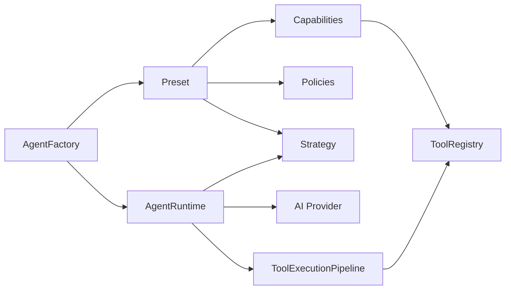
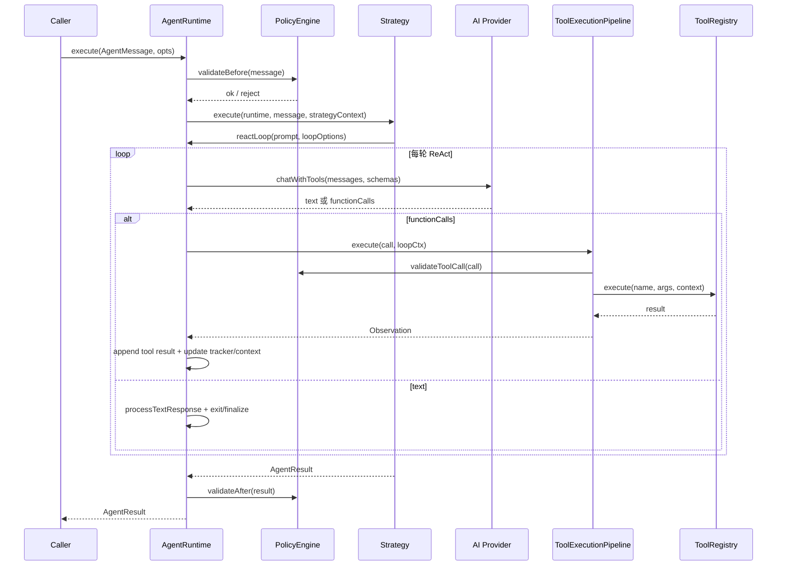

# AgentRuntime 全景深度分析

本文面向 Alembic 源码维护者，梳理当前 `AgentRuntime` 及其周边 Agent 系统的设计方案、执行链路、工具实现、长任务能力与主要消费入口。结论先行：Alembic 的 Agent 架构不是“每个业务 Agent 一个类”的模型，而是一个统一运行时加配置组合模型。`AgentRuntime` 是唯一执行引擎，`Preset` 负责把 Capability、Strategy、Policy、Persona 与 Memory 组合成不同语义 Agent。

## 1. 总体结论

Alembic Agent 系统可以理解为五层组合：

1. `AgentFactory` 是装配入口。它读取 `PRESETS`，解析 Capability、Policy、Strategy，创建 `AgentRuntime`，并为系统任务注入 `ContextWindow`、`ExplorationTracker`、`MemoryCoordinator`、`ActiveContext`、`sharedState` 等长任务上下文。
2. `AgentRuntime` 是统一执行引擎。它实现 ReAct 主循环，处理模型调用、工具调用、Observation 写回、上下文裁剪、退出判断、策略委托和 Policy 前后校验。
3. `Strategy` 决定工作组织方式。`SingleStrategy` 是直接 ReAct；`PipelineStrategy` 用阶段、Gate、Retry、Degrade 组织 Insight/Bootstrap/Evolution；`FanOutStrategy` 与 `AdaptiveStrategy` 支持并发和复杂度路由。
4. `Capability` 决定“能做什么”。Capability 提供 prompt fragment 与工具白名单，实际工具 Schema 来自 `ToolRegistry`。
5. `ToolExecutionPipeline` 是工具调用治理层。它在真正执行工具前后完成 allowlist、安全校验、缓存、observation 记录、tracker 信号、trace 记录和提交去重。

核心设计要点：Agent 类型是配置结果，不是类继承树。`chat`、`insight`、`evolution`、`lark`、`remote-exec` 都复用同一个 Runtime，只是在能力、策略、预算、安全策略和系统提示上不同。

## 2. 代码地图

| 区域 | 关键文件 | 角色 |
| --- | --- | --- |
| Runtime | `lib/agent/AgentRuntime.ts` | ReAct 主循环、策略入口、工具调用处理、事件/进度输出 |
| Factory | `lib/agent/AgentFactory.ts` | Preset 装配、系统上下文构建、scan/relation/evolution/chat 入口 |
| 类型 | `lib/agent/AgentRuntimeTypes.ts` | Runtime 配置、预算、结果、策略上下文等类型 |
| Preset | `lib/agent/presets.ts` | `chat`、`insight`、`evolution`、`lark`、`remote-exec` 配置 |
| Capability | `lib/agent/capabilities.ts` | prompt fragment 与工具 allowlist |
| Policy | `lib/agent/policies.ts` | Budget、Safety、QualityGate 与 tool call 校验 |
| Strategy | `lib/agent/strategies.ts`, `lib/agent/PipelineStrategy.ts` | Single/FanOut/Adaptive/Pipeline 执行组织 |
| 工具注册 | `lib/agent/tools/ToolRegistry.ts`, `lib/agent/tools/index.ts` | 内部 Function Calling 工具注册、Schema、执行 |
| 工具管线 | `lib/agent/core/ToolExecutionPipeline.ts` | 工具中间件治理 |
| 上下文 | `lib/agent/context/ContextWindow.ts`, `lib/agent/context/ExplorationTracker.ts` | 上下文压缩、探索阶段状态机、强制退出/工具选择 |
| 记忆 | `lib/agent/memory/*` | ActiveContext、SessionStore、PersistentMemory、MemoryCoordinator |
| Insight 领域 | `lib/agent/domain/*` | 分析/生产 Prompt、质量门控、证据收集、预定义任务 |
| Tool Forge | `lib/agent/forge/*` | 动态工具复用、组合、生成、沙箱测试和 TTL 注册 |
| DI | `lib/injection/modules/AgentModule.ts` | 注册 `toolRegistry`、`toolForge`、`agentFactory` |
| HTTP | `lib/http/routes/ai.ts` | `/chat`、`/summarize`、`/agent/tool`、`/agent/task` 等入口 |
| MCP | `lib/external/mcp/tools.ts`, `lib/external/mcp/McpServer.ts` | 外部 IDE Agent 工具面和 Gateway gating |
| Bootstrap | `lib/external/mcp/handlers/bootstrap/pipeline/orchestrator.ts` | 内部 Agent AI-First 维度分析管线 |
| Lark | `lib/external/lark/LarkTransport.ts` | 飞书 bot 与远程命令执行入口 |

## 3. Agent ONE Runtime 模型

当前实现的关键抽象是“一个 Runtime，多种 Preset”。业务语义不落在 `AgentRuntime` 的子类中，而是由 `PRESETS` 注入：



这种模型带来三个直接影响：

1. 新 Agent 能力优先通过 Preset/Capability/Strategy/Policy 扩展，而不是新建 Runtime 子类。
2. Runtime 对业务场景保持无知，只关心消息、工具、预算、退出和结果聚合。
3. 长任务质量由系统上下文共同保证：`ContextWindow` 管 token，`ExplorationTracker` 管探索进度，`MemoryCoordinator`/`ActiveContext` 管证据和跨阶段记忆。

## 4. Preset 与能力组合

`lib/agent/presets.ts` 是 Agent 语义配置中心。

| Preset | 主要 Capability | Strategy | Policy | 典型入口 |
| --- | --- | --- | --- | --- |
| `chat` | `conversation`, `code_analysis` | `single` | `BudgetPolicy` | HTTP `/chat`、技能推荐、通用问答 |
| `insight` | `code_analysis`, `knowledge_production` | `pipeline` | `BudgetPolicy`, `QualityGatePolicy` | Bootstrap、AI scan、summarize、relations |
| `evolution` | `evolution_analysis`, `code_analysis` | `pipeline` | `BudgetPolicy`, evolution gate | Rescan、Recipe 演进检查 |
| `lark` | conversation/code/query 类能力 | `single` | `BudgetPolicy`, `SafetyPolicy` | 飞书 Bot Agent |
| `remote-exec` | system interaction | `single` | `BudgetPolicy`, `SafetyPolicy` | 飞书远程安全命令 |

Capability 的实现并不执行工具，而是提供两类信息：

- `promptFragment`：告诉模型该能力的任务边界和工作方式。
- `tools`：允许暴露给模型的内部工具名列表。

工具真正执行时仍要经过 `ToolExecutionPipeline` 和 `PolicyEngine.validateToolCall()`。因此 Capability 是第一道显式能力边界，Policy 和工具管线是运行时边界。

## 5. AgentFactory 装配链路

`AgentFactory` 是 Runtime 的唯一标准创建入口。它的职责远超简单构造器：

1. `createRuntime(presetName, overrides)` 读取 `PRESETS[presetName]`。
2. 解析 preset 里的 capability 名称，通过 `CapabilityRegistry` 创建实例。
3. 构建 `PolicyEngine`，注入 Budget/Safety/Quality 等策略。
4. 解析 strategy：`single`、`fanout`、`adaptive`、`pipeline`。
5. 注入 `ToolRegistry`、`aiProvider`、`container`、`projectRoot`、语言偏好、进度回调等。
6. 返回配置完毕的 `AgentRuntime`。

它还提供多个语义入口：

- `createChat()`：创建 `chat` runtime。
- `createInsight()`：创建 `insight` runtime。
- `createLark()`：创建飞书对话 runtime。
- `createRemoteExec()`：创建远程命令 runtime。
- `scanKnowledge()`：构建 scan pipeline，运行代码分析与 `collect_scan_recipe` 生产。
- `discoverRelations()`：构建 Explore → Synthesize 关系发现 pipeline。
- `evolveCheck()`：运行 Recipe 演进检查 pipeline。
- `translateToEnglish()`：通过 chat runtime 做翻译类任务。
- `invokeAgent()`：绕过 ReAct，直接调用内部工具注册表。

对系统任务来说，`buildSystemContext()`/相关创建逻辑是关键。它统一创建：

- `ContextWindow`：系统任务使用更激进的工具结果裁剪和摘要策略。
- `ExplorationTracker`：系统任务使用 analyst/producer 等阶段策略。
- `MemoryCoordinator`：建立会话级和维度级 memory scope。
- `ActiveContext`：保存 tool trace、finding、plan、observation 摘要。
- `sharedState`：跨阶段去重集合、提交标题/trigger 集合、bootstrap dedup 等。

## 6. AgentRuntime 生命周期

`AgentRuntime.execute(message, opts)` 是统一入口。整体执行顺序如下：



`execute()` 的主要保护点：

- Policy 前置校验失败时直接返回拒绝结果，迭代数为 0。
- 运行时预算来自 `PolicyEngine.getBudget()`，包括 timeout、iteration、token 等。
- 策略执行包在全局 timeout 中，超时抛出 runtime timeout。
- 策略完成后执行后置质量校验，失败时通过 `qualityWarning` 附加到结果。
- Runtime 状态包括 `iterationCount`、`toolCallHistory`、`tokenUsage`、`fileCache`、`aborted` 等。

## 7. ReAct 主循环拆解

`reactLoop()` 是 Runtime 的核心。当前实现围绕 `LoopContext` 拆成多个私有步骤，典型流程如下：

1. `#initLoop`：构建系统提示、消息历史、工具 schema、预算、上下文窗口、tracker、trace、memory prompt。
2. `#shouldExit`：检查 abort、最大迭代、tracker 强制退出、预算耗尽、模型文本收敛等。
3. `#prepareIteration`：写入 tracker nudge、ContextWindow 压缩后的 messages、工具选择 override。
4. `#callLLM`：调用 `aiProvider.chatWithTools()`，累计 token usage。
5. `#processToolCalls`：把模型 function calls 交给 `ToolExecutionPipeline`。
6. `#processTextResponse`：处理文本回答，交给 tracker 判断是否继续或退出。
7. `#finalize`：汇总 reply、toolCalls、iterations、tokenUsage、duration、state、degraded 等。

这个循环同时承载 ReAct 和 CoALA 风格的认知链路：

- Perception：用户消息、历史、项目 briefing、memory prompt、工具结果。
- Working Memory：`LoopContext`、`ContextWindow`、`ActiveContext`。
- Reasoning：LLM text/function call 选择、Pipeline stage prompt、Gate retry prompt。
- Action：工具调用与安全执行。
- Reflection：tracker nudge、quality gate、producer rejection gate、final summary。

### 7.1 工具暴露

每轮调用模型前，Runtime 会根据 capability allowlist 取得工具 schema：

- 若 capability 列出工具，则 `toolRegistry.getToolSchemas(allowedTools)`。
- 若没有限制，则可传 `null` 获取默认注册 schema。
- Pipeline stage 可以覆盖 capability 和 system prompt，因此不同阶段暴露的工具集不同。
- `toolChoiceOverride` 可由 `ExplorationTracker` 影响，使模型在必须提交、必须总结或必须停止时改变工具选择。

### 7.2 退出机制

Runtime 不是只靠最大迭代退出。退出信号来自多处：

- 预算耗尽：`BudgetPolicy` 限制最大轮次、token、时间。
- Tracker 收敛：工具调用无进展、已覆盖阶段目标、提交完成、idle rounds 达阈值。
- 强制总结：`produceForcedSummary` 可在系统任务耗尽预算时生成可交付摘要。
- 文本回复：模型给出最终文本且 tracker 判断无需继续。
- AbortSignal：Bootstrap session 或调用方取消。
- Runtime `abort(reason)`：显式中止。

## 8. Strategy 层

### 8.1 SingleStrategy

`SingleStrategy` 是最直接的执行方式：把 `AgentMessage` 转成 prompt，然后调用 `runtime.reactLoop()`。通用 chat、Lark bot 和 remote exec 都以它为基础。

### 8.2 FanOutStrategy

`FanOutStrategy` 用于把一个任务拆给多个子任务并发执行，再聚合结果。它适合独立子目标明确、彼此依赖弱的场景。

### 8.3 AdaptiveStrategy

`AdaptiveStrategy` 根据复杂度选择执行路径。它的核心价值不是新能力，而是让简单任务走轻路径、复杂任务走更重的 pipeline/fanout。

### 8.4 PipelineStrategy

`PipelineStrategy` 是 Insight、Bootstrap、Evolution 的关键。它支持：

- 多阶段配置：每个 stage 可以指定 `name`、`capabilities`、`budget`、`systemPrompt`、`promptBuilder`、`promptTransform`。
- Gate 阶段：`gate.evaluator` 根据上一阶段结果决定 pass、retry、degrade。
- Retry：Gate 失败时用 `retryPromptBuilder` 生成修正提示，并可套用 `retryBudget`。
- Degrade：质量过低或失败时跳过后续阶段、保留降级结果。
- Stage 上下文隔离：阶段切换时可重置或压缩 ContextWindow。
- Hard timeout：每阶段预算外还有硬超时保护。
- Phase result 聚合：最终结果包含 `phases`，调用方可取 `analyze`、`quality_gate`、`produce` 等阶段产物。

Insight 标准管线为：

```text
Analyze -> QualityGate -> Produce -> RejectionGate
```

Evolution 场景可扩展为：

```text
Evolve -> EvolutionGate -> Analyze -> QualityGate -> Produce -> RejectionGate
```

Relations 独立管线为：

```text
Explore -> Synthesize
```

## 9. ToolRegistry 与内部工具全景

内部 Agent 工具是 Runtime function calling 使用的工具，定义在 `lib/agent/tools/*`，由 `lib/agent/tools/index.ts` 汇总进 `ALL_TOOLS`。当前按源码声明统计为 60 个内部工具，以 `ALL_TOOLS` 和各工具定义为准。

| 工具组 | 文件 | 代表工具 | 作用 |
| --- | --- | --- | --- |
| project-access | `project-access.ts` | `search_project_code`, `read_project_file`, `list_project_structure`, `get_file_summary`, `semantic_search_code` | 项目文件搜索、读取、结构和语义检索 |
| query | `query.ts` | `search_recipes`, `search_candidates`, `get_recipe_detail`, `search_knowledge`, `get_related_recipes` | 知识库查询 |
| ai-analysis | `ai-analysis.ts` | `enrich_candidate`, `refine_bootstrap_candidates` | AI 语义补全和候选精炼 |
| guard | `guard.ts` | `list_guard_rules`, `guard_check_code`, `query_violations` | Guard 规则和代码检查 |
| lifecycle | `lifecycle.ts` | `submit_knowledge`, `approve_candidate`, `publish_recipe`, `validate_candidate`, `quality_score` | 知识生命周期操作 |
| knowledge-graph | `knowledge-graph.ts` | `check_duplicate`, `add_graph_edge` | 查重和知识图谱边维护 |
| infrastructure | `infrastructure.ts` | `graph_impact_analysis`, `rebuild_index`, `load_skill`, `create_skill`, `bootstrap_knowledge` | 索引、技能、基础设施操作 |
| composite | `composite.ts` | `analyze_code`, `knowledge_overview`, `submit_with_check`, `plan_task`, `review_my_output` | 复合型高层工具 |
| ast-graph | `ast-graph.ts` | `get_project_overview`, `get_class_info`, `query_code_graph`, `query_call_graph`, `note_finding` | AST/代码图谱与发现记录 |
| system-interaction | `system-interaction.ts` | `run_safe_command`, `write_project_file`, `get_environment_info` | 系统交互和受控写入 |
| scan-recipe | `scan-recipe.ts` | `collect_scan_recipe` | scan pipeline 专用结构化候选收集 |
| evolution-tools | `evolution-tools.ts` | `propose_evolution`, `confirm_deprecation`, `skip_evolution` | Recipe 演进决策 |

`ToolRegistry` 的关键实现点：

- `registerAll(ALL_TOOLS)` 批量注册工具定义。
- `getToolSchemas()` 把内部工具定义转成模型可用 schema。
- `execute(name, params, context)` 查找 handler 并注入上下文。
- 支持参数别名归一化，例如 `filename`/`file_name` → `filePath`、`skill_name` → `skillName`。
- 工具 handler 上下文包含 container、projectRoot、fileCache、language、logger、aiProvider、sharedState 等。

## 10. ToolExecutionPipeline 治理链

模型发出 function call 后，并不是直接进入 `ToolRegistry.execute()`，而是经过 `ToolExecutionPipeline`：

```text
allowlistGate
  -> safetyGate
  -> cacheCheck
  -> ToolRegistry.execute
  -> observationRecord
  -> trackerSignal
  -> traceRecord
  -> submitDedup
```

各中间件职责：

- `allowlistGate`：确认工具在 capability/stage allowlist 内。若工具由 Tool Forge 动态注册且存在于 `ToolRegistry`，可作为 Forge fallback 放行。
- `safetyGate`：调用 `PolicyEngine.validateToolCall()`，重点检查命令执行、文件写入、路径范围等。
- `cacheCheck`：对可缓存工具结果复用，降低重复读写和 token 压力。
- `observationRecord`：把工具结果变成 ReAct Observation。
- `trackerSignal`：把工具行为反馈给 `ExplorationTracker`，例如搜索、读取、提交、空转。
- `traceRecord`：写入 `ActiveContext`，供 EvidenceCollector、QualityGate 和后续阶段使用。
- `submitDedup`：对 bootstrap/producer 提交做跨阶段去重，防止重复候选。

这个设计把工具治理集中在一个地方，避免 Runtime、Capability 和具体工具 handler 分散实现安全与观测逻辑。

## 11. ContextWindow：长上下文管理

`ContextWindow` 解决长任务 token 压力。当前实现分三层压缩：

1. L1：截断旧 tool result，保留最近上下文和关键输出。
2. L2：摘要历史，保留最后 2 轮完整交互。
3. L3：仅保留系统 prompt 和最后 1 轮，作为极限降级。

它还对工具结果做按类型裁剪：

- search 类工具保留命中摘要和关键文件。
- read 类工具保留头尾、重要片段和截断提示。
- 大型 JSON/数组结果压缩为结构化摘要。

`getToolResultQuota()` 会根据当前上下文压力动态分配工具结果额度。系统任务中，`ContextWindow` 与 `ExplorationTracker` 一起决定“继续查证”还是“进入总结/提交”。

## 12. ExplorationTracker：系统任务状态机

`ExplorationTracker` 是系统任务的隐式调度器，负责避免 Agent 无休止搜索或过早提交。它暴露的关键能力包括：

- `tick()` / `rollbackTick()`：推进或回滚轮次。
- `shouldExit()`：根据阶段目标、预算、idle rounds、提交数、收敛信号判断退出。
- `getNudge()`：生成下一轮提示，例如继续探索、补证据、立即总结、禁止再调用工具。
- `getToolChoice()`：在必要时影响工具选择。
- `recordToolCall()`：记录 search/read/submit 等工具行为。
- `endRound()`：更新本轮效果。
- `onTextResponse()`：分析模型文本是否满足退出条件。

策略上，它区分 bootstrap、analyst、producer 等角色：

- analyst 更强调 SCAN → EXPLORE → VERIFY → SUMMARIZE。
- producer 更强调从分析结果转换成结构化提交。
- bootstrap 还要处理维度推进、强制总结和跨维度记忆。

常见 nudge 类型包括：`force_exit`、`convergence`、`budget_warning`、`reflection`、`planning`。这些 nudge 是 Runtime 保持长任务质量的核心机制。

## 13. Memory 系统

Agent memory 不是单一对象，而是多层结构：

| 组件 | 作用 |
| --- | --- |
| `ActiveContext` | 当前 scope 的工作记忆，记录 plan、tool call、observation、finding、round log，并可 distill |
| `SessionStore` | 会话级记忆，保存维度报告、维度 digest、提交摘要、只读工具缓存 |
| `PersistentMemory` | 项目级永久语义记忆 facade，可接入 embedding store |
| `MemoryCoordinator` | 统一协调预算、scope、静态/动态 memory prompt 和写入路由 |
| `MemoryRetriever` | 基于 recency、importance、relevance 检索记忆 |
| `MemoryConsolidator` | ADD/UPDATE/MERGE/冲突解决，把短期发现固化为长期记忆 |
| `EpisodicConsolidator` | Bootstrap 后把维度级 episodic evidence 汇总固化 |

Bootstrap orchestrator 会显式创建 `SessionStore`、`PersistentMemory`、`MemoryCoordinator`。每个维度创建独立 scope，例如 `${dimId}:analyst`，然后把对应 `ActiveContext` 注入 `strategyContext.activeContext` 和 `trace`。QualityGate 由此可以从真实工具轨迹构建 `AnalysisArtifact`，而不是只看模型文本。

## 14. Insight / Scan / Bootstrap 生产链路

Insight 的标准链路由 `lib/agent/domain/scan-prompts.ts` 和 `lib/agent/domain/insight-*` 共同定义。

### 14.1 Analyze

Analyze 阶段使用 `ANALYST_SYSTEM_PROMPT`，通过 AST、文件读取、代码搜索、知识检索等工具自由探索。它产出分析文本，同时工具轨迹进入 `ActiveContext`。

### 14.2 QualityGate

`insightGateEvaluator` 优先走 v2 `buildAnalysisArtifact()`：

- 用 `EvidenceCollector` 从工具调用构建 `evidenceMap`、`explorationLog`、`negativeSignals`。
- 从 `ActiveContext.distill()` 提取结构化 `findings`。
- 统计 referenced files、search queries、classes explored。
- 计算 depth、breadth、evidence、coherence 四维质量分。

如果缺少 `ActiveContext`，才降级到 v1 `buildAnalysisReport()`。

### 14.3 Produce

Produce 阶段不重新探索，而是把 gate artifact 转换成结构化候选。`scanKnowledge()` 的 extract/summarize 都是工具驱动：模型需要调用 `collect_scan_recipe`。Bootstrap 内部生产则常用 `submit_knowledge` 或 `submit_with_check`。

### 14.4 RejectionGate

Producer 提交后，`producerRejectionGateEvaluator` 统计拒绝率。拒绝过高时触发 retry prompt，要求修正 content/reasoning/sourceRefs/trigger 等字段。

### 14.5 Bootstrap orchestrator

内部 Bootstrap 管线在 `lib/external/mcp/handlers/bootstrap/pipeline/orchestrator.ts`。它是“内部 Agent”路径，由 `bootstrap.js` Phase 5 调用，外部 Cursor/Copilot Agent 不经过这条管线。

关键流程：

1. 读取 snapshot：依赖图、Guard audit、AST summary、panorama、call graph、target file map。
2. 检查 AI Provider；mock 模式走 `mock-pipeline`。
3. 构建 ProjectGraph、SessionStore、PersistentMemory、CodeEntityGraph、MemoryCoordinator。
4. 按维度和 tier 调度，支持并行、checkpoint、incremental skip。
5. 每个维度用 `agentFactory.createRuntime('insight', { strategy: { type: 'pipeline', stages } })` 创建 Runtime。
6. 如果 rescan 且当前维度有旧 Recipe，可在 Analyze 前插入 Evolve/EvolutionGate。
7. `strategyContext` 注入维度配置、panorama、evidence starters、rescan context、existing recipes、ContextWindow、ExplorationTracker、ActiveContext、sharedState。
8. 执行后提取 `phases.analyze`、`phases.quality_gate`、`phases.produce`，统计提交、拒绝、引用文件、token、tool calls。
9. 将维度报告写回 `SessionStore`，并生成 skill、checkpoint 和最终报告。

## 15. Evolution 链路

Evolution 的语义重点是判断旧 Recipe 与当前代码是否仍然匹配。入口包括：

- `AgentFactory.evolveCheck()`：创建 `evolution` runtime。
- Bootstrap/rescan orchestrator：当维度有 existing recipes 且 prescreen 未完成时，把 evolution stages 插入 insight pipeline 前。
- MCP 外部工具：`alembic_evolve` 接收外部 Agent 的批量演进决策。

内部 evolution tools 包括：

- `propose_evolution`：代码迁移或接口变化，提出增强/修正。
- `confirm_deprecation`：模式消失，确认废弃。
- `skip_evolution`：仍有效或证据不足。

这条链路把“分析新知识”和“维护旧知识有效性”统一到 pipeline 模型里，是 Alembic 知识新陈代谢的关键。

## 16. Chat / HTTP / Lark / CLI 消费入口

### 16.1 HTTP API

`lib/http/routes/ai.ts` 是 Dashboard/HTTP 的主要消费端：

- `POST /api/v1/ai/chat`：构建 `AgentMessage.fromHttp(req)`，创建 `factory.createChat()`，运行 `runtime.execute()`，并持久化 `ConversationStore` 和 token usage。
- `POST /api/v1/ai/summarize`：调用 `factory.scanKnowledge({ task: 'summarize' })`。
- `POST /api/v1/ai/translate`：调用 `factory.translateToEnglish()`。
- `POST /api/v1/ai/agent/tool`：调用 `factory.invokeAgent()`，绕过 ReAct 直接执行内部工具。
- `POST /api/v1/ai/agent/task`：优先执行 `ChatAgentTasks` 预定义 DAG 任务，找不到再回退到 `invokeAgent()`。
- `GET /api/v1/ai/agent/capabilities`：返回内部 tool schemas、presets 和预定义任务。

### 16.2 ChatAgentTasks

`lib/agent/domain/ChatAgentTasks.ts` 提供 HTTP 预定义任务：

- `check_and_submit`：查重 + AI 判定重复/相似/唯一。
- `discover_all_relations`：委托 `AgentFactory.discoverRelations()`。
- `full_enrich`：批量补全候选语义字段。
- `quality_audit`：批量评分活跃 Recipe。
- `guard_full_scan`：运行 Guard 并可用 AI 生成修复建议。

这些任务不一定走 ReAct 主循环。它们更多是服务编排：用 `invokeAgent()` 调内部工具，用 `aiProvider` 做少量结构化判断。

### 16.3 Lark

`lib/external/lark/LarkTransport.ts` 有两条 Runtime 路径：

- Bot Agent：`AgentMessage.fromLark()` → `createLark()` → `runtime.execute()`。
- Remote Exec：`AgentMessage.fromLark()` → `createRemoteExec()` → `runtime.execute()`。

两者都注入飞书会话历史，并通过 `onProgress` 在工具调用时发送进度。`remote-exec` 依赖 `SafetyPolicy` 和 system-interaction 工具限制命令执行。

### 16.4 CLI / ModuleService

`lib/cli/AiScanService.ts` 和 `lib/service/module/ModuleService.ts` 都会调用 `AgentFactory.scanKnowledge()`。这说明 AgentRuntime 不只服务对话，也服务批量扫描和模块级知识生产。

## 17. MCP 外部工具面

需要区分两套工具：

- 内部 Agent 工具：`lib/agent/tools/*`，供 Runtime function calling 使用，当前源码声明为 60 个。
- MCP 外部工具：`lib/external/mcp/tools.ts`，暴露给 Cursor/VSCode Copilot 等外部 Agent，当前源码声明为 19 个 `alembic_*` 工具。

MCP server 在 `lib/external/mcp/McpServer.ts`：

1. 初始化时要求 `ALEMBIC_PROJECT_DIR`，避免多根 workspace 下 `process.cwd()` 指错项目。
2. 对 Alembic 自身开发仓库等排除项目做保护，避免创建运行时数据。
3. `ListTools` 根据 `ALEMBIC_MCP_TIER` 过滤 agent/admin 工具。
4. `CallTool` 先走 `_gatewayGate()`，写操作按 `TOOL_GATEWAY_MAP` 检查 Gateway/Constitution。
5. `_resolveHandler()` 把 `alembic_*` 路由到 `handlers/*`。
6. `_trackSession()` 追踪 tool calls、search queries、mentioned files、drift events。

外部 Agent 冷启动路径：

```text
alembic_bootstrap -> 外部 Agent 自行分析 -> alembic_submit_knowledge/evolve -> alembic_dimension_complete -> alembic_wiki
```

内部 Agent 冷启动路径：

```text
bootstrap.js Phase 5 -> orchestrator.fillDimensionsV3 -> AgentRuntime insight pipeline
```

两条路径共享服务层、知识库和部分 handler，但执行主体不同。外部 Agent 是 IDE 模型调用 MCP 工具；内部 Agent 是 Alembic 进程内的 `AgentRuntime` 调 LLM 与内部工具。

## 18. Tool Forge 动态工具

`lib/agent/forge/*` 提供 Tool Forge 能力，目标是在现有工具不足时动态产生临时工具。

主流程：

1. `ToolRequirementAnalyzer` 分析意图，判断 reuse/compose/generate。
2. reuse：如果已有工具满足需求，直接返回 matched tool。
3. compose：`DynamicComposer` 把多个工具组合成 sequential/parallel 临时工具。
4. generate：用 code generator 生成工具代码，经过 `ToolSafety` 检查和 `SandboxRunner` 测试。
5. `TemporaryToolRegistry` 注册到主 `ToolRegistry`，默认 TTL 回收。
6. `ToolExecutionPipeline.allowlistGate` 对已注册的 Forge 工具提供 fallback 放行。

当前 DI 中 `AgentModule` 注册了 `toolForge`，但常规 Runtime 链路仍主要依赖静态 `ALL_TOOLS`。Forge 更像高级扩展能力，不是主路径。

## 19. 依赖注入与启动

`lib/injection/modules/AgentModule.ts` 是 Agent 子系统装配点：

- `toolRegistry`：创建 `ToolRegistry` 并 `registerAll(ALL_TOOLS)`。
- `toolForge`：基于主 registry 创建 `ToolForge`。
- `agentFactory`：注入 container、toolRegistry、aiProvider、projectRoot。
- `skillHooks`、recommendation 子系统：为技能推荐与反馈提供支撑。

这意味着绝大多数服务不直接 new Runtime，而是从 container 取 `agentFactory`。这也让 AI Provider 热切换、projectRoot 解析、PathGuard 等基础设施可以集中生效。

## 20. 测试覆盖现状

当前与 Agent 直接相关的测试包括：

- `test/unit/AgentRuntime.test.ts`：覆盖构造、`execute()` 策略委托、policy 前后校验、timeout、ReAct tool call、token 累计、history、capability override、abort、fileCache、progress、AI 错误恢复、策略集成。
- `test/unit/ReasoningLayer.test.ts`：覆盖 `ActiveContext` 和 `ExplorationTracker`。
- `test/unit/MemorySystem.test.ts`：覆盖 `MemoryCoordinator`、SessionStore/PersistentMemory 等记忆系统单元行为。
- `test/integration/MemoryCoordinator.test.ts`：覆盖记忆协调集成路径。
- `test/integration/StrategyPolicy.test.ts`：覆盖策略与 Policy 的集成行为。

从测试分布看，Runtime、Reasoning、Memory 有基础覆盖；Bootstrap orchestrator 这种超长链路更多依赖集成/人工验证和 mock pipeline。若后续重构 `PipelineStrategy` 或 `ToolExecutionPipeline`，建议补充阶段级 fixture 测试，尤其是 Gate retry/degrade、submit dedup、ContextWindow 压缩后仍能提交的场景。

## 21. 实现检查与风险点

### 21.1 源码注释中的工具数量与管线顺序已滞后

`lib/external/mcp/tools.ts` 文件头仍写着“15 agent + 2 admin = 17 tools”“14 agent + 2 admin”等历史描述，`lib/external/mcp/McpServer.ts` 文件头也仍写着“39 → 16 工具”，但源码当前声明了 19 个 `alembic_*` 工具。内部 Agent 工具当前源码声明为 60 个。后续维护文档、Dashboard 文案或 MCP 描述时应以 `TOOLS`/`ALL_TOOLS` 实际数组为准，避免误导外部 Agent。

同类漂移也出现在 `ToolExecutionPipeline` 的注释里：默认管线底部注释列出的顺序从 `safetyGate` 开始，但实际 `createToolPipeline()` 第一项是 `allowlistGate`。执行逻辑没有问题，风险在于维护者按注释理解时容易漏掉 capability/stage allowlist 这一层。

### 21.2 内部工具与 MCP 工具容易混淆

内部 Runtime function calling 使用 `search_project_code`、`submit_knowledge` 等工具；外部 IDE Agent 使用 `alembic_search`、`alembic_submit_knowledge` 等 MCP 工具。两者名称、权限、执行上下文和安全边界都不同。新增能力时必须先判断目标是内部 Agent 还是外部 Agent。

### 21.3 PipelineStrategy 是复杂度集中点

Insight、Bootstrap、Evolution 都高度依赖 Pipeline stage、Gate、Retry 和 strategyContext。任何阶段字段名变化都会影响 `scan-prompts.ts`、`insight-gate.ts`、orchestrator、producer gate 等多个模块。建议在新增 stage 字段时补充类型收敛，减少 `Record<string, unknown>` 的隐式契约。

### 21.4 ActiveContext 是质量门控的关键隐式依赖

`insightGateEvaluator` 有 ActiveContext 时能构建 v2 artifact；没有时降级到 v1 report。也就是说，同样的 Analyze 文本，在不同调用路径上质量判断能力可能不同。系统任务应确保 `strategyContext.activeContext` 和 `trace` 一起注入。

### 21.5 Tool Forge 已接入但不是主路径

Forge fallback 已在工具管线中支持，DI 也注册了 `toolForge`。但常规 capabilities 并不会主动要求锻造工具。若未来要让模型自主锻造工具，需要明确入口工具、预算、安全审计和生命周期展示，否则容易形成难观测的临时能力。

### 21.6 直接工具调用绕过 ReAct 但不等于绕过安全

`AgentFactory.invokeAgent()` 直接调用 `ToolRegistry.execute()`，用于 HTTP `/agent/tool` 和 DAG 任务。它不像 Runtime tool calls 那样完整经过 `ToolExecutionPipeline` 的 tracker/trace/submitDedup。对写入型或系统交互型工具，调用方必须确认服务层/Gateway/工具自身仍有足够保护。

### 21.7 顶层 timeout 不会主动取消底层 Strategy

`AgentRuntime.execute()` 用 `Promise.race([strategy.execute(), timeoutPromise])` 做全局超时。超时后 Runtime 会进入失败路径并发布 `AGENT_FAILED`，但这个顶层 timeout 本身没有 `AbortController`，因此不能保证已经发出的 LLM 请求、工具调用或 strategy 内部 Promise 立即停止。

Pipeline stage 内部有自己的 hard timeout 和 `AbortController`，会把 `abortSignal` 传给 `reactLoop()`，但这只覆盖 PipelineStrategy 的阶段执行。`SingleStrategy`、`FanOutStrategy`、`AdaptiveStrategy` 或未来自定义 Strategy 如果没有显式接收/传播 abort，就可能出现“调用方已认为失败，底层工作仍在跑”的幽灵执行。

更细一点看，Pipeline hard timeout 目前主要能取消进行中的 LLM 请求，因为 `AgentRuntime.#callLLM()` 会把 `abortSignal` 传给 `aiProvider.chatWithTools()`。工具 handler 本身没有接收 `abortSignal`，因此已经进入 `ToolRegistry.execute()` 的长耗时工具不一定能被主动中止，只能依赖工具自己的超时或执行完成。

建议收敛方向：把顶层 execute 也改成可传播的 abort 模型，或者把 Strategy 接口升级为强制接收 `AbortSignal`；对工具执行也需要明确哪些工具可取消，哪些只能等待超时。

### 21.8 Pipeline hard timeout 会把阶段转为空结果继续推进

`PipelineStrategy.#runWithTimeout()` 在阶段 hard timeout 时返回：

```ts
{ reply: '', toolCalls: [], iterations: 0, tokenUsage: { input: 0, output: 0 }, timedOut: true }
```

这让 pipeline 不会整体崩溃，但边界后果是：后续 Gate 只能看到“无分析输出”，通常会 degrade 或 break。对于 Bootstrap/scan 这类任务，最终结果可能表现为“无候选/空回复/降级”，而不是一个强错误。当前已有 fast retry 处理“超时且 0 tool calls”的场景，但如果 retry 仍空，问题会变成低可见度的产出缺失。

建议收敛方向：在 `AgentResult.phases[stage]` 中保留明确的 timeout diagnostics，并在上层 `scanKnowledge()`、Bootstrap report、HTTP 响应中把 timedOut/degraded 作为一等状态暴露出来，而不是只靠日志。

### 21.9 Tracker 模式绕过 BudgetPolicy 迭代检查，强依赖 tracker 正确性

`AgentRuntime.#shouldExit()` 在存在 `ExplorationTracker` 时会把 `iteration` 传成 0 来绕过 `BudgetPolicy.validateDuring()` 的迭代限制，原因是 tracker 自己要提供 grace rounds。当前 `ExplorationTracker.shouldExit()` 内部已有 `maxIterations + 2` 硬上限，并会在达到 `maxIterations` 时强制进入终结阶段，所以主路径不是裸奔状态。风险在于这条安全边界已经从统一的 `PolicyEngine` 转移到了 tracker 实现。

边界风险：

- 未来如果引入自定义 tracker 或替代 tracker，`shouldExit()` / 内部硬上限一旦缺失，Policy 的 maxIterations 不再兜底。
- stage budget timeout 仍会兜底，但 timeout 是时间边界，不是步骤边界；高频空转时仍会浪费大量调用机会。
- Pipeline 中 retry 会重建 tracker，重试前后的阶段状态很容易出现统计口径不一致。

建议收敛方向：把 tracker 的 hard limit 作为显式接口暴露，并在 Runtime 层记录“Policy iteration skipped because tracker owns budget”的 diagnostics。若后续允许非 `ExplorationTracker` 实现，则 Runtime 应保留一个通用硬迭代上限，例如 `min(policy.maxIterations + grace, tracker.hardMax)`。

### 21.10 AllowlistGate 的 Forge fallback 过宽

`ToolExecutionPipeline.allowlistGate` 的设计意图是允许 Tool Forge 动态注册的临时工具绕过静态 allowlist。但当前判断条件是 `ctx.runtime.toolRegistry?.has(call.name)`。由于静态 `ALL_TOOLS` 本来也都注册在同一个 `ToolRegistry`，这个条件无法区分“锻造工具”和“只是当前 stage 未授权的静态工具”。

结果是：当模型调用了当前 stage schema 里没有、但全局 registry 中存在的工具时，allowlist 可能放行。对 `run_safe_command`、`write_project_file` 这类工具还有 SafetyPolicy/工具层兜底；但对读类、查询类、复合类工具，stage capability 边界会被削弱。

建议收敛方向：临时工具应有显式 metadata，例如 `forgeMode`、`temporary: true` 或来自 `TemporaryToolRegistry` 的名字空间；AllowlistGate 只允许这些动态工具 fallback。静态注册工具如果不在当前 stage schema 中，应保持阻断。

### 21.11 `invokeAgent()` 直通路径缺少管线治理

HTTP `/agent/tool` 和 `/agent/task` 的 fallback 都可以通过 `factory.invokeAgent()` 直接执行任意 ToolRegistry 工具。`AgentFactory.invokeAgent()` 的注释说“纯数据工具直接执行”，但 HTTP 层没有把请求限制在 data-only 工具集合里。这个路径没有经过：

- Capability allowlist。
- `PolicyEngine.validateToolCall()`。
- `ToolExecutionPipeline` 的 cache、trackerSignal、traceRecord、submitDedup。
- Runtime 的 token/iteration/phase 观测。

工具自身有部分兜底：例如 `run_safe_command` 在无 SafetyPolicy 时只允许安全前缀，`write_project_file` 会限制项目目录和危险路径。但 `invokeAgent()` 构建的工具上下文没有注入 `SafetyPolicy`，因此直通路径主要依赖工具层自己的 fallback，而不是统一策略。对生命周期类工具、复合工具、AI 分析工具和图谱写入工具，这条路径缺少统一审计边界。

建议收敛方向：把直通工具分成 `data-only` 和 `side-effect` 两类；`invokeAgent()` 默认只允许 data-only，side-effect 必须经过一个轻量版 ToolExecutionPipeline 或 Gateway mapping。HTTP `/agent/tool` 不宜暴露全 registry 任意调用。

### 21.12 SafetyPolicy 的路径检查存在前缀边界问题

`SafetyPolicy.checkFilePath()` 使用 `resolved.startsWith(scope)` 判断是否在 fileScope 内。若 scope 为 `/repo/app`，路径 `/repo/app2/file` 在字符串前缀上也成立。部分工具自身做了更严格的 `scopeRoot + path.sep` 检查，例如 `write_project_file`，但 Policy 层本身的判断仍偏宽。

此外，`PolicyEngine.validateToolCall()` 只检查 `read_project_file` 的 `filePath`，没有直接检查 `filePaths` 批量参数。当前 `read_project_file` handler 会把批量读取递归转成单文件读取，并在工具层拒绝绝对路径和 `..` 路径，所以项目根目录越界有兜底；但如果未来依赖 SafetyPolicy 的更窄 fileScope，批量参数不会先经过 Policy 层校验。

实际代码里还有一个更系统性的边界：`read_project_file`、`list_project_structure`、`get_file_summary` 等只读工具的工具层也散落使用 `fullPath.startsWith(projectRoot)` / `targetDir.startsWith(projectRoot)` 判断范围。它们先拒绝绝对路径和 `..`，多数情况下能挡住常见遍历，但实现方式并不统一，且仍有字符串前缀边界风险。

建议收敛方向：统一使用 `path.relative(scope, resolved)` 判断范围；`validateToolCall()` 同时覆盖 `filePath` 和 `filePaths`，并把路径策略下沉到共享 PathGuard/PathScope 工具函数，避免每个工具重复实现。

### 21.13 `scanKnowledge()` 的 fallback 可能吞掉生产失败

`AgentFactory.scanKnowledge()` 优先从 `collect_scan_recipe` tool calls 提取 recipes。若没有任何收集结果，会取 `phases.produce.reply || result.reply` 尝试 JSON 解析；只有解析失败时才返回 task config fallback，例如 `{ targetName, extracted: 0, recipes: [] }`。

这提供了兼容性，但也会把以下问题折叠成“正常 0 产出”：

- Produce 阶段没有调用工具。
- Gate degrade 导致 produce 被跳过。
- hard timeout 返回空阶段结果。
- 模型输出非 JSON 文本。
- `collect_scan_recipe` 全部被拒绝或去重。

建议收敛方向：返回结构中增加 `degraded`、`timedOut`、`gateReason`、`produceToolCalls`、`rejectedCount`、`parseFallbackUsed` 等字段。调用方可以继续兼容 `recipes: []` 或 JSON fallback，但上层报告要能区分“没有发现”“文本 fallback 成功”和“链路失败后使用默认 fallback”。

### 21.14 ActiveContext 缺失会让质量门控退化为文本规则

`insightGateEvaluator()` 有 `activeContext` 时走 `buildAnalysisArtifact()`，可使用 evidenceMap、negativeSignals、structured findings 和质量分；缺失时走 `buildAnalysisReport()`，只依赖文本和文件引用等弱信号。

这意味着同样的 Analyze 阶段，如果调用路径没有注入 `strategyContext.activeContext`，质量门控会变成 v1 fallback。当前 `AgentFactory.buildSystemContext()` 和 Bootstrap orchestrator 都有注入，但未来新 pipeline 很容易只传 `trace` 或 `memoryCoordinator`，漏掉 `activeContext`。

建议收敛方向：PipelineStrategy 在进入 gate 前可以检测 `gate.evaluator === insightGateEvaluator` 且缺少 activeContext 时发出结构化 warning；或者把 `trace` 自动别名为 `activeContext`，减少调用者记忆负担。

### 21.15 工具调用截断缺少对模型的显式反馈

Runtime 每轮最多执行 `MAX_TOOL_CALLS_PER_ITER` 个工具调用，超过部分会被 slice 掉，并通过 tracker 记录 truncated count。由于 assistant tool calls 是在截断后追加到 messages 的，被丢弃的调用不会得到 tool result，也不会在对话上下文里形成明确的“这些调用被拒绝/请分批”的反馈。

边界风险：模型如果一次提交大量 `collect_scan_recipe` 或多文件读取，后半部分静默丢弃，可能导致候选缺失或模型误以为已经完成。tracker 可以通过 nudge 引导，但这依赖系统任务路径；普通 chat 或无 tracker 路径反馈更弱。

建议收敛方向：对被截断的工具调用追加一条 synthetic tool/system observation，明确说明“本轮只执行前 N 个，其余被丢弃，请分批重试”。

### 21.16 Memory/Context 多实例连通性复杂，容易出现 scope 错位

当前长任务同时涉及 `ContextWindow`、`ExplorationTracker`、`ActiveContext`、`MemoryCoordinator`、`SessionStore`、`sharedState`。Bootstrap orchestrator 中每个维度会创建 `${dimId}:analyst` scope，并把 ActiveContext 同时作为 `trace` 和 `activeContext` 注入。scanKnowledge 则创建 `scan:${label}` scope。

问题不在单个组件，而在连接契约多：

- `trace` 用于 Runtime round/thought/observation。
- `activeContext` 用于 Insight Gate artifact。
- `memoryCoordinator` 用于 memory prompt 和 scope 管理。
- `sharedState._dimensionScopeId` 用于工具 handler，例如 `note_finding`。
- `sharedState._dimensionMeta` 用于提交去重和维度元数据。

任何一个字段漏传或 scopeId 不一致，都可能表现为：Gate 证据为空、finding 没归属、提交去重失效、维度报告缺关键文件、skill 生成拿不到分析文本。

建议收敛方向：把这些字段封装成 `SystemRunContext` 强类型对象，由 Factory/Orchestrator 统一构建和校验；PipelineStrategy 只接收一个上下文对象，不再依赖散落的 `Record<string, unknown>` 字段。

### 21.17 MCP 外部工具与内部 Runtime 的治理模型不一致

MCP 工具有 Gateway gating、tier 可见性和 intent session tracking；内部 Runtime 工具有 Capability allowlist、PolicyEngine 和 ToolExecutionPipeline。两套治理模型各自合理，但不是同一个模型。

边界风险：

- 一个能力在 MCP 侧受 Gateway 保护，但内部 HTTP `/agent/tool` 可能通过 `invokeAgent()` 调同类底层工具。
- MCP session 的 drift/mentionedFiles 只追踪外部工具调用，不知道内部 Runtime 在进程里做了哪些工具调用。
- 内部 ToolRegistry 工具数量、MCP `TOOLS` 数量和 Dashboard capabilities 文案可能漂移。

建议收敛方向：建立能力注册的单一事实源，至少为每个工具标注 `surface: internal|mcp|both`、`sideEffect`、`gatewayAction`、`requiresPolicy`，再由内部 Runtime、HTTP 和 MCP 各自投影。

### 21.18 错误恢复策略偏“继续产出”，但诊断结构不足

AgentRuntime 和 PipelineStrategy 都倾向于不中断：AI 空响应会重试，AI 连续错误会 forced summary，stage hard timeout 会返回空阶段结果，scanKnowledge 解析失败会 fallback。这对用户体验有利，但对系统任务可能掩盖根因。

边界风险：当产出为空时，调用方很难判断是“项目确实没有知识点”，还是“模型空响应/工具被阻断/Gate degrade/JSON 解析失败”。

建议收敛方向：定义统一 `diagnostics` 字段，贯穿 `AgentResult`、`StageResult`、`scanKnowledge()`、Bootstrap report 和 HTTP 响应。最少包含：`degraded`、`timedOutStages`、`blockedTools`、`emptyResponses`、`aiErrorCount`、`fallbackUsed`、`gateFailures`。

### 21.19 HTTP 角色解析信任 `X-User-Id`，与开放 CORS 组合风险高

`HttpServer.setupMiddleware()` 默认启用 CORS，`origin` 未配置时为 `*`，且允许 `X-User-Id` 请求头。`roleResolverMiddleware()` 在检查 token 之前，优先信任非 `anonymous`/`dashboard` 的 `x-user-id` header，并把它直接写入 `req.resolvedRole`。随后 `gatewayMiddleware()` 用 `req.resolvedRole` 作为 Gateway actor。

这对本地内部调用和 MCP 兼容是方便的，但如果 HTTP server 被绑定到非 localhost、被反向代理暴露，或浏览器/脚本可直接请求，就可能把“客户端自报身份”误当成授权结果。更麻烦的是，AI 路由本身大量操作没有走 `req.gw()`，即使 Gateway actor 正确也覆盖不到 `/api/v1/ai/agent/tool`、`/api/v1/ai/env-config` 等路径。

建议收敛方向：`X-User-Id` 只应在明确的 trusted internal mode、loopback 来源或带内部签名时生效；外部 HTTP 请求一律走 token auth / session auth。CORS 默认不应为 `*`，尤其不能默认允许 `X-User-Id` 这种身份头。

### 21.20 AI env-config 路由会明文读写 LLM 密钥

`GET /api/v1/ai/env-config` 调用 `parseLlmEnv()`，从项目 `.env` 中读取 `ALEMBIC_GOOGLE_API_KEY`、`ALEMBIC_OPENAI_API_KEY`、`ALEMBIC_CLAUDE_API_KEY`、`ALEMBIC_DEEPSEEK_API_KEY`、`ALEMBIC_EMBED_API_KEY` 等变量，并把原始值放进 `vars` 返回。`POST /api/v1/ai/env-config` 会直接更新项目 `.env`、同步 `process.env`，并尝试热切换 AI Provider。

这个能力对 Dashboard 配置体验有用，但当前路由只经过 Zod body 校验，没有 Gateway 写权限检查，也没有在返回值中掩码 secret。结合 21.19 的 HTTP 角色/CORS 边界，一旦服务端口暴露，这就是密钥读取和远程重配置入口。

建议收敛方向：GET 返回值默认掩码，只返回 `hasValue`/后四位；POST 走 `req.gw('config:update', 'ai_config', ...)` 或专门的 admin 权限；同时对 `.env` 写入使用 WriteZone/PathGuard，并为密钥读写写入审计日志。

### 21.21 ToolRegistry 只做参数归一化，不做 schema 校验

`ToolRegistry.execute()` 会按 JSON schema 的 property 名做别名归一化，但不会校验 `required`、`enum`、类型、未知字段或对象深度。是否安全完全落在每个 tool handler 自己的参数判断上。Runtime 路径至少还有 capability allowlist、Policy 和工具管线；`invokeAgent()` 直通路径则只剩 handler 级别防护。

高风险点在生命周期和基础设施工具：`approve_candidate`、`reject_candidate`、`publish_recipe`、`deprecate_recipe`、`update_recipe`、`add_graph_edge`、`rebuild_index`、`create_skill` 等 handler 会直接调用服务层并固定 `userId: 'agent'` 或 `source: 'manual'`。如果通过 HTTP `/agent/tool` 或 `/agent/task` fallback 直通调用，就不会经过 Gateway intent/action 审批，也没有统一的参数 schema 校验和审计边界。

建议收敛方向：ToolRegistry 执行前用统一 JSON Schema/Zod validator 校验工具参数；为每个工具声明 `sideEffect`、`gatewayAction`、`requiresApproval`、`dataOnly` metadata；`invokeAgent()` 默认只允许 `dataOnly: true`，写入类工具必须走 Gateway 或 Runtime pipeline。

### 21.22 `run_safe_command` 的 fallback 白名单是字符串前缀，不是命令解析

`run_safe_command` 最终通过 `execFile('sh', ['-c', command])` 执行。无 `SafetyPolicy` 时，工具层用 `FALLBACK_SAFE_PREFIXES.some(prefix => trimmed.startsWith(prefix))` 判断是否允许；有 `SafetyPolicy` 时，`SafetyPolicy.checkCommand()` 只做危险正则黑名单，不做安全命令白名单。

这意味着直通路径没有 SafetyPolicy 时，`echo ok; <其他命令>`、`git status && <其他命令>` 这类以安全前缀开头的复合 shell 命令可能通过 fallback 检查，只要没有命中硬编码黑名单。有 SafetyPolicy 时，任何未命中危险正则的 shell 命令都可能执行。`cwd` 范围也使用 `startsWith(path.resolve(projectRoot))`，存在与前文路径检查同类的字符串前缀边界问题。

建议收敛方向：不要用 `sh -c` 执行模型/HTTP 传入的自由字符串；把命令拆成 `{ bin, args }`，只允许白名单 binary 和受控参数；若必须支持 shell，至少用解析器识别管道、分号、`&&`、重定向、命令替换，并在 SafetyPolicy 中统一白名单和黑名单。

### 21.23 TemporaryToolRegistry 可覆盖静态工具名

`TemporaryToolRegistry.registerTemporary()` 会把临时工具直接注册到主 `ToolRegistry`。主 registry 的 `register()` 是 `Map.set(name, entry)`，没有拒绝同名覆盖；临时 registry 只检查 `#tempTools.has(tool.name)`，不会检查该名字是否已是静态内置工具。如果组合 spec 或生成工具返回了 `read_project_file`、`submit_knowledge` 等现有工具名，就可能覆盖静态工具实现。后续 TTL 清理或 `revoke()` 调用 `registry.unregister(name)`，还会把该名字从主 registry 删除。

当前常规 Runtime 没有主动使用 Tool Forge，因此这是“接入后高风险”而不是日常主路径风险。但 DI 已经注册 `toolForge`，AllowlistGate 也已经为 Forge fallback 开了口子，后续一旦把 forge 暴露给模型，这个命名冲突会变成工具面完整性问题。

建议收敛方向：临时工具必须强制使用保留前缀或 namespace，例如 `forge__...`；注册前拒绝覆盖静态工具；ToolRegistry 需要区分 static/temporary 来源；TTL revoke 只能删除自己注册的 temporary entry，不能删除同名 static entry。

### 21.24 组合工具内部步骤绕过 ToolExecutionPipeline

`DynamicComposer` 生成的组合工具 handler 内部直接调用 `registry.execute(step.tool, args, context)`。如果组合工具本身通过 Runtime tool pipeline 被调用，外层会经历 allowlist/safety/cache/trace/dedup；但组合工具内部的每个 step 不会再次经过 `ToolExecutionPipeline`，因此不会产生独立的 capability allowlist 判断、PolicyEngine.validateToolCall、tracker signal、trace record、submit dedup 或 per-tool diagnostics。

这会让一个看似单一的 forged tool 实际执行多个底层工具，其中可能包含写入、提交、重建索引等副作用工具。虽然上下文里可能仍带有 `safetyPolicy`，部分工具 handler 会自行使用它，但治理链路的可观察性和去重边界已经被压扁成一个外层工具调用。

建议收敛方向：组合工具内部步骤也应通过 ToolExecutionPipeline 的受控子执行接口运行，或至少在组合 spec 中声明每个 step 的 `sideEffect`/`requiresPolicy`，注册时做静态审查；trace 中要展开记录子步骤，而不是只记录组合工具外壳。

## 22. 连通性问题矩阵

| 连接点 | 当前连接方式 | 主要边界情况 | 风险等级 | 建议 |
| --- | --- | --- | --- | --- |
| Runtime → Strategy | `strategy.execute(runtime, message, opts)` | 顶层 timeout 不传播 abort；自定义 Strategy 可忽略预算 | 高 | Strategy 接口显式接收 abort/budget contract |
| Strategy → Runtime | `runtime.reactLoop(stagePrompt, loopOptions)` | stage context 由散字段传递，漏传会降级 | 高 | 引入强类型 `SystemRunContext` |
| Runtime → ToolPipeline | `#toolPipeline.execute(fc, loopCtx)` | Forge fallback 无法区分静态/临时工具 | 高 | 临时工具 metadata/namespace，静态工具不 fallback |
| HTTP → ToolRegistry | `factory.invokeAgent()` | 绕过 Runtime pipeline 和 PolicyEngine | 高 | 直通只允许 data-only，副作用工具走轻量 pipeline/Gateway |
| HTTP → RoleResolver | `x-user-id` 优先写入 `resolvedRole` | 客户端可自报 actor，Gateway 可能误信 | 高 | 身份头只允许可信内部来源，外部请求必须 token/session |
| HTTP → AI env-config | 直接读写项目 `.env` | 明文返回 LLM key；无 Gateway 写权限检查 | 高 | secret 掩码，admin Gateway action，审计日志 |
| ToolRegistry → Handler | 参数别名归一化后直接执行 | JSON schema 不参与执行时校验 | 高 | Registry 统一 schema validation + side-effect metadata |
| ToolForge → ToolRegistry | 临时工具注册到主 registry | 同名临时工具可覆盖/删除静态工具 | 高 | 强制 namespace，禁止覆盖 static，revoke 按 owner 删除 |
| DynamicComposer → ToolRegistry | 子步骤直接 `registry.execute()` | 内部步骤绕过 ToolExecutionPipeline 治理 | 高 | 子步骤走受控 pipeline 或展开审计/Policy |
| Policy → Path | `startsWith(scope)` + 工具层分散检查 | 路径前缀误判；Policy 不覆盖批量 filePaths | 中高 | 共享 `PathScope`，`path.relative` 范围判断，覆盖数组参数 |
| Command tool → shell | `execFile('sh', ['-c', command])` | fallback 前缀白名单可被复合 shell 语法放大 | 中高 | `{ bin,args }` 白名单，禁止自由 shell 字符串 |
| Tracker → BudgetPolicy | tracker 存在时跳过 Policy 迭代检查 | 当前 tracker 有 `maxIterations + 2`，但预算所有权分散 | 中 | 显式 tracker hard limit + diagnostics |
| Gate → ActiveContext | `strategyContext.activeContext` | 缺失则 v1 fallback，证据质量下降 | 中 | gate 前校验并自动 alias trace |
| scanKnowledge → 调用方 | tool 收集 → 文本 JSON → 默认 fallback | 真实空结果、文本 fallback、链路失败不可区分 | 中 | 返回 diagnostics 与 fallbackUsed |
| MCP → 内部工具 | 两套工具面手动维护 | 工具数量/权限/文案漂移 | 中 | 工具 metadata 单一事实源 |
| ContextWindow → Tool result | 动态裁剪/压缩 | 关键证据可能被裁掉，Gate 依赖 trace 补救 | 中 | 保留 evidence refs，不只保留文本 |
| Runtime → LLM | `chatWithTools` + toolChoice | 模型可能无视 toolChoice；空响应重试靠 sleep | 中 | 记录 toolChoice violation diagnostics |
| Memory scope → 工具 handler | `_dimensionScopeId` / `_sharedState` | scopeId 不一致导致 finding/去重错位 | 中 | 构建期校验 required fields |

## 23. 推荐维护原则

1. 新增“Agent 类型”优先新增 Preset 或扩展现有 Preset，不要复制 Runtime。
2. 新增模型可调用能力时，同时更新 Capability allowlist、工具定义、ToolRegistry 汇总和对应测试。
3. 新增外部 IDE 能力时，走 MCP `TOOLS` + handler + Gateway mapping，而不是内部 `ALL_TOOLS`。
4. 系统长任务必须注入 `ContextWindow`、`ExplorationTracker`、`ActiveContext` 和 `MemoryCoordinator`，否则质量门控会降级。
5. Pipeline stage 的输入输出要保持可观察：关键阶段结果应进入 `phases`，关键证据应进入 artifact。
6. 对提交/写入/命令工具，优先把安全策略放在 Policy、Gateway 或工具服务层，不依赖 prompt 约束。
7. 修改 Bootstrap orchestrator 后，应同时检查 checkpoint、incremental skip、rescan existing recipes、SessionStore 写回和 token usage 记录。
8. 对所有“降级继续”的路径，必须输出机器可读 diagnostics；不要只在日志里留下原因。
9. 对所有跨 surface 工具能力，明确 internal/MCP/HTTP 三个入口的权限是否一致。
10. 对任何新增 Pipeline stage，先写清楚输入来源、输出形状、Gate 消费字段和 retry/degrade 行为。
11. 对任何新增文件/目录访问工具，复用同一套 PathScope 判断，不要继续手写 `startsWith(projectRoot)`。
12. 对任何新增 HTTP 直通工具入口，先声明 data-only/side-effect 分类，再决定是否允许绕过 Runtime pipeline。
13. 对任何 HTTP 角色/身份来源，默认只信任认证中间件产生的 actor；调试或内部 header 必须有来源约束和审计。
14. 对任何 secret 配置接口，读路径返回掩码，写路径走 Gateway 权限和审计；不要把 `.env` 原值作为普通 JSON data 返回。
15. 对任何 Forge/动态工具能力，先解决 namespace、静态工具保护、子步骤治理和 trace 展开，再暴露给模型或 HTTP。
16. 对任何 shell 执行能力，优先传 `{ bin, args }`；如果保留 shell 字符串，必须把复合语法作为一等风险处理，而不是用 `startsWith` 判断。

## 24. 本轮修复落地状态

本轮针对 21.19-21.24 中可快速收敛且风险最高的入口，已经完成以下代码级修复：

| 风险项 | 修复状态 | 落地点 |
| --- | --- | --- |
| HTTP `X-User-Id` 自报身份 | 已修复：默认不再信任普通 `X-User-Id`；仅 `ALEMBIC_TRUST_X_USER_ID=true` 或 `X-Alembic-Internal-Token` 匹配 `ALEMBIC_INTERNAL_TOKEN` 时生效 | `lib/http/middleware/roleResolver.ts` |
| AI env-config 明文返回密钥 | 已修复：GET 返回 secret 掩码值；POST 写入要求 developer/admin/owner 角色 | `lib/http/routes/ai.ts` |
| HTTP AI 直通副作用工具 | 已修复：`/agent/tool` 和未知 `/agent/task` fallback 拒绝命令、写文件、知识生命周期、索引重建、Skill 创建、演进决策等副作用工具 | `lib/http/routes/ai.ts` |
| HTTP 直通工具分级散落在路由层 | 已修复：`ToolRegistry` 保存 `directCallable`/`sideEffect` 元数据；`ALL_TOOLS` 统一标注 data-only 与副作用工具；HTTP 直通入口按注册表元数据放行 | `lib/agent/tools/ToolRegistry.ts`, `lib/agent/tools/index.ts`, `lib/http/routes/ai.ts` |
| HTTP 直通入口缺少 Gateway action 映射 | 已继续收敛：`ToolMetadata` 支持 `gatewayAction`/`gatewayResource`；HTTP `/agent/tool` 和未知 `/agent/task` fallback 对带映射的直通工具先调用 `gateway.checkOnly()`；知识、候选、Guard、审计、项目代码读取、AST 图谱、Skill 读取、环境信息、agent tool introspection 与候选验证等 data-only 直通工具已补齐 Gateway 元数据 | `lib/agent/tools/ToolRegistry.ts`, `lib/agent/tools/index.ts`, `lib/http/routes/ai.ts`, `config/constitution.yaml` |
| ToolRegistry 参数 schema 不执行 | 已修复：执行前校验 `required`、基础 `type`、`enum`、数组 item 和嵌套对象必填项，失败时不调用 handler | `lib/agent/tools/ToolRegistry.ts` |
| `scanKnowledge()` fallback 缺少诊断 | 已修复：正常提取和文本 fallback 路径都会返回 `diagnostics`，包含 recipe 数、工具调用数、`collect_scan_recipe` 调用数、阶段回复长度、是否使用 fallback 与解析错误 | `lib/agent/AgentFactory.ts` |
| QualityGate 缺少 `activeContext` 时降级 | 已部分修复：`PipelineStrategy` 在 quality gate 自定义 evaluator 前检测上下文；若缺 `activeContext` 但有 `trace`，自动别名并写入 `_diagnostics.warnings`，避免误走文本弱门控 | `lib/agent/PipelineStrategy.ts` |
| 工具调用截断缺少显式反馈 | 已修复：超过 `MAX_TOOL_CALLS_PER_ITER` 的调用仍只执行前 N 个，但会在工具结果后追加用户 nudge，明确说明未执行数量和部分工具名，要求模型分批重试 | `lib/agent/AgentRuntime.ts` |
| AllowlistGate Forge fallback 过宽 | 已修复：不再用 `toolRegistry.has()` 放行；只有 `TemporaryToolRegistry.isTemporary()` 确认的临时工具可 fallback | `lib/agent/core/ToolExecutionPipeline.ts` |
| TemporaryToolRegistry 覆盖静态工具 | 已修复：临时工具注册前若主 registry 已存在同名非临时工具，直接拒绝 | `lib/agent/forge/TemporaryToolRegistry.ts` |
| DynamicComposer 组合副作用工具 | 已部分修复：组合 spec 校验会读取 ToolRegistry 元数据并拒绝 `sideEffect: true` 或 `composable: false` 的内部 step，避免组合工具绕过管线执行命令、写入、生命周期操作或元工具 introspection | `lib/agent/forge/DynamicComposer.ts` |
| 顶层 timeout 不传播 AbortSignal | 已部分修复：`AgentRuntime.execute()` 创建运行级 `AbortController`，顶层 timeout 会 abort 并将信号透传给 Strategy；`FanOutStrategy` 子任务和 `PipelineStrategy` 阶段会继续传递父级 abort 信号 | `lib/agent/AgentRuntime.ts`, `lib/agent/strategies.ts`, `lib/agent/PipelineStrategy.ts` |
| 工具 handler 无法感知 AbortSignal | 已部分修复：`ToolExecutionPipeline` 会在信号已中止时阻止工具启动，并把 `abortSignal` 注入 tool handler context，支持长耗时工具后续协作取消 | `lib/agent/core/ToolExecutionPipeline.ts`, `lib/agent/tools/_shared.ts` |
| Runtime/Pipeline 诊断结构分散 | 已部分修复：新增 `DiagnosticsCollector` 和 `AgentDiagnostics`，`AgentResult.diagnostics` 统一暴露 degraded、fallback、warnings、timedOutStages、blockedTools、truncatedToolCalls、emptyResponses、aiErrorCount、gateFailures；Runtime、PipelineStrategy、ToolExecutionPipeline 与 scanKnowledge 已接入首批结构化事件 | `lib/agent/core/DiagnosticsCollector.ts`, `lib/agent/AgentRuntimeTypes.ts`, `lib/agent/AgentRuntime.ts`, `lib/agent/PipelineStrategy.ts`, `lib/agent/core/ToolExecutionPipeline.ts`, `lib/agent/AgentFactory.ts` |
| `run_safe_command` shell 复合语法与 cwd 前缀 | 已修复：禁止分号、管道、重定向、命令替换等 shell 复合语法；用 tokenized `execFile(bin,args)` 代替 `sh -c`；cwd 范围改为 `path.relative` 判断 | `lib/agent/tools/system-interaction.ts` |
| SafetyPolicy 路径前缀与批量读取 | 已修复：`checkFilePath()` 使用 `path.relative` 判断范围；`validateToolCall()` 覆盖 `read_project_file.filePaths[]` 和 `get_file_summary.filePath` | `lib/agent/policies.ts` |
| 项目访问工具层路径范围判断分散 | 已修复：`read_project_file`、`list_project_structure`、`get_file_summary` 的磁盘路径范围检查改为 `path.relative` 判断，不再使用字符串前缀 | `lib/agent/tools/project-access.ts` |

仍需继续治理的深层项：组合工具内部 data-only step 走受控 pipeline 并展开 trace、具体长耗时工具对 `abortSignal` 的协作取消实现、更多调用入口对 `AgentDiagnostics` 的透传/展示、config 写入进入 Gateway 审计模型。这些项牵涉面更广，建议分任务逐步推进并配套集成测试。

## 25. 剩余治理与统一规划

前面的修复已经把最容易被直接利用的入口收窄：HTTP 直通副作用工具被拒绝，data-only 工具大多进入 Gateway `checkOnly()`，路径和命令边界也已硬化。剩余问题不再适合零散补丁式推进，更像几条平台能力需要统一设计。建议按下面的顺序治理。

### 25.1 工具能力单一事实源

当前 `ToolMetadata` 已有 `directCallable`、`sideEffect`、`gatewayAction`、`gatewayResource`，但 MCP 工具面、HTTP direct、Dashboard capabilities、Capability allowlist 仍各自维护投影。下一步应把工具能力描述升级成单一事实源，例如：

```ts
interface ToolCapabilityMetadata {
  surface: Array<'runtime' | 'http' | 'mcp' | 'dashboard'>;
  directCallable: boolean;
  sideEffect: boolean;
  composable: boolean;
  gatewayAction?: string;
  gatewayResource?: string;
  policyProfile: 'read' | 'analysis' | 'write' | 'system' | 'admin';
  auditLevel: 'none' | 'checkOnly' | 'full';
  abortMode: 'none' | 'preStart' | 'cooperative' | 'hardTimeout';
}
```

这个元数据应由内部 `ALL_TOOLS`、HTTP direct allowlist、MCP `TOOLS`、Dashboard capabilities 共同消费。这样新增工具时不会出现“Runtime 暴露了、HTTP 没拦住、MCP 有 Gateway 但内部没有”的三套口径漂移。

本轮已把 `get_tool_details`、`plan_task`、`review_my_output`、`validate_candidate` 纳入 Gateway 元数据，分别映射到 `read:agent_tools` / `agent_tools` 与 `validate:candidates` / `candidates`。同时 `ToolMetadata` 已扩展 `surface`、`composable`、`policyProfile`、`auditLevel`、`abortMode` 字段，作为单一事实源的第一步。后续重点是让 MCP、Dashboard capabilities 和 Capability allowlist 从同一份元数据派生，而不是继续手写投影。

### 25.2 统一 diagnostics 模型

目前 diagnostics 已在 `scanKnowledge()` 和 `PipelineStrategy` 局部出现，但还没有贯穿 `AgentResult`、`StageResult`、HTTP 响应和 Bootstrap 报告。建议定义一个可复用结构：

```ts
interface AgentDiagnostics {
  degraded: boolean;
  fallbackUsed: boolean;
  warnings: Array<{ code: string; message: string; stage?: string; tool?: string }>;
  timedOutStages: string[];
  blockedTools: Array<{ tool: string; reason: string }>;
  truncatedToolCalls: number;
  emptyResponses: number;
  aiErrorCount: number;
  gateFailures: Array<{ stage: string; action: string; reason?: string }>;
}
```

本轮已实现轻量 `DiagnosticsCollector`，由 `AgentRuntime` 创建并透传给 Strategy、Pipeline、ToolExecutionPipeline。各层开始记录结构化事件，最终由 Runtime 汇总到 `AgentResult.diagnostics`；`scanKnowledge()` 的局部 diagnostics 也会附带 `runtimeDiagnostics` 快照。后续重点是继续扩大事件覆盖面，例如 gate retry/degrade 细节、forced summary、toolChoice violation、HTTP/Bootstrap 报告裁剪与展示。

### 25.3 SystemRunContext 强类型化

系统长任务当前依赖 `strategyContext.trace`、`activeContext`、`memoryCoordinator`、`sharedState`、`contextWindow`、`tracker`、`_dimensionScopeId` 等散字段。虽然 `PipelineStrategy` 已经能在 quality gate 前把 `trace` 自动别名为 `activeContext`，但这只是兜底，不是最终形态。

建议新增 `SystemRunContext`，由 `AgentFactory` 和 Bootstrap orchestrator 构建：

- `activeContext` 与 `trace` 在构建期必须指向同一 scope，或显式声明不同用途。
- `dimensionMeta`、`dimensionScopeId`、`projectLanguage`、`submitToolName` 等字段集中校验。
- `sharedState` 由工厂创建，禁止调用方手写不完整对象。
- `PipelineStrategy` 接收 `systemRunContext`，再投影到旧的散字段，保留兼容期。

这条线应优先于继续扩展更多 pipeline 特性，否则每个新增 stage 都会继续复制隐式契约。

本轮已新增 `SystemRunContext` 构建与投影模块，集中校验 `trace` / `activeContext` 指向同一 scope，并统一生成 `sharedState._dimensionScopeId`、`_projectLanguage`、`_dimensionMeta` 等旧字段。`AgentFactory.buildSystemContext()` 和 Bootstrap orchestrator 已改为先构建 `SystemRunContext`，再投影成兼容的 `strategyContext`；`PipelineStrategy` 也能直接接收 `systemRunContext` 并展开给 stage、gate 与 `reactLoop()`。后续可以继续把更多 bootstrap 专属字段从 `extraFields` 收束成显式类型，但主链路已不再依赖完全手写散字段。

### 25.4 组合工具子步骤治理

`DynamicComposer` 目前已经拒绝 `sideEffect: true` 的 step，这是必要的第一层；但 data-only 子步骤仍直接调用 `registry.execute()`，不会产生独立的 allowlist、Policy、tracker、trace、diagnostics。建议分两阶段治理：

1. 短期：组合 spec 只允许 `composable: true` 的工具，且组合工具返回值中展开 `steps: [{ tool, durationMs, status }]`，至少让调用方看到内部执行。
2. 中期：从 `ToolExecutionPipeline` 抽出 `executeChildCall()` 或 `executeSubStep()`，组合工具内部 step 也走 safety/cache/observation/tracker/trace/dedup，只是标记 `parentTool` 和 `childIndex`，避免事件风暴。

最终目标不是“组合工具不能组合”，而是组合后仍然保持与普通工具调用同等的治理、观测和去重边界。

### 25.5 AbortSignal 协作取消

当前 abort 已能从 `AgentRuntime.execute()` 传到 Strategy、Pipeline stage 和 ToolExecutionPipeline；工具启动前也会检查已中止信号。但进入 handler 后，是否主动停止仍取决于工具实现。建议把工具分成三档：

| 档位 | 含义 | 处理方式 |
| --- | --- | --- |
| `preStart` | 只需启动前阻断 | 多数快速读工具保持现状 |
| `cooperative` | handler 内部循环或长 I/O 可检查 signal | 搜索、AST 扫描、Guard 全量检查、索引类任务逐步接入 |
| `hardTimeout` | 无法安全中止，只能依赖子进程或外部超时 | 命令执行、第三方库调用需明确 timeout 与清理策略 |

后续每个长耗时工具应在 metadata 中声明 `abortMode`。测试不必一次补全所有工具，先覆盖 1-2 个代表性长任务，确认 `abortSignal.aborted` 能中断循环或停止后续批处理。

本轮已完成第一批代表性 handler 协作取消：`search_project_code` 会在启动、批量 pattern 循环、文件枚举、文件级搜索和行级搜索中检查 `abortSignal.aborted`，中止后返回 `{ aborted: true }`，避免继续递归读盘或扫描内容；`guard_check_code` 会在进入 Guard 引擎/服务前检查 signal，避免取消后继续执行重型检查。`ToolExecutionPipeline` 仍保留启动前阻断，handler 内部检查用于覆盖已经进入执行体后的取消窗口。

### 25.6 HTTP 与配置写入治理

AI env-config 目前已经完成 GET secret 掩码和 POST developer/admin/owner 角色限制，但还没有进入 Gateway action，也没有统一审计为配置写操作。建议新增 `config:update` / `ai_config` 或 `update:config` 权限，并让 POST `/env-config` 走 `gateway.checkOnly()` 或完整 `gateway.execute()`。这能把配置写入与其他高风险操作放进同一审计模型。

本轮已把 POST `/api/v1/ai/env-config` 写入路径接入 Gateway `checkOnly()`：路由先保持 developer/admin/owner 角色门槛，再以 `update:config` / `ai_config` 发起 Gateway 权限检查与审计；Gateway 不可用时失败关闭，Gateway 拒绝时返回 requestId 与拒绝原因。写入 `.env`、热更新 `process.env` 和 provider hot-swap 均发生在 Gateway 通过之后。GET 路径仍只返回掩码后的配置状态。

CORS 与认证也应作为 HTTP 基线治理单独收敛：`X-User-Id` 信任问题已经修复，但默认 CORS、允许的身份头、loopback/内网部署模式仍需要一份明确配置矩阵，避免未来 Dashboard/API 部署场景扩展时重新打开身份边界。

### 25.7 建议实施顺序

| 阶段 | 目标 | 主要产物 | 验证方式 |
| --- | --- | --- | --- |
| P0 | 完成工具能力盘点 | `ToolCapabilityMetadata` 草案、未映射工具清单 | metadata 单元测试 |
| P1 | 统一 diagnostics | `DiagnosticsCollector`、`AgentResult.diagnostics` | Runtime/Pipeline/scanKnowledge 测试 |
| P2 | 收敛 HTTP 元工具权限 | `read:agent_tools`、`validate:candidates`、config 写入 Gateway action | AI route + PermissionManager 测试 |
| P3 | 强类型系统上下文 | `SystemRunContext` 构建器与兼容投影 | Pipeline/Bootstrap mock 测试 |
| P4 | 组合工具子步骤治理 | composable metadata、child step trace/diagnostics | DynamicComposer + ToolPipeline 测试 |
| P5 | 协作取消覆盖长任务 | `abortMode` metadata、代表性 handler 检查 signal | abort 单元/集成测试 |

这套顺序的关键是先统一“描述和诊断”，再统一“执行和治理”。如果先重构执行路径，缺少元数据和 diagnostics 会让回归定位困难；如果只继续补入口拦截，又会继续积累多套手工映射。

## 26. 一句话架构画像

Alembic 的 AgentRuntime 是一个以 ReAct 为执行核、以 Preset 为人格和能力装配层、以 PipelineStrategy 为长任务组织器、以 ToolExecutionPipeline 为安全观测边界、以 MemoryCoordinator/ActiveContext 为证据记忆系统的统一 Agent 引擎。它把聊天、代码洞察、知识生产、Recipe 演进、Bootstrap 冷启动、外部 MCP 协作和 Lark 机器人统一到了同一套运行时语义之下。
