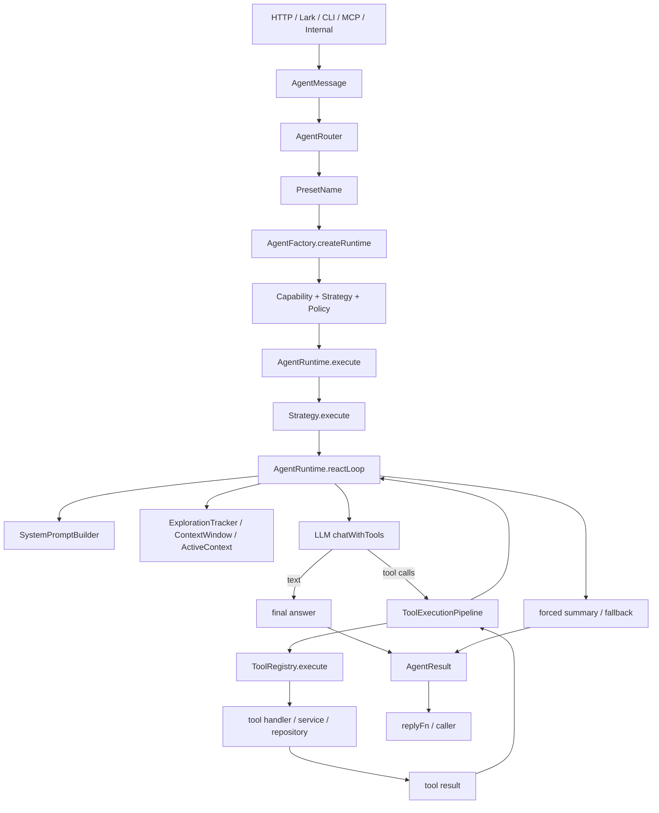

# Alembic AgentRuntime 全景实现分析

> 面向源码实现的 Agent 全景文档。
>
> 本文重点不是复述概念，而是把 Alembic 当前 Agent 栈的真实控制流、数据流、能力边界和扩展点串起来。它补充 [docs/agent-architecture.md](./agent-architecture.md) 的架构综述，也补充 AlembicBook 中对 ReAct 循环的章节说明。

---

## 1. 先给结论

Alembic 当前的 Agent 设计，不是“很多种不同的 Agent 类”，而是：

1. 只有一个统一执行引擎：[lib/agent/AgentRuntime.ts](../lib/agent/AgentRuntime.ts)
2. 不同 Agent 行为通过 Preset 组装：Capability + Strategy + Policy
3. Transport、意图路由、能力装配、多阶段执行、工具调用、记忆注入，最终都汇聚到同一个 ReAct 循环里

可以把它理解成：

- AgentMessage 解决“消息从哪里来”
- AgentRouter 解决“这条消息该走哪种配置”
- AgentFactory 解决“如何把配置装配成可运行的 Runtime”
- AgentRuntime 解决“如何在预算内完成 Thought → Action → Observation → Reflection”
- ToolExecutionPipeline + ToolRegistry 解决“工具调用如何安全、可观测、可复用地落地”
- ExplorationTracker + ActiveContext + MemoryCoordinator 解决“多轮推理如何不失控、不中断、不丢关键发现”

---

## 2. 源码地图

### 2.1 主干文件

| 模块 | 关键文件 | 作用 |
| --- | --- | --- |
| 统一出口 | [lib/agent/index.ts](../lib/agent/index.ts) | 汇总 Agent 子系统导出 |
| 消息统一 | [lib/agent/AgentMessage.ts](../lib/agent/AgentMessage.ts) | 把 HTTP/Lark/CLI/MCP/Internal 输入收敛成统一信封 |
| 路由分发 | [lib/agent/AgentRouter.ts](../lib/agent/AgentRouter.ts) | Intent → Preset |
| 运行时工厂 | [lib/agent/AgentFactory.ts](../lib/agent/AgentFactory.ts) | Preset + DI 依赖 → AgentRuntime |
| 统一运行时 | [lib/agent/AgentRuntime.ts](../lib/agent/AgentRuntime.ts) | execute + reactLoop + tool orchestration |
| 类型定义 | [lib/agent/AgentRuntimeTypes.ts](../lib/agent/AgentRuntimeTypes.ts) | AgentResult、LLMResult、ToolCallEntry、RuntimeConfig |
| 能力层 | [lib/agent/capabilities.ts](../lib/agent/capabilities.ts) | Capability 声明与注册 |
| 配置层 | [lib/agent/presets.ts](../lib/agent/presets.ts) | 命名配置组合 |
| 策略层 | [lib/agent/strategies.ts](../lib/agent/strategies.ts) | Single / FanOut / Adaptive |
| 管线策略 | [lib/agent/PipelineStrategy.ts](../lib/agent/PipelineStrategy.ts) | 多阶段顺序执行 + Gate 重试/降级 |
| 提示词构建 | [lib/agent/core/SystemPromptBuilder.ts](../lib/agent/core/SystemPromptBuilder.ts) | Persona、Capability、文件缓存、语言、预算注入 |
| 工具管线 | [lib/agent/core/ToolExecutionPipeline.ts](../lib/agent/core/ToolExecutionPipeline.ts) | before/execute/after 中间件流水线 |
| 工具注册 | [lib/agent/tools/ToolRegistry.ts](../lib/agent/tools/ToolRegistry.ts) | 注册、Schema 暴露、参数归一化、执行 |
| 工具全集 | [lib/agent/tools/index.ts](../lib/agent/tools/index.ts) | 所有内置工具导出 |
| 探索控制 | [lib/agent/context/ExplorationTracker.ts](../lib/agent/context/ExplorationTracker.ts) | 阶段状态机、信号检测、Nudge、Graceful Exit |
| 工作记忆 | [lib/agent/memory/ActiveContext.ts](../lib/agent/memory/ActiveContext.ts) | 轮次推理链 + Scratchpad + ObservationLog + Plan |
| 记忆协调 | [lib/agent/memory/MemoryCoordinator.ts](../lib/agent/memory/MemoryCoordinator.ts) | 静态/动态记忆注入和多层预算协调 |
| 事件总线 | [lib/agent/AgentEventBus.ts](../lib/agent/AgentEventBus.ts) | 生命周期/执行/进度事件 |
| 状态机 | [lib/agent/AgentState.ts](../lib/agent/AgentState.ts) | Agent phase 状态流转 |

### 2.2 一句话理解目录分层

- core: ReAct 循环的技术骨架
- context: 多轮推理的节奏控制和 token 管理
- memory: 工作记忆、会话记忆、持久记忆协调
- domain: insight、evolution、scan 等业务型 prompt/gate 逻辑
- tools: Agent 可调用能力的真实执行面

---

## 3. 端到端总链路



这个链路里最关键的事实有两个：

1. Strategy 负责“怎么组织工作”，但不负责工具执行细节
2. AgentRuntime 才是最终执行现场，所有策略都会回到它的 reactLoop 或 execute 结果汇总上

---

## 4. Alembic 当前有哪些 Agent 能力

### 4.1 Preset 级能力矩阵

Preset 定义在 [lib/agent/presets.ts](../lib/agent/presets.ts)。它是 Alembic 对“Agent 类型”的真正抽象。

| Preset | 能力组合 | Strategy | Policy | 典型场景 |
| --- | --- | --- | --- | --- |
| chat | conversation + code_analysis | single | Budget | Dashboard 对话、常规问答 |
| insight | code_analysis + knowledge_production | pipeline | Budget + QualityGate | 冷启动、深度分析、知识提取 |
| evolution | evolution_analysis | pipeline | Budget | Recipe 演进/废弃决策 |
| lark | conversation + code_analysis | single | Budget + Safety | 飞书知识管理对话 |
| remote-exec | conversation + code_analysis + system_interaction | single | Budget + Safety | 远程执行、本地操作 |

这里的关键设计是：

- 不再通过不同 Agent 子类表达差异
- 差异都落到配置组合上
- 所以“新增 Agent 能力”的首选入口，不是新增 Runtime，而是新增 Capability / Preset / Strategy / Tool

### 4.2 Capability 级能力矩阵

Capability 定义在 [lib/agent/capabilities.ts](../lib/agent/capabilities.ts)。它负责两件事：

1. 给模型注入 promptFragment，告诉它“你拥有什么能力、应怎么使用”
2. 给 Runtime 收集工具白名单，告诉它“这一轮允许调用哪些工具”

当前内置 6 个 Capability：

| Capability | 作用 | 典型工具 |
| --- | --- | --- |
| conversation | 对话、知识检索、连续上下文 | search_knowledge、search_recipes、semantic_search_code、submit_knowledge |
| code_analysis | 结构扫描、代码搜索、文件阅读、证据沉淀 | get_project_overview、search_project_code、read_project_file、note_finding |
| knowledge_production | 将分析转成知识候选并入库 | submit_knowledge、submit_with_check、read_project_file |
| scan_production | 将扫描结果转成 Recipe，但只做内存收集 | collect_scan_recipe、read_project_file |
| system_interaction | 安全命令执行、文件写入、环境探测 | run_safe_command、write_project_file、get_environment_info |
| evolution_analysis | Recipe 进化决策 | propose_evolution、confirm_deprecation、skip_evolution |

一个很重要的实现点是：Capability 只是“能力声明”，不是工具执行器。真正执行工具的还是 ToolRegistry + ToolExecutionPipeline。

### 4.3 工具层能力全量覆盖

当前工具全集定义在 [lib/agent/tools/index.ts](../lib/agent/tools/index.ts)。按当前实现，ALL_TOOLS 中共注册 60 个内置工具，按类别分布如下：

| 类别 | 数量 | 代表能力 |
| --- | --- | --- |
| AI 分析 | 2 | 候选增强、Bootstrap 候选精修 |
| AST/代码图谱/Agent Memory | 11 | 项目概览、类层级、方法覆盖、历史证据、note_finding |
| 组合工具/元工具 | 6 | analyze_code、plan_task、review_my_output、submit_with_check |
| Evolution 工具 | 3 | propose_evolution、confirm_deprecation、skip_evolution |
| Guard | 4 | 规则查询、违规查询、代码检查、建议生成 |
| 基础设施 | 7 | graph impact、skill、bootstrap、audit log |
| 知识图谱 | 2 | duplicate check、graph edge |
| 生命周期 | 10 | submit/approve/reject/publish/update/deprecate 等 |
| 项目访问 | 5 | search_project_code、read_project_file、list_project_structure |
| 查询 | 6 | search_knowledge、search_recipes、get_recipe_detail |
| 扫描收集 | 1 | collect_scan_recipe |
| 系统交互 | 3 | run_safe_command、write_project_file、get_environment_info |

从 Agent 视角看，这些工具能力大致可以再归并为 5 个大面向：

1. 项目理解：搜索、读文件、结构分析、代码图查询
2. 知识操作：搜索、详情、提交、校验、发布、废弃、反馈统计
3. 推理辅助：计划、回顾、候选增强、历史证据回取
4. 系统操作：命令执行、文件写入、环境探测
5. 治理闭环：Guard、Impact、Evolution、Knowledge Graph

---

## 5. 入口层如何把请求送进 Runtime

### 5.1 AgentMessage: 统一消息信封

[lib/agent/AgentMessage.ts](../lib/agent/AgentMessage.ts) 把不同渠道的输入归一为统一对象：

- content: 用户输入正文
- channel: http / lark / cli / mcp / internal
- session: 对话上下文与 history
- sender: 发起方身份
- metadata: mode、lang、context、stream 等附加信息
- replyFn: 把 AgentResult 回复回原渠道的函数

这意味着 Runtime 根本不需要知道消息来自 Dashboard、飞书还是 MCP。渠道差异被前移到了 Message 工厂方法里。

### 5.2 AgentRouter: Intent → Preset

[lib/agent/AgentRouter.ts](../lib/agent/AgentRouter.ts) 的路由顺序非常明确：

1. 手动 preset
2. 渠道特征
3. 关键词匹配
4. LLM 分类
5. 默认 chat

关键实现点：

- Lark 消息默认走 lark preset，若文本以 > 或 $ 开头则改走 remote-exec
- 冷启动/扫描/全项目分析相关关键词直接命中 insight
- LLM 分类不是主路径，而是兜底提升精度

也就是说，Alembic 的“智能路由”是分层的：先零成本规则，再高成本模型判别。

### 5.3 AgentFactory: Preset + 依赖注入 → AgentRuntime

[lib/agent/AgentFactory.ts](../lib/agent/AgentFactory.ts) 是 Agent 装配中枢。它做了 4 件事情：

1. 通过 getPreset 解析配置
2. 通过 CapabilityRegistry 实例化 Capability
3. 通过 PolicyEngine 实例化 Policy
4. 创建统一 AgentRuntime

Factory 还封装了几个高价值语义入口：

- createChat
- createInsight
- createLark
- createRemoteExec
- buildSystemContext
- scanKnowledge

其中 scanKnowledge 很重要。它并没有引入一个“扫描专用 Agent”，而是：

1. 复用 insight preset
2. 自定义 pipeline stage
3. 使用系统级 ContextWindow + ExplorationTracker + MemoryCoordinator
4. 最后从 toolCalls 中提取 collect_scan_recipe 的结构化结果

这恰好体现了 Alembic 的统一运行时思想。

---

## 6. AgentRuntime 的总职责

[lib/agent/AgentRuntime.ts](../lib/agent/AgentRuntime.ts) 是整个 Agent 子系统的核心。它的职责可以拆成两层：

### 6.1 execute: 一次完整执行的外壳

execute 负责：

1. 重置统计信息：iterationCount、toolCallHistory、tokenUsage、startTime
2. 执行前 Policy 校验
3. 根据 BudgetPolicy 设定总超时保护
4. 把工作委托给当前 Strategy
5. 执行后 Policy 校验
6. 更新 AgentState、EventBus、replyFn
7. 回填 AgentResult.state 与 durationMs

它不直接参与 Thought → Action 循环，但负责把一次 Runtime 执行包装成可治理、可观察、可中断的事务。

### 6.2 reactLoop: 统一 ReAct 引擎

reactLoop 是所有策略最终复用的核心循环。它的结构可以概括成：

```text
初始化 LoopContext
while true:
  轮次递增
  exit 检查
  迭代准备
  调 LLM
  若返回 tool calls → 执行工具并继续
  若返回 text → 决定继续或结束
循环结束后 finalize
```

这个循环把以下子系统真正粘在了一起：

- SystemPromptBuilder
- MessageAdapter
- ContextWindow
- ExplorationTracker
- ActiveContext
- MemoryCoordinator
- ToolExecutionPipeline
- PolicyEngine
- aiProvider.chatWithTools
- forced summary

---

## 7. AgentRuntime 主循环逐段拆解

### 7.1 #initLoop: 统一上下文装配

这一步在进入 while 前完成：

1. 解析 capabilityOverride，否则使用 runtime.capabilities
2. 通过 SystemPromptBuilder 构建基础 system prompt
3. 根据 Capability 工具白名单生成 tool schemas
4. 创建 MessageAdapter，并把历史消息和当前 prompt 载入
5. 解析 budget
6. 在 system 场景下注入轮次预算说明
7. 初始化 LoopContext
8. 推动 AgentState 从 idle → planning
9. 发布 AGENT_STARTED 事件

这一段决定了本次循环的“初始世界状态”。

### 7.2 #shouldExit: 循环退出条件

退出条件来自三层：

1. 外部 abortSignal
2. ExplorationTracker.shouldExit
3. PolicyEngine.validateDuring

此外还有一个细节：

- 若存在 tracker，PolicyEngine 的 iteration 限制会被绕开，由 tracker 自己管理 maxIterations + grace 轮次

这是为了避免“双重预算控制”互相打架。

### 7.3 #prepareIteration: 进入本轮前的动态编排

这一段做了所有“本轮级动态决策”：

- thinking progress 事件
- 由 ExplorationTracker 注入 nudge
- ContextWindow 触发上下文压缩
- 动态计算 toolChoice
- 按阶段补充 system prompt
- 注入动态记忆 prompt
- 在末轮强制总结场景下改写 prompt

其中最关键的是 toolChoice：

- tracker 模式下由 tracker 决定 required / auto / none
- 非 tracker 模式下，默认在后 20% 轮次切换到 none，逼迫模型停止工具调用并总结

### 7.4 #callLLM: 模型调用与错误恢复

LLM 调用前后会发布：

- LLM_CALL_START
- LLM_CALL_END

同时它处理了几类关键异常：

1. toolChoice = none 时不传 toolSchemas，避免部分模型在“看见工具但被禁止”场景下返回空响应
2. 累加 token usage 到 runtime 和 loop 双层统计
3. 处理空响应重试
4. 处理 graceful exit 期间模型仍偷偷返回 tool calls 的情况
5. AI 错误进入 #handleAiError

### 7.5 #handleAiError: 两击失败策略

这里实现了一个明确的恢复策略：

1. AbortError 直接退出，不计入 AI 错误
2. 普通 AI 错误累计 consecutiveAiErrors
3. tracker.rollbackTick，避免失败轮次消耗预算
4. 若熔断器已开，直接结束并返回摘要路径
5. 连续两次错误后 resetToPromptOnly，然后退出到总结逻辑

这能避免 Runtime 在坏上下文或坏外部依赖上无限重试。

### 7.6 #processToolCalls: 工具调用编排核心

如果模型返回 functionCalls，这里会：

1. 把每轮工具调用数截断到 MAX_TOOL_CALLS_PER_ITER = 8
2. 先把 assistant tool call 消息写入消息历史
3. 对每个调用进入 ToolExecutionPipeline
4. 记录 ToolCallEntry 到 loopCtx 和 runtime 两处历史
5. 通知 onToolCall hook
6. 把工具结果转成消息写回 MessageAdapter
7. 更新 tracker 的阶段信号
8. 更新 trace 的 roundSummary
9. 调用 Capability.onAfterStep
10. 必要时触发预算耗尽后的强制 summary

这里是 Runtime 最重的“执行现场”。ReAct 是否真的形成闭环，取决于这段是否把工具结果正确回灌给下一轮 LLM。

### 7.7 #processTextResponse: 文本答复分流

当模型直接返回文本时，逻辑分两种：

- tracker 模式：交给 tracker.onTextResponse 判断这是最终回答、还是需要继续、还是需要注入 digest nudge
- 非 tracker 模式：文本就是最终回答

这意味着系统任务里的“文字回复”并不天然等于结束，它仍受阶段控制器约束。

### 7.8 #finalize: 兜底输出保证

循环退出后如果还没有 lastReply：

1. scan 管线直接根据 collect_scan_recipe 工具调用数量生成固定回复
2. 若存在工具调用、tracker 或 system source，则走 produceForcedSummary
3. 否则返回通用兜底报错信息

这一步保证 AgentResult.reply 永远有值，不让上层拿到空输出。

---

## 8. Strategy 层如何组织工作

### 8.1 SingleStrategy

[lib/agent/strategies.ts](../lib/agent/strategies.ts) 中的 SingleStrategy 最简单，只做一件事：

- 把 message.content + history + context 透传给 runtime.reactLoop

这就是 chat、lark、remote-exec 的主要运行方式。

### 8.2 PipelineStrategy

[lib/agent/PipelineStrategy.ts](../lib/agent/PipelineStrategy.ts) 是 Alembic 系统任务的主力组织器，适合 Analyze → Gate → Produce 这种多阶段流程。

它的关键机制有：

1. 每个 stage 可配置 capabilities、budget、systemPrompt、promptBuilder、retryPromptBuilder
2. Gate stage 支持三态：pass / retry / degrade
3. retry 会回跳到上一个执行阶段重跑
4. degrade 会让后续可降级阶段跳过
5. 阶段级 ContextWindow / ExplorationTracker 状态隔离
6. 每阶段可有硬超时

因此 insight、evolution、scanKnowledge 都可以复用同一个 PipelineStrategy，而不用写多个专用 orchestrator。

### 8.3 FanOutStrategy

FanOutStrategy 解决多子任务并行执行问题：

- items 按 tier 分组
- 每个 tier 受 concurrency 限制
- 每个 item 使用 itemStrategy 执行
- 所有结果最后 merge

它适合多维度冷启动、批量分析、多目标审计。

### 8.4 AdaptiveStrategy

AdaptiveStrategy 会根据：

- 是否有显式 items
- prompt 中是否出现冷启动、全项目、深度分析、扫描等关键词

在 single / pipeline / fan_out 之间做路由。它本质上是 Strategy 层的 Router。

---

## 9. Prompt、上下文和记忆是如何被注入的

### 9.1 SystemPromptBuilder

[lib/agent/core/SystemPromptBuilder.ts](../lib/agent/core/SystemPromptBuilder.ts) 负责组装基础系统提示词，顺序是：

1. persona.description
2. fileCache 文件清单
3. 每个 Capability 的 promptFragment
4. 每个 Capability 的 buildContext 动态上下文
5. 语言偏好
6. system 场景下的轮次预算注入

这说明 Alembic 的 prompt 不是一整块大模板，而是由 Persona、Capability、Memory、文件缓存、阶段预算共同拼出来的。

### 9.2 ActiveContext: 工作记忆 + 推理链合并体

[lib/agent/memory/ActiveContext.ts](../lib/agent/memory/ActiveContext.ts) 把 WorkingMemory 和 ReasoningTrace 合并成一个对象，内部有三块：

1. Scratchpad: 关键发现，通常由 note_finding 写入
2. ObservationLog: 每轮工具调用和观察结果
3. Plan: 计划步骤和进度

它不是简单日志，而是下一轮推理可消费的工作记忆容器。

### 9.3 MemoryCoordinator: 多层记忆协调

[lib/agent/memory/MemoryCoordinator.ts](../lib/agent/memory/MemoryCoordinator.ts) 负责：

- PersistentMemory
- ConversationLog
- SessionStore
- ActiveContext

之间的预算分配和 prompt 注入。

它有两个重要方法：

1. buildStaticMemoryPrompt: 一次执行前构建静态记忆区块
2. buildDynamicMemoryPrompt: 每轮构建动态工作记忆区块

也就是说，Alembic 不是把所有记忆都粗暴塞给模型，而是分层、分时机、分预算地注入。

### 9.4 ContextWindow: 消息膨胀控制

虽然核心逻辑分散在 MessageAdapter / ContextWindow 中，但它在 Runtime 的职责很清晰：

- 统一管理消息历史
- 在超出预算时进行压缩
- 为多轮工具调用保留必要上下文而不是无限增长

这和 ActiveContext 是两层不同的内存：

- ContextWindow 管的是“发给 LLM 的消息历史”
- ActiveContext 管的是“给 Runtime 自己用的工作记忆”

---

## 10. ExplorationTracker 如何控制系统任务节奏

[lib/agent/context/ExplorationTracker.ts](../lib/agent/context/ExplorationTracker.ts) 是 Alembic 系统型 Agent 的节奏控制器。它把三个子问题统一起来：

1. 阶段状态机
2. 探索信号收集
3. Nudge 生成与 graceful exit

### 10.1 它解决了什么问题

如果没有 Tracker，模型在系统任务里很容易出现：

- 不停搜索，不肯总结
- 太早总结，证据不够
- 反复调用同类工具，浪费预算
- 在最后阶段仍试图调工具

Tracker 通过 phase、metrics、nudge 和 toolChoice，把这些行为收紧。

### 10.2 它有哪些关键信号

Tracker 内部维护的指标包括：

- uniqueFiles
- uniquePatterns
- uniqueQueries
- totalToolCalls
- submitCount
- roundsSinceNewInfo
- roundsSinceSubmit
- phaseRounds
- searchRoundsInPhase
- consecutiveIdleRounds

它不是“看 LLM 文本猜阶段”，而是基于工具调用事实来判断探索是否还在产生新信息。

### 10.3 它如何影响 Runtime

Tracker 在 Runtime 里主要影响四个地方：

1. shouldExit: 决定是否退出循环
2. getNudge: 注入用户侧提醒信息
3. getToolChoice: 决定 required / auto / none
4. endRound / onTextResponse: 决定阶段转换和终止时机

所以，Tracker 实际上是系统任务里的“行为控制器”。

---

## 11. 工具执行链路是怎么落地的

### 11.1 ToolExecutionPipeline: 横切关注点的装配器

[lib/agent/core/ToolExecutionPipeline.ts](../lib/agent/core/ToolExecutionPipeline.ts) 把工具执行拆成 before → execute → after 三段，中间件顺序承载横切能力。

当前内置关键中间件包括：

1. allowlistGate: 校验当前调用是否在 toolSchemas 白名单中
2. safetyGate: 通过 PolicyEngine.validateToolCall 做安全拦截
3. cacheCheck: 从 MemoryCoordinator 取缓存命中
4. observationRecord: 记录到 MemoryCoordinator
5. trackerSignal: 更新 ExplorationTracker 的 isNew 等指标
6. traceRecord: 写入 ActiveContext 推理链
7. submitDedup: 对 submit_knowledge / submit_with_check 做标题和 trigger 去重

这意味着 Alembic 的工具执行不是“直接 call handler”，而是一个可观测、可拦截、可扩展的管线。

### 11.2 ToolRegistry: 工具注册与参数归一化

[lib/agent/tools/ToolRegistry.ts](../lib/agent/tools/ToolRegistry.ts) 负责：

1. register / registerAll
2. getToolSchemas
3. execute
4. 参数归一化
5. has / unregister / getToolNames

其中参数归一化非常实用。它会把模型常见的：

- snake_case
- 近义字段名
- path / file / filename / query 等别名

自动映射回 schema 里的标准参数名。这样可以显著降低不同模型的 tool calling 方言差异。

### 11.3 工具上下文如何透传

ToolRegistry.execute 的 context 里，Runtime 会透传很多运行时上下文：

- agentId
- source
- container
- safetyPolicy
- projectRoot
- fileCache
- lang
- aiProvider
- sharedState
- dimension 元信息
- memoryCoordinator
- currentRound

这使得工具 handler 不需要直接依赖 Runtime，也能拿到足够多的执行现场信息。

---

## 12. Policy、State、EventBus 如何给 Runtime 加治理能力

### 12.1 PolicyEngine: 预算、安全、质量三层约束

虽然本文重点不是 policies.ts，但从 Runtime 使用方式看，Policy 被分成三类入口：

1. validateBefore: execute 前拦截
2. validateDuring: reactLoop 过程中持续检查
3. validateAfter: 执行后质量检查
4. validateToolCall: 每次工具调用前安全检查

典型策略包括：

- BudgetPolicy
- SafetyPolicy
- QualityGatePolicy

它们让 Runtime 从“会跑”提升到“受控地跑”。

### 12.2 AgentState: phase 状态机

[lib/agent/AgentState.ts](../lib/agent/AgentState.ts) 管理的 phase 包括：

- idle
- planning
- executing
- reflecting
- waiting_input
- handoff
- completed
- failed
- aborted

Runtime 在关键节点会通过 #safeTransition 推动状态流转。safeTransition 的存在很重要，因为 Pipeline/FanOut 场景下一个 Runtime 可能多次进入 reactLoop，非法状态切换需要被吞掉而不是打断主流程。

### 12.3 AgentEventBus: 全局可观测面

[lib/agent/AgentEventBus.ts](../lib/agent/AgentEventBus.ts) 提供了：

- 生命周期事件
- LLM 调用事件
- 工具调用事件
- 进度事件
- request/reply 式 agent 间事件通信

这让 Runtime 不必直接耦合 UI、日志、流式输出或外部监控，只需发布标准事件。

---

## 13. 三条最重要的端到端执行链路

### 13.1 普通聊天链路

```text
HTTP/Lark/MCP → AgentMessage
→ AgentRouter(chat/lark)
→ AgentFactory.createRuntime
→ Preset(chat/lark)
→ SingleStrategy
→ AgentRuntime.reactLoop
→ 对话/分析工具
→ 最终文本回复
```

特点：

- 低轮次
- 允许记忆
- 以文本交互为主
- 一般不启用 Tracker

### 13.2 insight 深度分析链路

```text
消息 → insight preset
→ PipelineStrategy
→ analyze stage
→ quality_gate
→ produce stage
→ rejection_gate
→ 汇总返回
```

特点：

- 多阶段
- 通常是 system source
- 使用 Tracker 控节奏
- produce 阶段可能触发 submit_knowledge / submit_with_check

### 13.3 scanKnowledge 扫描链路

```text
AgentFactory.scanKnowledge
→ createRuntime(insight + custom pipeline)
→ buildSystemContext
→ runtime.execute(internal message)
→ collect_scan_recipe 工具逐个收集
→ 从 result.toolCalls 提取结构化 recipe
```

特点：

- 不直接入库
- 产出从 toolCalls 里回收
- 体现了 Runtime 不仅能产出文本，也能产出结构化工作结果

---

## 14. 为什么说 Alembic Agent 是“统一引擎 + 分层编排”

综合源码实现，可以把 Alembic Agent 总结为四层：

### 第 1 层: 输入统一

- AgentMessage
- Router
- Transport 适配

解决的是“请求从哪里来”。

### 第 2 层: 行为装配

- Preset
- Capability
- Strategy
- Policy

解决的是“这次该以什么模式跑”。

### 第 3 层: 运行时执行

- AgentRuntime.execute
- AgentRuntime.reactLoop
- LoopContext
- SystemPromptBuilder

解决的是“多轮 Thought/Action/Observation 如何真的跑起来”。

### 第 4 层: 执行基座

- ToolExecutionPipeline
- ToolRegistry
- ActiveContext
- MemoryCoordinator
- ExplorationTracker
- AgentState
- EventBus

解决的是“如何让它安全、稳定、可扩展、可观察、可恢复”。

这一分层的价值在于：

- 新增工具，不需要改 Runtime
- 新增 Capability，不需要改 Router
- 新增 Preset，不需要改 ToolRegistry
- 新增 Pipeline stage，不需要改 execute 外壳

---

## 15. 扩展和维护时应该从哪里下手

### 15.1 想新增一种“Agent 能力”

优先顺序通常是：

1. 在 [lib/agent/tools](../lib/agent/tools) 新增工具
2. 在 [lib/agent/capabilities.ts](../lib/agent/capabilities.ts) 选择接入到哪个 Capability，或新增 Capability
3. 在 [lib/agent/presets.ts](../lib/agent/presets.ts) 把 Capability 组装进某个 Preset
4. 如果需要新的组织方式，再考虑新增 Strategy 或 Pipeline stage

### 15.2 想改变系统任务节奏

重点看：

- [lib/agent/context/ExplorationTracker.ts](../lib/agent/context/ExplorationTracker.ts)
- [lib/agent/context/exploration](../lib/agent/context/exploration)
- [lib/agent/PipelineStrategy.ts](../lib/agent/PipelineStrategy.ts)
- [lib/agent/presets.ts](../lib/agent/presets.ts)

### 15.3 想改变最终输出质量

重点看：

- [lib/agent/core/SystemPromptBuilder.ts](../lib/agent/core/SystemPromptBuilder.ts)
- [lib/agent/domain/insight-analyst.ts](../lib/agent/domain/insight-analyst.ts)
- [lib/agent/domain/insight-producer.ts](../lib/agent/domain/insight-producer.ts)
- [lib/agent/domain/insight-gate.ts](../lib/agent/domain/insight-gate.ts)
- [lib/agent/forced-summary.ts](../lib/agent/forced-summary.ts)

### 15.4 想排查“模型行为不稳定”

优先排查：

1. toolSchemas 是否正确过滤
2. toolChoice 是否被阶段逻辑改写
3. ContextWindow 是否压缩过度
4. Tracker 是否提前切到 SUMMARIZE
5. Policy 是否中途 stop
6. ToolExecutionPipeline 中间件是否返回 blocked / dedup / cacheHit
7. finalize 是否走了 forced summary

---

## 16. 代码阅读建议顺序

如果要从源码真正读懂 AgentRuntime，推荐顺序如下：

1. [lib/agent/index.ts](../lib/agent/index.ts)
2. [lib/agent/presets.ts](../lib/agent/presets.ts)
3. [lib/agent/capabilities.ts](../lib/agent/capabilities.ts)
4. [lib/agent/AgentFactory.ts](../lib/agent/AgentFactory.ts)
5. [lib/agent/AgentRuntime.ts](../lib/agent/AgentRuntime.ts)
6. [lib/agent/core/SystemPromptBuilder.ts](../lib/agent/core/SystemPromptBuilder.ts)
7. [lib/agent/core/ToolExecutionPipeline.ts](../lib/agent/core/ToolExecutionPipeline.ts)
8. [lib/agent/tools/ToolRegistry.ts](../lib/agent/tools/ToolRegistry.ts)
9. [lib/agent/context/ExplorationTracker.ts](../lib/agent/context/ExplorationTracker.ts)
10. [lib/agent/memory/ActiveContext.ts](../lib/agent/memory/ActiveContext.ts)
11. [lib/agent/memory/MemoryCoordinator.ts](../lib/agent/memory/MemoryCoordinator.ts)
12. [lib/agent/PipelineStrategy.ts](../lib/agent/PipelineStrategy.ts)

这样读，能先建立“配置如何装配”，再进入“循环如何执行”，最后再看“上下文和工具如何支撑”。

---

## 17. 总结

Alembic 当前 Agent 体系最核心的实现特征是：

1. 一个 Runtime 统一承载所有 Agent 执行
2. Preset 统一表达差异化行为，而不是膨胀出多套 Agent 类
3. Strategy 决定工作组织方式，Capability 决定允许做什么，Policy 决定边界，ToolExecutionPipeline 决定如何安全落地
4. ExplorationTracker、ActiveContext、MemoryCoordinator 共同把“多轮推理”从简单对话升级成可控的系统型执行
5. 文本回复只是 Agent 的一种输出，toolCalls、phases、state 同样是关键产物

如果把 Alembic AgentRuntime 看成一个系统，它已经具备了现代 Agent 框架常见的完整部件：

- 统一输入模型
- 可配置能力装配
- 多策略执行引擎
- ReAct 循环
- 多层记忆
- 阶段控制器
- 工具白名单和安全闸门
- 质量门控和降级机制
- 全局事件与状态观测

换句话说，Alembic 的 Agent 不是“在代码库里嵌了几个 AI 调用”，而是已经形成了一套可持续扩展的运行时架构。