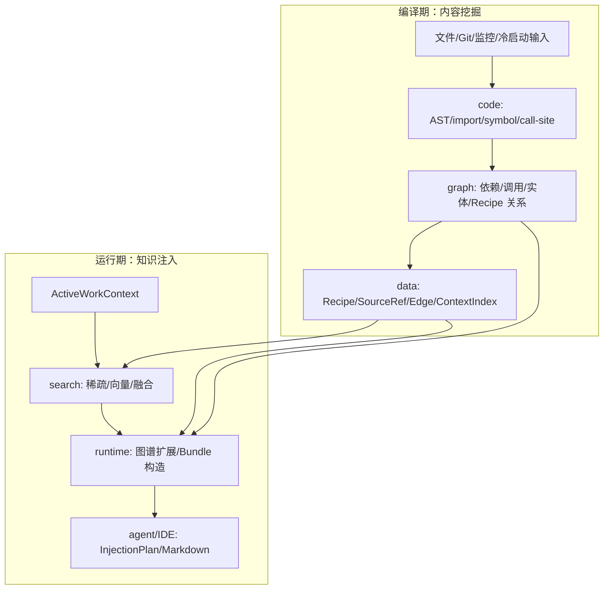

# 新主干中间层迁移计划

本文档用于承接新主干下一阶段开发：在底层 `core/data/code/search/graph/runtime`
已经初步分层后，继续深挖旧 Alembic 的真实实现，把值得保留的能力迁入新主干，并把过重、低频、偏支的功能剪掉。

## 核心判断

新主干要最终替代旧项目，但替代方式不是把旧对象包一层适配器继续跑，而是按编译期和运行期两条主线重新实现。

编译期主线负责内容挖掘：

1. 文件、Git、监控、冷启动和增量扫描进入统一输入。
2. 语言解析、符号表、调用图、依赖图产出项目事实。
3. 证据包、Recipe、Recipe 关系和 SourceRef 进入数据层。
4. 搜索索引、图谱索引和 ContextIndex 形成可查询的知识底座。

运行期主线负责知识注入：

1. Agent 或 IDE 只提交当前任务上下文。
2. Runtime 通过搜索、图谱扩展和 Recipe 关系取回上下文。
3. 注入层产出稳定的 ContextBundle、InjectionPlan 和 Markdown/IDE artifact。
4. 现有 `agent/tools/workflows` 暂时保持现状，只在边界逐步切向新主干。

中间层的定位是连接底层基础能力和上层使用闭环。它不是临时投影层，而是未来 Alembic 的真实业务内核。

## 当前新主干状态

已有基础：

- `lib/mainline/core`：路径、写边界、日志端口、生命周期、事件、调度器、并发、WorkerPool、文件监控、GitPort、TestMode、环境变量、单例注册等基础能力。
- `lib/mainline/data`：ContextIndex、JSON 存储、ArtifactStore、JobLedger、DatabasePort、FileFingerprintSnapshotStore。
- `lib/mainline/data`：SQLite ContextIndex、ContextIndex、JSON 存储、ArtifactStore、JobLedger、DatabasePort、FileFingerprintSnapshotStore、SQLite data_version 失效观察。
- `lib/mainline/code`：语言目录、文件扫描、AstPort、结构化 AST parser、import record、import path resolver、symbol table、call-site extractor。
- `lib/mainline/search`：内存搜索索引、中英混合 tokenizer、字段权重 scorer、RRF、批量 embedding 端口、内存/JSON 向量 store、HybridSearch。
- `lib/mainline/graph`：项目文件图、ProjectIntelligenceArtifact、ProjectIntelligenceQueries、import/export/require/dynamic import 关系、循环、外部依赖和未解析依赖。
- `lib/mainline/compile`：内容挖掘 runner、EvidencePackage、RecipeRelationMiner、SourceRef 物化、增量证据编译、ProjectIntelligence materializer/runner。
- `lib/mainline/runtime`：ActiveWorkContext、RuntimeRetrievalPipeline、ContextBundle、GraphExpansion、GuardFindingBuilder。
- `lib/mainline/agent`：知识注入 runner、上下文 presenter、注入规划器。

短板：

- 数据层已有 SQLite ContextIndex 和跨连接失效观察，但还缺少一条统一 materialization transaction，把 Recipe/SourceRef/Edge/search document 一次写齐。
- 搜索层已有 tokenizer、字段权重、RRF、向量 store 和 HybridSearch，但还缺少从编译期产物到 search document 的稳定增量索引写入。
- 代码层已有 import record、path resolver、symbol table 和 call-site extractor，但还缺少跨文件调用边解析、受影响文件闭包和大项目 partial result 策略。
- 图谱层已有 ProjectIntelligence artifact 与查询器，但还缺少 data_flow、inherits、conforms、depends_on 等更完整语义边，以及增量合并策略。
- Runtime 已有检索闭环，但 `agent/tools/workflows` 尚未切换到新主干，IDE delivery 也还只是未来边界。

## 旧实现可迁入能力

### 数据层

旧实现中值得迁入的能力：

- `DatabaseConnection` 的 Ghost data root、PathGuard、WAL、foreign_keys、busy_timeout、迁移、健康检查。
- `KnowledgeUnitOfWork` 的原则：文件或 artifact 是真相源，数据库是索引和查询缓存，写入失败要有补偿逻辑。
- `KnowledgeRepository`、`RecipeSourceRefRepository`、`KnowledgeEdgeRepository` 的核心查询模型：Recipe、SourceRef、RecipeEdge、active/stale path、入边出边、热点节点、调用/data_flow/pattern 关系。
- `CodeEntityRepository` 的实体存储能力，但它应服务 `mainline/graph`，不要让数据层承担图谱业务。
- `BootstrapRepository` 的 snapshot 和 dimension-file map 能力，可和 `FileFingerprintSnapshotStore` 合并思考。
- `CacheCoordinator` 基于 SQLite `PRAGMA data_version` 的跨进程失效机制，适合放入新数据层。

暂缓或剪枝：

- Redis/UnifiedCacheAdapter、CacheKeyBuilder 这类抽象收益低，先不迁。
- RemoteCommandRepository、Lark/远程 IDE 命令暂不进入主干。
- audit/session/token/evolution proposal 等旁路表先不迁。
- 直接 SQL escape hatch 只保留必要位置，不在新主干扩散。

### 搜索层

旧实现中值得迁入的能力：

- 中文、CJK bigram、camelCase、PascalCase、停用词处理的 tokenizer。
- 字段权重评分：trigger、title、tags、description、content、facets 分层加权。
- RRF 融合算法，用于稀疏搜索和向量搜索合并。
- `BatchEmbedder` 的批处理、并发、失败回退。
- 最小向量存储接口和 JSON brute-force fallback。
- IndexingPipeline 的 hash 增量思想，但实现要轻，不把旧 pipeline 原样搬进来。

暂缓或剪枝：

- 整个旧 `SearchEngine` 暂不搬，它把 SQL、向量、rerank、上下文补强和 HTTP 参数揉得太重。
- CrossEncoder、CoarseRanker、MultiSignalRanker、contextBoost 暂不进入核心。
- HNSW、BinaryPersistence、SQ8、VectorMigration 以后作为可插拔加速，不作为主线必需品。
- 搜索 HTTP 的 graph/impact/similarity 扩展接口暂不迁，等主干图谱稳定后再恢复。

### AST、符号和图谱层

旧实现中值得迁入的能力：

- `ImportRecord` 的结构：symbols、alias、kind、isTypeOnly。
- `ImportPathResolver` 的策略：相对路径、扩展名补全、index 文件、Python `__init__.py`、tsconfig/jsconfig paths alias。
- `SymbolTableBuilder` 的思路：FQN declaration、fileImports、fileExports、instantiatedClasses、propertyTypes。
- `CallEdgeResolver` 的解析优先级：this/self/super、import-based、隐式 this、本文件函数、全局唯一匹配、RTA 过滤、DI 字段类型推断。
- 大项目降级策略：文件数量、调用点数量、timeout partial result、affectedFiles 增量。
- `CodeEntityGraph` 的语义词表：class、protocol、category、module、pattern、method，以及 inherits、conforms、extends、calls、data_flow、depends_on、uses_pattern。

暂缓或剪枝：

- 不整迁 `AstAnalyzer + lib/core/ast/* + core/ast/ProjectGraph`。
- tree-sitter、wasm grammar、自动 grammar 安装和语言插件副作用注册先放到后续 adapter，不进入主干核心。
- 旧 `ProjectGraph` 是扫描、解析、索引、缓存、增量一体化对象，形态过重。
- 图谱数据库 materialization 不放在 graph 核心里，graph 先输出纯对象 artifact。

### 冷启动、结构工具和注入层

旧实现中值得保留的行为：

- 冷启动入口、Mission Briefing、异步维度扫描的用户体验暂时保持。
- `ProjectIntelligenceRunner` 的阶段思想保留，但内部要拆成主干端口：文件事实、AST 事实、实体图、调用图、依赖图、Guard findings、Panorama signals。
- `alembic_structure`、`alembic_graph`、`alembic_call_context` 的输出契约暂时保持，但未来数据源切向主干图谱。
- IDE delivery 输出路径和产物格式先保持，输入数据逐步改成 ContextIndex 和 Recipe/Graph 查询。

暂缓或剪枝：

- `agent/tools/workflows` 暂不改。
- wiki tool 锻造、Guard 反向优化、AI mock、过度自动化演化等非主线能力不进入这轮。
- 冷启动可以继续使用，但要把它视为编译期入口之一，而不是主干中心。

## 新主干中间层目标结构

关键约束：

- 主干内接口必须一致，不做多种兼容形状。
- 旧代码只允许作为参考或边界 adapter，不能在主干核心里继续支配模型。
- 每个中间层都要有稳定输入、稳定输出和测试 fixture。
- 中文注释优先补在领域模型、复杂算法和迁移边界处。

## 多子 agent 迁移设计

### Agent A：数据层主干

职责：

- 在 `lib/mainline/data` 建立 SQLite 主干实现。
- 迁入 Ghost data root、WAL、foreign_keys、busy_timeout、migration、health check。
- 建立 `RecipeStore`、`SourceRefStore`、`RecipeEdgeStore`、`ContextIndexStore` 的生产实现。
- 加入跨进程缓存失效能力，优先复用 `PRAGMA data_version` 思路。

明确不做：

- 不迁 Redis。
- 不迁 audit/session/token/evolution。
- 不碰 `agent/tools/workflows`。

验收：

- SQLite integration tests 覆盖迁移幂等、事务、SourceRef stale/active、RecipeEdge in/out、ContextIndex 重建。
- 主干类型不暴露旧 `KnowledgeEntry`。

### Agent B：搜索与检索主干

职责：

- 在 `lib/mainline/search` 增加 tokenizer、字段权重 scorer、RRF 融合。
- 定义最小 `VectorStore` 和 JSON brute-force adapter。
- 加入 `BatchEmbedder` 风格的批量 embedding 端口，但不绑定具体 AI provider。
- 让搜索输入只消费 `MainlineSearchDocument`，输出只暴露稳定 hit 结构。

明确不做：

- 不迁 CrossEncoder、多信号 reranker、HNSW 和 HTTP 扩展搜索接口。
- 不把旧 `SearchEngine` 包进主干。

验收：

- 单测覆盖中文、camelCase、PascalCase、字段权重、稀疏/向量融合、无向量降级。
- 搜索层不依赖旧 repository。

### Agent C：代码解析、符号表和调用图

职责：

- 在 `lib/mainline/code` 建立 `MainlineImportRecord`、`MainlineImportParser`、`MainlineSymbolTableBuilder`。
- 增强 import path 解析：alias、index、扩展名、Python dotted import、tsconfig/jsconfig paths。
- 定义 `MainlineCallSite`，先实现 TS/JS/Python 的保守调用点抽取。
- 把旧 `CallEdgeResolver` 的解析优先级迁成纯算法。

明确不做：

- 不直接引入 tree-sitter。
- 不迁旧语言插件注册器。
- 不追求第一轮高召回，优先稳定和可解释。

验收：

- fixture 覆盖 import alias、动态 import、CJS require、Python package、same-file call、import-based call、unresolved call、timeout partial。
- 输出能被 graph 层直接消费。

### Agent D：项目图谱和全景能力

职责：

- 在 `lib/mainline/graph` 扩展实体和边 vocabulary。
- 支持 file-to-file、symbol-to-symbol、calls、data_flow、inherits、implements/conforms、depends_on。
- 建立纯对象 `ProjectIntelligenceArtifact`，不直接写数据库。
- 设计图谱增量合并和大项目降级策略。

明确不做：

- 不迁旧 `CodeEntityGraph` 的 repository 写入。
- 不恢复 Panorama 的重服务依赖，只保留必要 signals。

验收：

- 图谱单测覆盖实体去重、边去重、调用链、反向 callers/callees、影响范围、循环。
- 产物可序列化，可被数据层 materializer 写入。

### Agent E：ContextIndex 与 Runtime 注入闭环

职责：

- 让 Runtime 使用真实 ContextIndex、search hit、graph expansion 构造 ContextBundle。
- 让 `AgentInjectionPlanner` 只依赖主干稳定类型。
- 把 Recipe 关系、SourceRef freshness、GuardFinding 纳入 Bundle 构造。
- 为 IDE delivery 定义一个轻输入接口，输出仍保持现有 artifact 格式。

明确不做：

- 不重写旧 agent。
- 不改 workflow 协议。
- 不扩大 AI mock。

验收：

- 单测覆盖 ActiveWorkContext -> search -> graph expansion -> ContextBundle -> InjectionPlan。
- 无搜索结果、SourceRef stale、Recipe 冲突、GuardFinding 存在时都有稳定输出。

### Agent F：冷启动和结构工具切换

职责：

- 保持旧冷启动入口可用，把内部产物逐步 materialize 到主干 ContextIndex/Graph。
- 为 `alembic_structure`、`alembic_graph`、`alembic_call_context` 准备主干数据源。
- 将 `ProjectIntelligenceRunner` 的阶段结果映射为主干 artifact。

明确不做：

- 不重写 MCP tools。
- 不改现有返回 JSON 契约。
- 不把旧 workflow 直接塞进新主干。

验收：

- 同一个 fixture 项目，旧结构工具和新主干结构结果在关键字段上可对照。
- 冷启动后能查询到 Recipe、SourceRef、文件图、符号图、搜索文档。

## 并行推进顺序

第一轮可以并行：

- Agent A 做数据层主干。
- Agent B 做搜索纯算法和内存/JSON 实现。
- Agent C 做 import、symbol、call-site。

第二轮依赖第一轮：

- Agent D 消费 Agent C 的 code artifact，建立项目图谱。
- Agent E 消费 Agent A/B/D 的 ContextIndex、Search、Graph。

第三轮收口：

- Agent F 把冷启动、结构工具、IDE delivery 的输入逐步切到新主干。

建议窗口分配：

1. 数据窗口：只改 `lib/mainline/data` 和对应测试。
2. 搜索窗口：只改 `lib/mainline/search` 和对应测试。
3. 代码图谱窗口：先改 `lib/mainline/code`，再交给图谱窗口接 `lib/mainline/graph`。
4. Runtime 窗口：等数据/搜索/图谱基本接口确定后再动。
5. Surface 窗口：最后处理冷启动、MCP structure、IDE delivery 的切换。

## 分轮实现计划

### Round 1：数据、搜索、代码解析三根中柱

目标：

- 数据层有生产级 SQLite store。
- 搜索层有可用的字段权重和融合检索。
- 代码层有结构化 import、符号表和轻量调用点。

交付：

- `mainline/data` SQLite adapter。
- `mainline/search` tokenizer/scorer/RRF/vector fallback。
- `mainline/code` import parser/symbol table/call-site。

### Round 2：项目图谱和 ContextIndex 真实化

目标：

- 编译期能把文件事实、符号事实、调用事实、Recipe 事实合成统一 ContextIndex。
- graph 层输出可序列化的项目智能 artifact。

交付：

- `ProjectIntelligenceArtifact`。
- graph vocabulary。
- ContextIndex materializer。

### Round 3：Runtime 注入闭环

目标：

- 运行期不再依赖临时内存数据，而是从 ContextIndex/Search/Graph 取数。
- 注入结果能解释“为什么选这些 Recipe 和 SourceRef”。

交付：

- Runtime retrieval pipeline。
- GraphExpansion 接真实 graph。
- InjectionPlan 可解释字段。

### Round 4：冷启动、结构工具、IDE delivery 切换

目标：

- 上层入口保持，但内部逐步切到新主干。
- 旧 `agent/tools/workflows` 不大动，只让它们读取更稳定的数据产物。

交付：

- 冷启动 materialization。
- structure/call_context 主干数据源。
- IDE delivery 输入切换。

## 剪枝总表

本阶段不做：

- AI mock 扩张。
- wiki tool 锻造。
- Guard 反向优化。
- 重型 reranker。
- HNSW 和向量压缩。
- 远程命令、Lark、复杂 IDE remote。
- 旧 AST runtime 整体迁移。
- 旧 ProjectGraph 整体迁移。
- audit/session/token/evolution proposal。
- `agent/tools/workflows` 重构。

可以保留但后移：

- tree-sitter adapter。
- HNSW adapter。
- Panorama richer signals。
- MCP 搜索扩展接口。
- 多语言深度 AST walker。

## 设计红线

- 主干模型不能同时支持多套历史字段名。
- 中间层不能为了旧调用方变成兼容仓库。
- 数据层只负责存储和事务，不负责搜索排序和图谱语义。
- 搜索层只负责检索，不负责决定注入策略。
- 图谱层只负责事实和关系，不负责写数据库副作用。
- Runtime 只消费稳定数据，不直接扫描文件。
- 注释写在领域边界和复杂算法旁边，避免空泛注释。

## 下一步建议

下一轮优先开三个并行任务窗口：

1. 数据层主干：SQLite store、事务、迁移、Recipe/SourceRef/Edge。
2. 搜索主干：tokenizer、field scoring、RRF、JSON vector fallback。
3. 代码主干：import record、symbol table、轻量 call-site。

我在主窗口负责收口接口一致性：确保三条线产出的类型能进入 Round 2 的 `ProjectIntelligenceArtifact` 和 ContextIndex materializer。
