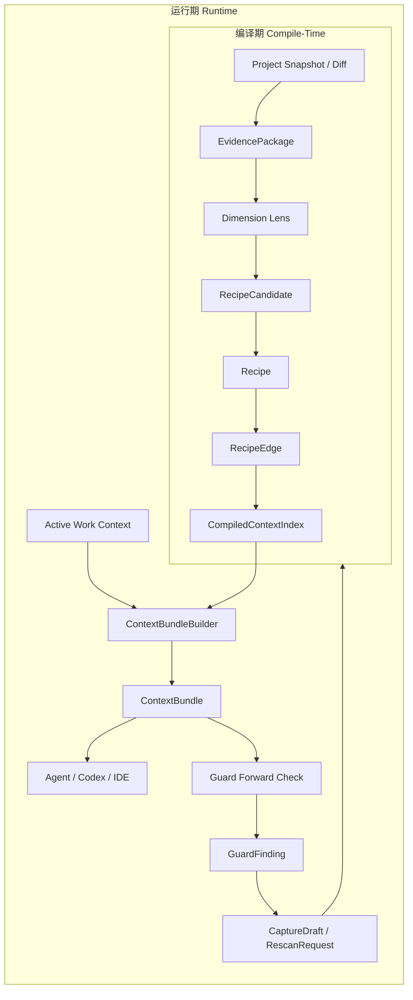

# Alembic 双主线重构总案

> 目标：把 Alembic 从“很多能力并列的平台”收束成“开发现场的项目上下文层”。新的架构只保留两条核心主线：编译期把项目编译成可信知识图谱，运行期把图谱压缩成可行动上下文并反馈回编译期。

## 1. 核心判断

Alembic 现在不是能力不够，而是能力过多且同层竞争。Wiki 生成、Tool Forge、ReverseGuard、Dashboard 全量控制台、Workflow Skill Forge、Semantic Memory、Panorama、Delivery 等能力都试图进入主流程，结果让“最常用、最高频、最高收益”的路径变重。

新的主线不再问“还能加什么工具”，而是问：

1. 编译期：代码、文档、差异、历史 Recipe 能否被稳定编译成 `SourceRef -> Recipe -> RecipeEdge -> ContextIndex`？
2. 运行期：当前任务、当前文件、当前 diff 能否快速得到一个小而准的 `ContextBundle`？
3. 反馈期：Guard、Agent、用户操作产生的新证据能否回流成低成本的 `CaptureDraft` 或 `RescanRequest`？

如果一个功能不能服务这三件事，它就不应该在核心路径里。

## 2. 新的两条主线



编译期负责“形成知识”：扫描、挖掘、归纳、建立关系、写入索引。

运行期负责“使用知识”：根据当前开发现场召回上下文、解释规则、辅助修改、反馈新证据。

这两条线共享领域模型和数据层，但不能互相拖拽。运行期不能默认启动昂贵的编译工作；编译期不能默认生成 Wiki、跑 Dashboard 流程、执行 Tool Forge。

## 3. 第一性对象

新的主对象只保留六类：

| 对象 | 归属 | 作用 |
| --- | --- | --- |
| `SourceRef` | 编译期/数据层 | 知识证据锚点，连接 Recipe 与真实代码、文档、diff。 |
| `Recipe` | 编译期/数据层 | 项目可复用约定、模式、事实、风险。 |
| `RecipeEdge` | 编译期/数据层 | Recipe 之间的可解释关系，例如 `requires`、`supports`、`conflicts_with`。 |
| `EvidencePackage` | 编译期 | 一次扫描或 diff 产生的最小证据包。 |
| `ContextBundle` | 运行期 | 给 Agent/人/Guard 的当前任务上下文包。 |
| `GuardFinding` | 运行期 | 前向规则检查结果，必须能解释、定位、反馈。 |

其他对象如果存在，也应该围绕这六类服务，而不是扩展成新的平台。

## 4. 目标目录建议

```text
lib/mainline/
  foundation/
  domain/
    SourceRef.ts
    Recipe.ts
    RecipeEdge.ts
    EvidencePackage.ts
    ContextBundle.ts
    GuardFinding.ts
    DimensionLens.ts
  data/
    RecipeStore.ts
    EdgeStore.ts
    SourceRefStore.ts
    CodeEntityStore.ts
    ContextIndex.ts
  compile/
    SnapshotCompiler.ts
    EvidencePackageBuilder.ts
    DimensionLensPolicy.ts
    RecipeCandidateMiner.ts
    RecipeRelationMiner.ts
    CompileArtifactWriter.ts
  runtime/
    ActiveWorkContext.ts
    GraphExpansion.ts
    ContextBundleBuilder.ts
    GuardExplanationBuilder.ts
    CaptureDraftBuilder.ts
  agent/
    RouteSkill.md
    AgentContextPresenter.ts
    McpFacade.ts
  legacy/
    KnowledgeServiceAdapter.ts
    SearchEngineAdapter.ts
    GuardServiceAdapter.ts
    WorkflowAdapter.ts
```

依赖方向：

```text
foundation -> domain -> data -> compile/runtime -> agent/interfaces
```

规则：

1. `compile` 可以写入索引，但不直接调用运行期 Agent。
2. `runtime` 可以读取索引，但不默认触发全量 rescan。
3. `agent` 只能消费 `ContextBundle`，不能成为领域模型中心。
4. `legacy` 只做旧系统适配，不承载新逻辑。

## 5. 核心剪枝

| 功能线 | 新定位 | 动作 |
| --- | --- | --- |
| Wiki tool / WikiGenerator | 高级导出，不是主线 | 从完成流程默认项移除，保留手动入口。 |
| Tool Forge | 实验能力，不是主线 | 从核心 DI/运行期 fallback 迁出，默认关闭。 |
| ReverseGuard | 反向健康审计，不是主线 | 用编译期 SourceRef freshness 替代核心价值。 |
| Guard RuleLearner / Coverage / Compliance | Guard 辅助层 | 保留数据价值，退出默认运行链路。 |
| Workflow Finalizer 全家桶 | 旧工作流尾部编排 | 拆为显式步骤，默认只写核心 artifact。 |
| AgentRuntime 大平台 | 旧 Agent 容器 | 冻结为 adapter，新主线不继续加能力。 |
| Dashboard 全控制台 | 可视化外壳 | 主屏改成 Current Context，复杂能力进 Advanced。 |
| SignalCollector 自动建议 | 辅助信号 | 改为显式 review，不自动制造新任务。 |
| Remote Recipe Repo / Lark / MacSystem | 外部集成 | 只保留 adapter，不进主线。 |

## 6. 迁移策略

重构不建议一次性推倒。正确方式是“新主线旁路生长，旧系统逐步供血”：

1. 先补领域合约：`SourceRef`、`RecipeEdge`、`EvidencePackage`、`ContextBundle`。
2. 用 legacy adapter 从旧 Search/Knowledge/Guard 读数据，先跑通 `ContextBundleBuilder`。
3. 把编译期扫描从现有 `ProjectIntelligenceRunner`、`KnowledgeRescanPlanner` 中抽出薄层。
4. 把 Recipe 关系挖掘作为 `RecipeProductionGateway` 的后处理，而不是单独开大系统。
5. 运行期 Guard 只做前向检查和解释，ReverseGuard 下线到高级审计。
6. 完成流程的默认项改轻：不默认 wiki、不默认 panorama、不默认 semantic memory。
7. 多窗口并行推进，每个窗口只拥有一个写入边界，避免互相踩。

## 7. 分文档

- [01-current-code-audit.md](01-current-code-audit.md)：真实代码审计、重型模块、剪枝判断。
- [02-compile-time-mainline.md](02-compile-time-mainline.md)：编译期主线、扫描挖掘、Recipe 关系生成。
- [03-runtime-mainline.md](03-runtime-mainline.md)：运行期主线、ContextBundle、Agent/Guard 交互。
- [04-pruning-and-migration-plan.md](04-pruning-and-migration-plan.md)：剪枝清单、迁移步骤、风险控制。
- [05-parallel-task-windows.md](05-parallel-task-windows.md)：多任务窗口拆分、写入边界、同步协议。
- [06-legacy-pruning-execution-map.md](06-legacy-pruning-execution-map.md)：基于真实代码路径的旧链路剪枝执行图。
- [07-layered-migration-content-mining-injection.md](07-layered-migration-content-mining-injection.md)：内容挖掘与知识注入两条上层主线的自底向上迁移计划。
- [08-ai-capability-migration-pruning.md](08-ai-capability-migration-pruning.md)：AI 能力迁入、真实 provider 边界和 mock/AgentRuntime/ToolForge 剪枝规则。
- [09-mainline-foundation-infra.md](09-mainline-foundation-infra.md)：统一单例、环境、数据库端口、语言/AST 端口等底层基础设施设计。
- [10-extracted-foundation-capabilities.md](10-extracted-foundation-capabilities.md)：从旧代码挖掘出的 IO、事件、配置、Job、语言扫描等底层能力提取与剪枝判断。
- [11-project-surface-change-capabilities.md](11-project-surface-change-capabilities.md)：Git、文件监控、IDE、插件、测试模式、Markdown 等项目表层能力的迁入与剪枝边界。
- [12-next-phase-incremental-evidence-plan.md](12-next-phase-incremental-evidence-plan.md)：检查当前主干实现后的下一阶段计划，核心是增量证据编译闭环。
