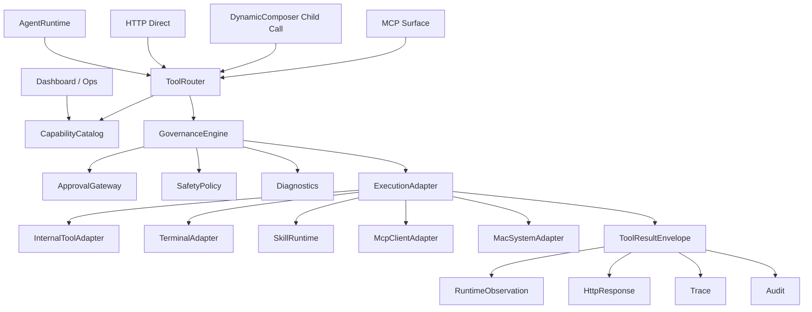

# Agent 工具体系统一解耦落地方案

本文承接 `docs-dev/agent-tool-system-redesign.md`，目标不是重复目标架构，而是把“能力目录 + 治理内核 + ACI 设计”拆成可审查、可测试、边界清晰的工程落地方案。

本文按“破坏性重构”设计：可以删除旧结构、重写调用链、调整 API 返回结构，不以兼容旧入口为主要约束。唯一需要保持的是业务语义、权限安全、可观测性和测试可验证性。

核心判断：

- 现有 `ToolRegistry`、`ToolExecutionPipeline`、`ToolMetadata`、`DiagnosticsCollector`、`SystemRunContext` 可以提供语义参考，但不再作为必须兼容的结构保留。
- 当前最大耦合点是 `ToolRegistry.execute()` 同时承担“参数规范化、handler 调用、错误兜底、跨入口执行入口”四种职责；新架构应移除这个万能入口。
- 统一解耦的正确顺序是：先定义层级和接口，再替换所有入口，最后接入 terminal、Skill、MCP、macOS 等 adapter。
- 新系统只允许一条执行主路径：`Surface -> ToolRouter -> GovernanceEngine -> ExecutionAdapter -> ToolResultEnvelope`。

## 1. 目标

### 1.1 要解决的问题

当前工具调用路径存在几类分叉：

- Runtime ReAct loop 走 `ToolExecutionPipeline`，但 HTTP direct 经过 `ensureDirectToolAllowed()` 后调用 `AgentFactory.invokeAgent()`，最终直接落到 `ToolRegistry.execute()`。
- `DynamicComposer` 的子步骤直接调用 `registry.execute()`，组合工具虽然禁止 side-effect step，但子步骤没有独立 callId、policy decision、diagnostics 和 trace 层级。
- `tools/index.ts` 通过多张 `Set` / `Map` 推导 metadata，能力描述、治理策略、暴露面和测试期望混在一起。
- tool handler 返回任意对象，Runtime、HTTP、MCP、Dashboard、ActiveContext 很难共享结果处理逻辑。
- `run_safe_command` 已经变成 tokenized `execFile`，但仍是字符串命令工具，不具备 terminal 子系统所需的 command policy、artifact、approval preview 和 session 抽象。

### 1.2 目标形态

落地后的调用链应收敛为：



### 1.3 非目标

第一轮落地不做这些事：

- 不开放任意 shell、鼠标键盘 UI 自动化、第三方 MCP 自动执行或 Skill 脚本执行。
- 不保留旧调用链作为长期兼容层；旧接口只作为迁移期间的待删除对象。
- 不允许任何入口直接调用 tool handler、registry handler 或外部 adapter。
- 不把 Gateway、SafetyPolicy、approval、人类确认混成一个大类；它们由 `GovernanceEngine` 编排，但保持职责独立。
- 不为了迁就旧返回结构继续允许 handler 返回任意对象；所有 adapter 必须返回 `ToolResultEnvelope`。

### 1.4 破坏性重构原则

新架构以清晰边界优先：

- **单一能力事实源**：所有工具、workflow、Skill、terminal profile、MCP tool、macOS capability 都必须先进入 `CapabilityCatalog`。
- **单一执行入口**：所有 Runtime、HTTP、MCP、Dashboard、composer、system task 调用都必须经过 `ToolRouter`。
- **单一治理内核**：discover、plan、approve、execute 四阶段决策都由 `GovernanceEngine` 产生，不在 route、handler、composer 中重复判断。
- **单一结果契约**：任何执行结果都必须是 `ToolResultEnvelope`，业务对象只能放在 `structuredContent`。
- **adapter 只执行，不治理**：Terminal、Skill、MCP、macOS、internal tool adapter 不判断角色、surface、Gateway 权限。
- **surface 只转译，不执行**：HTTP route、MCP handler、Dashboard controller 只负责协议输入输出转换，不包含工具执行逻辑。

## 2. 解耦边界

统一解耦后，系统分为七层。层与层之间只通过公开接口交互，不允许跨层调用内部实现。

| 层级 | 模块 | 主职责 | 硬边界 |
| --- | --- | --- | --- |
| Surface Layer | HTTP route、MCP handler、Runtime loop、Dashboard controller | 接收外部请求，转换为 `ToolCallRequest`，展示 `ToolResultEnvelope` | 禁止直接调用 tool handler、Gateway、SafetyPolicy |
| Capability Layer | `CapabilityCatalog`、manifest loader、schema projector | 保存能力定义、生命周期、surface、risk、schema、adapter 映射 | 禁止执行工具，禁止读取 request/runtime 状态 |
| Routing Layer | `ToolRouter` | 唯一执行门面，创建 callId/context，串联治理与 adapter | 禁止内嵌具体权限规则和业务 handler |
| Governance Layer | `GovernanceEngine`、`ApprovalEngine`、Gateway bridge、policy bridge | 产生 discover/plan/approve/execute 决策 | 禁止执行 handler，禁止格式化协议响应 |
| Execution Layer | `InternalToolAdapter`、`TerminalAdapter`、`SkillAdapter`、`McpAdapter`、`MacSystemAdapter`、`WorkflowAdapter` | 执行具体能力，返回 envelope | 禁止判断 surface/role/Gateway 权限 |
| Context Layer | `ToolCallContext`、`SystemRunContext`、`DiagnosticsCollector`、budget/trust context | 保存调用上下文、预算、诊断、父子调用关系 | 禁止持有业务 handler 或协议 response |
| Observation Layer | audit log、trace、ActiveContext、Dashboard ops | 记录调用事实和可观测数据 | 禁止影响执行决策，只消费 envelope/decision |

硬性边界规则：

- Surface 只能调用 `ToolRouter.execute()`、`ToolRouter.plan()`、`CapabilityCatalog.list()`。
- `GovernanceEngine` 只能返回 `ToolDecision`，不能调用 adapter。
- `ExecutionAdapter` 只能接收已经通过治理的 `ToolExecutionRequest`。
- `ToolResultEnvelope.text` 是给模型和人看的摘要，`structuredContent` 是给程序消费的数据。
- `ToolCallContext` 是 handler 能看到的唯一上下文来源，禁止继续透传松散的 `Record<string, unknown>` 大对象。

## 3. 新增核心契约

### 3.1 `ToolCapabilityManifest`

新增文件建议：

- `lib/agent/tools/CapabilityManifest.ts`
- `lib/agent/tools/CapabilityCatalog.ts`
- `lib/agent/tools/CapabilityProjection.ts`

最小类型直接替代现有 `ToolMetadata`，为后续 terminal、Skill、MCP、macOS 留扩展位。

```ts
export type CapabilityKind =
  | 'internal-tool'
  | 'workflow'
  | 'terminal-profile'
  | 'skill'
  | 'mcp-tool'
  | 'macos-adapter';

export interface ToolCapabilityManifest {
  id: string;
  title: string;
  kind: CapabilityKind;
  description: string;
  owner: string;
  lifecycle: 'experimental' | 'active' | 'deprecated' | 'disabled';
  surfaces: Array<'runtime' | 'http' | 'mcp' | 'dashboard' | 'skill' | 'internal'>;
  inputSchema: Record<string, unknown>;
  outputSchema?: Record<string, unknown>;
  risk: ToolRiskProfile;
  execution: ToolExecutionProfile;
  governance: ToolGovernanceProfile;
  examples?: ToolExample[];
  failureModes?: ToolFailureMode[];
}
```

落地策略：

- 第一阶段直接建立 manifest 文件或 manifest builder，不再让 `tools/index.ts` 的 `Set` / `Map` 成为事实源。
- `HTTP_DIRECT_TOOL_NAMES`、`SIDE_EFFECT_TOOL_NAMES`、`TOOL_GATEWAY_METADATA`、`TOOL_POLICY_PROFILES`、`TOOL_ABORT_MODES` 全部删除，改为 manifest 字段。
- 新增 `catalog.getManifest(id)`、`catalog.list({ surface, role, lifecycle })`、`catalog.toToolSchemas(ids)`。
- Runtime prompt、HTTP capabilities、MCP list、Dashboard ops 都从 catalog 投影。

### 3.2 `ToolResultEnvelope`

新增文件建议：

- `lib/agent/core/ToolResultEnvelope.ts`
- `lib/agent/core/ToolResultPresenter.ts`

最小契约：

```ts
export interface ToolResultEnvelope<T = unknown> {
  ok: boolean;
  toolId: string;
  callId: string;
  parentCallId?: string;
  status: 'success' | 'error' | 'blocked' | 'aborted' | 'timeout' | 'needs-confirmation';
  startedAt: string;
  durationMs: number;
  text: string;
  structuredContent?: T;
  diagnostics: AgentDiagnostics;
  trust: ToolResultTrust;
  artifacts?: ToolArtifactRef[];
  nextActionHint?: string;
}
```

结果规则：

- 新 handler 不允许返回裸对象，必须返回 envelope 或 adapter 可包装的 typed result。
- governance 拦截时 envelope `ok=false`、`status='blocked'`。
- abortSignal 触发时 envelope `ok=false`、`status='aborted'`。
- 大输出必须通过 artifact/resource ref 进入 envelope，不能直接塞入模型上下文。
- Runtime observation、HTTP response、MCP response 都从同一个 envelope 投影。

### 3.3 `ToolCallContext`

新增文件建议：

- `lib/agent/core/ToolCallContext.ts`

该 context 替代当前 execute 时拼出来的大对象，明确区分 actor、surface、source、runtime、system run 和 parent call。

```ts
export interface ToolCallContext {
  callId: string;
  parentCallId?: string;
  toolId: string;
  surface: 'runtime' | 'http' | 'mcp' | 'dashboard' | 'composer' | 'system';
  actor: {
    role?: string;
    user?: string;
    sessionId?: string;
  };
  runtime?: {
    agentId?: string;
    presetName?: string;
    iteration?: number;
  };
  systemRunContext?: SystemRunContext;
  abortSignal?: AbortSignal | null;
  projectRoot: string;
  services: ToolServiceLocator;
}
```

落地策略：

- Runtime 调用时从 `LoopContext` 创建。
- HTTP direct 调用时从 `Request` 创建。
- `DynamicComposer` 子步骤继承 parent context，并设置 `parentCallId`。
- 所有 handler 只接收 `ToolCallContext` 或从中投影出的强类型 service，不再接收任意 context map。

### 3.4 统一调用接口

新增文件建议：

- `lib/agent/core/ToolContracts.ts`

所有层级围绕以下接口交互：

```ts
export interface ToolCallRequest {
  toolId: string;
  args: Record<string, unknown>;
  surface: ToolSurface;
  actor: ToolActor;
  source: ToolCallSource;
  parentCallId?: string;
  abortSignal?: AbortSignal | null;
}

export interface ToolExecutionRequest {
  manifest: ToolCapabilityManifest;
  args: Record<string, unknown>;
  context: ToolCallContext;
  decision: ToolDecision;
}

export interface ToolExecutionAdapter {
  readonly kind: CapabilityKind;
  execute(request: ToolExecutionRequest): Promise<ToolResultEnvelope>;
}
```

接口约束：

- Surface 只能构造 `ToolCallRequest`。
- Router 负责把 `ToolCallRequest` 解析成 `ToolExecutionRequest`。
- Adapter 只能消费 `ToolExecutionRequest`，不能自行重新查 surface/role 权限。
- Workflow/composer 调用子步骤时必须创建新的 `ToolCallRequest`，不能复用父步骤 envelope 当作隐式上下文。

## 4. 统一执行入口

### 4.1 `ToolRouter`

新增文件建议：

- `lib/agent/core/ToolRouter.ts`

职责：

1. 校验 capability 是否存在。
2. 创建 `ToolCallContext`。
3. 调用 `GovernanceEngine.decide()`。
4. 调用对应 `ExecutionAdapter`。
5. 归一化为 `ToolResultEnvelope`。
6. 记录 diagnostics、trace、audit 所需事件。

候选接口：

```ts
export interface ToolRouter {
  execute(input: ToolExecuteInput): Promise<ToolResultEnvelope>;
  executeChildCall(input: ToolExecuteInput & { parentCallId: string }): Promise<ToolResultEnvelope>;
  explain(input: ToolPlanInput): Promise<ToolDecision>;
}
```

### 4.2 `GovernanceEngine`

新增文件建议：

- `lib/agent/core/GovernanceEngine.ts`
- `lib/agent/core/ToolDecision.ts`

直接实现 discover/plan/approve/execute 四阶段，不再把 execute 阶段作为旧逻辑的等价替换层。

阶段定义：

| 阶段 | 行为 | 输出 |
| --- | --- | --- |
| discover | 根据 manifest、surface、role、lifecycle、trust 判断能力是否可见 | `ToolDecision` |
| plan | 判断参数形态、风险、预算、是否需要 explanation/preview | `ToolDecision` |
| approve | 统一调用 Gateway、人类确认、role policy、approval policy | `ToolDecision` |
| execute | 最后一次执行前检查，包括 SafetyPolicy、abort、budget、concurrency | `ToolDecision` |

决策结果：

```ts
export interface ToolDecision {
  allowed: boolean;
  stage: 'discover' | 'plan' | 'approve' | 'execute';
  reason?: string;
  requiresConfirmation?: boolean;
  requestId?: string;
  policyProfile?: string;
  auditLevel?: string;
}
```

### 4.3 Runtime pipeline 的替换

`ToolExecutionPipeline` 不再作为新架构的核心保留。Runtime 需要的 allowlist、cache、observation、tracker、trace、submit dedup 拆成明确组件，由 `ToolRouter` 和 Observation Layer 编排。

旧调用形态：

```ts
runtime.toolRegistry.execute(call.name, call.args, oldContextMap)
```

替换后：

```ts
toolRouter.execute({
  toolId: call.name,
  args: call.args,
  surface: 'runtime',
  actor: createRuntimeActor(runtime, loopCtx),
  source: createRuntimeSource(runtime, loopCtx, call),
  abortSignal: loopCtx.abortSignal,
})
```

原中间件归属：

- `allowlistGate` 迁入 Governance discover 阶段。
- `safetyGate` 迁入 Governance execute 阶段。
- `cacheCheck` 迁入 Router 前置 execution cache。
- `observationRecord`、`trackerSignal`、`traceRecord` 迁入 Observation Layer。
- `submitDedup` 迁入 workflow/domain-level post processor，不再作为通用 tool middleware。

## 5. 分阶段实施计划

### P0: 架构骨架与旧入口冻结

目标：先把新边界立住，并停止旧结构继续扩散。

改动：

- 新增 `ToolContracts.ts`、`CapabilityManifest.ts`、`CapabilityCatalog.ts`、`ToolRouter.ts`、`GovernanceEngine.ts`、`ToolResultEnvelope.ts`、`ToolCallContext.ts`。
- 标记旧入口为待删除：`ToolRegistry.execute()`、`ToolExecutionPipeline`、`AgentFactory.invokeAgent()`、`ensureDirectToolAllowed()`、composer 内部 `registry.execute()`。
- 禁止新增代码调用上述旧入口，新增 lint/test 规则或架构测试扫描引用。
- 建立 manifest 文件或 manifest builder，现有工具必须声明 manifest 后才能进入 catalog。

验收：

- 新架构核心类型可编译。
- 架构测试能识别旧入口引用。
- catalog 可以列出所有已迁移能力及其 surface、risk、adapter、governance 字段。

### P1: 能力目录替换 `tools/index.ts` 治理表

目标：先统一能力事实源。

改动：

- 删除 `HTTP_DIRECT_TOOL_NAMES`、`SIDE_EFFECT_TOOL_NAMES`、`TOOL_GATEWAY_METADATA`、`TOOL_POLICY_PROFILES`、`TOOL_ABORT_MODES` 等手写治理表。
- 每个内部工具拆成两部分：manifest 描述和 handler 实现。
- `CapabilityCatalog` 负责 runtime/http/mcp/dashboard/schema projection。
- `get_tool_details`、`/agent/capabilities`、MCP `tools/list`、Dashboard 工具目录都改从 catalog 读取。

验收：

- 新增工具不改 `tools/index.ts` 治理表，只添加 manifest + handler。
- 同一个工具在不同 surface 的可见性来自同一份 manifest。
- disabled/deprecated/experimental lifecycle 在所有 surface 投影一致。

### P2: 统一结果契约与 handler 形态

目标：移除“handler 返回任意对象”的不确定性。

改动：

- 所有 adapter 返回 `ToolResultEnvelope`。
- internal tool handler 返回 typed result，由 `InternalToolAdapter` 包装成 envelope；或直接返回 envelope，但不能返回裸 `{ error }`。
- `MessageAdapter`、HTTP response、MCP response、trace、audit 全部从 envelope 投影。
- 输出截断、脱敏、trust 标记、artifact/resource ref 在 envelope 层统一处理。

验收：

- 成功、错误、阻断、中止、超时、需要确认都有稳定 envelope status。
- Runtime observation 不再直接序列化 raw result。
- 大输出不会直接进入模型上下文。

### P3: `ToolRouter` 替换 Runtime、HTTP、MCP、Dashboard 执行入口

目标：所有 surface 只能走 `ToolRouter`。

改动：

- Runtime ReAct loop 调用 `ToolRouter.execute()`。
- HTTP `/agent/tool` 和 `/agent/task` 工具路径只构造 `ToolCallRequest`。
- MCP `tools/call` 只构造 `ToolCallRequest`。
- Dashboard 操作类入口只构造 `ToolCallRequest`。
- 删除或禁止 `AgentFactory.invokeAgent()` 的工具直调语义；AgentFactory 只负责创建 Runtime，不负责调用工具。

验收：

- 代码库中除 adapter 内部测试外，不存在 surface 直接调用 handler/registry execute。
- 每次工具调用都有 callId、surface、actor、source。
- Runtime、HTTP、MCP 对同一工具得到一致 governance decision。

### P4: `GovernanceEngine` 完整接管权限、策略、确认

目标：移除 route、pipeline、handler 中散落的治理逻辑。

改动：

- discover 阶段接管 allowlist、surface、role、lifecycle、trust gate。
- plan 阶段接管 schema validation、risk preview、budget 预估。
- approve 阶段接管 Gateway、人类确认、approval policy、role policy。
- execute 阶段接管 SafetyPolicy、abort、timeout、concurrency、cache policy。
- `ensureDirectToolAllowed()` 删除，HTTP route 根据 `ToolDecision` 统一返回 403/409/503/approval request。

验收：

- 高风险工具没有 gateway/approval policy 时默认 blocked。
- Gateway 不可用时需要 Gateway 的能力 fail-closed。
- Runtime hallucinated tool、HTTP 非 direct surface、MCP untrusted server 都通过同一种 decision 表达。

### P5: Workflow/composer 作为一等 adapter

目标：组合工具不再绕过治理。

改动：

- `DynamicComposer` 改为 `WorkflowAdapter` 或由 Workflow service 托管。
- workflow 本身是 `kind='workflow'` manifest。
- 每个子步骤都创建 child `ToolCallRequest`，必须经过 router/governance/adapter。
- parent/child callId、budget、abort、diagnostics、trace 层级固定下来。

验收：

- composer 不再持有 `ToolRegistryLike.execute()`。
- side-effect、non-composable、高风险子步骤由 GovernanceEngine 决定，而不是 composer 自己判断。
- trace 能展示 workflow parent 和 child calls。

### P6: Internal tools 重分层

目标：把现有工具模块从“注册表函数集合”改成“能力实现集合”。

改动：

- `lib/agent/tools/*` 保留纯业务 handler，不再包含 surface/gateway/direct callable 推导。
- handler 依赖通过 `ToolServiceLocator` 或强类型 service 注入，不接收松散 context map。
- 参数校验由 schema validator 在 Governance plan 阶段完成，handler 内只处理业务 invariant。
- `ToolRegistry` 删除或降级为 `InternalToolAdapter` 私有 handler map，不再是跨入口 API。

验收：

- handler 单测可用明确 typed context 构造。
- 参数 alias、schema validation、权限判断不散落在 handler 中。
- 旧 `ToolRegistry.execute()` 不存在或不可从外部导入。

### P7: TerminalAdapter v1

目标：建立结构化、可治理的终端能力。

改动：

- 删除 `run_safe_command` 作为主要能力，改为 `terminal_run`、`terminal_plan`、`terminal_artifact`。
- `terminal_run` 参数使用 `{ bin, args, env, cwd, timeoutMs, network, filesystem, interactive, session }`。
- `terminal_run` manifest 进入 `CapabilityCatalog`，通过 `kind='terminal-profile'` 路由到 `TerminalAdapter`。
- `TerminalAdapter` 已接入生产 `ToolRouter` adapter 集合，第一版使用 `execFile` 执行结构化 `{ bin, args }`。
- command policy 使用结构化规则 `{ bin, argsPattern, cwdScope, network, writeScope }`。
- `TerminalCommandPolicy` 已落第一版执行前决策：拒绝 shell bin、高危 bin、`rm -rf`、`network='open'`、`filesystem='workspace-write'`，并产出后续 approval preview 可复用的结构化 preview。
- terminal 非交互治理已落地：`terminal_run.interactive` 默认为 `never`；显式声明 `interactive='allowed'` 会在 policy 阶段返回 `interactive-command` blocked envelope；执行环境会强制注入 `CI=1`、`GIT_TERMINAL_PROMPT=0`、`PAGER=cat`、`GIT_PAGER=cat`、`LESS=-FRX`。
- terminal env 持久化治理已落地：`terminal_run.env` 默认为单次命令作用域；只有 persistent session 显式声明 `session.envPersistence='explicit'` 时，才会复用显式 env metadata；session record / audit 只暴露 env key，不暴露 env value，敏感命名 env key 禁止持久化。
- `PolicyEngine.validateToolCall()` 已支持 `terminal_run` 的 `{ bin, args }`，运行时 `SafetyPolicy` 可在 Governance approve 阶段提前拦截结构化 terminal command。
- `ToolDecision.preview` 与 adapter `preview()` 契约已落地；`TerminalAdapter.preview()` 复用 `TerminalCommandPolicy` 构建同一份结构化 terminal preview，`ToolRouter.explain()` 和需要确认的 Router envelope 均可携带该预览。
- stdout/stderr 大输出 artifact 化已落地：超过 `manifest.execution.maxOutputBytes` 的 terminal 输出会写入 `ToolArtifactRef`，inline 内容保留截断预览；写入优先走 `WriteZone.runtime('artifacts/tools/<callId>/...')`，无 WriteZone 时回退到项目 `.asd/artifacts/tools/<callId>/`。
- terminal session v1 抽象已落地：新增 `TerminalSessionPlan`，`terminal_run.session` 进入 manifest schema / policy input / approval preview / envelope structuredContent；`persistent` session 要求显式 `session.id`，并以高风险进入治理。
- terminal session manager 基础层已落地：新增 `InMemoryTerminalSessionManager`，提供 session lease、exclusive busy guard、release、snapshot、close、TTL cleanup；`AgentModule` 注册 `terminalSessionManager` 单例，`TerminalAdapter` 在执行前申请 lease 并在 envelope 返回 `sessionRecord`。结构化 persistent execFile session 已可复用 session cwd metadata；shell / PTY 目前开放为一次性受治理执行，不复用 persistent process。
- terminal session 生命周期入口已落地：新增 `terminal_session_close` / `terminal_session_cleanup` manifest，`SystemInteraction` Runtime 暴露面已包含这两个工具；`TerminalAdapter` 对 session lifecycle capability 单独分支执行，不走命令执行路径。
- `SystemInteraction` capability 已把主终端入口切换为 `terminal_run`，Runtime 工具白名单会暴露结构化 terminal schema；旧 `run_safe_command` 不再作为该能力的主入口。
- `run_safe_command` 已从 internal tool 注册/导出路径中移除：`tools/index.ts` 不再导入、barrel export 或注册到 `RAW_TOOLS`；`CapabilityProjection` 和 `PolicyEngine` 也移除了它的治理特判；`system-interaction.ts` 中未注册的 legacy handler 段落也已删除。
- 自由 shell、管道、重定向、命令替换只允许进入单独 `terminal_script`；`terminal_script` 第一版仅开放非交互 `/bin/sh <artifact>`，脚本内容先写入 artifact，再执行受 policy 约束的脚本文件。

验收：

- 只读诊断、测试、构建、安装、网络、写入命令有不同 risk/approval。
- 超时和 abort 能 kill 进程并返回 envelope。
- stdout/stderr 大输出 artifact 化。

### P8: SkillRuntime、MCP、macOS adapter 接入

目标：外部能力都按同一 adapter 模型接入。

Skill 改动：

- `skill_search`、`skill_load`、`skill_load_resource`、`skill_validate` 进入 Skill adapter。
- Skill manifest 校验 owner、version、status、triggers、requiresTools、permissions。
- Skill adapter 只读/校验切片已接入第一版：`SkillAdapter` 支持 search/load/load_resource/validate，生产 `CapabilityCatalog` 和 `ToolRouter` 已注册 `SKILL_CAPABILITY_MANIFESTS`；`skill_load_resource` 禁止加载 `hooks.js`，`skill_validate` 不执行 hooks 或脚本。
- 脚本执行不在第一版开放。

MCP 改动：

- 外部 MCP server/tool 作为 virtual capability。
- trust decision 是 manifest 的必要字段。
- MCP trust decision 已接入第一版：`ToolCapabilityManifest.externalTrust` 记录外部能力来源、server id、trusted 判定和输出信任语义；`McpCapabilityProjection` 为 MCP virtual capability 写入该字段；`McpToolAdapter` 在执行 handler 前阻断未信任或缺失 trust decision 的 MCP capability。
- MCP provenance / allowlist 首版已接入：`externalTrust` 增加 `allowlisted` 与 `registration`，可记录 server 注册来源（bundled / workspace config / user config / runtime / unknown）、配置路径和声明方；`buildMcpToolCapabilities()` 接收 server registry 与 `trustedServerIds`，未知外部 server 默认 `trusted=false`，只有 bundled、显式 trusted registration 或 allowlist 命中的 server 才可执行。
- MCP output 标记 `containsUntrustedText=true`。

macOS 改动：

- 第一版只开放 `mac_system_info`、`mac_permission_status`、`mac_screenshot`、`mac_window_list`。
- 截图和窗口标题默认 sensitive，并通过 artifact/resource ref 返回。
- macOS adapter 第一版已接入：新增 `MacSystemAdapter` 与 `MAC_SYSTEM_CAPABILITY_MANIFESTS`，生产 `CapabilityCatalog` 和 `ToolRouter` 已注册 `kind='macos-adapter'` 能力。
- `mac_system_info` 只返回当前进程可读的平台信息；`mac_permission_status` 只报告 `unknown` / `unavailable` 等状态，不触发 TCC prompt，也不尝试绕过系统权限。
- `mac_window_list` / `mac_screenshot` 复用已有 ScreenCaptureKit helper；窗口列表写入 JSON resource artifact，截图写入 image artifact，`ToolResultEnvelope.trust.source='macos'`，敏感输出不内联为正文。

验收：

- 未信任 MCP server 不可执行。
- TCC 权限缺失不会尝试绕过。
- Skill、MCP、macOS adapter 都不包含 surface/role/Gateway 判断。

### P9: Tool Search 与 schema 延迟加载

目标：能力规模扩大后保持上下文可控。

改动：

- `CapabilityCatalog.search()` 支持关键词/BM25/metadata filter。
- Runtime prompt 先注入 capability index，再加载命中的完整 schema。
- 高风险工具可以被发现，但执行仍由 GovernanceEngine 决定。

验收：

- 默认注入 schema 数量可观测。
- tool search 结果包含 `whyRelevant` 和 risk 摘要。
- Dashboard 展示“可发现能力”和“本轮实际注入 schema”的差异。

## 6. 文件级落地点

| 文件 | 落地动作 |
| --- | --- |
| `lib/agent/tools/ToolRegistry.ts` | 删除跨入口 `execute()` 职责；如保留，仅作为 `InternalToolAdapter` 私有 handler map |
| `lib/agent/tools/index.ts` | 不再维护治理表；改为导出 internal handler 和 manifest 注册入口 |
| `lib/agent/core/ToolExecutionPipeline.ts` | 删除或拆分为 Router/Governance/Observation 组件 |
| `lib/agent/core/SystemRunContext.ts` | 升级为 `ToolCallContext` 的 system 维度来源，去除散落 `_sharedState` 拼装 |
| `lib/agent/core/DiagnosticsCollector.ts` | 扩展 decision、approval、artifact、trust、child call 记录 |
| `lib/agent/AgentRuntime.ts` | ReAct loop 只构造 `ToolCallRequest` 并消费 envelope |
| `lib/agent/AgentFactory.ts` | 移除工具直调职责，只创建 Runtime/Strategy/Preset |
| `lib/http/routes/ai.ts` | route 层只做协议转换和 response mapping，不做 direct tool gating |
| `lib/agent/forge/DynamicComposer.ts` | 改为 workflow manifest + child `ToolCallRequest` |
| `lib/agent/tools/system-interaction.ts` | 拆为 TerminalAdapter 能力；删除字符串命令主入口 |
| `lib/external/mcp/*` | MCP list/call 从 catalog/router 投影 |
| `resources/native-ui/screenshot.swift` | 纳入 MacSystemAdapter，补权限检测、版本/hash、artifact 输出 |

## 7. 测试矩阵

### 7.1 架构边界测试

- Surface 层不能 import internal handler、registry execute、Gateway implementation。
- Adapter 层不能 import HTTP request/response、Runtime loop、Dashboard controller。
- Governance 层不能 import adapter implementation。
- Handler 不能接收 `Record<string, unknown>` 松散上下文。
- 所有 capability manifest 必须声明 owner、lifecycle、surface、risk、execution、governance。

### 7.2 行为测试

| 阶段 | 测试 |
| --- | --- |
| P0 | 旧入口引用扫描、新核心类型编译 |
| P1 | catalog projection 在 runtime/http/mcp/dashboard 一致 |
| P2 | envelope status、trust、artifact、diagnostics 映射 |
| P3 | Runtime/HTTP/MCP/Dashboard 都经过 `ToolRouter.execute()` |
| P4 | discover/plan/approve/execute decision 覆盖 allowlist、Gateway、SafetyPolicy、abort |
| P5 | workflow child call parentCallId、预算、trace、blocked propagation |
| P6 | internal handler typed context、schema validation 前置 |
| P7 | terminal command policy、timeout、abort、artifact |
| P8 | skill validate、MCP untrusted blocked、macOS TCC denied |
| P9 | tool search schema budget、risk filter |

## 8. 断旧立新策略

### 8.1 必删旧结构

这些结构不进入最终架构：

- `ToolRegistry.execute(name, params, context)` 作为跨入口执行 API。
- `ToolExecutionPipeline` 作为 Runtime 私有执行管道。
- `AgentFactory.invokeAgent(toolName, params)` 作为工具直调 API。
- `ensureDirectToolAllowed()` 作为 HTTP direct 专用治理函数。
- `tools/index.ts` 中的治理 `Set` / `Map`。
- `run_safe_command(command)` 作为主要终端能力。
- `DynamicComposer` 直接持有 registry 并调用 `registry.execute()`。

### 8.2 替换规则

- 删除前必须先有新接口和测试，但不要求旧接口继续工作。
- 同一 PR 可以修改调用方和被调用方，允许编译期暴露所有未迁移点。
- API 返回结构可以调整为 envelope，但需要同步更新前端、MCP handler 和测试。
- 如果旧测试表达的是旧结构耦合，应删除或重写；如果表达的是业务安全语义，应迁移到新接口。

### 8.3 PR 切分建议

推荐按架构层切分：

1. `tool-contracts-and-catalog`：统一契约、catalog、manifest、架构边界测试。
2. `router-and-governance-core`：Router、GovernanceEngine、Decision、Envelope。
3. `surface-rewrite`：Runtime、HTTP、MCP、Dashboard 入口改为 `ToolCallRequest`。
4. `internal-adapter-rewrite`：删除跨入口 registry execute，internal tools typed handler 化。
5. `workflow-adapter`：composer/workflow child call 治理。
6. `terminal-adapter`：结构化 terminal 能力。
7. `skill-mcp-macos-adapters`：Skill/MCP/macOS 只读能力接入。
8. `tool-search-and-ops`：schema 延迟加载、Dashboard Tool Ops。

每个 PR 都应包含：

- 本 PR 所属层级和禁止跨越的边界。
- 删除了哪些旧入口。
- 新接口的输入输出契约。
- 安全影响说明。
- 架构边界测试和行为测试。

## 9. 风险与缓解

| 风险 | 缓解 |
| --- | --- |
| 破坏性重构导致长时间不可编译 | 以层级 PR 切分，每个 PR 只允许短暂编译失败，合并前必须恢复 |
| 旧测试大量失效 | 先区分“结构测试”和“语义测试”，结构测试删除，语义测试迁移 |
| envelope 改变 Runtime 行为 | 用 ReAct golden trace 测试锁定关键工具 observation |
| HTTP/MCP API 返回变化影响前端或调用方 | 同步更新 schema、前端消费和 API 文档 |
| manifest 字段过多导致维护成本上升 | 必填字段只覆盖边界和治理，高级 eval/examples 可逐步补齐 |
| GovernanceEngine 变成上帝对象 | Gateway、SafetyPolicy、Approval、Budget、Trust 均以 bridge/plugin 注入，Governance 只编排 decision |
| adapter 偷偷做权限判断 | 架构测试禁止 adapter import Gateway/HTTP role resolver |

## 10. 最小可交付版本

第一个可合并里程碑建议包含 P0-P4：

- `CapabilityCatalog` 是唯一能力事实源。
- `ToolRouter` 是唯一执行入口。
- `GovernanceEngine` 负责 discover/plan/approve/execute 四阶段决策。
- `ToolResultEnvelope` 是唯一执行结果格式。
- Runtime、HTTP direct、MCP call 至少三个 surface 已迁入新入口。
- 旧 `ToolRegistry.execute()`、`ensureDirectToolAllowed()`、`AgentFactory.invokeAgent()` 工具直调路径已删除或不可从 surface 使用。

这个版本完成后，Alembic 工具体系的层级和边界已经确定。Terminal、Skill、MCP、macOS 的后续扩展只是在 Execution Layer 增加 adapter，不再影响 surface、governance 和 observation 的核心结构。

## 11. 验收门槛

完成统一解耦落地后，应满足：

- 新增能力没有 manifest 不能进入 runtime/http/mcp/dashboard discovery。
- 所有 surface 只能通过 `ToolRouter` 执行能力。
- 所有 adapter 只能接收 `ToolExecutionRequest`，不能自行读取 HTTP/Runtime/Gateway 状态。
- 所有工具执行结果都是 `ToolResultEnvelope`。
- 所有 direct/http/mcp/composer 子步骤都经过 `GovernanceEngine`。
- 高风险能力没有 Gateway action 或 approval policy 时默认不可执行。
- 工具调用 diagnostics 能解释：为什么可见、为什么可执行、为什么被阻断、结果是否截断、输出是否可信。
- `tools/index.ts` 不再维护多张治理 Set/Map。
- `ToolRegistry.execute()`、`AgentFactory.invokeAgent()` 工具直调、`ensureDirectToolAllowed()` 不再作为执行路径存在。
- `run_safe_command` 不再是底层执行能力，结构化 TerminalAdapter 是唯一终端入口。
- Skill、MCP、macOS 能力只能通过 catalog + router + governance + adapter 暴露。

## 12. 当前实施进度

### 已完成

- P0 核心契约骨架已落地：
  - `ToolContracts.ts`
  - `ToolCallContext.ts`
  - `ToolDecision.ts`
  - `ToolResultEnvelope.ts`
  - `ToolResultPresenter.ts`
  - `ToolRouter.ts`
  - `GovernanceEngine.ts`
- P1 能力事实源已开始替换 `tools/index.ts` 治理表：
  - 新增 `CapabilityManifest.ts`
  - 新增 `CapabilityCatalog.ts`
  - 新增 `CapabilityProjection.ts`
  - `tools/index.ts` 不再直接维护 `HTTP_DIRECT_TOOL_NAMES`、`SIDE_EFFECT_TOOL_NAMES`、`TOOL_GATEWAY_METADATA` 等治理表。
  - `AgentRuntime` 工具 schema 注入优先从 `CapabilityCatalog` 投影。
  - `/agent/capabilities` 优先从 `CapabilityCatalog` 投影。
  - DI 已注册 `capabilityCatalog`。
- P2 已启动：
  - 新增 `InternalToolAdapter`，内部工具执行结果会包装为 `ToolResultEnvelope`。
  - `ToolRegistry` 已降级为 internal / forged handler store；`execute()` / `executeEnvelope()` / `executeInternal()` 均已删除，不再作为任何 surface 的执行入口或测试入口。
  - DI 中的 `ToolRegistry` 已接入 `ToolRouter + GovernanceEngine + InternalToolAdapter`。
  - `AgentFactory` 新增 `invokeToolEnvelope()` 作为 system surface 的 envelope-native 工具调用入口。
  - `ChatAgentTasks` 已改为显式消费 `invokeToolEnvelope()`，并在 task 模块内部通过 task-local envelope projector 读取结构化结果；DAG task 不再依赖 `invokeAgent()` 的旧 `Record<string, unknown>` 投影。
- P3 已启动：
  - `AgentRuntime` 已持有 `toolRouter`。
  - `ToolExecutionPipeline` 的 execute 阶段已直接调用 `ToolRouter.execute()`，并把 `ToolResultEnvelope` 写入 pipeline metadata。
  - Runtime tool history、progress、event success、MessageAdapter 格式化、memory observation、trace record 已开始原生识别 `ToolResultEnvelope`，同时保留 `structuredContent` 到旧 `result` 字段的投影，保障现有策略和领域分析器可继续读取结构化结果。
  - `/agent/tool` 和 `/agent/task` 的工具直通回退路径已直接构造 HTTP surface `ToolCallRequest` 并调用 `ToolRouter.execute()`，HTTP response 已按 envelope status 显式表达成功、阻断、确认、超时和错误语义。
  - MCP `tools/call` 已通过 `McpCapabilityProjection + McpToolAdapter + ToolRouter` 接入统一路由：MCP `TOOLS` 会投影为 `mcp-tool` capability，CallTool 请求会构造 MCP surface `ToolCallRequest`，未知工具在 discover 阶段阻断，handler 结果统一包装为 `ToolResultEnvelope`。
  - Dashboard 命令型操作已通过 `DashboardOperations + DashboardOperationAdapter + ToolRouter` 接入统一路由：模块映射刷新、语义索引重建、项目扫描、bootstrap、rescan、cancel 会投影为 `dashboard-operation` capability，HTTP route 构造 dashboard surface `ToolCallRequest`，并保留现有 Dashboard response 的 `data` 投影。
  - `AgentFactory.invokeAgent()` 工具直调/legacy 投影入口已删除；内部 DAG task 已迁到 `invokeToolEnvelope()`。
- P4 已完成核心执行治理收口：
  - `GovernanceEngine.decide()` 已升级为异步决策，`ToolRouter` 在 execute/explain 时会向治理层传入 service locator。
  - `GovernanceEngine` 的 approve 阶段已集中处理外部 surface（HTTP/MCP/Dashboard）的 `allowedRoles` 白名单。
  - 当 manifest 声明 `gatewayAction/gatewayResource` 且容器中存在 Gateway 时，approve 阶段会统一调用 `gateway.checkOnly()`；Gateway 拒绝会转成 `ToolResultEnvelope` 的 blocked 结果，并记录 approve 阶段 gate failure。
  - HTTP direct route 的 `ensureDirectToolAllowed()` 已改为基于 `CapabilityCatalog.getManifest()` 的 http surface 发现：route 层不再读取 `ToolRegistry.isDirectCallable()` / tool metadata 白名单，只在已知能力未暴露 HTTP surface 时快速拒绝；Gateway/role 仍统一交由 `GovernanceEngine` approve 阶段执行。
  - MCP 动态 Gateway resolver 已迁入 `ToolCallRequest.governance`：`McpServer` 在构造 MCP surface 请求时解析 `TOOL_GATEWAY_MAP` 的静态或动态 mapping，把实际 `gatewayAction/gatewayResource/gatewayData` 交给 `GovernanceEngine` approve 阶段；handler 执行前的 `_gatewayGate()` 已移除。
  - Runtime `SafetyPolicy.validateToolCall()` 已迁入 `GovernanceEngine` approve 阶段：`ToolExecutionPipeline` 会把当前 runtime policy validator 挂到 `ToolCallRequest.runtime`，Router/Governance 统一产生 blocked envelope；pipeline 不再保留独立 `safetyGate`。
  - Runtime `abortSignal` 的执行前检查已迁入 `GovernanceEngine` execute 阶段：Router 路径会把已中止请求统一映射为 `aborted` envelope，pipeline 不再保留无 Router 直接中止短路。
  - Runtime cache policy 已迁入 Router 执行路径：`ToolRouter` 会按 manifest `execution.cachePolicy` 读取和写入 runtime cache，cache 命中返回带 `cache.hit=true` 的 `ToolResultEnvelope`；pipeline 不再保留 `cacheCheck`。
  - Runtime timeout 已迁入 Router 执行路径：`ToolRouter` 会按 manifest `execution.timeoutMs` 包装 adapter 执行，超时返回 `timeout` envelope，并向 adapter 传递会被 timeout 触发的 abort signal。
  - Runtime concurrency 已迁入 Router 执行路径：`ToolRouter` 会按 manifest `execution.concurrency` 管理运行中占用，`single` 阻止同能力重入，`exclusive` 阻止其他能力并发启动，并在成功、失败、timeout 路径释放占用。
- P5 已启动并完成 workflow 一等化主路径：
  - `DynamicComposer` 子步骤已从直接 `registry.execute()` 改为通过 `ToolRouter.executeChildCall()` 创建 composer surface child call。
  - composer 校验只负责缺失工具检查；side-effect、non-composable、高风险步骤不再由 composer 预判，交由 child Governance decision 统一阻断。
  - composed handler 会从 `toolCallContext` 继承 actor、runtime、abortSignal，并固定 parent/child callId 关系。
  - 新增 `WorkflowRegistry` 与 `WorkflowAdapter`：compose 产物会注册为 `kind='workflow'` capability，`ToolRouter` 通过 workflow adapter 执行 parent workflow，workflow 内部步骤继续以 child call 进入 router/governance。
  - `CapabilityCatalog` 新增动态注销能力；`TemporaryToolRegistry` 在 TTL 过期、revoke、dispose 时会同步清理 compose workflow 的 registry entry 和 capability manifest。
  - compose 产物已不再注册为 `ToolRegistry` internal tool：`TemporaryToolRegistry` 现在支持只追踪 TTL/allowlist 的临时能力，generate 产物通过 `ForgedInternalToolStore` 专用接口投影到 internal handler store。
  - `DiagnosticsCollector` 新增 tool call trace 记录：`ToolRouter` 会把每个 envelope 的 `callId/parentCallId/status/kind/surface` 写入 `diagnostics.toolCalls`，workflow parent 与 composer child 共享同一个 runtime diagnostics collector。
  - `ActiveContext` 的 tool observation 已识别 `ToolResultEnvelope`，会把 parent call 的 `callId/status/duration` 写入 observation 元数据，用于推理链展示。
- P6 已启动：
  - 新增 `ToolInputSchema.ts`，集中承载参数 alias/snake_case 规范化与 JSON Schema 子集校验，避免校验逻辑继续散落在 handler/registry 内。
  - `ToolRouter.execute()` / `explain()` 会先按 manifest `inputSchema` 规范化参数，再进入 `GovernanceEngine` 四阶段决策与 adapter 执行，adapter 接收到的是治理层确认后的标准参数。
  - `GovernanceEngine` plan 阶段已基于 `inputSchema` 统一做 required/type/enum/nested/items 校验；非法输入会返回 blocked envelope，并记录 plan 阶段 gate failure。
  - Registry 执行入口已删除后，schema validation 只在 Router plan 阶段统一发生；internal handler store 不再持有私有参数校验实现。
  - 新增 `InternalToolHandler.ts`，固定 internal handler store 和 typed handler context 的边界；`ToolHandlerContext` 不再依赖开放式索引签名。
  - `InternalToolAdapter` 已从调用 `ToolRegistry.executeInternal()` 改为直接通过 `InternalToolHandlerStore.getInternalTool()` 获取 handler 并注入 `InternalToolHandlerContext`，避免 adapter 路径重新进入 legacy execute fallback。
  - `ToolCallRequest.legacyContext` / `ToolCallContext.legacyContext` 已删除；Runtime/HTTP/MCP/Dashboard/Workflow 不再通过开放式上下文袋传递 handler 依赖，必要依赖进入 `runtime` 命名字段或 `serviceContracts`。
  - 新增 `ToolDefinition.ts` 承载工具定义与 legacy metadata 类型，`tools/index.ts` 与 `CapabilityProjection.ts` 不再从 `ToolRegistry` 导入定义类型。
  - `ToolRegistry` 已删除 `getToolMetadata()` / `isDirectCallable()` 旧治理查询 API；surface/direct/gateway/side-effect 只能从 `CapabilityCatalog` / manifest 投影读取。
  - `ToolRegistry.execute()` / `executeEnvelope()` / `executeInternal()` 已删除，生产路径不再通过 Registry 做跨入口执行；Runtime pipeline 强制走 `ToolRouter.execute()`。
  - `ToolForge` 的 registry-like 依赖已移除 `execute()` 要求，compose 子步骤继续通过 `ToolRouter.executeChildCall()` 治理执行。
  - `ToolRegistry.getToolSchemas()` 已删除，Runtime prompt schema 注入固定从 `CapabilityCatalog.toToolSchemas()` 获取；缺少 catalog 时不再回退到 Registry schema projection。
  - `get_tool_details` 元工具已改为从 `CapabilityCatalog.getManifest()` 读取 schema，工具详情和 `/agent/capabilities` 一样以 manifest 为事实源。
  - `/agent/task` 的 DAG task context 已从 `invokeAgent()` 切换为 `invokeToolEnvelope()`，`ChatAgentTasks` 自身承担局部 envelope-to-structure 投影，避免 AgentFactory 继续成为 DAG 任务的隐式 legacy bridge。
  - `AgentFactory.invokeAgent()` 与共享 `projectToolResultForLegacy()` 已删除；legacy 投影不再作为 AgentFactory 公开工具调用 API 存在。
  - `WorkflowRegistry` 新增 `WorkflowHandlerContext`，workflow handler 不再接收开放式 `Record<string, unknown>` context；`WorkflowAdapter` 统一构造 typed context，`DynamicComposer` 子步骤通过该 context 显式读取 parent `ToolCallContext` 与 `ToolRouter`。
  - `ToolRequirementAnalyzer` 不再依赖 `ToolRegistry.getToolNames()` 枚举工具目录，改为消费 `ToolRequirementDirectory`；`ToolForge` 优先由 `CapabilityCatalog` 构造该目录，`ToolRegistry.getToolNames()` 已删除。
  - `ToolMetadata` 已显式承载 manifest `owner` / `lifecycle` / `risk` 边界；`CapabilityProjection` 支持工具定义覆盖 owner/lifecycle、risk 细节和 policy/audit/abort 声明，同时对 side-effect 工具设置治理下限，避免通过 policy/audit/abort/risk 覆盖弱化副作用语义。
  - Forge generate 注册职责已从通用 `ToolRegistry.register()` / `unregister()` 调用链收口为 `ForgedInternalToolStore`：`TemporaryToolRegistry` 只调用 `projectForgedTool()` / `revokeForgedTool()` / `hasInternalTool()`，并拒绝把 compose workflow 投影成 forged internal tool。
  - workflow/composer 的 router 依赖已从裸 `services.get('toolRouter')` 收口到命名 `ToolRoutingServiceContract`：`ToolRouter` 在 `ToolCallContext.serviceContracts.toolRouting` 注入自身，`WorkflowAdapter` / `DynamicComposer` 通过 `resolveToolRouterFromContext()` 读取 contract，不再从原始 service locator 兜底解析 Router。
  - internal tools 的知识查询域已从裸 `ctx.container.get(...)` 收口到命名 `ToolKnowledgeServiceContract`：`ToolRouter` 在 `ToolCallContext.serviceContracts.knowledge` 注入知识域访问器，`query.ts` 通过 `resolveKnowledgeServicesFromContext()` 读取 `knowledgeService` / `searchEngine` / `knowledgeGraphService`。
  - internal tools 的核心业务服务域已完成 contract-only 收束：Guard、Lifecycle、Infra、Quality/Feedback、Composite、Knowledge Graph、Evolution 均已通过命名 service contract 读取依赖；core service resolver 不再从 `ctx.container` 重建 service contract，缺失 contract 时返回空 contract 并由 `require*()` 显式失败。
  - P7 已启动：新增 `TerminalAdapter`，作为 `kind='terminal-profile'` 的结构化执行 adapter；它接收 `{ bin, args, env, cwd, timeoutMs, network, filesystem, interactive, session }`，使用 `execFile` 执行，不再解析自由 shell 字符串，并把结果包装为 `ToolResultEnvelope`。
  - `terminal_run` capability manifest 已进入生产 `CapabilityCatalog`，`AgentModule` 已将 `TerminalAdapter` 注入生产 `ToolRouter` adapter 集合；`ToolRouterGovernance.test.ts` 已覆盖 Router 到 TerminalAdapter 的执行路径。
  - `TerminalCommandPolicy` 已接入 `TerminalAdapter` 执行前阶段；被 policy 拒绝的命令返回 `status='blocked'` envelope，并携带 policy preview/diagnostics。运行时 `SafetyPolicy` 也已支持 `terminal_run` 的结构化 `{ bin, args }`。
  - approval preview 已有第一版通用契约：`ToolDecision.preview` + adapter `preview()`。Terminal 预览已经能通过 `ToolRouter.explain()` 返回，也能在 `needs-confirmation` Router envelope 的 `structuredContent.preview` 中返回。
  - Terminal artifact 输出已有第一版：stdout/stderr 超过 inline 限额时写入受控 artifact 文件，envelope 返回 `artifacts` 引用和 inline 截断预览。
  - Terminal session v1 已落地为声明式 session plan：默认 `session.mode='ephemeral'`，preview / envelope 均会携带 session plan；`persistent` 模式要求显式 `session.id`，以 high risk 进入治理。
  - Terminal session manager 基础层已落地：`InMemoryTerminalSessionManager` 管理 session record、lease/release、exclusive busy guard、close/snapshot/TTL cleanup；`TerminalAdapter` 通过生产注入的 `terminalSessionManager` 或本地 fallback 申请执行 lease，并在结果中返回 `sessionRecord`。
  - 结构化 persistent execFile session 已开放：同一 `session.id` 的后续命令可复用 session manager 记录的 cwd metadata；`terminal_script` 已开放非交互 artifact-backed `/bin/sh` 执行，`terminal_shell` 已开放受治理 `/bin/sh -lc`，`terminal_pty` 已开放一次性 Python `pty.fork()` transcript 观察；persistent shell / 持续输入型 PTY 仍不开放。
  - Terminal session lifecycle capability 已开放：`terminal_session_close` 关闭 idle persistent session metadata，`terminal_session_cleanup` 删除 closed / expired session metadata；二者均通过 `CapabilityCatalog` + `TerminalAdapter` 暴露为受治理工具。
  - Terminal audit 事件已接入：`TerminalAdapter` 会为 run / close / cleanup 记录精简审计事件，优先使用 `terminalAuditSink`，回退 `auditLogger.log()`；事件包含 command 摘要、policy、session/sessionRecord 和 lifecycle 结果，不记录 stdout/stderr 正文或完整 args。
  - Terminal 非交互策略已接入：`TerminalCommandPolicy` 解析并预览 `interactive` 意图，默认 `never`，显式 `allowed` 被阻断为 high risk；`TerminalAdapter` 在 execFile 环境中强制注入非交互环境变量，避免命令等待人工输入。
  - Terminal env 持久化策略已接入：`TerminalCommandPolicy` 会校验 env key/value、保护非交互 env key、在 preview 中只展示 env keys；`InMemoryTerminalSessionManager` 内部持久化 explicit env 值，但 `sessionRecord` 只暴露 `envKeys`；`TerminalAdapter` 支持命令级 env 和 persistent explicit env 复用，审计仍只记录 env keys。
  - `SystemInteraction` 的 Runtime 暴露入口已从 `run_safe_command` 切换到 `terminal_run`；系统提示词不再建议 `sh -c`，并明确要求 bin + args 结构化调用。
- P8 已启动：
  - MCP virtual capability 已具备 manifest-level trust decision：`externalTrust.source='mcp-server'`、`serverId`、`trusted`、`reason`、`outputContainsUntrustedText`。
  - MCP trust decision 已扩展 server provenance：`externalTrust.allowlisted` 与 `externalTrust.registration` 会记录外部 server 的注册来源、配置路径和声明方；未知外部 server 默认不可信，allowlist 命中后才允许 adapter 执行。
  - `McpToolAdapter` 会在 handler 执行前检查 trust decision；未信任或缺失 trust decision 的 MCP capability 返回 `status='blocked'` envelope，handler 不会执行。
  - MCP 成功/错误输出继续按 `externalTrust.outputContainsUntrustedText` 标记 `trust.containsUntrustedText`，默认 bundled Alembic MCP tool 为 trusted，但输出仍视为 untrusted text。
  - Skill adapter 第一版已接入：新增 `SkillAdapter` 与 `SKILL_CAPABILITY_MANIFESTS`，把 `skill_search` / `skill_load` / `skill_load_resource` / `skill_validate` 投影为 `kind='skill'` capability；adapter 只读取本地 Skill 文档和非执行资源，结果统一返回 `ToolResultEnvelope`，并将 Skill 内容标记为 untrusted text。
  - macOS adapter 第一版已接入：新增 `MacSystemAdapter` 与 `MAC_SYSTEM_CAPABILITY_MANIFESTS`，把 `mac_system_info` / `mac_permission_status` / `mac_window_list` / `mac_screenshot` 投影为 `kind='macos-adapter'` capability；TCC 状态只报告不请求，窗口标题和截图均通过 artifact/resource ref 返回。
- `run_safe_command` 已完全退出 active code path：不再作为 internal capability 注册，不再保留 CapabilityProjection/PolicyEngine 的治理特判，`system-interaction.ts` 中未注册的旧 handler 和直接单测也已删除。
- 已新增测试：
  - `CapabilityCatalog.test.ts`
  - `ToolRouterGovernance.test.ts`
  - `McpToolRouter.test.ts`
  - `DashboardOperationRouter.test.ts`

### 进行中

- P3 还需继续收口：
  - Dashboard 读写 CRUD 类 route（如知识生命周期、GuardRule、Skill 管理）仍有一部分直接调用 service；本轮先完成命令型/工作流型入口。
- P2 的 legacy bridge 仍需继续压缩：
  - `ToolRegistry.execute()` / `executeEnvelope()` / `executeInternal()`、`AgentFactory.invokeAgent()` 均已删除；`ChatAgentTasks` 已显式消费 `invokeToolEnvelope()`；`AgentRuntime` 构造阶段强制要求 `ToolRouter`，`ToolExecutionPipeline` 不再存在 no-router fallback。
  - `ToolCallRequest.legacyContext` / `ToolCallContext.legacyContext` 已删除；HTTP/MCP/Dashboard/Runtime 不再向 Router 传递开放式 legacy context bag。
  - 后续只保留必要的 surface-local response projector，避免新增跨入口 legacy projector。
- P5 还需继续收口：
  - Workflow handler context 已 typed，compose child call 仍通过 `diagnostics.toolCalls` 记录 parent/child 关系；ActiveContext 当前记录 parent envelope observation，后续 UI/报告层可按 callId 合并展示。
- P6 主线已完成，剩余为增量清理：
  - internal/workflow handler context 已有 typed 注入边界，workflow/composer 的 tool routing 依赖以及 internal tools 的核心业务服务域依赖已收窄为命名 service contract；core resolver 已移除 `ctx.container` fallback，服务依赖只有 contract 一个业务语义来源。
  - 剩余 `container.get(...)` 主要集中在更大边界：SkillAdvisor、AST/Code Graph、Project Search/Vector/AI、System Interaction、CapabilityCatalog 元工具读取；这些应作为后续专门切片处理，不再阻塞 P7。
  - `ToolRegistry` 已降级为 `InternalToolHandlerStore` / `ForgedInternalToolStore`，且不再暴露治理 metadata 查询、schema projection、工具目录枚举、跨入口 execute / executeInternal 或 Forge 通用 register 调用链；静态工具批量注册仍在 Registry 内，后续可继续收窄 bootstrap-time 注册 API。
  - schema validation 已前置到 plan 阶段，manifest owner/lifecycle/risk 已有边界测试；后续需要继续收窄 manifest owner/lifecycle 的声明来源和生成工具 lifecycle 策略。
- P6/P8 之间的 no-legacy 收口已完成：
  - `ToolExecutionPipeline` 只执行 `ToolRouter.execute()`；旧的 no-router `SafetyGate` / `cacheCheck` 和 `ToolRegistry.executeInternal()` 回退已删除。
  - generate 型 forged tool 现在必须具备 `CapabilityCatalog`，生成成功时同步注册 `internal-tool` manifest，TTL/dispose revoke 时同步注销 handler 与 manifest；不再出现“Registry 有 handler、Catalog 无 capability”的动态工具断层。
  - internal handler context 已从 `ToolCallContext.runtime` 命名字段和 `serviceContracts` 构造，`contextFromLegacyRecord()` / legacy context projection 已删除。
  - Workflow/Composer 只从 `ToolRoutingServiceContract` 获取 Router，不再通过 `services.get('toolRouter')` 做隐式服务定位兜底。
- P7 已继续完善 terminal 治理模型：
  - `terminal_script` 已落地为独立 capability：每次调用都走 `confirm-every-time`，脚本内容写入 `ToolArtifactRef` 后以 `/bin/sh <artifact>` 非交互执行；policy 会阻断 open network、workspace-write、交互脚本、敏感 env key、`sudo/su`、破坏性系统命令、`rm -rf`、remote shell pipe、`eval` 与 fork-bomb-like 片段。
  - `terminal_shell` 已落地为独立 capability：每次调用都走 `confirm-every-time`，只允许 `/bin/sh -lc <command>`，preview / audit 只记录 command hash、env keys、cwd、intent，不记录原始 command 或 env value；policy 与 `terminal_script` 共用危险 payload 阻断规则。
  - `terminal_pty` 已落地为一次性观察型 capability：每次调用都走 `confirm-every-time`，通过 Python `pty.fork()` runner 建立 PTY transcript，stdin 固定为 `disabled`，rows / cols 受 schema 和 policy 校验；当前只开放“命令自行结束”的 PTY 观察，不开放持续输入型 PTY session。
  - persistent shell / 持续输入型 PTY 仍不开放；后续若推进，需要单独设计输入治理、approval UI、session 生命周期、输出观察窗口、超时/中断协议和敏感输出处理。
- P8 已启动，下一步需要继续补齐外部 MCP server 真实配置发现/刷新：
  - 当前 MCP projection 已有 server provenance 与 allowlist 输入；后续还需要实现从 workspace/user MCP 配置读取 server registry、注册生命周期刷新、配置变更失效和 manifest provenance 落库/审计。

### 已验证

- `npm run typecheck` 通过。
- 新增测试通过：
  - `test/unit/CapabilityCatalog.test.ts`
  - `test/unit/ToolRouterGovernance.test.ts`
  - `test/unit/McpToolRouter.test.ts`
  - `test/unit/DashboardOperationRouter.test.ts`
- 相关回归测试通过：
  - `test/integration/ToolPipeline.test.ts`
  - `test/unit/AiRouteDirectTool.test.ts`
  - `test/unit/AgentRuntime.test.ts`
  - `test/unit/AgentFactory.test.ts`
- P4 HTTP direct catalog discovery 聚焦测试通过：
  - `test/unit/AiRouteDirectTool.test.ts`
- P2 legacy bridge 边界聚焦测试通过：
  - `test/unit/AgentFactory.test.ts`
- P2 DAG task envelope 边界聚焦测试通过：
  - `test/unit/ChatAgentTasks.test.ts`
- P5 composer 聚焦测试通过：
  - `test/unit/DynamicComposer.test.ts`
- P5 workflow adapter 聚焦测试通过：
  - `test/unit/ToolForge.test.ts`
- P5 workflow trace 聚焦测试通过：
  - `test/unit/MemorySystem.test.ts`
- P5 compose registry bridge 移除聚焦测试通过：
  - `test/unit/TemporaryToolRegistry.test.ts`
- 本轮聚焦验证通过：
  - `npx vitest run test/unit/ToolForge.test.ts test/unit/DynamicComposer.test.ts test/unit/ToolRouterGovernance.test.ts`（3 个测试文件、39 个测试）
- 本轮 compose bridge 聚焦验证通过：
  - `npx vitest run test/unit/TemporaryToolRegistry.test.ts test/unit/ToolForge.test.ts test/unit/DynamicComposer.test.ts test/unit/ToolRouterGovernance.test.ts`（4 个测试文件、55 个测试）
- 本轮 HTTP direct catalog gate 聚焦验证通过：
  - `npx vitest run test/unit/AiRouteDirectTool.test.ts test/unit/CapabilityCatalog.test.ts test/unit/ToolRouterGovernance.test.ts`（3 个测试文件、34 个测试）
- 本轮 legacy bridge 边界聚焦验证通过：
  - `npx vitest run test/unit/AgentFactory.test.ts test/unit/ToolRouterGovernance.test.ts test/integration/ToolPipeline.test.ts`（3 个测试文件、48 个测试）
- 本轮 trace 聚焦验证通过：
  - `npx vitest run test/unit/ToolForge.test.ts test/unit/MemorySystem.test.ts test/unit/ToolRouterGovernance.test.ts`（3 个测试文件、109 个测试）
- 本轮宽回归验证通过：
  - `npx vitest run test/unit/CapabilityCatalog.test.ts test/unit/ToolRouterGovernance.test.ts test/unit/McpToolRouter.test.ts test/unit/DashboardOperationRouter.test.ts test/integration/ToolPipeline.test.ts test/unit/AiRouteDirectTool.test.ts test/unit/AgentRuntime.test.ts test/unit/AgentFactory.test.ts test/unit/DynamicComposer.test.ts test/unit/ToolForge.test.ts test/unit/TemporaryToolRegistry.test.ts test/unit/PermissionManager.test.ts`（12 个测试文件、151 个测试）
- 本轮 trace 宽回归验证通过：
  - `npx vitest run test/unit/CapabilityCatalog.test.ts test/unit/ToolRouterGovernance.test.ts test/unit/McpToolRouter.test.ts test/unit/DashboardOperationRouter.test.ts test/integration/ToolPipeline.test.ts test/unit/AiRouteDirectTool.test.ts test/unit/AgentRuntime.test.ts test/unit/AgentFactory.test.ts test/unit/DynamicComposer.test.ts test/unit/ToolForge.test.ts test/unit/TemporaryToolRegistry.test.ts test/unit/PermissionManager.test.ts test/unit/MemorySystem.test.ts`（13 个测试文件、231 个测试）
- 本轮 compose bridge 移除宽回归验证通过：
  - `npx vitest run test/unit/CapabilityCatalog.test.ts test/unit/ToolRouterGovernance.test.ts test/unit/McpToolRouter.test.ts test/unit/DashboardOperationRouter.test.ts test/integration/ToolPipeline.test.ts test/unit/AiRouteDirectTool.test.ts test/unit/AgentRuntime.test.ts test/unit/AgentFactory.test.ts test/unit/DynamicComposer.test.ts test/unit/ToolForge.test.ts test/unit/TemporaryToolRegistry.test.ts test/unit/PermissionManager.test.ts test/unit/MemorySystem.test.ts`（13 个测试文件、234 个测试）
- 本轮 HTTP direct catalog gate 宽回归验证通过：
  - `npx vitest run test/unit/CapabilityCatalog.test.ts test/unit/ToolRouterGovernance.test.ts test/unit/McpToolRouter.test.ts test/unit/DashboardOperationRouter.test.ts test/integration/ToolPipeline.test.ts test/unit/AiRouteDirectTool.test.ts test/unit/AgentRuntime.test.ts test/unit/AgentFactory.test.ts test/unit/DynamicComposer.test.ts test/unit/ToolForge.test.ts test/unit/TemporaryToolRegistry.test.ts test/unit/PermissionManager.test.ts test/unit/MemorySystem.test.ts`（13 个测试文件、234 个测试）
- 本轮 legacy bridge 边界宽回归验证通过：
  - `npx vitest run test/unit/CapabilityCatalog.test.ts test/unit/ToolRouterGovernance.test.ts test/unit/McpToolRouter.test.ts test/unit/DashboardOperationRouter.test.ts test/integration/ToolPipeline.test.ts test/unit/AiRouteDirectTool.test.ts test/unit/AgentRuntime.test.ts test/unit/AgentFactory.test.ts test/unit/DynamicComposer.test.ts test/unit/ToolForge.test.ts test/unit/TemporaryToolRegistry.test.ts test/unit/PermissionManager.test.ts test/unit/MemorySystem.test.ts`（13 个测试文件、236 个测试）
- 本轮 P6 schema plan 阶段聚焦验证通过：
  - `npx vitest run test/unit/ToolRouterGovernance.test.ts test/integration/ToolPipeline.test.ts`（2 个测试文件、45 个测试）
  - `npm run typecheck`
- 本轮 P6 schema plan 阶段宽回归验证通过：
  - `npx vitest run test/unit/CapabilityCatalog.test.ts test/unit/ToolRouterGovernance.test.ts test/unit/McpToolRouter.test.ts test/unit/DashboardOperationRouter.test.ts test/integration/ToolPipeline.test.ts test/unit/AiRouteDirectTool.test.ts test/unit/AgentRuntime.test.ts test/unit/AgentFactory.test.ts test/unit/DynamicComposer.test.ts test/unit/ToolForge.test.ts test/unit/TemporaryToolRegistry.test.ts test/unit/PermissionManager.test.ts test/unit/MemorySystem.test.ts`（13 个测试文件、238 个测试）
- 本轮 P6 handler context 边界聚焦验证通过：
  - `npx vitest run test/unit/ToolRouterGovernance.test.ts test/integration/ToolPipeline.test.ts test/unit/evolution-tools.test.ts`（3 个测试文件、58 个测试）
  - `npm run typecheck`
- 本轮 P6 handler context 边界宽回归验证通过：
  - `npx vitest run test/unit/CapabilityCatalog.test.ts test/unit/ToolRouterGovernance.test.ts test/unit/McpToolRouter.test.ts test/unit/DashboardOperationRouter.test.ts test/integration/ToolPipeline.test.ts test/unit/AiRouteDirectTool.test.ts test/unit/AgentRuntime.test.ts test/unit/AgentFactory.test.ts test/unit/DynamicComposer.test.ts test/unit/ToolForge.test.ts test/unit/TemporaryToolRegistry.test.ts test/unit/PermissionManager.test.ts test/unit/MemorySystem.test.ts test/unit/evolution-tools.test.ts`（14 个测试文件、251 个测试）
  - `npm run typecheck`
- 本轮 P6 Registry metadata API 收口聚焦验证通过：
  - `npx vitest run test/unit/CapabilityCatalog.test.ts test/integration/ToolPipeline.test.ts test/unit/DynamicComposer.test.ts test/unit/ToolRouterGovernance.test.ts`（4 个测试文件、62 个测试）
  - `npm run typecheck`
- 本轮 P6 Registry metadata API 收口宽回归验证通过：
  - `npx vitest run test/unit/CapabilityCatalog.test.ts test/unit/ToolRouterGovernance.test.ts test/unit/McpToolRouter.test.ts test/unit/DashboardOperationRouter.test.ts test/integration/ToolPipeline.test.ts test/unit/AiRouteDirectTool.test.ts test/unit/AgentRuntime.test.ts test/unit/AgentFactory.test.ts test/unit/DynamicComposer.test.ts test/unit/ToolForge.test.ts test/unit/TemporaryToolRegistry.test.ts test/unit/PermissionManager.test.ts test/unit/MemorySystem.test.ts test/unit/evolution-tools.test.ts`（14 个测试文件、252 个测试）
  - `npm run typecheck`
- 本轮 P6 Registry execute API 删除聚焦验证通过：
  - `npx vitest run test/integration/ToolPipeline.test.ts test/unit/ToolRouterGovernance.test.ts test/unit/AgentRuntime.test.ts test/unit/AgentFactory.test.ts test/unit/ToolForge.test.ts test/unit/DynamicComposer.test.ts`（6 个测试文件、94 个测试）
  - `npm run typecheck`
- 本轮 P6 Registry execute API 删除宽回归验证通过：
  - `npx vitest run test/unit/CapabilityCatalog.test.ts test/unit/ToolRouterGovernance.test.ts test/unit/McpToolRouter.test.ts test/unit/DashboardOperationRouter.test.ts test/integration/ToolPipeline.test.ts test/unit/AiRouteDirectTool.test.ts test/unit/AgentRuntime.test.ts test/unit/AgentFactory.test.ts test/unit/DynamicComposer.test.ts test/unit/ToolForge.test.ts test/unit/TemporaryToolRegistry.test.ts test/unit/PermissionManager.test.ts test/unit/MemorySystem.test.ts test/unit/evolution-tools.test.ts`（14 个测试文件、252 个测试）
  - `npm run typecheck`
- 本轮 P6 schema projection 收口聚焦验证通过：
  - `npx vitest run test/unit/AgentRuntime.test.ts test/integration/ToolPipeline.test.ts test/unit/CapabilityCatalog.test.ts`（3 个测试文件、55 个测试）
  - `npm run typecheck`
- 本轮 P6 schema projection 收口宽回归验证通过：
  - `npx vitest run test/unit/CapabilityCatalog.test.ts test/unit/ToolRouterGovernance.test.ts test/unit/McpToolRouter.test.ts test/unit/DashboardOperationRouter.test.ts test/integration/ToolPipeline.test.ts test/unit/AiRouteDirectTool.test.ts test/unit/AgentRuntime.test.ts test/unit/AgentFactory.test.ts test/unit/DynamicComposer.test.ts test/unit/ToolForge.test.ts test/unit/TemporaryToolRegistry.test.ts test/unit/PermissionManager.test.ts test/unit/MemorySystem.test.ts test/unit/evolution-tools.test.ts`（14 个测试文件、252 个测试）
  - `npm run typecheck`
- 本轮 P2 DAG task envelope 边界聚焦验证通过：
  - `npx vitest run test/unit/ChatAgentTasks.test.ts test/unit/AgentFactory.test.ts test/unit/AiRouteDirectTool.test.ts`（3 个测试文件、17 个测试）
  - `npm run typecheck`
- 本轮 P2 DAG task envelope 边界宽回归验证通过：
  - `npx vitest run test/unit/CapabilityCatalog.test.ts test/unit/ToolRouterGovernance.test.ts test/unit/McpToolRouter.test.ts test/unit/DashboardOperationRouter.test.ts test/integration/ToolPipeline.test.ts test/unit/AiRouteDirectTool.test.ts test/unit/AgentRuntime.test.ts test/unit/AgentFactory.test.ts test/unit/ChatAgentTasks.test.ts test/unit/DynamicComposer.test.ts test/unit/ToolForge.test.ts test/unit/TemporaryToolRegistry.test.ts test/unit/PermissionManager.test.ts test/unit/MemorySystem.test.ts test/unit/evolution-tools.test.ts`（15 个测试文件、254 个测试）
  - `npm run typecheck`
- 本轮 P2 AgentFactory legacy entrypoint 删除聚焦验证通过：
  - `npx vitest run test/unit/AgentFactory.test.ts test/unit/ChatAgentTasks.test.ts test/unit/AiRouteDirectTool.test.ts`（3 个测试文件、17 个测试）
  - `npm run typecheck`
- 本轮 P2 AgentFactory legacy entrypoint 删除宽回归验证通过：
  - `npx vitest run test/unit/CapabilityCatalog.test.ts test/unit/ToolRouterGovernance.test.ts test/unit/McpToolRouter.test.ts test/unit/DashboardOperationRouter.test.ts test/integration/ToolPipeline.test.ts test/unit/AiRouteDirectTool.test.ts test/unit/AgentRuntime.test.ts test/unit/AgentFactory.test.ts test/unit/ChatAgentTasks.test.ts test/unit/WorkflowAdapter.test.ts test/unit/DynamicComposer.test.ts test/unit/ToolForge.test.ts test/unit/TemporaryToolRegistry.test.ts test/unit/PermissionManager.test.ts test/unit/MemorySystem.test.ts test/unit/evolution-tools.test.ts`（16 个测试文件、255 个测试）
  - `npm run typecheck`
- 本轮 workflow handler context 边界聚焦验证通过：
  - `npx vitest run test/unit/WorkflowAdapter.test.ts test/unit/ToolForge.test.ts test/unit/DynamicComposer.test.ts test/unit/TemporaryToolRegistry.test.ts`（4 个测试文件、38 个测试）
  - `npm run typecheck`
- 本轮 workflow handler context 边界宽回归验证通过：
  - `npx vitest run test/unit/CapabilityCatalog.test.ts test/unit/ToolRouterGovernance.test.ts test/unit/McpToolRouter.test.ts test/unit/DashboardOperationRouter.test.ts test/integration/ToolPipeline.test.ts test/unit/AiRouteDirectTool.test.ts test/unit/AgentRuntime.test.ts test/unit/AgentFactory.test.ts test/unit/ChatAgentTasks.test.ts test/unit/WorkflowAdapter.test.ts test/unit/DynamicComposer.test.ts test/unit/ToolForge.test.ts test/unit/TemporaryToolRegistry.test.ts test/unit/PermissionManager.test.ts test/unit/MemorySystem.test.ts test/unit/evolution-tools.test.ts`（16 个测试文件、255 个测试）
  - `npm run typecheck`
- 本轮 P6 Forge capability directory 边界聚焦验证通过：
  - `npx vitest run test/unit/ToolRequirementAnalyzer.test.ts test/unit/ToolForge.test.ts test/unit/ToolForgeIntegration.test.ts test/unit/DynamicComposer.test.ts test/integration/ToolPipeline.test.ts test/unit/AgentRuntime.test.ts`（6 个测试文件、79 个测试）
  - `npm run typecheck`
- 本轮 P6 Forge capability directory 边界宽回归验证通过：
  - `npx vitest run test/unit/CapabilityCatalog.test.ts test/unit/ToolRouterGovernance.test.ts test/unit/McpToolRouter.test.ts test/unit/DashboardOperationRouter.test.ts test/integration/ToolPipeline.test.ts test/unit/AiRouteDirectTool.test.ts test/unit/AgentRuntime.test.ts test/unit/AgentFactory.test.ts test/unit/ChatAgentTasks.test.ts test/unit/WorkflowAdapter.test.ts test/unit/ToolRequirementAnalyzer.test.ts test/unit/DynamicComposer.test.ts test/unit/ToolForge.test.ts test/unit/ToolForgeIntegration.test.ts test/unit/TemporaryToolRegistry.test.ts test/unit/PermissionManager.test.ts test/unit/MemorySystem.test.ts test/unit/evolution-tools.test.ts`（18 个测试文件、265 个测试）
  - `npm run typecheck`
- 本轮 P6 manifest metadata 边界聚焦验证通过：
  - `npx vitest run test/unit/CapabilityCatalog.test.ts test/unit/ToolRouterGovernance.test.ts test/unit/ToolForge.test.ts test/unit/ToolRequirementAnalyzer.test.ts`（4 个测试文件、48 个测试）
  - `npm run typecheck`
- 本轮 P6 manifest metadata 边界宽回归验证通过：
  - `npx vitest run test/unit/CapabilityCatalog.test.ts test/unit/ToolRouterGovernance.test.ts test/unit/McpToolRouter.test.ts test/unit/DashboardOperationRouter.test.ts test/integration/ToolPipeline.test.ts test/unit/AiRouteDirectTool.test.ts test/unit/AgentRuntime.test.ts test/unit/AgentFactory.test.ts test/unit/ChatAgentTasks.test.ts test/unit/WorkflowAdapter.test.ts test/unit/ToolRequirementAnalyzer.test.ts test/unit/DynamicComposer.test.ts test/unit/ToolForge.test.ts test/unit/ToolForgeIntegration.test.ts test/unit/TemporaryToolRegistry.test.ts test/unit/PermissionManager.test.ts test/unit/MemorySystem.test.ts test/unit/evolution-tools.test.ts`（18 个测试文件、269 个测试）
  - `npm run typecheck`
- 本轮 P6 Forge generate projection 边界聚焦验证通过：
  - `npx vitest run test/unit/TemporaryToolRegistry.test.ts test/unit/ToolForge.test.ts test/unit/ToolForgeIntegration.test.ts test/integration/ToolPipeline.test.ts test/unit/ToolRouterGovernance.test.ts`（5 个测试文件、79 个测试）
  - `npm run typecheck`
- 本轮 P6 Forge generate projection 边界宽回归验证通过：
  - `npx vitest run test/unit/CapabilityCatalog.test.ts test/unit/ToolRouterGovernance.test.ts test/unit/McpToolRouter.test.ts test/unit/DashboardOperationRouter.test.ts test/integration/ToolPipeline.test.ts test/unit/AiRouteDirectTool.test.ts test/unit/AgentRuntime.test.ts test/unit/AgentFactory.test.ts test/unit/ChatAgentTasks.test.ts test/unit/WorkflowAdapter.test.ts test/unit/ToolRequirementAnalyzer.test.ts test/unit/DynamicComposer.test.ts test/unit/ToolForge.test.ts test/unit/ToolForgeIntegration.test.ts test/unit/TemporaryToolRegistry.test.ts test/unit/PermissionManager.test.ts test/unit/MemorySystem.test.ts test/unit/evolution-tools.test.ts`（18 个测试文件、272 个测试）
  - `npm run typecheck`
- 本轮 P6 tool routing service contract 聚焦验证通过：
  - `npx vitest run test/unit/WorkflowAdapter.test.ts test/unit/DynamicComposer.test.ts test/unit/ToolForge.test.ts test/unit/ToolRouterGovernance.test.ts`（4 个测试文件、43 个测试）
  - `npm run typecheck`
- 本轮 P6 tool routing service contract 宽回归验证通过：
  - `npx vitest run test/unit/CapabilityCatalog.test.ts test/unit/ToolRouterGovernance.test.ts test/unit/McpToolRouter.test.ts test/unit/DashboardOperationRouter.test.ts test/integration/ToolPipeline.test.ts test/unit/AiRouteDirectTool.test.ts test/unit/AgentRuntime.test.ts test/unit/AgentFactory.test.ts test/unit/ChatAgentTasks.test.ts test/unit/WorkflowAdapter.test.ts test/unit/ToolRequirementAnalyzer.test.ts test/unit/DynamicComposer.test.ts test/unit/ToolForge.test.ts test/unit/ToolForgeIntegration.test.ts test/unit/TemporaryToolRegistry.test.ts test/unit/PermissionManager.test.ts test/unit/MemorySystem.test.ts test/unit/evolution-tools.test.ts`（18 个测试文件、273 个测试）
  - `npm run typecheck`
- 本轮 P6 knowledge service contract 聚焦验证通过：
  - `npx vitest run test/unit/AgentTools.test.ts test/unit/ToolRouterGovernance.test.ts test/integration/ToolPipeline.test.ts`（3 个测试文件、79 个测试）
  - `npm run typecheck`
- 本轮 P6 knowledge service contract 宽回归验证通过：
  - `npx vitest run test/unit/CapabilityCatalog.test.ts test/unit/ToolRouterGovernance.test.ts test/unit/McpToolRouter.test.ts test/unit/DashboardOperationRouter.test.ts test/integration/ToolPipeline.test.ts test/unit/AiRouteDirectTool.test.ts test/unit/AgentRuntime.test.ts test/unit/AgentFactory.test.ts test/unit/AgentTools.test.ts test/unit/ChatAgentTasks.test.ts test/unit/WorkflowAdapter.test.ts test/unit/ToolRequirementAnalyzer.test.ts test/unit/DynamicComposer.test.ts test/unit/ToolForge.test.ts test/unit/ToolForgeIntegration.test.ts test/unit/TemporaryToolRegistry.test.ts test/unit/PermissionManager.test.ts test/unit/MemorySystem.test.ts test/unit/evolution-tools.test.ts`（19 个测试文件、305 个测试）
  - `npm run typecheck`
- 本轮 P6 Evolution contract 收口与 P7 TerminalAdapter 起步聚焦验证通过：
  - `npx vitest run test/unit/TerminalAdapter.test.ts test/unit/evolution-tools.test.ts test/unit/AgentTools.test.ts test/unit/ToolRouterGovernance.test.ts test/integration/ToolPipeline.test.ts`（5 个测试文件、114 个测试）
  - `npm run typecheck`
- 本轮 P7 `terminal_run` manifest 与生产 Router adapter 接入验证通过：
  - `npx vitest run test/unit/TerminalAdapter.test.ts test/unit/ToolRouterGovernance.test.ts`（2 个测试文件、24 个测试）
  - `npm run typecheck`
  - `npx biome check lib/agent/adapters/TerminalAdapter.ts lib/agent/adapters/TerminalCapabilities.ts lib/injection/modules/AgentModule.ts test/unit/TerminalAdapter.test.ts test/unit/ToolRouterGovernance.test.ts`
- 本轮 P7 command policy 聚焦验证通过：
  - `npx vitest run test/unit/TerminalCommandPolicy.test.ts test/unit/TerminalAdapter.test.ts test/unit/ToolRouterGovernance.test.ts`（3 个测试文件、30 个测试）
  - `npm run typecheck`
  - `npx biome check lib/agent/adapters/TerminalAdapter.ts lib/agent/adapters/TerminalCommandPolicy.ts lib/agent/policies.ts test/unit/TerminalCommandPolicy.test.ts test/unit/TerminalAdapter.test.ts test/unit/ToolRouterGovernance.test.ts`
- 本轮 P7 approval preview 聚焦验证通过：
  - `npx vitest run test/unit/TerminalCommandPolicy.test.ts test/unit/TerminalAdapter.test.ts test/unit/ToolRouterGovernance.test.ts`（3 个测试文件、32 个测试）
  - `npm run typecheck`
  - `npx biome check lib/agent/core/ToolDecision.ts lib/agent/core/ToolContracts.ts lib/agent/core/ToolRouter.ts lib/agent/adapters/TerminalAdapter.ts lib/agent/adapters/TerminalCommandPolicy.ts test/unit/ToolRouterGovernance.test.ts test/unit/TerminalCommandPolicy.test.ts test/unit/TerminalAdapter.test.ts`
- 本轮 P7 terminal artifact 聚焦验证通过：
  - `npx vitest run test/unit/TerminalAdapter.test.ts test/unit/TerminalCommandPolicy.test.ts test/unit/ToolRouterGovernance.test.ts`（3 个测试文件、33 个测试）
  - `npm run typecheck`
  - `npx biome check lib/agent/adapters/TerminalAdapter.ts test/unit/TerminalAdapter.test.ts test/unit/TerminalCommandPolicy.test.ts test/unit/ToolRouterGovernance.test.ts`
- 本轮 P7 Runtime terminal entrypoint 聚焦验证通过：
  - `npx vitest run test/unit/CapabilityCatalog.test.ts test/unit/TerminalAdapter.test.ts test/unit/TerminalCommandPolicy.test.ts test/unit/ToolRouterGovernance.test.ts`（4 个测试文件、45 个测试）
  - `npm run typecheck`
  - `npx biome check lib/agent/capabilities.ts test/unit/CapabilityCatalog.test.ts lib/agent/adapters/TerminalAdapter.ts test/unit/TerminalAdapter.test.ts test/unit/TerminalCommandPolicy.test.ts test/unit/ToolRouterGovernance.test.ts`
- 本轮 P7 terminal-only registration 聚焦验证通过：
  - `npx vitest run test/unit/CapabilityCatalog.test.ts test/integration/ToolPipeline.test.ts test/unit/ToolRouterGovernance.test.ts test/unit/TerminalAdapter.test.ts test/unit/TerminalCommandPolicy.test.ts test/unit/SystemInteractionTools.test.ts`（6 个测试文件、74 个测试）
  - `npm run typecheck`
  - `npx biome check lib/agent/tools/index.ts lib/agent/tools/CapabilityProjection.ts lib/agent/policies.ts lib/agent/capabilities.ts test/unit/CapabilityCatalog.test.ts test/integration/ToolPipeline.test.ts test/unit/ToolRouterGovernance.test.ts`
- 本轮 P7 legacy `runSafeCommand` handler 删除验证通过：
  - `npx vitest run test/unit/SystemInteractionTools.test.ts test/unit/CapabilityCatalog.test.ts test/integration/ToolPipeline.test.ts test/unit/ToolRouterGovernance.test.ts test/unit/TerminalAdapter.test.ts test/unit/TerminalCommandPolicy.test.ts`（6 个测试文件、73 个测试）
  - `npm run typecheck`
  - `npx biome check lib/agent/tools/system-interaction.ts test/unit/SystemInteractionTools.test.ts lib/agent/tools/index.ts lib/agent/tools/CapabilityProjection.ts lib/agent/policies.ts test/unit/CapabilityCatalog.test.ts test/integration/ToolPipeline.test.ts test/unit/ToolRouterGovernance.test.ts`
- 本轮 P7 terminal session v1 聚焦验证通过：
  - `npx vitest run test/unit/TerminalCommandPolicy.test.ts test/unit/TerminalAdapter.test.ts test/unit/ToolRouterGovernance.test.ts test/unit/CapabilityCatalog.test.ts`（4 个测试文件、48 个测试）
  - `npm run typecheck`
  - `npx biome check lib/agent/adapters/TerminalSession.ts lib/agent/adapters/TerminalCommandPolicy.ts lib/agent/adapters/TerminalAdapter.ts lib/agent/adapters/TerminalCapabilities.ts test/unit/TerminalCommandPolicy.test.ts test/unit/TerminalAdapter.test.ts`
- 本轮 P7 terminal session manager 基础层验证通过：
  - `npx vitest run test/unit/TerminalSessionManager.test.ts test/unit/TerminalAdapter.test.ts test/unit/TerminalCommandPolicy.test.ts test/unit/ToolRouterGovernance.test.ts test/unit/CapabilityCatalog.test.ts`（5 个测试文件、52 个测试）
  - `npm run typecheck`
  - `npx biome check lib/agent/adapters/TerminalSessionManager.ts lib/agent/adapters/TerminalSession.ts lib/agent/adapters/TerminalAdapter.ts lib/agent/adapters/TerminalCommandPolicy.ts lib/agent/adapters/TerminalCapabilities.ts lib/injection/modules/AgentModule.ts lib/injection/ServiceMap.ts test/unit/TerminalSessionManager.test.ts test/unit/TerminalAdapter.test.ts test/unit/TerminalCommandPolicy.test.ts`
- 本轮 P7 persistent execFile session 验证通过：
  - `npx vitest run test/unit/TerminalCommandPolicy.test.ts test/unit/TerminalAdapter.test.ts test/unit/TerminalSessionManager.test.ts test/unit/ToolRouterGovernance.test.ts test/unit/CapabilityCatalog.test.ts`（5 个测试文件、53 个测试）
  - `npm run typecheck`
  - `npx biome check lib/agent/adapters/TerminalSession.ts lib/agent/adapters/TerminalCommandPolicy.ts lib/agent/adapters/TerminalAdapter.ts lib/agent/adapters/TerminalCapabilities.ts lib/agent/adapters/TerminalSessionManager.ts test/unit/TerminalCommandPolicy.test.ts test/unit/TerminalAdapter.test.ts test/unit/TerminalSessionManager.test.ts`
- 本轮 P7 terminal session lifecycle capability 验证通过：
  - `npx vitest run test/unit/TerminalAdapter.test.ts test/unit/TerminalSessionManager.test.ts test/unit/TerminalCommandPolicy.test.ts test/unit/CapabilityCatalog.test.ts test/unit/ToolRouterGovernance.test.ts`（5 个测试文件、54 个测试）
  - `npm run typecheck`
  - `npx biome check lib/agent/adapters/TerminalAdapter.ts lib/agent/adapters/TerminalCapabilities.ts lib/agent/capabilities.ts test/unit/TerminalAdapter.test.ts test/unit/CapabilityCatalog.test.ts`
- 本轮 P7 terminal audit event 验证通过：
  - `npx vitest run test/unit/TerminalAdapter.test.ts test/unit/TerminalSessionManager.test.ts test/unit/TerminalCommandPolicy.test.ts test/unit/CapabilityCatalog.test.ts test/unit/ToolRouterGovernance.test.ts`（5 个测试文件、55 个测试）
  - `npm run typecheck`
  - `npx biome check lib/agent/adapters/TerminalAdapter.ts test/unit/TerminalAdapter.test.ts`
- 本轮 P7 terminal 非交互策略验证通过：
  - `npx vitest run test/unit/TerminalCommandPolicy.test.ts test/unit/TerminalAdapter.test.ts test/unit/CapabilityCatalog.test.ts`（3 个测试文件、32 个测试）
  - `npm run typecheck`
  - `npx biome check lib/agent/adapters/TerminalCommandPolicy.ts lib/agent/adapters/TerminalAdapter.ts lib/agent/adapters/TerminalCapabilities.ts lib/agent/capabilities.ts test/unit/TerminalCommandPolicy.test.ts test/unit/TerminalAdapter.test.ts test/unit/CapabilityCatalog.test.ts`
- 本轮 P7 terminal env 持久化策略验证通过：
  - `npx vitest run test/unit/TerminalCommandPolicy.test.ts test/unit/TerminalAdapter.test.ts test/unit/TerminalSessionManager.test.ts test/unit/CapabilityCatalog.test.ts`（4 个测试文件、42 个测试）
  - `npm run typecheck`
  - `npx biome check lib/agent/adapters/TerminalSession.ts lib/agent/adapters/TerminalSessionManager.ts lib/agent/adapters/TerminalCommandPolicy.ts lib/agent/adapters/TerminalAdapter.ts lib/agent/adapters/TerminalCapabilities.ts lib/agent/capabilities.ts test/unit/TerminalSessionManager.test.ts test/unit/TerminalCommandPolicy.test.ts test/unit/TerminalAdapter.test.ts test/unit/CapabilityCatalog.test.ts`
- 本轮 P7 terminal session status 补齐验证通过：
  - `terminal_session_status` 只开放 persistent session metadata 观察，不执行命令、不打开 shell、不创建 PTY。
  - `terminal_script` 已注册并暴露给 `SystemInteraction`，但只支持非交互 `/bin/sh <artifact>`，并使用 `confirm-every-time` 审批策略。
  - `npx vitest run test/unit/TerminalAdapter.test.ts test/unit/TerminalCommandPolicy.test.ts test/unit/TerminalSessionManager.test.ts test/unit/CapabilityCatalog.test.ts test/unit/ToolRouterGovernance.test.ts`（5 个测试文件、70 个测试）
  - `npm run typecheck`
- 本轮 P7 shell / PTY 开放验证通过：
  - `terminal_shell` 已注册并暴露给 `SystemInteraction`，支持受治理 `/bin/sh -lc`，允许管道/重定向/命令替换等 shell 语义，但必须走 `confirm-every-time` 和 shell payload policy。
  - `terminal_pty` 已注册并暴露给 `SystemInteraction`，支持一次性 Python `pty.fork()` transcript 观察；支持 bounded one-shot stdin，stdin 只进入子进程、不进入 preview/audit metadata；在受限 sandbox 无 PTY device 时返回 error envelope，非 sandbox 环境可真实创建 PTY。
  - `pnpm typecheck`
  - `pnpm vitest run test/unit/TerminalAdapter.test.ts test/unit/TerminalCommandPolicy.test.ts test/unit/CapabilityCatalog.test.ts test/unit/ToolRouterGovernance.test.ts`（4 个测试文件、78 个测试）
- 本轮 P8 MCP trust decision 聚焦验证通过：
  - `npx vitest run test/unit/McpToolRouter.test.ts`（1 个测试文件、7 个测试）
  - `npm run typecheck`
  - `npx biome check lib/agent/tools/CapabilityManifest.ts lib/external/mcp/McpCapabilityProjection.ts lib/external/mcp/McpToolAdapter.ts test/unit/McpToolRouter.test.ts`
- 本轮 P8 MCP provenance / allowlist 聚焦验证通过：
  - `npx vitest run test/unit/McpToolRouter.test.ts`（1 个测试文件、9 个测试）
  - `npm run typecheck`
  - `npx biome check lib/agent/tools/CapabilityManifest.ts lib/external/mcp/McpCapabilityProjection.ts test/unit/McpToolRouter.test.ts`
- 本轮 P8 Skill adapter 只读/校验切片验证通过：
  - `npx vitest run test/unit/SkillAdapter.test.ts test/unit/CapabilityCatalog.test.ts`（2 个测试文件、17 个测试）
  - `npm run typecheck`
  - `npx biome check lib/agent/adapters/SkillAdapter.ts lib/agent/adapters/SkillCapabilities.ts lib/injection/modules/AgentModule.ts test/unit/SkillAdapter.test.ts test/unit/CapabilityCatalog.test.ts`
- 本轮 P8 macOS adapter 首版验证通过：
  - `npx vitest run test/unit/MacSystemAdapter.test.ts test/unit/CapabilityCatalog.test.ts`（2 个测试文件、19 个测试）
  - `npm run typecheck`
  - `npx biome check lib/agent/adapters/MacSystemAdapter.ts lib/agent/adapters/MacSystemCapabilities.ts lib/injection/modules/AgentModule.ts lib/agent/capabilities.ts test/unit/MacSystemAdapter.test.ts test/unit/CapabilityCatalog.test.ts`
- 本轮 no-legacy runtime / Forge 收口验证通过：
  - `npx vitest run test/unit/AgentRuntime.test.ts test/unit/ToolForge.test.ts test/unit/ToolForgeIntegration.test.ts test/unit/ToolRouterGovernance.test.ts test/integration/ToolPipeline.test.ts`（5 个测试文件、91 个测试）
  - `npm run typecheck`
  - `npx biome check lib/agent/AgentRuntime.ts lib/agent/AgentRuntimeTypes.ts lib/agent/core/ToolExecutionPipeline.ts lib/agent/tools/ToolRegistry.ts lib/agent/forge/ToolForge.ts test/unit/AgentRuntime.test.ts test/unit/ToolForge.test.ts test/unit/ToolForgeIntegration.test.ts test/unit/ToolRouterGovernance.test.ts test/integration/ToolPipeline.test.ts`
- 本轮 `legacyContext` / service locator 收口验证通过：
  - `npx vitest run test/unit/AgentRuntime.test.ts test/unit/WorkflowAdapter.test.ts test/unit/ToolRouterGovernance.test.ts test/integration/ToolPipeline.test.ts`（4 个测试文件、77 个测试）
  - `npm run typecheck`
  - `npx biome check lib/agent/core/ToolCallContext.ts lib/agent/core/ToolContracts.ts lib/agent/core/InternalToolHandler.ts lib/agent/core/ToolExecutionPipeline.ts lib/agent/core/ToolRouter.ts lib/agent/core/GovernanceEngine.ts lib/agent/core/ToolRoutingServices.ts lib/agent/AgentFactory.ts lib/agent/adapters/WorkflowAdapter.ts lib/agent/forge/DynamicComposer.ts lib/agent/workflow/WorkflowRegistry.ts lib/http/routes/ai.ts lib/http/utils/dashboard-operation.ts lib/external/mcp/McpServer.ts test/unit/AgentRuntime.test.ts test/unit/WorkflowAdapter.test.ts`
  - `rg "legacyContext" lib test` 无匹配。
- 本轮 core service contract-only 收口验证通过：
  - `npx vitest run test/unit/ToolServiceContracts.test.ts test/unit/AgentTools.test.ts test/unit/evolution-tools.test.ts test/integration/ToolPipeline.test.ts`（4 个测试文件、93 个测试）
  - `npm run typecheck`
  - `npx biome check lib/agent/core/ToolKnowledgeServices.ts lib/agent/core/ToolGuardServices.ts lib/agent/core/ToolLifecycleServices.ts lib/agent/core/ToolInfraServices.ts lib/agent/core/ToolQualityServices.ts test/unit/ToolServiceContracts.test.ts test/unit/evolution-tools.test.ts test/unit/AgentTools.test.ts`
- Governance 相关聚焦验证共 4 个测试文件、38 个测试通过：
  - `test/unit/ToolRouterGovernance.test.ts`
  - `test/unit/McpToolRouter.test.ts`
  - `test/unit/DashboardOperationRouter.test.ts`
  - `test/unit/AiRouteDirectTool.test.ts`
- MCP 相关聚焦验证共 3 个测试文件、80 个测试通过：
  - `test/unit/McpToolRouter.test.ts`
  - `test/integration/WrapHandler.test.ts`
  - `test/integration/ZodSchemas.test.ts`
- 本次改动文件的 Biome check 通过。

### 已知未处理

- 全量 `npm run lint` 仍会命中仓库既有 lint 问题，当前失败点不在本轮改动文件中。

