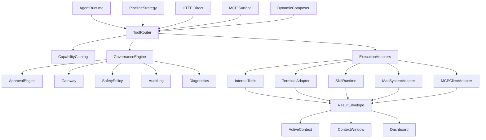

# AgentRuntime 工具体系重设计方案

本文面向 Alembic 维护者，目标是重新设计 `AgentRuntime` 周边的工具体系：让工具更强、更安全、更可维护，并把终端能力、Skills、必要的 macOS 系统能力、MCP 外部连接与现有 `ToolRegistry` / `ToolExecutionPipeline` 统一到一套治理模型中。

本文不是立即落地的改动清单，而是一份系统设计稿。后续实现应按阶段拆分，避免一次性重构破坏当前 Bootstrap、Insight、HTTP direct、MCP handler 与 Dashboard 能力面。

## 1. 结论

Alembic 当前的工具体系已经有一个不错的骨架：`ToolRegistry` 统一注册内部工具，`ToolExecutionPipeline` 做 allowlist、SafetyPolicy、缓存、observation、tracker、trace 和 diagnostics，`ToolMetadata` 已经开始表达 `surface`、`sideEffect`、`composable`、`gatewayAction`、`policyProfile`、`auditLevel`、`abortMode`。这说明 Alembic 不需要推倒重写，而是应该把工具体系升级成三层：

1. **Tool Capability Layer**：工具能力单一事实源。所有 runtime/http/mcp/dashboard/skill/computer/mac/terminal 暴露都从同一份 registry 派生。
2. **Tool Governance Layer**：工具执行治理内核。所有工具，包括组合工具子步骤、HTTP direct、MCP proxy、terminal、macOS adapter，都必须经过同一套权限、审计、预算、上下文、确认与 diagnostics。
3. **Agent-Computer Interface Layer**：面向模型的工具体验。模型看到的不是底层 API 零件，而是经过 ACI 设计的高质量工具、技能、工作流和安全终端。

设计原则：工具不是“给模型更多按钮”，而是给 Agent 一组可发现、可解释、可验证、可撤销、可审计的操作界面。

## 2. 外部资料提炼

### 2.1 Anthropic: Building Effective Agents

参考：https://www.anthropic.com/engineering/building-effective-agents

核心启发：

- 优先使用简单、可组合的工作流，只有在确实需要时再增加 Agent 自主性。
- 成功的 Agent 依赖清晰的环境反馈，也就是工具结果必须成为 ground truth。
- 透明性很重要，应显式展示计划、动作和检查点。
- 工具定义本身需要 prompt engineering。好的工具描述应包含用途、参数边界、示例和错误场景。
- ACI 与 HCI 一样重要。SWE-bench 经验显示，给模型设计合适的工具接口比一味改 prompt 更关键。

对 Alembic 的含义：

- 不要把所有能力都塞进单一 `run_safe_command` 或 `invokeAgent()`。
- 长任务优先 Pipeline / workflow，开放任务才给 ReAct 自主探索。
- 每个工具都要有文档质量门槛，工具描述不只是 schema 注释。

### 2.2 ReAct

参考：https://arxiv.org/abs/2210.03629

ReAct 的关键价值是让语言模型交错地产生 reasoning trace 与 action。reasoning 帮模型维护计划、处理异常；action 让模型访问外部知识库或环境，减少幻觉并提高可解释性。

对 Alembic 的含义：

- `AgentRuntime` 的 ReAct loop 方向是对的，但工具结果必须结构化进入 trace，而不是只拼接到文本 observation。
- 工具调用失败、空结果、被阻断、降级、重试都应进入 diagnostics 和 ActiveContext。
- 工具体系应支持“查证 → 行动 → 验证”的闭环，不应只有 read/write 两类粗粒度动作。

### 2.3 Toolformer

参考：https://arxiv.org/abs/2302.04761

Toolformer 证明模型可以学习“何时调用 API、传什么参数、如何吸收结果”。它把工具选择视为能力的一部分，而不是外部硬编码。

对 Alembic 的含义：

- Alembic 应保留工具调用日志、成功率、错误模式、参数修正记录，用于后续 tool routing / skill routing / eval。
- `ToolMetadata` 应增加 usage/eval 维度，支持后续推荐“这个场景应该用哪个工具/Skill”。
- 工具描述和参数设计应通过测试反馈持续迭代。

### 2.4 SWE-agent / Agent-Computer Interface

参考：https://arxiv.org/abs/2405.15793

SWE-agent 的核心观点是：语言模型 Agent 是一种新的软件用户，需要专门设计的 Agent-Computer Interface。合适的 ACI 能显著改善代码编辑、仓库导航、测试执行和错误恢复。

对 Alembic 的含义：

- 终端不是一个字符串命令入口，而应是一个面向 Agent 的任务执行界面。
- 文件编辑、搜索、测试、诊断、依赖、Git 操作应有高层工具，不应全部退化成 shell。
- 对模型来说，可靠的“结构化 terminal result + next action hint”比原始 stdout 更有价值。

### 2.5 MCP Tools

参考：https://modelcontextprotocol.io/docs/concepts/tools

MCP 工具体系提供了几个可直接借鉴的标准点：

- `tools/list` / `tools/call` / `tools/list_changed` 使工具可动态发现。
- Tool 定义包含 name、description、inputSchema、outputSchema、annotations。
- Tool result 支持 text、image、audio、resource_link、embedded resource、structuredContent。
- 安全要求包括输入校验、访问控制、rate limit、输出清洗、超时、审计、人类确认。

对 Alembic 的含义：

- 内部工具也应支持 output schema，不只是 input schema。
- 工具结果应统一成 `ToolResultEnvelope`，同时提供模型可读文本和机器可读 structuredContent。
- Dashboard/MCP/HTTP/Runtime 应从同一份工具能力描述投影，而不是手写多套列表。

### 2.6 Claude Tool Use / Strict Tool Use

参考：https://platform.claude.com/docs/en/docs/agents-and-tools/tool-use/overview

Claude 工具模型区分 client tools 与 server tools。client tools 由应用执行，server tools 由模型服务商基础设施执行。工具 schema 会消耗上下文 token，strict tool use 可提升 schema conformance。

对 Alembic 的含义：

- Alembic 内部工具都是 client tools，必须自行承担执行安全。
- 工具过多时不能全部塞进上下文，需要 tool search / deferred schema loading。
- 需要区分“工具名索引”与“完整 schema 注入”，按任务动态展开。

### 2.7 Claude Code Security

参考：https://code.claude.com/docs/en/security

Claude Code 的安全要点：

- 默认只读，编辑/命令/测试等敏感操作需要显式权限。
- Bash 应有沙箱、文件系统/网络隔离、命令审批和 allowlist。
- 对 prompt injection 的防护包括输入清洗、命令 blocklist、网络请求审批、隔离 context、首次信任确认、fail-closed、自然语言解释。
- 团队应通过 managed settings、权限配置、监控与审计统一治理。

对 Alembic 的含义：

- `run_safe_command` 应升级为“终端会话系统”，支持权限分级、命令计划、审批、沙箱和结构化结果。
- 对网络访问、包安装、脚本执行、git 写入等操作应采用单独 capability 和 Gateway action。
- 未匹配策略的命令必须默认需要确认或直接拒绝。

### 2.8 Claude Computer Use

参考：https://platform.claude.com/docs/en/docs/build-with-claude/computer-use

Computer Use 提供截图、鼠标、键盘、桌面自动化能力，但官方明确强调 beta 风险：应使用 VM/container、最小权限、网络域名 allowlist、人类确认、日志审计，避免敏感账号和数据。

对 Alembic 的含义：

- macOS 系统能力应作为隔离的 `SystemAdapter`，不是普通工具随意开放。
- screenshot、window list、clipboard、open URL、通知、快捷指令等能力必须有 TCC 权限检测、scope、确认与审计。
- UI 自动化应从低风险只读开始：截图、窗口信息、系统信息；写操作如点击/键盘输入应进入单独高风险阶段。

### 2.9 Claude Skills

参考：

- https://www.claude.com/skills
- https://claude.com/blog/skills
- https://claude.com/blog/skills-explained
- https://claude.com/blog/how-to-create-skills-key-steps-limitations-and-examples

Skills 的核心不是“更长的 prompt”，而是可移植、可组合、按需加载的过程知识包。一个 Skill 是文件夹，包含 `SKILL.md`、资源、脚本和可执行代码。关键实践：

- metadata 先加载，完整说明按需加载，资源/脚本更晚加载。
- description 决定触发质量，应描述能力、场景、边界和反例。
- SKILL.md 应结构化，包含步骤、示例、错误处理、限制、成功标准。
- 使用 menu / progressive disclosure，把大文档拆成按需文件。
- 建立 owner、版本、changelog、测试矩阵和季度 review。

对 Alembic 的含义：

- 当前 `load_skill` / `create_skill` / `suggest_skills` 是起点，但还缺少 Skill activation、progressive disclosure、validation、versioning、trust policy。
- Skill 应成为工具体系的一等能力，不只是可读文档。
- Skill 可以声明需要哪些工具、哪些权限、哪些资源、哪些脚本，以及是否允许自动执行。

### 2.10 OWASP GenAI Top 10

参考：https://genai.owasp.org/llm-top-10/

与工具体系直接相关的风险包括：Prompt Injection、Sensitive Information Disclosure、Supply Chain、Improper Output Handling、Excessive Agency、Unbounded Consumption。

对 Alembic 的含义：

- 工具输出进入模型前要清洗、截断、标注来源和可信度。
- 第三方 MCP server、Skill、脚本、terminal 命令都属于 supply chain。
- Agent 的 agency 应通过 capability、policy、budget、approval 和 audit 限界。

## 3. 当前 Alembic 工具体系评估

### 3.1 已有优势

- `ToolRegistry` 已统一管理工具定义、schema、handler 和 metadata。
- `ToolExecutionPipeline` 已经集中处理 allowlist、SafetyPolicy、缓存、observation、tracker、trace、submit dedup。
- `ToolMetadata` 已有跨入口投影所需的初始字段：`surface`、`directCallable`、`sideEffect`、`composable`、`gatewayAction`、`gatewayResource`、`policyProfile`、`auditLevel`、`abortMode`。
- `run_safe_command` 已从 `sh -c` 收敛到 tokenized `execFile`，并禁用 shell 复合语法。
- `SkillAdvisor`、`SkillHooks`、内置 `skills/*/SKILL.md` 已经具备 Skill 生态雏形。
- `resources/native-ui/screenshot.swift` 表明 macOS ScreenCaptureKit 能力已有基础资产。

### 3.2 主要缺口

| 领域 | 当前状态 | 缺口 |
| --- | --- | --- |
| 工具描述 | input schema + description | 缺 output schema、examples、failure modes、trust annotations |
| 工具发现 | capability allowlist 直接注入 schemas | 缺 tool search / deferred loading / task-aware schema budget |
| 工具结果 | handler 返回任意对象 | 缺统一 envelope、structuredContent、resource refs、output validation |
| 执行治理 | Runtime tool call 走 pipeline | HTTP direct、组合子步骤、MCP proxy 仍容易形成旁路 |
| 终端能力 | `run_safe_command(command)` | 缺 session、PTY、批准模型、沙箱、网络控制、命令计划、artifact 输出 |
| Skill 能力 | load/create/suggest + hooks | 缺自动触发、progressive disclosure、trust/version/eval、脚本沙箱 |
| macOS 能力 | screenshot.swift 资源 | 缺 SystemAdapter、TCC 检查、权限分级、UI action 审批 |
| 安全治理 | SafetyPolicy + Gateway + hard blacklist | 缺跨工具统一 trust model、risk tier、approval policy、supply-chain 审核 |
| 维护管理 | 手写列表 + 部分 tests | 缺 tool manifest、owner、review cadence、eval matrix、deprecation policy |

## 4. 目标架构



关键变化：

- `ToolRegistry` 升级为 `CapabilityCatalog`，保存所有工具、Skill、MCP server、terminal profile、macOS adapter 的统一 manifest。
- `ToolExecutionPipeline` 升级为 `GovernanceEngine`，所有入口都通过它，不再只服务 Runtime ReAct loop。
- `run_safe_command` 拆成 `TerminalAdapter`，从单次命令工具升级为受控 terminal 子系统。
- `SkillRuntime` 负责 Skill metadata scan、activation、按需加载、脚本执行和版本治理。
- `MacSystemAdapter` 负责 macOS 权限、截图、窗口、剪贴板、通知、打开 URL 等本机能力。
- 所有执行结果统一成 `ToolResultEnvelope`。

## 5. 统一能力描述

建议新增 `ToolCapabilityManifest`，替代散落在 `tools/index.ts` 中的多张 Set/Map。

```ts
interface ToolCapabilityManifest {
  id: string;
  title: string;
  kind: 'tool' | 'skill' | 'terminal-profile' | 'mcp-server' | 'mac-adapter' | 'workflow';
  description: string;
  owner: string;
  lifecycle: 'experimental' | 'active' | 'deprecated' | 'disabled';
  surfaces: Array<'runtime' | 'http' | 'mcp' | 'dashboard' | 'skill' | 'internal'>;
  inputSchema?: Record<string, unknown>;
  outputSchema?: Record<string, unknown>;
  examples?: ToolExample[];
  failureModes?: ToolFailureMode[];
  risk: ToolRiskProfile;
  execution: ToolExecutionProfile;
  context: ToolContextProfile;
  governance: ToolGovernanceProfile;
  evals: ToolEvalProfile;
}
```

风险画像建议：

```ts
interface ToolRiskProfile {
  sideEffect: boolean;
  dataAccess: 'none' | 'project' | 'workspace' | 'user-home' | 'network' | 'secrets';
  writeScope: 'none' | 'project' | 'data-root' | 'workspace' | 'system';
  network: 'none' | 'allowlisted' | 'open';
  credentialAccess: 'none' | 'masked' | 'scoped-token' | 'raw-secret';
  requiresHumanConfirmation: 'never' | 'on-risk' | 'always';
  owaspTags: Array<'prompt-injection' | 'sensitive-info' | 'supply-chain' | 'excessive-agency' | 'unbounded-consumption'>;
}
```

执行画像建议：

```ts
interface ToolExecutionProfile {
  adapter: 'internal' | 'terminal' | 'skill' | 'mcp' | 'macos' | 'workflow';
  timeoutMs: number;
  maxOutputBytes: number;
  abortMode: 'none' | 'preStart' | 'cooperative' | 'hardTimeout';
  cachePolicy: 'none' | 'session' | 'scope' | 'persistent';
  concurrency: 'single' | 'parallel-safe' | 'exclusive';
  artifactMode: 'inline' | 'file-ref' | 'resource-link';
}
```

治理画像建议：

```ts
interface ToolGovernanceProfile {
  gatewayAction?: string;
  gatewayResource?: string;
  auditLevel: 'none' | 'checkOnly' | 'full';
  policyProfile: 'read' | 'analysis' | 'write' | 'system' | 'admin';
  approvalPolicy: 'auto' | 'explain-then-run' | 'confirm-once' | 'confirm-every-time';
  allowedRoles: string[];
  allowInComposer: boolean;
  allowInRemoteMcp: boolean;
  allowInNonInteractive: boolean;
}
```

## 6. 统一工具结果

当前 handler 可以返回任意对象，导致 Runtime、HTTP、MCP、Dashboard、ActiveContext 很难统一处理。建议所有 adapter 最终归一化为：

```ts
interface ToolResultEnvelope<T = unknown> {
  ok: boolean;
  toolId: string;
  callId: string;
  parentCallId?: string;
  startedAt: string;
  durationMs: number;
  status: 'success' | 'error' | 'blocked' | 'aborted' | 'timeout' | 'needs-confirmation';
  text: string;
  structuredContent?: T;
  artifacts?: ToolArtifactRef[];
  resources?: ToolResourceRef[];
  diagnostics: AgentDiagnostics;
  trust: {
    source: 'internal' | 'terminal' | 'mcp' | 'skill' | 'macos' | 'user';
    sanitized: boolean;
    containsUntrustedText: boolean;
    containsSecrets: boolean;
  };
  nextActionHint?: string;
}
```

要求：

- 给模型的 `text` 必须经过截断、脱敏和来源标注。
- 给程序的 `structuredContent` 必须通过 output schema 校验。
- 大输出默认落 artifact/resource ref，不直接塞进上下文。
- 不可信来源，例如网页、MCP、终端输出、截图 OCR，要显式标记 `containsUntrustedText`。

## 7. Tool Search 与按需 schema 加载

随着 terminal、macOS、MCP、Skills 扩展，完整工具 schema 不能全部注入模型上下文。建议引入两级发现机制：

1. **Capability Index**：每个能力只注入 id、title、短 description、risk tier、keywords，控制在 100-200 tokens。
2. **Tool Search / Load Tool**：模型或 router 根据任务检索完整工具 schema，只有命中的工具进入本轮调用。

候选接口：

```ts
interface ToolSearchResult {
  id: string;
  title: string;
  kind: ToolCapabilityManifest['kind'];
  summary: string;
  risk: string;
  whyRelevant: string;
}
```

实现策略：

- 初期可用 BM25 + metadata filter，不必马上向量化。
- `CapabilityRegistry` 先返回 preset 允许的工具 index。
- `ToolRouter` 根据 intent、role、surface、risk、budget 筛选。
- 对高风险工具，加载 schema 不等于可执行；执行仍需 approval/Gateway。

## 8. 终端能力重设计

### 8.1 当前 `run_safe_command` 的定位

当前 `run_safe_command` 是安全兜底版命令执行器：禁止 shell 复合语法，硬编码危险命令黑名单，缺 SafetyPolicy 时用安全前缀白名单，执行采用 `execFile`。这适合只读诊断，但不够承载“强大安全的终端能力”。

### 8.2 目标：TerminalAdapter

建议将 terminal 能力拆成四类工具：

| 工具 | 风险 | 用途 |
| --- | --- | --- |
| `terminal_plan` | read | 解析自然语言意图，生成命令计划，不执行 |
| `terminal_run` | system | 执行单条 tokenized 命令，结构化返回 |
| `terminal_session` | system | 管理短生命周期 PTY 会话，支持交互式测试但需审批 |
| `terminal_artifact` | read | 读取上次命令的大输出、日志、文件 artifact |

命令不再只传字符串，而是传结构：

```ts
interface TerminalCommand {
  bin: string;
  args: string[];
  cwd?: string;
  env?: Record<string, string>;
  stdin?: string;
  timeoutMs?: number;
  network?: 'disabled' | 'allowlisted' | 'inherit';
  filesystem?: 'read-only' | 'project-write' | 'data-write';
}
```

### 8.3 终端安全策略

1. 默认读模式：`git status`、`git diff`、`rg`、`ls`、`cat`、`npm test -- --runInBand` 等可按策略自动执行。
2. 写入/安装/网络/脚本执行需要 `explain-then-run` 或 `confirm-every-time`。
3. 禁止自由 shell。确需 shell 的场景进入 `terminal_shell_script`，脚本落临时文件、静态扫描、显示 diff、人工确认。
4. 使用 command policy 而不是前缀字符串：`{ bin, argsPattern, cwdScope, network, writeScope }`。
5. 对包管理器分层：`npm test`、`npm run build` 与 `npm install` 风险不同。
6. stdout/stderr 分块、摘要、大输出 artifact 化。
7. 每个命令产生可复现的 execution record：命令、cwd、env keys、exit code、duration、truncated、artifact refs。
8. 支持 abort：长命令必须能被 kill，PTY session 要有 idle timeout 和 hard timeout。

### 8.4 沙箱策略

本地开发场景建议三档：

| 档位 | 实现 | 默认用途 |
| --- | --- | --- |
| `none` | 当前进程直接 `execFile` | 只读命令、快速检查 |
| `project-sandbox` | 限定 cwd、env、network、写入路径 | 测试、构建、lint |
| `container` | devcontainer/Docker/临时 workspace | 不可信代码、包安装、外部脚本、browser/computer use |

Alembic 源码仓自身有开发仓保护机制，因此 terminal adapter 还要识别 `isOwnDevRepo()`，在本仓中拒绝运行用户-facing `asd/alembic` 命令和 runtime `.asd` 写入。

## 9. Skills 一等化设计

### 9.1 Skill 与 Tool 的边界

- Tool 是操作能力：读文件、跑测试、查数据库、截图、写配置。
- Skill 是过程知识：什么时候用哪些工具、如何判断成功、如何处理边界、有哪些组织规范。
- Workflow 是可执行编排：固定或半固定步骤，可能调用多个工具和 Skills。

### 9.2 Skill Manifest

建议把 `SKILL.md` frontmatter 升级为可治理 manifest：

```yaml
name: swift-networking-review
description: Review Swift networking code for endpoint, retry, error, and Sendable conventions.
version: 1.2.0
owner: platform-team
status: active
triggers:
  - swift networking code review
  - Endpoint implementation
requiresTools:
  - search_project_code
  - read_project_file
  - guard_check_code
permissions:
  read: [project, recipes]
  write: []
scripts:
  allow: []
resources:
  - references/retry-patterns.md
evals:
  - evals/normal.md
  - evals/out-of-scope.md
```

### 9.3 Progressive Disclosure

SkillRuntime 应按三层加载：

1. `SkillIndex`：name、description、version、owner、tags，常驻或可搜索。
2. `SkillInstructions`：`SKILL.md` 主体，命中后加载。
3. `SkillResources`：引用文件、脚本、模板、示例，按需读取。

这与 Anthropic Skills 的 metadata-first 设计一致，可避免把所有技能内容压进上下文。

### 9.4 Skill 维护管理

每个 Skill 必须有：

- owner
- version
- changelog
- trigger tests
- functional tests
- out-of-scope tests
- dependency list
- last verified timestamp
- deprecation reason 或 replacement

建议新增命令/工具：

| 能力 | 说明 |
| --- | --- |
| `skill_search` | 按任务查找相关 Skill，只返回 index |
| `skill_load` | 加载主说明 |
| `skill_load_resource` | 加载引用资源 |
| `skill_validate` | 校验 frontmatter、链接、资源大小、脚本权限 |
| `skill_eval` | 跑触发/功能/边界测试 |
| `skill_publish` | 通过 Gateway 发布/更新 Skill |
| `skill_deprecate` | 标记废弃并指定替代 |

### 9.5 Skill 脚本安全

Skill 可以包含脚本，但不能默认执行。脚本执行规则：

- 脚本必须声明 `runtime`、入口、参数 schema、输出 schema。
- 默认在 `SkillSandbox` 中运行，不能访问 raw secret。
- 网络默认关闭，除非 manifest 显式声明并经 Gateway/approval。
- 脚本输出进入 `ToolResultEnvelope`，并标记 source=`skill`。
- 第三方 Skill 需要 trust review；未信任 Skill 只能作为文档参考，不执行脚本。

## 10. macOS 系统能力设计

### 10.1 能力范围

必要的 macOS 能力建议分阶段开放：

| 能力 | 工具 | 风险 | 说明 |
| --- | --- | --- | --- |
| 系统信息 | `mac_system_info` | low | OS、权限状态、前台应用、显示器信息 |
| 截图 | `mac_screenshot` | medium | 使用 ScreenCaptureKit；需要 Screen Recording 权限 |
| 窗口列表 | `mac_window_list` | medium | App、窗口标题、bounds；可能含敏感标题 |
| 剪贴板读取 | `mac_clipboard_read` | high | 可能含 token/password，默认需要确认 |
| 剪贴板写入 | `mac_clipboard_write` | medium | 需要确认，写入内容进入审计 |
| 打开 URL/文件 | `mac_open` | medium | 只允许 http(s)、file scope；外部 URL 需要确认 |
| 通知 | `mac_notify` | low | 用户提示 |
| 键盘/鼠标 | `mac_ui_action` | critical | 初期不开放或仅 sandbox/VM |

### 10.2 SystemAdapter 边界

建议新增 `MacSystemAdapter`，不要让 Agent 直接执行 `osascript` 或随意调用 native binary。

接口示意：

```ts
interface MacSystemAdapter {
  capabilities(): Promise<MacCapabilityStatus[]>;
  screenshot(options: ScreenshotOptions): Promise<ToolResultEnvelope<ScreenshotResult>>;
  listWindows(options: WindowListOptions): Promise<ToolResultEnvelope<WindowListResult>>;
  readClipboard(options: ClipboardReadOptions): Promise<ToolResultEnvelope<ClipboardResult>>;
  writeClipboard(options: ClipboardWriteOptions): Promise<ToolResultEnvelope<void>>;
  notify(options: NotifyOptions): Promise<ToolResultEnvelope<void>>;
}
```

治理规则：

- TCC 权限检测必须先于操作。
- 截图/窗口标题/剪贴板内容默认标记 sensitive，进入 ContextWindow 前做裁剪和脱敏。
- UI action 类能力必须 human-in-loop，且最好先在虚拟/远程 sandbox 中实现。
- macOS native helper 应签名、版本化、hash 校验，避免 supply chain 风险。

## 11. MCP 与外部工具统一接入

Alembic 既是 MCP server，也可以成为 MCP client。未来扩展外部工具时建议：

- MCP server 作为 `mcp-server` manifest 进入 CapabilityCatalog。
- 每个外部 MCP tool 转换成本地 virtual tool，但风险默认高于 internal read-only tool。
- 支持 MCP `list_changed`，但变化要进入 audit log。
- remote HTTP MCP 优先；stdio MCP 需 command allowlist。
- 对第三方 MCP server 采用 trust registry：trusted、team-approved、local-only、blocked。
- MCP output 应遵守本地 `ToolResultEnvelope`，大输出 artifact 化。
- OAuth scopes 必须 pinned，不接受默认无限扩展。

## 12. 组合工具与 Workflow

DynamicComposer 当前已拒绝 side-effect / non-composable step，但 data-only step 仍直接 `registry.execute()`。新体系中应改为：

- 组合工具本身是 `workflow` manifest。
- 每个子步骤必须通过 `ToolRouter.executeChildCall()`。
- 子步骤继承 parent context，但有独立 callId、duration、status、diagnostics。
- trace 中展开 parent/child 结构。
- 并发子步骤有总预算和单步预算。
- 如果某个子步骤返回 untrusted output，后续步骤必须显式标记是否可消费。

目标不是禁止组合，而是让组合后仍保持治理边界。

## 13. 权限、确认与 Gateway 模型

建议把每个工具调用分成四个阶段：

1. **Discover**：能不能让模型看到这个能力。
2. **Plan**：能不能生成执行计划。
3. **Approve**：是否需要人类/Gateway/role 通过。
4. **Execute**：真正运行。

`ToolExecutionPipeline` 当前主要覆盖 Execute，应扩展到四阶段。建议新增：

```ts
interface ToolDecision {
  allowed: boolean;
  stage: 'discover' | 'plan' | 'approve' | 'execute';
  reason?: string;
  requiresConfirmation?: boolean;
  confirmationMessage?: string;
  requestId?: string;
}
```

典型策略：

| 工具类型 | Discover | Plan | Approve | Execute |
| --- | --- | --- | --- | --- |
| read-only internal | auto | auto | none | auto |
| project write | role-gated | auto | on-risk | Gateway full |
| terminal read | auto | auto | none/on-risk | Gateway checkOnly |
| terminal write/network | role-gated | explain | confirm | Gateway full |
| mac screenshot | role-gated | explain | confirm-once | audit full |
| clipboard read | hidden by default | explain | always | audit full |
| third-party MCP | trust-gated | auto | on-risk | audit full |
| Skill script | trust-gated | explain | on-risk | sandbox + audit |

## 14. 维护与管理方案

### 14.1 Tool Review Checklist

新增或修改工具必须回答：

- 这个工具解决什么重复问题？是否应该是 Skill 或 Workflow？
- 输入 schema 是否足够 poka-yoke，是否避免让模型写困难格式？
- 输出 schema 是否可验证？大输出如何处理？
- 是否可能泄露 secret、路径、用户数据、截图、剪贴板？
- 是否有副作用？副作用是否走 Gateway？
- 是否支持 abort/timeout？
- 是否可缓存？缓存 key 是否会误复用敏感数据？
- 是否允许 HTTP direct / MCP / Dashboard / composer？
- 是否需要 human confirmation？
- 是否有正常、错误、越权、prompt injection 测试？

### 14.2 Tool Lifecycle

| 状态 | 含义 | 规则 |
| --- | --- | --- |
| experimental | 新能力试验 | 默认不暴露 HTTP/MCP，需显式启用 |
| active | 稳定能力 | 有 owner、tests、docs、evals |
| deprecated | 保留兼容 | schema 仍可查，执行给 replacement hint |
| disabled | 禁用 | 不进入 discovery，不可执行 |

### 14.3 Eval Matrix

建议按工具类型建立 eval：

- schema conformance eval
- permission denial eval
- prompt injection eval
- output truncation eval
- abort/timeout eval
- side-effect audit eval
- skill trigger/out-of-scope eval
- terminal command policy eval
- macOS TCC denied eval
- MCP untrusted server eval

### 14.4 Observability

每次工具调用应记录：

- tool id / version
- manifest hash
- surface
- actor/role/session
- parent call id
- input schema validation result
- policy decision
- approval decision
- execution status
- duration
- output size / truncation
- artifact refs
- diagnostics

Dashboard 可以提供 Tool Ops 页面：工具目录、调用趋势、失败率、被拦截原因、慢调用、过大输出、Skill 命中率、终端命令审计。

## 15. 迁移路径

### P0: 文档和 manifest 草案

- 新增本文档。
- 从 `tools/index.ts` 的 Set/Map 生成临时 manifest snapshot。
- 给每个现有工具补齐 owner、risk、execution、governance 初值。
- 不改执行路径。

### P1: ToolResultEnvelope

- 在 `ToolExecutionPipeline` 外层归一化结果，不要求所有 handler 立即改造。
- 增加 output schema 可选校验。
- Runtime/HTTP/MCP 读取 envelope。

### P2: ToolRouter / GovernanceEngine

- 抽出 Runtime tool call、HTTP direct、DynamicComposer child call 的共同执行入口。
- HTTP direct 不再直接 `factory.invokeAgent()` 跳过 pipeline。
- DynamicComposer 子步骤进入 child call trace。

### P3: TerminalAdapter v1

- 保留 `run_safe_command` 兼容层。
- 新增 `{ bin, args }` 结构化执行。
- 增加 command policy、approval preview、artifact 输出、kill/abort。
- 增加测试：读命令、写命令阻断、网络命令确认、超时 kill、大输出 artifact。

### P4: SkillRuntime v1

- Skill index、search、load、resource load、validate。
- frontmatter manifest 校验。
- trigger tests 与 out-of-scope tests。
- Skill 脚本默认禁用，后续进入 sandbox。

### P5: macOS Adapter v1

- 只读能力：permission status、system info、screenshot、window list。
- 截图内容 sensitive 标记与 artifact 化。
- 不开放鼠标/键盘写操作。

### P6: MCP Client Adapter

- team-approved MCP server registry。
- remote HTTP / local stdio 两类接入策略。
- OAuth scopes pinning、server trust、list_changed audit、output envelope。

### P7: Tool Search

- 将工具完整 schema 延迟加载。
- 按 preset、role、task intent、risk 过滤工具 index。
- Dashboard 展示可发现工具与实际注入工具差异。

## 16. 关键设计取舍

### 16.1 不把终端当万能工具

终端强大，但它也是最容易绕过高层治理的通道。Alembic 应提供强终端能力，但以结构化命令、policy、sandbox、approval、artifact 的形式提供，而不是扩大自由 shell 字符串。

### 16.2 Skill 不替代工具

Skill 负责“怎么做”，Tool 负责“做动作”。把 Skill 当工具会导致能力不可审计；把 Tool 当 Skill 会导致模型缺少过程知识。两者应由 Runtime 组合。

### 16.3 macOS 能力先只读后写入

截图、窗口、剪贴板都可能含敏感信息。应该先做只读诊断和人工确认，再考虑 UI 自动化。鼠标键盘控制属于 critical 能力，不应与普通 project tools 同级。

### 16.4 MCP 外部工具默认不可信

MCP 是连接层，不是信任层。第三方 server 的 annotations、description、output 都应视为不可信，必须经过 Alembic 本地策略二次治理。

### 16.5 先统一描述和结果，再统一执行

如果先重写执行路径，调试会非常痛苦。正确顺序是：manifest → result envelope → shared router → terminal/skill/mac/mcp adapters。

## 17. 对当前代码的落地点

| 当前文件 | 建议演进 |
| --- | --- |
| `lib/agent/tools/ToolRegistry.ts` | 保留注册表职责，增加 manifest/output schema/example/failure modes；或拆成 `CapabilityCatalog` |
| `lib/agent/core/ToolExecutionPipeline.ts` | 升级为所有入口共享的 `GovernanceEngine`，支持 discover/plan/approve/execute 与 child call |
| `lib/agent/tools/index.ts` | 移除多张手写 Set/Map，改由 manifest 派生 metadata |
| `lib/agent/tools/system-interaction.ts` | 将 `run_safe_command` 变成兼容 facade，新增 `TerminalAdapter` |
| `lib/agent/forge/DynamicComposer.ts` | 子步骤改走 `executeChildCall()`，返回 steps 观测信息 |
| `lib/agent/tools/infrastructure.ts` | `load_skill` / `create_skill` / `suggest_skills` 迁移到 `SkillRuntime` |
| `lib/service/skills/SkillAdvisor.ts` | 继续做推荐，但输出 Skill manifest 草案和 eval plan |
| `lib/service/skills/SkillHooks.ts` | hook 需要 trust/version/timeout/audit，不信任 Skill 不执行 hooks |
| `resources/native-ui/screenshot.swift` | 纳入 `MacSystemAdapter`，补权限检查、hash、artifact 输出 |
| `lib/http/routes/ai.ts` | HTTP direct 统一改走 ToolRouter，而不是独立 gating 后 `invokeAgent()` |
| `lib/external/mcp/*` | MCP tool/list/call 从 CapabilityCatalog 投影，结果使用 envelope |

## 18. 最小可行里程碑

建议第一批实现不要碰 macOS UI 自动化，也不要直接支持任意第三方 MCP 执行。最小可行版本：

1. `ToolCapabilityManifest` 类型和从现有工具自动生成 manifest。
2. `ToolResultEnvelope` 外层归一化。
3. `ToolRouter.execute()` 包住 Runtime 与 HTTP direct。
4. `TerminalAdapter` 支持 `{ bin, args }` 的只读/测试命令。
5. `SkillRuntime` 支持 index/search/load/validate，不执行脚本。
6. Dashboard 或 CLI 输出工具目录、风险等级和缺失 metadata。

通过这个版本后，再扩展 sandbox terminal、Skill script、macOS screenshot、MCP client adapter。

## 19. 推荐验收标准

- 新增工具没有 manifest 不能注册。
- 高风险工具没有 Gateway action 不能执行。
- 工具没有 output envelope 不能进入 Runtime observation。
- 大输出必须 artifact 化并给模型摘要。
- 所有 side-effect tool 必须有审计记录。
- 所有 terminal write/network/script 命令必须有 approval 或明确角色豁免。
- 所有 Skill 必须通过 validate 和至少一条 trigger test。
- 所有 macOS sensitive 能力必须检测权限并提示用户。
- 所有外部 MCP server 必须有 trust decision。
- 所有工具调用都能在 diagnostics 中解释：为什么可见、为什么可执行、为什么被阻断、结果如何被截断。

## 20. 总结

Alembic 的下一代工具体系应从“工具列表 + 执行函数”升级为“能力目录 + 治理内核 + ACI 设计”。现有 Runtime、Pipeline、ToolRegistry、ToolExecutionPipeline、SkillHooks、Gateway 都可以保留并演进。关键是把工具自身当作产品来维护：有 owner、有风险画像、有 schema、有输出契约、有审计、有测试、有版本、有退场路径。

终端、Skills、macOS、MCP 都应该进入同一个能力系统，而不是各自开旁路。这样 AgentRuntime 才能在变强的同时保持可控，既能跑测试、看屏幕、调用外部系统、加载组织知识，也能回答一个最重要的问题：每一步为什么被允许，做了什么，结果是否可信。
