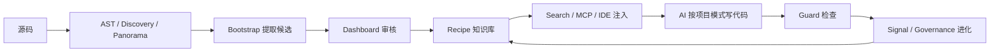

# Alembic 短介绍视频执行计划

本文档规划一版 90-120 秒 Alembic 简短介绍视频的完整执行方案。目标是先做出一条可试看、可评估风格与信息密度的样片，而不是一次性完成 6-8 分钟深度长片。

样片必须深入挖掘 Alembic 的主要链路和真实功能，但表达上要压缩到一个核心闭环：

> Alembic 从代码库中提炼团队知识，把它交付给 IDE 里的 AI，并用 Guard 与信号治理让这套知识持续变准。

## 样片定位

| 项目 | 方案 |
| --- | --- |
| 视频长度 | 90-120 秒 |
| 画幅 | 16:9，1920x1080 |
| 目标观众 | 已经使用 Cursor / Copilot / Claude Code 的开发者或团队负责人 |
| 风格 | 技术动画 + 少量真实界面 / 代码证据 |
| 主制作管线 | HyperFrames + GSAP |
| 第一版重点 | 看叙事、视觉语言、节奏、信息密度是否成立 |
| 暂不追求 | 全功能覆盖、完整口播长片、发布级封面和多平台拆条 |

## 主链路提炼

样片只讲一条主链路，避免把所有功能平均铺开。



这条链路分成 5 个观众能记住的动作：

| 动作 | 用户理解 | Alembic 实现证据 |
| --- | --- | --- |
| 看懂项目 | Alembic 先读代码结构，不是只读文档 | `lib/core/ast/`, `lib/core/discovery/`, `lib/service/panorama/` |
| 提炼知识 | 从真实代码模式生成候选知识 | `lib/service/bootstrap/`, `lib/workflows/cold-start/`, `lib/service/knowledge/RecipeExtractor.ts` |
| 人来审核 | 知识进入 Dashboard，由开发者批准 | `dashboard/src/`, `lib/http/routes/candidates.ts`, `lib/service/knowledge/ConfidenceRouter.ts` |
| 交给 AI | IDE Agent 通过 MCP 搜索并按需注入 Recipe | `lib/external/mcp/`, `lib/service/task/IntentExtractor.ts`, `lib/service/task/PrimeSearchPipeline.ts`, `lib/service/search/` |
| 持续校正 | Guard 与 Signal 让知识和代码互相反馈 | `lib/service/guard/`, `lib/infrastructure/signal/`, `lib/service/evolution/` |

## 功能取舍

短样片只保留 P0 功能，P1 用快闪方式出现，P2 留给长片。

| 优先级 | 功能 | 样片表达方式 |
| --- | --- | --- |
| P0 | 本地项目记忆 | 开场一句痛点 + 源码变成 Recipe 的核心动效 |
| P0 | Bootstrap / Rescan | 代码扫描流过 AST、Panorama、候选生成 |
| P0 | Dashboard 审核 | 候选卡片进入 Approved 状态 |
| P0 | MCP / Search / IDE 注入 | IDE Agent 请求知识，Recipe 被压缩注入 |
| P0 | Guard 闭环 | 违规 diff 被 Guard 标红，再回到 Agent 修复 |
| P0 | Governance / Signal | 使用、搜索、违规、生命周期信号回流，Recipe 变准 |
| P1 | Tool Forge | 作为“能力边界自动造工具”的 2 秒快闪 |
| P1 | 多语言 AST | 以语言图标/文件后缀扫过呈现 |
| P1 | 6 通道 IDE 交付 | 用一张通道图闪现 |
| P2 | Lark 远程、Recipe 远程仓库、完整知识图谱 | 留到长片或系列短片 |

## 插件与 Skill 编排

| 阶段 | 主要插件 / Skill | 用途 |
| --- | --- | --- |
| 取证 | GitHub、Spreadsheets、本地代码阅读 | 建证据矩阵，锁定每个镜头的源码依据 |
| 设计 | Figma、Presentations | 画信息架构、分镜和关键帧草图 |
| 制作 | HyperFrames、HyperFrames CLI、GSAP | 建视频工程、写 composition、做动效 |
| 素材 | Browser Use、Computer Use、Jam | 采 Dashboard / IDE / 终端画面，分析录屏素材 |
| 音频 | HyperFrames CLI TTS 或外部旁白 | 生成临时旁白，先锁节奏 |
| 验收 | HyperFrames CLI、Browser Use | `lint`、`inspect`、预览、抽帧检查 |

当前已安装能力足够完成样片。若要增强效果，唯一建议补充的是 HyperFrames 细分 adapter skills，比如 Lottie、Three.js、WAAPI、Anime.js。

## 分阶段执行计划

### Phase 0. 样片边界锁定

目标：确定这版短片的口吻、时长和成功标准。

| 项目 | 内容 |
| --- | --- |
| 输入 | 本文档、`docs/codex-plugin-video-workflow.md` |
| 输出 | 样片 brief：长度、主线、风格、镜头数量 |
| 插件 | Presentations 或 Markdown |
| 完成标准 | 明确只做 90-120 秒主链路样片，不扩成长片 |

决策建议：

- 样片先用中文旁白和中文字幕。
- 真实界面占 20-30%，动画解释占 70-80%。
- 不用 Avatar 出镜，先让系统链路本身说话。

### Phase 1. 主链路源码取证

目标：把每个镜头绑定到真实代码和文档，防止样片讲虚。

| 取证主题 | 文件 / 目录 | 用途 |
| --- | --- | --- |
| 入口启动 | `bin/cli.ts`, `bin/mcp-server.ts`, `bin/api-server.ts`, `lib/bootstrap.ts` | 证明 CLI、MCP、API 共享启动链 |
| 项目理解 | `lib/core/ast/`, `lib/core/analysis/`, `lib/core/discovery/`, `lib/service/panorama/` | 证明 Alembic 真的理解结构、调用图、模块角色 |
| 冷启动 | `lib/service/bootstrap/`, `lib/workflows/cold-start/` | 证明从扫描到候选的编排流程 |
| 知识实体 | `lib/domain/knowledge/`, `lib/service/knowledge/`, `lib/repository/knowledge/` | 证明 Recipe / KnowledgeEntry 的本地持久化 |
| 搜索注入 | `lib/service/task/`, `lib/service/search/`, `lib/infrastructure/vector/` | 证明意图感知搜索和混合检索 |
| MCP 工具 | `lib/external/mcp/`, `docs/mcp-tools.md` | 证明 IDE Agent 访问方式 |
| Guard | `lib/service/guard/`, `docs/guard.md` | 证明检查、报告、ReverseGuard |
| 信号进化 | `lib/infrastructure/signal/`, `lib/service/evolution/` | 证明使用反馈和生命周期治理 |
| Dashboard | `dashboard/src/`, `docs/dashboard.md` | 证明审核、Panorama、Guard、Signals 的可视化入口 |

产物：

```text
video/alembic-short-intro/scripts/evidence-matrix.md
```

证据矩阵字段：

| 字段 | 说明 |
| --- | --- |
| 镜头编号 | S01-S06 |
| 旁白断言 | 这一句具体说了什么 |
| 代码证据 | 文件或目录 |
| 文档证据 | README / docs |
| 画面素材 | 动画、代码截图、Dashboard、终端 |
| 风险 | 是否需要验证、是否容易误导 |

完成标准：每个 P0 断言至少有一个代码路径和一个文档路径。

### Phase 2. 90-120 秒脚本压缩

目标：把主链路压成 6 个镜头。

| 镜头 | 时长 | 旁白要点 | 画面 |
| --- | --- | --- | --- |
| S01 痛点 | 0:00-0:14 | AI 能写代码，但不知道你的团队怎么写 | 通用代码 diff 被 Review 标注“命名、分层、错误处理不对” |
| S02 定位 | 0:14-0:28 | Alembic 把代码库里的真实模式蒸馏成本地项目记忆 | 源码文件流入 Recipe 晶体 / Markdown 卡片 |
| S03 看懂项目 | 0:28-0:48 | 它先用 AST、Discovery、Panorama 建立项目结构全貌 | 模块图、调用边、健康雷达、代码路径快闪 |
| S04 知识生产 | 0:48-1:08 | Bootstrap 生成候选，Dashboard 审核后成为 Recipe | Candidates 卡片进入 Approved，Recipe 写入本地 |
| S05 AI 使用 | 1:08-1:32 | IDE Agent 通过 MCP 搜索 Recipe，按项目模式生成代码 | MCP 工具请求、搜索结果、IDE 代码补全 |
| S06 闭环进化 | 1:32-1:55 | Guard 检查 diff，Signal 和 Governance 让知识持续更新 | Guard 标红、修复、信号回流到 Recipe |

脚本原则：

- 每 12-18 秒出现一个明确视觉状态变化。
- 旁白不报大量数字，数字只用作画面角标。
- 结尾落在“AI 越用越像团队成员”，不落在功能清单。

产物：

```text
video/alembic-short-intro/scripts/narration.md
video/alembic-short-intro/scripts/shot-list.md
```

### Phase 3. 视觉身份与关键帧

目标：先设计视觉系统，再写 HyperFrames HTML。

| 项目 | 决策 |
| --- | --- |
| 画布 | 深色工程画布，避免纯深蓝一色 |
| 主色 | 墨黑、冷白、青绿、琥珀、少量警示红 |
| 图形语言 | 代码窗口、模块层、信号线、状态机、证据标签 |
| 动效语言 | 信息流动、节点激活、状态迁移、Guard 扫描 |
| 字体 | 标题无衬线，代码 monospace |
| 禁忌 | 不用泛 AI 机器人、空泛光球、无法落回代码的抽象视觉 |

HyperFrames 约束：

- 创建 `DESIGN.md` 后再写 composition。
- 每个镜头先做静态 hero frame，再加 GSAP 动画。
- 多镜头必须有转场，每个镜头必须有 entrance 动画。
- 不用 `repeat: -1`，不用异步构建 timeline。

产物：

```text
video/alembic-short-intro/DESIGN.md
video/alembic-short-intro/scripts/keyframes.md
```

完成标准：6 个镜头各有一张文字版 hero frame 说明，信息层级不超过 3 层。

### Phase 4. 素材采集与清洗

目标：收集少量真实素材，给动画建立可信度。

| 素材 | 来源 | 插件 / 工具 | 用途 |
| --- | --- | --- | --- |
| README 开场语 | `README_CN.md` | 本地读取 | S02 定位字幕 |
| 代码路径快闪 | `lib/service/*`, `lib/agent/*`, `lib/external/mcp/*` | 本地读取 | S03-S06 证据角标 |
| Dashboard 页面 | `alembic ui` 后本地浏览 | Browser Use | S04 / S06 真实界面 |
| MCP 工具表 | `docs/mcp-tools.md` | 本地读取 | S05 工具矩阵 |
| Guard 规则画面 | `docs/guard.md` 或运行结果 | Browser Use / 终端 | S06 违规检查 |
| 终端命令 | `alembic setup`, `alembic ui`, `alembic guard` | Computer Use 或静态模拟 | S02 / S06 |

清洗标准：

- 不展示 `.env`、个人路径、真实 token、私有对话。
- 代码截图只取 8-16 行，不塞整屏。
- Dashboard 截图只服务一个镜头，不把 UI 细节讲满。

### Phase 5. HyperFrames 样片工程

目标：搭建短视频工程目录并实现可预览版本。

建议目录：

```text
video/alembic-short-intro/
├── DESIGN.md
├── index.html
├── compositions/
│   ├── 01-problem.html
│   ├── 02-pipeline.html
│   ├── 03-panorama.html
│   ├── 04-recipe-review.html
│   ├── 05-mcp-ide.html
│   └── 06-guard-loop.html
├── media/
│   ├── dashboard/
│   ├── code/
│   └── audio/
├── scripts/
│   ├── evidence-matrix.md
│   ├── narration.md
│   ├── shot-list.md
│   └── keyframes.md
└── renders/
```

推荐命令：

```bash
npx hyperframes init video/alembic-short-intro --non-interactive
cd video/alembic-short-intro
npx hyperframes lint
npx hyperframes inspect --samples 12
npx hyperframes preview --port 3018
```

完成标准：

- 6 个 composition 都能加载。
- 时间轴总长控制在 120 秒以内。
- 无 track overlap、未注册 timeline、文字溢出问题。

### Phase 6. 动效实现顺序

目标：减少返工，先锁结构再加细节。

| 顺序 | 工作 | 完成标准 |
| --- | --- | --- |
| 1 | 建 `index.html` 和 6 个空 composition | `lint` 通过基础结构 |
| 2 | 做 6 个静态 hero frame | Browser Use 预览无遮挡 |
| 3 | 加入临时字幕和旁白时间码 | 节奏接近 90-120 秒 |
| 4 | 加入 entrance 动画 | 每个元素自然进入 |
| 5 | 加入场景转场 | 无跳切，转场不抢信息 |
| 6 | 插入真实代码 / Dashboard 素材 | 画面可信但不拥挤 |
| 7 | 加入 Guard / Signal 闭环高光 | 结尾形成记忆点 |
| 8 | 渲染 draft | 可给用户试看 |

优先动效：

- 源码文件沿管线进入 Recipe。
- MCP 工具调用像请求包一样进入 IDE。
- Guard 扫描线从 diff 上扫过，违规处出现红色短标记。
- Signal 线从 Guard / Search / Usage 回流到 Recipe 生命周期。

### Phase 7. 技术与视觉验收

目标：样片能放心给人看，且技术说法站得住。

技术验收：

| 检查项 | 标准 |
| --- | --- |
| 断言 | 每句关键旁白能回到证据矩阵 |
| 代码路径 | 画面中出现的路径在当前仓库存在 |
| MCP 工具 | 名称和能力不超出 `docs/mcp-tools.md` |
| Guard 表达 | 不把 Guard 讲成万能静态分析器，保留三态和不确定性 |
| 生命周期 | 六态表达与 `docs/technical-reference.md` 一致 |

视觉验收：

```bash
cd video/alembic-short-intro
npx hyperframes lint
npx hyperframes inspect --samples 20
npx hyperframes render --quality draft --output renders/alembic-short-intro-draft.mp4
```

检查标准：

- 字幕不遮挡代码和 UI。
- 1080p 下核心代码路径可读。
- 每个镜头只表达一个主信息。
- 动效服务理解，不靠噪声制造“高级感”。
- 结尾能清楚记住 Alembic 的闭环价值。

### Phase 8. 试看反馈与下一步

目标：用样片判断是否进入完整版本。

反馈问题：

1. 你是否在 30 秒内理解 Alembic 解决什么问题。
2. 主链路是否清楚：代码、知识、IDE、Guard、进化。
3. 哪个镜头最有记忆点，哪个镜头信息过载。
4. 是否需要更多真实 Dashboard / IDE 画面。
5. 是否要扩成长片、拆短视频，还是先改视觉方向。

可能决策：

| 反馈结果 | 下一步 |
| --- | --- |
| 叙事成立，视觉也成立 | 扩展成 6-8 分钟深度长片 |
| 叙事成立，视觉不够 | 先改 `DESIGN.md` 和关键帧 |
| 视觉成立，信息太密 | 重写脚本，减少功能点 |
| 主链路不清楚 | 回到 Phase 2，重排镜头 |
| 更想看真实演示 | 增加 Browser Use / Computer Use 录屏比例 |

## 执行时间预估

| 阶段 | 时间 |
| --- | --- |
| Phase 0-1：边界与取证 | 0.5 天 |
| Phase 2：脚本和镜头 | 0.5 天 |
| Phase 3：视觉身份和关键帧 | 0.5 天 |
| Phase 4：素材采集 | 0.5 天 |
| Phase 5-6：HyperFrames 制作 | 1-1.5 天 |
| Phase 7：验收和 draft 渲染 | 0.5 天 |
| 合计 | 3-4 天出第一版样片 |

## 本轮产物清单

第一轮实际执行时应产生：

```text
docs/alembic-short-intro-video-execution-plan.md
video/alembic-short-intro/DESIGN.md
video/alembic-short-intro/scripts/evidence-matrix.md
video/alembic-short-intro/scripts/narration.md
video/alembic-short-intro/scripts/shot-list.md
video/alembic-short-intro/scripts/keyframes.md
video/alembic-short-intro/renders/alembic-short-intro-draft.mp4
```

本文档是第一项；后续进入视频制作时，从 Phase 1 的证据矩阵开始。

## 成功定义

样片成功不等于“功能讲全”，而是满足以下条件：

- 观众能复述 Alembic 的核心闭环：代码模式提炼成本地知识，再通过 MCP 和 Guard 回到 AI 编码过程。
- 画面中至少出现 5 个真实代码/文档证据路径。
- Guard、MCP、Dashboard、Recipe、Signal 至少各出现一次。
- 技术表达不夸大，能回到当前仓库源码。
- HyperFrames 工程能通过 `lint`、`inspect`，并渲染出 draft MP4。
