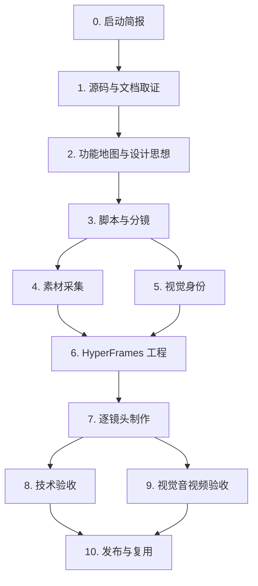

# Alembic Codex 插件介绍视频流程链路

本文档用于规划一条从 Alembic 真实代码挖掘到介绍视频交付的完整链路。目标不是做一条泛泛的产品宣传片，而是把 Alembic 的实际工程能力、源码结构、设计哲学和使用场景压缩成一条可验证、可复用、可继续迭代的视频生产流程。

## 目标

- 输出一条 6-8 分钟的深度介绍视频，适合开发者、AI 编码工具重度用户、团队工程负责人观看。
- 所有关键说法都能回到仓库中的真实文件、测试、文档或运行画面。
- 使用 Codex 插件能力分阶段完成调研、脚本、视觉、制作、验收和发布。
- 保留中间资产，方便后续拆成短视频、演示片段、官网动图或发布会材料。

## 核心叙事

Alembic 的一句话定位：

> Alembic 把代码库里的真实工程模式提炼成本地知识库，通过 MCP、IDE 交付、Guard 和 Dashboard，让 AI 编码助手持续生成更像团队自己的代码。

视频的主线建议围绕「从代码到知识，再从知识回到 AI 编码」展开：


这个叙事可以自然带出 Alembic 的五个内部系统：

| 系统 | 视频表达 | 代码证据入口 |
| --- | --- | --- |
| Panorama | 理解项目结构、模块角色、依赖与知识缺口 | `lib/service/panorama/`, `lib/core/analysis/`, `lib/core/ast/` |
| Governance | 候选知识进入生命周期，自动路由、去重、衰退、进化 | `lib/service/evolution/`, `lib/service/knowledge/`, `lib/domain/knowledge/` |
| Signal + Intent | 从搜索、Guard、使用、意图漂移里感知上下文 | `lib/infrastructure/signal/`, `lib/service/signal/`, `lib/service/task/` |
| Guard | 正向检查代码，反向验证 Recipe 是否过期 | `lib/service/guard/`, `lib/repository/guard/`, `docs/guard.md` |
| Tool Forge / Agent Runtime | 在能力边界动态组合或锻造工具 | `lib/agent/runtime/`, `lib/agent/forge/`, `lib/tools/` |

## 插件总览

| 插件 / 能力 | 用途 | 阶段 |
| --- | --- | --- |
| GitHub 插件 | 查看仓库历史、PR、Issue、发布说明；如果要把视频方案提交 PR，也用它发起发布链路 | 调研、审稿、发布 |
| Browser Use 插件 | 打开本地 Dashboard、预览 HyperFrames Studio、检查画面、截图取证 | 运行演示、视觉验收 |
| HyperFrames by HeyGen 插件 | 编写 HTML 视频组合、字幕、转场、TTS、音频反应、最终渲染 | 视频制作主链路 |
| HyperFrames CLI | `init`、`lint`、`inspect`、`preview`、`render`，保证视频工程可检查可复现 | 制作、验收、交付 |
| Presentations 插件 | 先把故事线压成分镜式 deck，用于内部审稿或转成视频骨架 | 脚本、分镜、审稿 |
| Documents 插件 | 生成旁白稿、审稿版脚本文档、交付说明；需要 `.docx` 时使用 | 脚本、交付 |
| Spreadsheets 插件 | 建立源码证据矩阵、镜头清单、时长预算、素材状态表 | 调研管理、制作排期 |
| Computer Use 插件 | 操作桌面应用或捕捉 IDE/Dashboard 真实交互画面 | 录屏、演示补拍 |

最低可行组合：

| 目标 | 必需插件 |
| --- | --- |
| 做一条纯动画讲解视频 | HyperFrames by HeyGen + HyperFrames CLI |
| 加入真实 Dashboard / IDE 操作画面 | HyperFrames by HeyGen + HyperFrames CLI + Browser Use |
| 做到可审计的深度技术介绍 | HyperFrames by HeyGen + HyperFrames CLI + Browser Use + Spreadsheets |
| 做成正式发布资产 | 上述组合 + Presentations + GitHub |

## 联网补充候选

以下候选来自 OpenAI Skills Catalog、OpenAI Plugins 仓库、Codex Plugin Marketplace、HyperFrames 文档和 HeyGen Skills 仓库。安装前建议先看许可证、权限和最近更新记录；社区插件尤其要谨慎。

| 优先级 | 插件 / Skill | 用途 | 适合 Alembic 视频的原因 | 安装时机 |
| --- | --- | --- | --- | --- |
| P0 | HyperFrames adapter skills | Lottie、Three.js、WAAPI、CSS Animation、Anime.js 等动画运行时指导 | 可以把五大系统、信号流、知识图谱、Guard 闭环做得更有空间感和运动层次 | 开始写 `DESIGN.md` 前安装或升级 |
| P0 | Figma 插件 | Figma MCP、Code to Canvas、Code Connect、设计系统规则 | 先把 Alembic 的视觉语言和分镜做成可讨论的 Figma 画布，再回到 HyperFrames 实现 | 需要设计审稿或多人共创时 |
| P1 | HyperFrames registry skill | 安装 shader transitions、social overlays、data-chart 等官方 block/component | 直接复用转场、数据图表、字幕组件，少造轮子 | 进入逐镜头制作前 |
| P1 | HeyGen Skills (`heygen-avatar`, `heygen-video`) | Avatar 出镜、脚本到 AI 口播视频 | 如果想让介绍视频有“讲解者”或短视频口播版本，可作为外层素材来源 | 需要真人/虚拟人讲解版本时 |
| P1 | Remotion 插件 / Skill | React 方式生成程序化视频 | 若后续要做大量数据驱动短片、版本化视频、自动化多语言输出，Remotion 可作为 HyperFrames 之外的备选管线 | 批量化视频需求明确后 |
| P1 | Jam 插件 | 带上下文的屏幕录制 | 适合录真实 Dashboard、IDE、Guard 诊断，再嵌进 HyperFrames | 需要大量真实操作画面时 |
| P2 | Canva 插件 | 快速生成封面、社媒切图、发布物料 | 视频完成后做 YouTube/B 站封面、预告海报、社媒图 | 发布阶段 |
| P2 | Notion / Google Drive 插件 | 素材库、脚本审稿、发布清单协作 | 如果脚本、素材、评论在团队协作工具里，用插件拉取上下文更顺 | 多人审稿阶段 |
| 暂缓 | 大型社区 auto-video 技能包 | 一句话生成完整视频、外部生成模型、剪映草稿等 | 能力诱人，但权限、依赖、计费和素材可控性风险更高 | 只在单独沙箱评估后使用 |

建议安装顺序：

1. 先补齐 HyperFrames adapter skills。当前项目的核心视频管线已经选 HyperFrames，补 adapter 能直接提升图谱、3D、Lottie、字幕和转场效果。
2. 再装 Figma 插件。它最适合把 Alembic 的“知识有机体”视觉系统先画成可审稿的设计稿。
3. 如果需要“人讲系统”的风格，再评估 HeyGen Skills。
4. Remotion 保持备选，不要和 HyperFrames 同时作为主管线，避免早期复杂度翻倍。

## 当前安装核查

按当前 Codex 会话和本机插件缓存核查，制作 Alembic 介绍视频的主链路已经足够。

| 能力 | 当前状态 | 判断 |
| --- | --- | --- |
| HyperFrames 主制作 | 已安装 `hyperframes`, `hyperframes-cli`, `hyperframes-registry`, `website-to-hyperframes`, `gsap` | 足够作为主视频管线 |
| 浏览器预览与视觉检查 | Browser Use 已可用 | 足够检查 Dashboard、HyperFrames Studio、本地页面 |
| GitHub | GitHub 插件和 PR/Issue/CI 相关 skills 已可用 | 足够做源码审稿、发布 PR、CI 排查 |
| Figma | Figma 插件 skills 已在本地缓存，工具发现可用 | 足够做设计稿、分镜画布、设计系统规则 |
| Canva | Canva 插件 skills 已在本地缓存，工具发现可用 | 足够做封面、社媒图、发布物料 |
| Jam | Jam 工具发现可用 | 足够分析已有录屏或 Bug report 型素材 |
| Remotion | Remotion skill 已在本地缓存 | 可作为备选视频管线，不建议第一版和 HyperFrames 并行 |
| Documents / Presentations / Spreadsheets | 已安装 | 足够做脚本、分镜 deck、证据矩阵和制作排期 |
| Notion / Google Drive | skills 已在本地缓存 | 如果团队资料在这些工具里，可以作为协作补充 |
| Computer Use | 已可用 | 足够补录桌面、IDE、Dashboard 操作画面 |

主要缺口：

| 缺口 | 影响 | 建议 |
| --- | --- | --- |
| HyperFrames 细分 adapter skills 未看到 | Lottie、Three.js、WAAPI、Anime.js 等效果需要靠通用 HyperFrames/GSAP 或手写实现 | 如果要做更强的动态图谱、3D 信号流、Lottie 图标动画，优先补这些 adapter |
| HeyGen Avatar / Video skills 未看到 | 无法直接走 Avatar 口播或脚本到视频外部生成 | 只有当视频需要“讲解人出镜”时再安装 |
| 专门的录屏剪辑插件未看到 | 大量真实操作素材的整理可能偏手工 | 目前 Browser Use + Computer Use + Jam 已够第一版 |

结论：第一版 6-8 分钟深度技术介绍视频不需要再安装新插件。若要把视觉效果提升到更强的“系统动画片”级别，下一步只建议补 HyperFrames adapter skills；若要多人设计审稿，优先使用已经可用的 Figma。

## 阶段链路

### 0. 项目启动与边界确认

目标：确定视频长度、受众、口吻、发布平台和验收标准。

| 项目 | 内容 |
| --- | --- |
| 主要插件 | Presentations、Documents |
| 输入 | `README_CN.md`, `README.md`, `SOUL.md`, `docs/architecture.md`, `docs/technical-reference.md` |
| 输出 | 视频简报、目标受众、核心卖点、镜头粒度、术语表 |
| 决策 | 6-8 分钟深度版；16:9 主视频；可再拆 60-90 秒短片 |

建议先定三个问题：

1. 观众是否已经熟悉 MCP、Cursor、Copilot Agent Mode。
2. 视频更偏「产品使用」还是「工程解构」。
3. 是否展示真实 Alembic Dashboard、VS Code 扩展和 MCP 调用。

### 1. 源码与文档取证

目标：把视频里的每个功能点都绑定到真实证据。

| 项目 | 内容 |
| --- | --- |
| 主要插件 | Spreadsheets、GitHub |
| 辅助能力 | Codex 本地代码阅读、`rg`、`npm` scripts |
| 输入 | 源码、测试、正式文档、README |
| 输出 | `evidence-matrix.xlsx` 或 Markdown 证据表 |

建议证据字段：

| 字段 | 说明 |
| --- | --- |
| 功能点 | 例如「Guard 四层检查」「MCP 16 个工具」「6 通道 IDE 交付」 |
| 用户价值 | 这解决什么实际痛点 |
| 代码路径 | 真实文件或目录 |
| 文档路径 | README / docs 中的说明 |
| 测试路径 | 单元、集成、e2e 测试 |
| 可视化方式 | 架构图、代码高亮、Dashboard 画面、终端演示 |
| 风险 | 是否容易讲过头，是否需要运行验证 |

重点取证范围：

| 主题 | 代码路径 | 文档 / 测试参考 |
| --- | --- | --- |
| 入口与启动 | `bin/cli.ts`, `bin/mcp-server.ts`, `bin/api-server.ts`, `lib/bootstrap.ts` | `docs/architecture.md`, `docs/cli-reference.md` |
| DI 与分层架构 | `lib/injection/`, `lib/core/gateway/`, `lib/core/constitution/` | `docs/architecture.md`, `docs/development.md` |
| Agent Runtime | `lib/agent/runtime/`, `lib/agent/service/`, `lib/agent/profiles/` | `docs/agent-architecture.md` |
| Tool Forge | `lib/agent/forge/`, `lib/tools/core/`, `lib/tools/v2/` | `docs/technical-reference.md` |
| Panorama | `lib/service/panorama/`, `lib/core/analysis/`, `lib/core/discovery/`, `lib/core/enhancement/` | `docs/technical-reference.md` |
| Knowledge / Recipe | `lib/domain/knowledge/`, `lib/service/knowledge/`, `lib/repository/knowledge/` | `docs/api-reference.md`, `docs/technical-reference.md` |
| Governance / Evolution | `lib/service/evolution/`, `lib/domain/evolution/`, `lib/repository/evolution/` | `docs/technical-reference.md` |
| Search / Vector | `lib/service/search/`, `lib/service/vector/`, `lib/infrastructure/vector/` | `docs/mcp-tools.md`, `docs/technical-reference.md` |
| Guard | `lib/service/guard/`, `lib/repository/guard/` | `docs/guard.md`, `test/unit/*Guard*.test.ts`, `test/integration/Guard*.test.ts` |
| MCP / IDE 交付 | `lib/external/mcp/`, `lib/service/delivery/`, `resources/vscode-ext/`, `templates/` | `docs/mcp-tools.md`, `docs/ide-integration.md` |
| Dashboard | `dashboard/src/`, `lib/http/routes/`, `lib/infrastructure/realtime/` | `docs/dashboard.md` |
| Lark 远程 | `lib/external/lark/`, `lib/http/routes/remote.ts`, `resources/vscode-ext/src/remoteCommandPoller.ts` | `docs/lark-integration.md` |

### 2. 功能地图与设计思想提炼

目标：把零散模块整理成观众能理解的完整系统。

| 项目 | 内容 |
| --- | --- |
| 主要插件 | Presentations、Spreadsheets |
| 输入 | 阶段 1 的证据矩阵 |
| 输出 | 功能地图、架构地图、设计原则映射 |

建议提炼成三层：

| 层 | 说明 | 镜头表达 |
| --- | --- | --- |
| 使用层 | 开发者如何用它：setup、ui、MCP、Guard、Dashboard 审核 | 终端 + IDE + Dashboard |
| 系统层 | Alembic 内部如何流转：Bootstrap、Recipe、Search、Guard、Signal | 动态流程图 |
| 哲学层 | 为什么这样设计：本地知识、确定性运行、信号驱动、纵深防御 | 架构抽象 + 代码证据 |

必须讲清的设计思想：

| 设计思想 | 对应能力 | 证据入口 |
| --- | --- | --- |
| AI 编译期 + 工程运行期 | LLM 负责提炼，运行期用确定性服务、索引、规则和网关执行 | `lib/service/knowledge/`, `lib/service/guard/`, `lib/core/gateway/` |
| 本地优先 | Recipe 是 Markdown，SQLite 是读缓存，知识跟 git 走 | `README_CN.md`, `lib/repository/knowledge/`, `docs/configuration.md` |
| 信号驱动 | Search、Guard、Usage、Lifecycle 等事件进入 SignalBus | `lib/infrastructure/signal/`, `lib/service/signal/` |
| 正交组合 | Capability、Strategy、Policy、Preset 组合 Agent 行为 | `lib/agent/capabilities/`, `lib/agent/strategies/`, `lib/agent/policies/`, `lib/agent/profiles/` |
| 纵深防御 | Constitution、Gateway、Permission、Safety、PathGuard、ConfidenceRouter | `lib/core/constitution/`, `lib/core/gateway/`, `lib/core/permission/`, `lib/service/knowledge/ConfidenceRouter.ts` |

### 3. 视频大纲与旁白脚本

目标：把复杂系统压成清晰、有节奏的 6-8 分钟脚本。

| 项目 | 内容 |
| --- | --- |
| 主要插件 | Documents、Presentations |
| 输入 | 功能地图、证据矩阵 |
| 输出 | 旁白稿、分镜稿、画面清单、字幕初稿 |

建议结构：

| 段落 | 时长 | 核心内容 | 画面 |
| --- | --- | --- | --- |
| 1. 痛点开场 | 0:00-0:45 | 通用 AI 写得能跑，但不像团队代码 | 代码 diff、Review 注释、重复规范提示 |
| 2. Alembic 定位 | 0:45-1:20 | 从代码提炼项目记忆，通过 MCP 给 AI 使用 | 源码到 Recipe 到 IDE 的动态链路 |
| 3. 冷启动流程 | 1:20-2:10 | setup、coldstart、候选、Dashboard 审核 | 终端 + Dashboard Candidates |
| 4. 五大系统 | 2:10-4:30 | Panorama、Governance、Signal、Guard、Tool Forge | 五个系统的动态图 |
| 5. 实际工程入口 | 4:30-5:40 | CLI、MCP、Dashboard、VS Code、Lark | 多入口网格与真实代码路径 |
| 6. 设计哲学 | 5:40-6:50 | 本地优先、确定性、信号驱动、纵深防御 | 架构层叠图 + 源码高亮 |
| 7. 收束 | 6:50-7:30 | Alembic 让 AI 从“通用助手”变成“懂项目的人” | Recipe 循环回到 AI 写代码 |

旁白原则：

- 每段只讲一个主要信息。
- 技术名词第一次出现时给出用途，不堆定义。
- 所有数字型说法必须来自文档、代码统计或运行结果。
- 避免把 Alembic 讲成普通知识库，重点是「知识生命周期 + IDE 交付 + Guard 反馈循环」。

### 4. 素材采集

目标：拿到真实、清晰、可剪辑的素材。

| 项目 | 内容 |
| --- | --- |
| 主要插件 | Browser Use、Computer Use、HyperFrames by HeyGen |
| 输入 | 本地运行的 Alembic、Dashboard、IDE、终端 |
| 输出 | 截图、录屏、代码高亮片段、动态图素材 |

素材清单：

| 素材 | 获取方式 | 插件 |
| --- | --- | --- |
| Dashboard 页面 | `alembic ui` 后用浏览器打开本地页面 | Browser Use |
| HyperFrames 预览 | `npx hyperframes preview` 后打开 Studio | Browser Use |
| IDE Agent 场景 | VS Code / Cursor 真实操作录屏 | Computer Use |
| 架构图 | Mermaid / HyperFrames 动态图 | HyperFrames by HeyGen |
| 源码片段 | 从关键路径抽取 8-20 行高亮 | Codex 本地代码阅读 |
| 终端演示 | `alembic setup`, `alembic search`, `alembic guard` | Computer Use 或静态终端画面 |

建议优先录这些画面：

1. `alembic setup --ghost` 和 `alembic ui` 的终端路径。
2. Dashboard 的 Candidates、Guard、Panorama、Knowledge Graph、Signals 页面。
3. VS Code 扩展中的 Guard 诊断、CodeLens、文件指令。
4. MCP 工具表或工具调用返回的结构化结果。
5. Recipe Markdown 文件和 sourceRefs。

### 5. 视觉身份与分镜设计

目标：在写 HyperFrames HTML 之前确定视觉规则。

| 项目 | 内容 |
| --- | --- |
| 主要插件 | Presentations、HyperFrames by HeyGen |
| 输入 | Alembic 品牌气质、代码截图、架构图 |
| 输出 | `DESIGN.md`、分镜 deck、镜头样张 |

建议视觉方向：

| 元素 | 建议 |
| --- | --- |
| 画布 | 深色技术画布，但避免单一深蓝；可以混合墨黑、青绿、琥珀、白色代码高亮 |
| 动效 | 像系统信号在层间流动，不做纯装饰粒子 |
| 字体 | 标题用清晰工程感无衬线，代码用 monospace |
| 图形语言 | 流程线、模块层、证据卡、代码窗口、状态机 |
| 禁忌 | 不做泛 AI 机器人视觉，不用空泛光球背景，不用无法对应代码的抽象炫技 |

HyperFrames 硬性要求：

- 写任何 composition HTML 前，先创建 `DESIGN.md` 或等价视觉规范。
- 先做每个镜头最完整的静态 hero frame，再加动画。
- 每个 composition 都要注册 `window.__timelines["<composition-id>"]`。
- 视频和音频分离：视频 `muted playsinline`，音频独立 `<audio>`。

### 6. HyperFrames 工程搭建

目标：建立可复现的视频工程。

| 项目 | 内容 |
| --- | --- |
| 主要插件 | HyperFrames by HeyGen、HyperFrames CLI |
| 输入 | 脚本、分镜、素材 |
| 输出 | `video/alembic-intro/` HyperFrames 项目 |

建议目录：

```text
video/alembic-intro/
├── DESIGN.md
├── index.html
├── compositions/
│   ├── 01-problem.html
│   ├── 02-pipeline.html
│   ├── 03-organs.html
│   ├── 04-code-evidence.html
│   ├── 05-dashboard.html
│   └── 06-closing.html
├── media/
│   ├── dashboard/
│   ├── code/
│   ├── voice/
│   └── music/
├── scripts/
│   ├── narration.md
│   └── shot-list.md
└── renders/
```

推荐命令：

```bash
npx hyperframes init video/alembic-intro --non-interactive
cd video/alembic-intro
npx hyperframes lint
npx hyperframes inspect --samples 15
npx hyperframes preview --port 3017
npx hyperframes render --quality draft
npx hyperframes render --quality high --output renders/alembic-intro-final.mp4
```

### 7. 逐镜头制作

目标：把脚本转成可播放的视频组合。

| 项目 | 内容 |
| --- | --- |
| 主要插件 | HyperFrames by HeyGen、HyperFrames CLI |
| 辅助插件 | Browser Use |
| 输出 | 可预览的视频初版 |

逐镜头生产顺序：

1. 先做 6 个静态 hero frame，确认构图、字号、信息密度。
2. 加入旁白或临时代替音轨，锁定节奏。
3. 为每个镜头添加进入、强调、退出动画。
4. 加入字幕和关键词高亮。
5. 插入真实 Dashboard / IDE / 终端素材。
6. 每完成一个镜头就跑一次 `lint` 和局部 `inspect`。

关键镜头建议：

| 镜头 | 核心画面 | 技术表达 |
| --- | --- | --- |
| 源码蒸馏 | 源码文件被分块、提取、进入 Candidate | AST、Bootstrap、AI 提取 |
| Recipe 生命周期 | `pending -> staging -> active -> evolving/decaying -> deprecated` | Governance |
| MCP 工具层 | 16 个 MCP 工具连到 IDE Agent | `lib/external/mcp/` |
| Guard 闭环 | diff 被检查，违规回给 Agent 修复 | `lib/service/guard/` |
| Dashboard 控制台 | Candidates、Guard、Panorama、Signals 四屏联动 | `dashboard/src/`, `lib/http/routes/` |
| 设计哲学 | 六层防御和信号驱动循环 | Core + Service + Infrastructure |

### 8. 技术验收

目标：保证视频里所有技术说法经得起检查。

| 项目 | 内容 |
| --- | --- |
| 主要插件 | GitHub、Spreadsheets |
| 辅助能力 | 本地测试、类型检查、代码搜索 |
| 输出 | 技术审稿记录 |

验收清单：

| 检查项 | 标准 |
| --- | --- |
| 功能说法 | 能定位到源码、文档或测试 |
| 数字说法 | 来自当前仓库统计或正式文档 |
| 架构图 | 不改变真实依赖方向 |
| 命令演示 | 当前版本能运行或明确标注为示意 |
| Dashboard 画面 | 与当前 UI 一致 |
| MCP 工具 | 名称和参数与 `docs/mcp-tools.md` 一致 |
| Guard 规则 | 示例与 `docs/guard.md`、代码实现一致 |

建议运行：

```bash
npm run typecheck
npm run test:unit
npm run test:integration
npm run build:dashboard
```

### 9. 视觉与音视频验收

目标：保证最终视频没有文字溢出、时间轴错误、轨道冲突或画面看不清。

| 项目 | 内容 |
| --- | --- |
| 主要插件 | HyperFrames CLI、Browser Use |
| 输出 | 可交付渲染版 |

必须执行：

```bash
cd video/alembic-intro
npx hyperframes lint
npx hyperframes inspect --samples 20
npx hyperframes preview --port 3017
npx hyperframes render --quality standard
```

检查标准：

- 字幕不遮挡代码重点。
- 代码截图在 1080p 下可读。
- 每个镜头的主信息 3 秒内能被理解。
- 动画服务于结构，不压过旁白。
- Dashboard / IDE 素材不出现敏感路径、密钥或个人信息。
- 最终渲染至少抽查开头、中段、结尾和所有转场。

### 10. 发布与复用

目标：把完整资产留在仓库或发布目录，方便二次生产。

| 项目 | 内容 |
| --- | --- |
| 主要插件 | GitHub、Documents、Presentations |
| 输出 | 发布包、PR、说明文档、短视频拆条计划 |

交付物建议：

```text
video/alembic-intro/
├── renders/alembic-intro-final.mp4
├── renders/alembic-intro-subtitled.mp4
├── scripts/narration.md
├── scripts/shot-list.md
├── scripts/evidence-matrix.md
├── DESIGN.md
└── README.md
```

可复用拆条：

| 短片 | 来源片段 | 用途 |
| --- | --- | --- |
| 60 秒产品速览 | 段落 1、2、7 | 官网、社媒 |
| Guard 深挖 | 段落 4 的 Guard 镜头 | 技术博客 |
| Dashboard 演示 | 段落 3、5 | 文档首页 |
| MCP 集成 | 段落 5 | IDE 用户引导 |
| 架构哲学 | 段落 6 | 深度文章配套 |

## 推荐执行顺序



## 第一轮工作包

第一轮先不要直接做完整视频，建议完成以下工作包：

| 工作包 | 交付物 | 插件 |
| --- | --- | --- |
| WP1 证据矩阵 | `video/alembic-intro/scripts/evidence-matrix.md` | Spreadsheets 或 Markdown |
| WP2 技术大纲 | `video/alembic-intro/scripts/technical-outline.md` | Documents / Presentations |
| WP3 分镜脚本 | `video/alembic-intro/scripts/shot-list.md` | Presentations |
| WP4 视觉规范 | `video/alembic-intro/DESIGN.md` | HyperFrames by HeyGen |
| WP5 30 秒样片 | `video/alembic-intro/renders/sample.mp4` | HyperFrames CLI |

样片只做两个镜头：

1. 痛点开场：通用 AI 代码与团队规范冲突。
2. Alembic 核心链路：源码、Recipe、MCP、IDE、Guard 形成闭环。

通过样片后，再进入完整 6-8 分钟制作。

## 风险与控制

| 风险 | 影响 | 控制方式 |
| --- | --- | --- |
| 功能讲过头 | 观众按代码验证时失真 | 所有说法进入证据矩阵 |
| 画面太抽象 | 看完不知道 Alembic 怎么用 | 每 90 秒至少出现一次真实界面或真实代码 |
| 信息密度过高 | 非作者观众跟不上 | 每段只保留一个核心观点 |
| 视觉先行压过内容 | 技术视频变成空泛动画 | 先锁脚本和 hero frame，再做动效 |
| 本地演示不可复现 | 录屏和当前版本不一致 | 录屏前跑 `npm run build`、`npm run typecheck` 和相关命令 |
| 敏感信息泄露 | 发布风险 | 素材采集前清理 `.env`、个人路径、token、真实对话 |

## 最终验收定义

一条合格的 Alembic 介绍视频应满足：

- 观众在 60 秒内知道 Alembic 解决什么问题。
- 观众在 3 分钟内理解「代码 -> 知识 -> IDE AI -> Guard -> 进化」闭环。
- 观众能看到真实 CLI、Dashboard、MCP、Guard 或源码证据。
- 技术观众能从视频中的模块名和路径继续读源码。
- 视频工程能通过 HyperFrames `lint`、`inspect` 和最终渲染。
- 所有源素材、脚本、证据矩阵和设计规范都保留在可追溯目录中。
