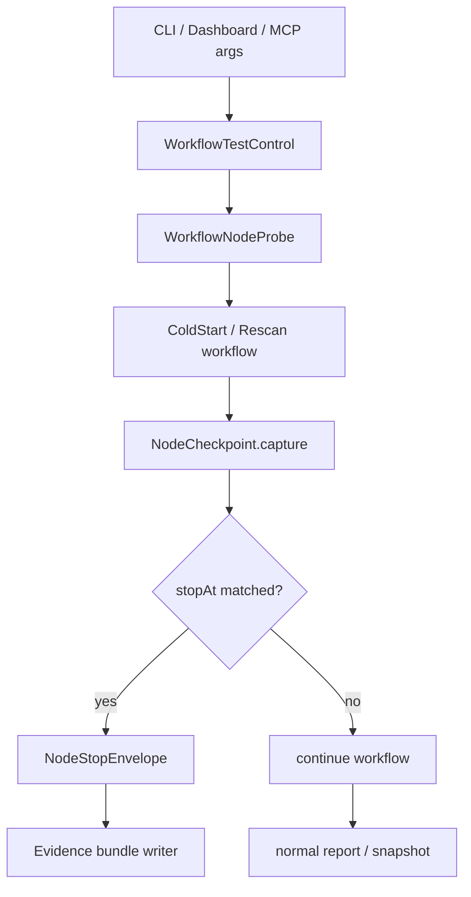

# 冷启动与增量扫描渐进式测试 Harness 代码实现方案

本文档描述如何落地一套代码级测试支撑能力，让 `docs/bootstrap-rescan-chain-test-plan.md` 中的“节点推进、检查结果、修改优化、重验、再推进”真正可执行。

目标不是写一批固定测试脚本，而是在现有冷启动和增量扫描链路中加入可控的测试 harness：

- 可以从真实入口启动。
- 可以停在指定节点。
- 可以导出该节点的结构化证据。
- 可以用相同输入重跑同一节点验证优化结果。
- 不改变生产默认行为。

## 设计原则

1. 默认关闭。没有显式测试参数时，生产链路行为完全不变。
2. 只加观测与断点，不在业务代码里硬编码测试分支。
3. 节点断点必须返回合法 envelope，不能通过抛异常模拟停止。
4. 每个节点的证据结构稳定，可以被 CLI、Dashboard、单元测试、集成测试复用。
5. 先支持内部链路：`bootstrap-internal`、`rescan-internal`、CLI、Dashboard；外部 MCP agent 链路后续再扩展。
6. Ghost 模式路径必须作为一等证据记录，避免误写 BiliDili 项目目录。

## 总体架构



新增代码集中在 `lib/workflows/testing/`，业务 workflow 只在节点边界调用一个轻量函数：

```ts
const stop = await probe.capture('N3_DISCOVERY', evidence);
if (stop) {
  return stop;
}
```

生产模式下 `probe.capture()` 是 no-op，开销接近一次空函数调用。

## 新增目录与文件

```text
lib/workflows/testing/
  WorkflowTestNode.ts
  WorkflowTestControl.ts
  WorkflowNodeProbe.ts
  WorkflowEvidenceBundle.ts
  WorkflowNodeStop.ts
  WorkflowReplayManifest.ts
  WorkflowTestControlResolver.ts

test/unit/
  WorkflowTestControl.test.ts
  WorkflowNodeProbe.test.ts

test/integration/
  BootstrapRescanNodeHarness.test.ts
```

后续如果需要 CLI 专用命令，可以再加：

```text
bin/cli.ts
  coldstart --test-stop-at <node>
  rescan --test-stop-at <node>
  chain-test <coldstart|rescan>
```

第一阶段建议只加隐藏参数和内部类型，不急着做独立命令。

## 核心类型

### WorkflowTestNode

文件：`lib/workflows/testing/WorkflowTestNode.ts`

```ts
export const WORKFLOW_TEST_NODES = [
  'N0_ENV',
  'N1_BOOTSTRAP',
  'N2_INTENT',
  'N3_DISCOVERY',
  'N4_MATERIALIZATION',
  'N5_RESCAN_SNAPSHOT_CLEANUP',
  'N6_DIMENSION_PLAN',
  'N7_SESSION_TASKS',
  'N8_STAGE_TOOL_POLICY',
  'N9_ANALYZE',
  'N10_EVOLVE_PRESCREEN',
  'N11_PRODUCE',
  'N12_CONSUMERS',
  'N13_FINALIZER',
  'N14_REPORT_SNAPSHOT_HISTORY',
] as const;

export type WorkflowTestNode = (typeof WORKFLOW_TEST_NODES)[number];

export function isWorkflowTestNode(value: unknown): value is WorkflowTestNode {
  return typeof value === 'string' && WORKFLOW_TEST_NODES.includes(value as WorkflowTestNode);
}
```

命名使用稳定枚举值，不直接使用中文节点名，方便 JSON、CLI、测试断言。

### WorkflowTestControl

文件：`lib/workflows/testing/WorkflowTestControl.ts`

```ts
import type { WorkflowTestNode } from './WorkflowTestNode.js';

export interface WorkflowTestControl {
  enabled: boolean;
  runId: string;
  workflow: 'coldstart' | 'rescan';
  stopAt?: WorkflowTestNode | null;
  evidenceDir?: string | null;
  label?: string | null;
  includeHeavyEvidence?: boolean;
  failOnInvariantViolation?: boolean;
}
```

语义：

- `enabled=false`：生产模式，所有 probe no-op。
- `stopAt`：到达该节点后返回 `NodeStopEnvelope`。
- `evidenceDir`：把节点证据写到指定目录。
- `includeHeavyEvidence`：是否包含大体积文件列表、prompt 摘要、tool result 片段。
- `failOnInvariantViolation`：节点 invariant 失败时是否让流程失败。默认建议 false，先收集证据。

### WorkflowNodeEvidence

文件：`lib/workflows/testing/WorkflowEvidenceBundle.ts`

```ts
import type { WorkflowTestNode } from './WorkflowTestNode.js';

export interface WorkflowNodeEvidence<T = Record<string, unknown>> {
  node: WorkflowTestNode;
  workflow: 'coldstart' | 'rescan';
  runId: string;
  timestamp: string;
  projectRoot: string;
  dataRoot: string;
  ghost: boolean;
  summary: Record<string, unknown>;
  details?: T;
  invariants?: WorkflowNodeInvariant[];
}

export interface WorkflowNodeInvariant {
  id: string;
  ok: boolean;
  severity: 'info' | 'warn' | 'error';
  message: string;
  actual?: unknown;
  expected?: unknown;
}
```

每个节点都必须提供 `summary`，`details` 可以按需轻量化。这样 Dashboard 可以只看 summary，调试时再看 details。

### WorkflowNodeStop

文件：`lib/workflows/testing/WorkflowNodeStop.ts`

```ts
import type { WorkflowNodeEvidence } from './WorkflowEvidenceBundle.js';

export interface WorkflowNodeStopEnvelope {
  success: true;
  stopped: true;
  data: {
    workflow: 'coldstart' | 'rescan';
    stoppedAt: string;
    runId: string;
    evidence: WorkflowNodeEvidence;
    evidencePath?: string | null;
    nextRecommendedNode?: string | null;
  };
  meta: {
    tool: string;
    responseTimeMs: number;
    testHarness: true;
  };
}
```

不要用异常中断，因为异常会污染正常错误统计，也容易触发 retry 或 cancel 逻辑。

## Test Control 解析

文件：`lib/workflows/testing/WorkflowTestControlResolver.ts`

来源优先级：

1. 显式 args：CLI/Dashboard/MCP 内部测试参数。
2. 环境变量。
3. 默认 disabled。

建议环境变量：

```bash
ALEMBIC_CHAIN_TEST=1
ALEMBIC_CHAIN_TEST_STOP_AT=N6_DIMENSION_PLAN
ALEMBIC_CHAIN_TEST_EVIDENCE_DIR=.test-runs/current
ALEMBIC_CHAIN_TEST_HEAVY=0
```

注意：这些是链路测试 harness 变量，不是终端能力变量。终端能力仍然只由 `ALEMBIC_TERMINAL_TOOLSET` 控制。

解析函数：

```ts
export function resolveWorkflowTestControl(input: {
  workflow: 'coldstart' | 'rescan';
  args?: Record<string, unknown>;
  projectRoot: string;
  dataRoot: string;
}): WorkflowTestControl;
```

需要支持的隐藏 args：

```ts
interface InternalWorkflowTestArgs {
  testStopAt?: string;
  testRunId?: string;
  testEvidenceDir?: string;
  testIncludeHeavyEvidence?: boolean;
}
```

这些字段只进入 `WorkflowTestControl`，不能继续散落到业务上下文中。

## WorkflowNodeProbe

文件：`lib/workflows/testing/WorkflowNodeProbe.ts`

```ts
export class WorkflowNodeProbe {
  constructor(private readonly control: WorkflowTestControl, private readonly base: ProbeBase) {}

  async capture<T>(
    node: WorkflowTestNode,
    evidence: Omit<WorkflowNodeEvidence<T>, 'node' | 'workflow' | 'runId' | 'timestamp'>
  ): Promise<WorkflowNodeStopEnvelope | null> {
    if (!this.control.enabled) {
      return null;
    }

    const fullEvidence = buildEvidence(this.control, node, evidence);
    const evidencePath = await maybeWriteEvidence(this.control, fullEvidence);

    if (this.control.stopAt === node) {
      return buildStopEnvelope(this.control, fullEvidence, evidencePath);
    }
    return null;
  }
}
```

ProbeBase：

```ts
export interface ProbeBase {
  projectRoot: string;
  dataRoot: string;
  ghost: boolean;
  logger: { info(...args: unknown[]): void; warn(...args: unknown[]): void };
}
```

日志规范：

```text
[ChainTest] captured node=N6_DIMENSION_PLAN workflow=rescan runId=...
[ChainTest] stopped at node=N6_DIMENSION_PLAN evidence=...
```

## Evidence Bundle 写入

文件：`lib/workflows/testing/WorkflowEvidenceBundle.ts`

输出路径：

```text
<evidenceDir>/
  manifest.json
  N0_ENV.json
  N1_BOOTSTRAP.json
  N2_INTENT.json
  ...
```

manifest：

```ts
export interface WorkflowReplayManifest {
  runId: string;
  workflow: 'coldstart' | 'rescan';
  projectRoot: string;
  dataRoot: string;
  ghost: boolean;
  argsHash: string;
  createdAt: string;
  nodes: Array<{
    node: WorkflowTestNode;
    path: string;
    capturedAt: string;
    invariantSummary: { ok: number; warn: number; error: number };
  }>;
}
```

这个 manifest 是“同一节点重跑”的核心。后续可以实现 replay 命令读取它。

## Workflow 插入点

### InternalColdStartWorkflow

文件：`lib/workflows/cold-start/internal/InternalColdStartWorkflow.ts`

建议插入点：

1. intent 创建后：N2
2. cleanup 后：可作为 N2 附属证据，冷启动没有 N5
3. `ProjectIntelligenceCapability.run` 后：N3 + N4
4. snapshot/report/targetFileMap/dimensions 后：N6
5. `startInternalDimensionExecutionSession` 后：N7
6. dispatch 前：返回骨架路径

伪代码：

```ts
const testControl = resolveWorkflowTestControl({
  workflow: 'coldstart',
  args,
  projectRoot,
  dataRoot,
});
const probe = createWorkflowNodeProbe(testControl, { projectRoot, dataRoot, ghost, logger });

const stopAtIntent = await probe.capture('N2_INTENT', {
  projectRoot,
  dataRoot,
  ghost,
  summary: {
    maxFiles: intent.projectAnalysis.maxFiles,
    dimensions: intent.dimensionIds,
    skipAsyncFill: intent.internalExecution.skipAsyncFill,
  },
});
if (stopAtIntent) return stopAtIntent;
```

N3/N4 可以由同一个 phaseResults 分两次 capture：

```ts
await probe.capture('N3_DISCOVERY', {
  summary: {
    targets: phaseResults.allTargets.length,
    files: phaseResults.allFiles.length,
    primaryLang: phaseResults.primaryLang,
  },
  details: lightFileCollectionSummary(phaseResults),
});

await probe.capture('N4_MATERIALIZATION', {
  summary: {
    astClasses: phaseResults.astProjectSummary?.classes?.length ?? 0,
    depNodes: phaseResults.depGraphData?.nodes?.length ?? 0,
    depEdges: phaseResults.depGraphData?.edges?.length ?? 0,
    dimensions: phaseResults.activeDimensions.length,
  },
});
```

### InternalKnowledgeRescanWorkflow

文件：`lib/workflows/knowledge-rescan/internal/InternalKnowledgeRescanWorkflow.ts`

建议插入点：

1. intent 创建后：N2
2. recipe snapshot + cleanup 后：N5
3. sourceRef reconcile 后：N5 details
4. `ProjectIntelligenceCapability.run` 后：N3 + N4
5. `KnowledgeRescanPlan` 后：N6
6. `startInternalDimensionExecutionSession` 后：N7
7. dispatch 前返回 stop envelope

N5 evidence：

```ts
await probe.capture('N5_RESCAN_SNAPSHOT_CLEANUP', {
  summary: {
    preservedRecipes: recipeSnapshot.count,
    cleanupPolicy: intent.cleanupPolicy,
    clearedTables: cleanResult.clearedTables.length,
    deletedFiles: cleanResult.deletedFiles,
    cleanupErrors: cleanResult.errors.length,
    reconcileActive: reconcileReport?.active ?? null,
    reconcileStale: reconcileReport?.stale ?? null,
  },
  details: {
    coverageByDimension: recipeSnapshot.coverageByDimension,
    lifecycleCounts: recipeSnapshot.lifecycleCounts,
  },
});
```

N6 evidence：

```ts
await probe.capture('N6_DIMENSION_PLAN', {
  summary: {
    requestedDimensions: requestedDimensions.length,
    executionDimensions: executionDimensions.length,
    gapDimensions: gapDimensions.length,
    skippedDimensions: skippedDimensions.length,
    targetPerDimension,
  },
  details: {
    gapDetails: knowledgeRescanPlan.dimensionPlans.map(...),
    occupiedTriggers: knowledgeRescanPlan.occupiedTriggers.slice(0, 50),
  },
});
```

### InternalDimensionExecutionPipeline

文件：`lib/workflows/capabilities/execution/internal-agent/InternalDimensionExecutionPipeline.ts`

建议插入点：

1. preparation 后：N7 或 N8 的预备信息。
2. runtime 初始化后：N8/N9 前的系统上下文。
3. sessionResult 后：N12。
4. finalizer 后：N13。

这里不能直接返回 workflow envelope，因为这个函数通常在 async fill 中执行。建议策略：

- 如果 `stopAt` 是 N8 之后的异步节点，TaskManager 应该标记 session 为 `stopped`。
- `runInternalDimensionExecution` 返回 `InternalDimensionExecutionStopResult`。
- dispatch 方感知 stop result 后不再继续后续维度。

第一阶段可只支持 N0-N7 的同步 stopAt。N8-N14 先只 capture evidence，不 stop。第二阶段再支持异步 stop。

推荐分两步实现：

- Milestone A：支持 N0-N7 stopAt。
- Milestone B：支持 N8-N14 async stopAt。

### InternalDimensionFillSessionRunner

文件：`lib/workflows/capabilities/execution/internal-agent/InternalDimensionFillSessionRunner.ts`

需要增加节点级 evidence：

- N8：stage factory/tool policy summary。
- N9：Agent analyze + quality gate artifact summary。
- N10：evolve/prescreen summary。
- N11：producer submitted/accepted/rejected。
- N12：consumer persistence summary。

最小侵入方案：

1. 在 `createBootstrapDimensionRunInput` 后记录 stage toolset 摘要。
2. 在 `agentService.run` 返回后，用 `projectAgentRunResult` 提取阶段摘要。
3. 在 `consumeBootstrapDimensionAgentResult` 后记录 candidate/skill/sessionStore 结果。

不要把完整 prompt 和完整 tool result 默认写入 evidence；只在 `includeHeavyEvidence=true` 时写摘要片段。

N9 evidence 最少应包含：

```ts
interface N9AnalyzeEvidenceSummary {
  provider: { name: string | null; model: string | null };
  dimensionId: string;
  selectedStageNames: string[];
  selectedAdditionalTools: Array<{ stage: string; additionalTools: string[] }>;
  toolDistribution: Record<string, number>;
  memoryActions: string[];
  replyLength: number;
  findingCount: number;
  pathRefCount: number;
  evidenceMapSize: number;
  negativeSignalCount: number;
  qualityReport: {
    totalScore: number;
    scores: {
      depthScore: number;
      breadthScore: number;
      evidenceScore: number;
      coherenceScore: number;
    };
    suggestions: string[];
  } | null;
  nudgeLeak: boolean;
  terminalPhaseNudgeAfterSummarize: boolean;
}
```

N9 evidence 的目的不是复刻日志，而是让开发者快速回答五个问题：

- 是否用了目标项目的 AI 配置。
- analyze 阶段是否拿到了正确工具，produce 是否没有被提前执行。
- Agent 是否通过 `memory({ action: "note_finding", params: ... })` 把关键发现写入结构化记忆。
- QualityGate 的 artifact 是否足够喂给 Producer。
- Tracker 是否在 `SUMMARIZE` 后继续注入 planning/replan/reflection 冲突指令。

## CLI 接入方案

文件：`bin/cli.ts`

给 `coldstart` 和 `rescan` 加隐藏选项。Commander 没有严格隐藏需求时，可以在 description 中标注 internal：

```ts
.option('--test-stop-at <node>', '[internal] stop workflow at a chain-test node')
.option('--test-run-id <id>', '[internal] stable chain-test run id')
.option('--test-evidence-dir <path>', '[internal] write chain-test evidence bundle')
.option('--test-heavy', '[internal] include heavy evidence')
```

传入 handler：

```ts
testStopAt: opts.testStopAt,
testRunId: opts.testRunId,
testEvidenceDir: opts.testEvidenceDir,
testIncludeHeavyEvidence: opts.testHeavy === true,
```

CLI 输出：

```text
🧪 Chain test stopped at N6_DIMENSION_PLAN
Evidence: .test-runs/.../N6_DIMENSION_PLAN.json
Next: N7_SESSION_TASKS
```

JSON 模式直接输出 stop envelope。

## Dashboard / HTTP 接入方案

文件：

- `lib/shared/schemas/http-requests.ts`
- `lib/http/routes/modules.ts`
- `lib/tools/adapters/DashboardOperations.ts`

不要把测试字段加入公开 API 文档。可以接受 `_test` 子对象：

```ts
_test: z
  .object({
    stopAt: z.string().optional(),
    runId: z.string().optional(),
    evidenceDir: z.string().optional(),
    includeHeavyEvidence: z.boolean().optional(),
  })
  .optional()
```

Dashboard operation 转成内部 args：

```ts
testStopAt: request.args._test?.stopAt,
testRunId: request.args._test?.runId,
testEvidenceDir: request.args._test?.evidenceDir,
testIncludeHeavyEvidence: request.args._test?.includeHeavyEvidence,
```

生产 UI 不展示这些字段。只给开发调试面板或 curl 使用。

## Invariant 设计

每个节点应该内置少量稳定 invariant，作为“是否可以推进”的机器辅助判断。

### N0

- `projectRoot` exists。
- `dataRoot` exists 或可创建。
- ghost 模式下 `projectRoot !== dataRoot`。

### N2

- intent 不包含旧终端测试字段。
- dimensions 是字符串数组或空。
- coldstart 的 `skipAsyncFill` 与 CLI `--wait` 语义一致。

### N3

- files 数量大于 0。
- 所有文件路径在 projectRoot 下。
- 不包含 dataRoot / ghost workspace 文件。

### N4

- primary language 非空。
- active dimensions 大于 0。
- report phases 存在。

### N5

- preservedRecipes 非负。
- cleanup errors 为空或全部 warning。
- rescan 不清理 recipe 主表。

### N6

- executionDimensions 是 requestedDimensions 子集。
- gapDimensions 是 requestedDimensions 子集。
- skipped + execution 不超过 requested。

### N7

- task 数量等于 executionDimensions。
- session id 非空。
- task id 唯一。

### N8

- default toolset 有 terminal。
- producer 无 terminal。
- baseline 无 terminal。

### N9-N12

- Agent result 有 final answer 或 structured output。
- N9 selected stages 只包含 `analyze`、`quality_gate` 时，不应出现 `produce` phase 或 `knowledge.submit`。
- N9 `qualityReport.scores.evidenceScore > 40`；如果等于 40 且 `findingCount=0`，应判为黄灯，即使 totalScore pass。
- N9 `findingCount >= 3`，`pathRefCount >= 3`，`qualityReport.suggestions` 不包含 `Findings lack file-level evidence`。
- N9 `memoryActions` 至少包含 `recall`，candidate/dual 输出必须包含 `note_finding`；若缺失，gate artifact 可以从正文提取兜底 findings 保留证据，但 `qualityReport.suggestions` 必须包含 `Required memory action note_finding calls are missing` 并触发 retry。
- N9 进入 `SUMMARIZE` 后不再注入 planning/reflection/replan nudge。
- Producer submitted 不超过 gap。
- candidate error 有 reason。

### N14

- report JSON 可解析。
- session id 对齐。
- history index 可解析。
- snapshot id 存在或有明确跳过原因。

Invariant 不应该一开始就全部 fail hard。建议先写入 evidence，再逐步把关键 invariant 升级为 hard gate。

## Evidence 轻量化策略

默认 evidence 不写大字段：

- 不写完整文件内容。
- 不写完整 prompt。
- 不写完整 tool result。
- 不写完整 analysis text。

默认写摘要：

- 文件数量、top directories、扩展名分布。
- stage 名称、tool ids、tool call count。
- candidate 数量和错误原因。
- report path、snapshot id。

`includeHeavyEvidence=true` 时才写：

- 截断后的 prompt。
- 截断后的 analysis。
- top N tool result 摘要。
- top N source refs。

## Replay 与重验

第一阶段不实现真正的“从中间节点恢复执行”，因为链路状态复杂，容易制造假象。正确的重验方式是：

1. 使用相同入口参数。
2. 使用相同 projectRoot / dataRoot。
3. 使用相同 `testRunId` 或生成新 runId 并记录关联。
4. stopAt 同一个节点。
5. 对比两个 evidence JSON。

后续可以增加 replay manifest diff：

```ts
export function compareEvidenceRuns(before: WorkflowNodeEvidence, after: WorkflowNodeEvidence) {
  return {
    invariantDelta,
    summaryDelta,
    improved,
    regressions,
  };
}
```

CLI 可以后续加：

```bash
node dist/bin/cli.js chain-test diff <before-dir> <after-dir>
```

## 实施里程碑

### Milestone 1：基础类型与同步节点 stopAt

改动：

- 新增 `lib/workflows/testing/*`。
- `InternalColdStartWorkflow` 支持 N2、N3、N4、N6、N7 capture + stop。
- `InternalKnowledgeRescanWorkflow` 支持 N2、N3、N4、N5、N6、N7 capture + stop。
- CLI coldstart/rescan 支持隐藏测试参数。
- evidence bundle 写入 JSON。

验收：

- 能对 BiliDili 跑到 N3 停止。
- 能对 BiliDili 跑到 N6 停止。
- 产物 JSON 可读。
- 默认不传测试参数时行为不变。

### Milestone 2：异步维度节点 evidence

改动：

- `PipelineFillView` 或 preparation 中注入 `WorkflowNodeProbe`。
- `InternalDimensionExecutionPipeline` capture N8、N12、N13。
- `InternalDimensionFillSessionRunner` capture N9、N10、N11、N12。
- TaskManager 增加 stopped/testHarness 状态。

验收：

- 少维度 `--wait --test-stop-at N9_ANALYZE` 可以停止或至少写 evidence 后停止后续阶段。
- TaskManager status 能显示 stoppedAt。
- Report history 不被半流程污染，除非明确进入 N14。

### Milestone 3：Invariant 与对比工具

改动：

- 每个节点内置 invariant。
- evidence manifest 汇总 invariant。
- 增加 `chain-test diff` 或脚本比较 before/after。

验收：

- 优化前后可以看到 invariant 从 fail 到 pass。
- 能输出“是否可以推进下一节点”的机器辅助结论。

### Milestone 4：Dashboard 开发调试入口

改动：

- HTTP `_test` 参数支持。
- Bootstrap status 展示 stoppedAt / evidencePath。
- Reports 页面显示 node evidence 链接。

验收：

- 不影响普通 Dashboard 用户。
- 开发者能用 curl 或隐藏面板触发节点停止。

## 代码改动优先级

第一优先级：

- `WorkflowTestControl`
- `WorkflowNodeProbe`
- evidence bundle writer
- coldstart/rescan 同步节点 N2-N7

第二优先级：

- CLI hidden options
- invariant 基础集
- N8 tool policy evidence

第三优先级：

- N9-N12 async stop
- TaskManager stopped 状态
- evidence diff

第四优先级：

- Dashboard hidden test controls
- 可视化节点进度

## 风险与边界

### 风险：测试字段再次变成业务参数

约束：

- 所有测试字段必须收敛到 `WorkflowTestControl`。
- 不允许进入 `SystemRunContext`、Agent prompt、tool runtime context。

### 风险：stopAt 造成半写入污染

约束：

- N0-N7 stopAt 发生在 AI 写入前，安全。
- N8-N14 stopAt 必须明确哪些写入已经发生，并在 evidence 中记录。
- 涉及 DB 写入的节点优先使用 ghost 或临时副本。

### 风险：Evidence 过大

约束：

- 默认只写 summary。
- heavy evidence 必须截断。
- artifacts 目录按 runId 分隔。

### 风险：生产行为受影响

约束：

- `enabled=false` 下 probe no-op。
- 单元测试覆盖“默认不启用 harness”。
- 不改变现有 CLI 默认参数。

## 推荐第一批 PR 内容

建议第一批只实现 Milestone 1，范围小、收益大：

1. 新增测试 harness 类型和 probe。
2. 冷启动支持 stopAt N2/N3/N4/N6/N7。
3. 增量扫描支持 stopAt N2/N3/N4/N5/N6/N7。
4. CLI 支持 hidden test options。
5. 增加 unit + integration 测试。

第一批不做：

- async N9-N14 stopAt。
- Dashboard UI。
- diff 可视化。
- 中间节点恢复执行。

这样可以先支撑“慢慢推进”的核心工作法：从入口跑到节点、检查证据、改代码、重跑同节点、再推进。
