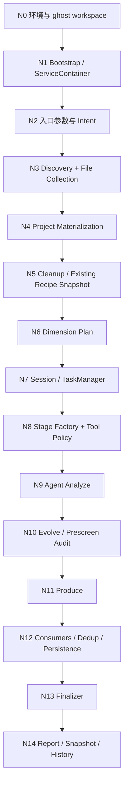

# 冷启动与增量扫描长链路渐进式测试优化方案

本文档不是测试脚本清单，而是一套“从起点推进到某个节点，检查结果，修改代码优化，再验证优化结果，然后继续推进”的长链路工作法。目标是让冷启动和增量扫描这两条长链路可控地被拆开验证，避免一次性跑完整流程后只能面对一大团日志。

适用链路：

- 冷启动：`coldstart` / Dashboard bootstrap / MCP `bootstrap-internal`
- 增量扫描：`rescan` / Dashboard rescan / MCP `rescan-internal`
- BiliDili ghost 模式真实项目验证

## 核心方法

每一轮只做一件事：把链路从开始节点推进到目标节点，并在目标节点停下来判断“这个节点之前的行为是否可信”。

一轮测试优化包含 6 个动作：

1. 选定目标节点：例如“只验证到文件收集完成”或“只验证到 Dimension Session 创建完成”。
2. 执行从入口到目标节点的最短路径。
3. 收集目标节点产物：日志、JSON、DB、report、snapshot、task 状态、terminal artifact。
4. 判断节点是否通过：用明确的不变量，而不是凭感觉。
5. 修改代码优化：只改当前节点暴露的问题，不顺手重构后面的链路。
6. 重跑同一节点：确认问题消失，再推进到下一个节点。

推进规则：

- 当前节点不稳定，不进入下一个节点。
- 同一问题必须先补一个低层测试或可复查观测点，再继续长跑。
- 优先修“观测缺失”再修“行为错误”。如果节点失败但不知道为什么，先加日志、report 字段或测试钩子。
- 每次优化都记录“前后对比”：失败表现、代码修改、重跑结果。

## 节点切分总览



冷启动会经过 N0、N1、N2、N3、N4、N6、N7、N8、N9、N10、N11、N12、N13、N14。

增量扫描会经过 N0、N1、N2、N3、N4、N5、N6、N7、N8、N9、N10、N11、N12、N13、N14，其中 N5 是 rescan 独有的关键节点。注意：内部 rescan 的 prescreen 会在 N6 之前完成，N8 stage factory 会因为 `prescreenDone=true` 直接生成 `analyze → quality_gate → produce → rejection_gate`。因此 N10 在内部 rescan 中不是“晚于 analyze 才开始 evolve”，而是对前置 prescreen 与后续 evolve audit 副作用做复查。

## 节点推进协议

每个节点都用同一个记录模板：

```markdown
## 节点 Nx：名称

目标：
本轮只验证从入口到 Nx，不评价 Nx 之后的行为。

执行范围：
入口是什么，哪些后续阶段需要跳过或降维。

检查证据：
需要看的日志、文件、DB 表、report 字段、内存状态。

通过标准：
必须满足的不变量。

失败分类：
失败可能属于输入、状态、算法、并发、持久化、观测缺失中的哪一种。

优化动作：
代码应该优先改哪里，如何保持改动收敛。

重验标准：
同一入口、同一数据、同一目标节点重跑后，哪些指标必须改善。
```

## N0：环境与 Ghost Workspace

目标：
确认测试从正确项目、正确数据根、正确 ghost 模式开始。这个节点不跑冷启动，也不跑 rescan。

执行范围：
只执行项目解析、setup ghost、workspace resolver、ProjectRegistry 读取。

检查证据：

- BiliDili 项目根：`/Users/gaoxuefeng/Documents/github/BiliDili`
- ghost workspace 路径是否稳定。
- BiliDili 项目目录内是否没有新增 Alembic 写入物。
- `WorkspaceResolver` 返回的 `projectRoot`、`dataRoot`、`ghost` 是否正确。
- `.asd/alembic.db` 实际位于 ghost workspace。

通过标准：

- `ghost=true`。
- 所有写入路径指向 ghost workspace。
- 项目源目录只读，不被创建 `.asd`、`Alembic`、report、artifact。

失败分类：

- WorkspaceResolver 找不到注册信息。
- ProjectRegistry 中 BiliDili 的 ghost 状态不一致。
- WriteZone 错把 runtime 写到项目目录。

优化动作：

- 优先修 `WorkspaceResolver`、`ProjectRegistry`、`WriteZone` 的路径解析和日志。
- 增加一条明确日志：`projectRoot`、`dataRoot`、`ghost`、`runtimeRoot`。

重验标准：

- 重复 setup 不改变数据根。
- 运行只读状态查询不会污染 BiliDili 项目目录。

## N1：Bootstrap / ServiceContainer 初始化

目标：
确认最底层运行时可启动、可关闭，DB 和服务容器稳定。

执行范围：
从 CLI/Dashboard/MCP 入口初始化到 `Bootstrap.initialize()` 完成后停止，不进入项目扫描。

检查证据：

- `ServiceContainer` 是否包含 DB、logger、gateway、toolRegistry、bootstrapTaskManager。
- DB 是否完成迁移，WAL 状态是否正常。
- shutdown 后 DB 是否释放。
- 重复初始化/关闭是否稳定。

通过标准：

- 初始化无异常。
- container 核心服务均可 resolve。
- 连续两次 init/shutdown 不报错。

失败分类：

- DB lock。
- container 依赖注册顺序错误。
- ghost dataRoot 注入不完整。

优化动作：

- 修 container 初始化顺序。
- 给 DB 初始化和 shutdown 加更清晰的错误上下文。
- 补 `BootstrapLifecycle` 类低层测试。

重验标准：

- 同一进程连续初始化两轮通过。
- 后续 N2 入口可以复用同一 container，不出现脏状态。

## N2：入口参数与 Intent

目标：
确认 CLI、Dashboard、MCP 三个入口最终生成同一语义的 intent，不再携带旧终端测试开关。

执行范围：
从入口参数解析到 `ColdStartIntent` 或 `KnowledgeRescanIntent` 创建完成后停止。

检查证据：

- `maxFiles`、`contentMaxLines`、`skipGuard`、`dimensions`、`skipAsyncFill`。
- rescan 的 `reason`、`force`、cleanup policy。
- intent 中不应出现 `terminalTest`、`terminalToolset`、`allowedTerminalModes`。
- 终端能力只由后续 stage factory 解析。

通过标准：

- 三个入口对同一请求生成一致 intent。
- 旧终端字段全链路不存在。
- 测试模式只影响维度过滤，不影响终端是否启用。

失败分类：

- CLI 与 Dashboard 默认值不一致。
- HTTP schema 仍接受旧字段。
- MCP handler 旁路了统一 intent。

优化动作：

- 收敛 schema 和 intent 类型。
- 对 CLI/Dashboard/MCP 各补一个 intent projection 测试。
- 在入口日志打印标准化后的 intent 摘要。

重验标准：

- 三入口同输入得到同等 intent。
- 全仓搜索旧字段没有结果。

## N3：Discovery + File Collection

目标：
验证项目发现、target 列表、文件收集、截断策略，不进入 AI。

执行范围：
从入口跑到 source files collected 后停止。冷启动和 rescan 都需要经过此节点。

检查证据：

- discoverer id。
- targets 数量和名称。
- allFiles 数量。
- maxFiles 是否生效。
- skip dirs 是否生效。
- 文件路径是否全部位于 projectRoot 下。
- 文件内容截断是否符合 `contentMaxLines`。

通过标准：

- BiliDili 能稳定识别为预期项目类型。
- allFiles 大于最低阈值，且不包含 `.git`、build 产物、ghost workspace 文件。
- maxFiles 相同输入下结果稳定。

失败分类：

- discoverer 错误。
- 文件收集遗漏核心目录。
- 路径过滤过宽或过窄。
- 内容读取失败但日志不可解释。

优化动作：

- 优先修 discovery 和 skip dirs。
- 给 file collection report 增加 top dirs、skipped dirs、read failures。
- 如果 BiliDili 目录结构特殊，补一个真实项目 fixture 或小型复制样本测试。

重验标准：

- 同一 maxFiles 下 targets 和 top dirs 稳定。
- 读失败数量可解释。

## N4：Project Materialization

目标：
验证非 AI 项目分析产物：语言统计、AST、依赖图、enhancement packs、Guard audit。

执行范围：
从入口跑到 Phase 1-4 项目分析完成后停止，不进入 dimension fill。

检查证据：

- `languageStats` 和 primary language。
- AST metrics：classes、protocols、functions、categories。
- dependency graph 边数量。
- enhancement pack 匹配结果。
- Guard summary。
- project snapshot view 是否包含目标、文件、语言、图谱。

通过标准：

- primary language 与 BiliDili 实际技术栈一致。
- AST 不应整体为空，除非语言插件确实不可用。
- Guard 失败不阻塞主流程，除非明确配置为阻塞。
- snapshot view 足够支持后续 prompt，不缺核心字段。

失败分类：

- AST parser 不兼容。
- dependency graph 降级但无日志。
- enhancement pack 误匹配。
- Guard 误报过多影响后续上下文质量。

优化动作：

- 给 AST 和 dependency graph 增加 graceful degradation 原因。
- 优化语言识别和 enhancement 匹配。
- 将 Guard summary 压缩为后续 prompt 可用的结构。

重验标准：

- Phase 1-4 report 可解释。
- 同一输入重复执行产物差异可控。

## N5：Rescan Existing Recipe Snapshot 与 Cleanup

目标：
增量扫描专属。确认已有知识被正确保留，衍生缓存被清理，相关性审计的输入正确。

执行范围：
rescan 从入口推进到 recipe snapshot、cleanup、prescreen 输入准备完成后停止。

检查证据：

- preserved recipe 数量。
- lifecycle 分布：active、staging、candidate、deprecated。
- source refs 数量和路径健康。
- cleanup 删除了哪些表和文件。
- recipes、source refs、evolution proposals 是否被保留。

通过标准：

- `preservedRecipes > 0`。
- 不误删 active/staging/evolving recipes。
- 衍生缓存清理后，后续 Phase 1-4 可以重建。
- cleanup report 明确区分“保留”和“删除”。

失败分类：

- cleanup policy 太激进。
- DB 表保留策略不完整。
- ghost dataRoot 下清理错目录。
- sourceRef 快照缺少必要字段。

优化动作：

- 优先修 `CleanupService.rescanClean` 和 snapshot 投影。
- 给 cleanup 增加 dry-run 风格的 report 字段，即使不暴露为 CLI 参数，也要内部可观测。
- 补 DB 副本测试，避免直接写真实 BiliDili 数据。

重验标准：

- 同一 DB 副本 rescan 前后，保留表数量符合预期。
- cleanup 之后冷启动骨架仍可正常扫描。

## N6：Dimension Plan

目标：
确认冷启动和增量扫描选择哪些维度、为什么执行或跳过。

执行范围：
推进到 dimension plan 创建完成后停止，不创建 agent session。

检查证据：

- requested dimensions。
- skipped dimensions。
- rescan coverageByDimension。
- gap dimensions。
- executionReasons。
- occupied triggers。
- decaying recipes。

通过标准：

- 冷启动：测试模式过滤只留下指定维度，全量模式包含完整维度。
- rescan：healthy recipe 足够的维度可跳过，decay/gap/manual-request 维度进入执行。
- reason 可解释，不出现“所有维度都 gap”这种异常。

失败分类：

- coverage 计算错误。
- knowledgeType 与 dimension id 对不齐。
- dedup set 没纳入已有 trigger。
- 测试模式过滤影响了不该影响的阶段。

优化动作：

- 修 `KnowledgeRescanPlan`、`BootstrapRescanState`。
- 把 executionReasons 写入 report，方便长跑后复查。
- 给 BiliDili 实际维度覆盖做一个只读统计测试。

重验标准：

- 同一 recipe snapshot 生成同一 plan。
- 人工构造 healthy/decay/dead recipe 后，plan 变化符合预期。

## N7：Session / TaskManager

目标：
确认异步任务会话、维度任务、取消和状态查询稳定。

执行范围：
推进到 BootstrapTaskManager session 和 tasks 创建完成，暂不执行 Agent stage。

检查证据：

- session id。
- task 数量、维度 id、tier、状态。
- status API 返回结构。
- cancel 前后状态流转。
- session abort signal 是否传入后续执行输入。

通过标准：

- task 数量等于 execution dimensions。
- 初始状态明确，不出现无任务但 session running。
- cancel 后不会继续启动新维度。

失败分类：

- session 状态和实际执行脱节。
- 并发调度提前启动后续任务。
- cancel 只改 UI 状态，没有 abort 执行。

优化动作：

- 修 BootstrapTaskManager 状态机。
- 给 session status 增加 current task、done/failed 计数。
- 给 cancel 加集成测试。

重验标准：

- 创建 session 后立即 status 可读。
- cancel 后最终态稳定，后续新运行不受旧 abort signal 影响。

## N8：Stage Factory + Tool Policy

目标：
确认 Agent stage 和工具策略正确生成，尤其是终端能力默认可用但只在允许阶段出现。

执行范围：
推进到 `bootstrapDimensionPipeline` stage 列表和 toolset 创建完成后停止。

检查证据：

- analyze/evolve/produce stage 顺序。
- `additionalTools`。
- `toolPolicyHints.terminalCapability`。
- `ALEMBIC_TERMINAL_TOOLSET` 不同档位下的工具差异。
- produce 阶段是否禁止终端。

通过标准：

- 默认不设置任何终端测试开关时，analyze 有 `terminal`。
- `baseline` 时所有 stage 无 terminal。
- `terminal-shell` / `terminal-pty` 只扩大允许范围，不改变入口参数。
- producer 没有 terminal tools。

失败分类：

- stage factory 仍依赖上游传参。
- prompt 提示和实际 toolset 不一致。
- terminal_pty 泄漏到不该出现的阶段。

优化动作：

- 修 `BootstrapTerminalToolset` 和 `AgentStageFactoryRegistry`。
- 给 stage factory 输出增加 debug 摘要。
- 补 toolset 矩阵测试。

重验标准：

- 档位矩阵稳定。
- 全仓旧终端测试字段无匹配。

## N9：Agent Analyze

目标：
先只验证 Analyst 是否能产生可信分析报告，不评价 Producer 候选质量。N9 属于 Agent 核心节点，不能只看“阶段跑通”，必须深入检查 Agent 运行时、工具使用、scratchpad/memory、quality gate artifact 和后续 Producer 输入风险。

执行范围：
单维度或少维度推进到 analyze stage 完成后停止，或在完整 pipeline 中只检查 analyze artifact。

检查证据：

- provider/runtime：必须确认使用目标项目配置，例如 BiliDili 应为 `deepseek/deepseek-v4-flash`，不能误用 Alembic 仓库 `.env`。
- stage 列表：内部 rescan 已 prescreen 时应是 `analyze → quality_gate → produce → rejection_gate`，N9 小节点只选择 `analyze + quality_gate`。
- Analyst 输出长度。
- 文件证据数量。
- 具体 path/class/method 引用。
- toolCalls 分布：code、graph、terminal。
- memory/scratchpad 行为：是否调用 `memory` 工具的 `recall` / `note_finding` action，结构化 findings 是否进入 gate artifact。
- ExplorationTracker 阶段推进。
- QualityGate depth/breadth/evidence/coherence。
- gate artifact：`findings`、`referencedFiles`、`evidenceMap`、`negativeSignals`、`explorationLog`。
- Producer 输入风险：即使不跑 Producer，也要判断 `gateArtifact.findings` 是否为空；为空会导致 N11 失去结构化发现。
- context compaction 是否异常。
- nudge 泄漏与冲突：最终报告不能复制系统 nudge；进入 `SUMMARIZE` 后不应再注入 planning/replan/reflection。

通过标准：

- 至少 3 个核心发现，每个发现有文件级证据。
- `gateArtifact.findings.length >= 3`，且核心发现优先来自 `memory({ action: "note_finding", params: ... })`。
- evidenceScore 不应停在 40 分兜底上限；如果 `findings=[]` 且 evidenceScore=40，即使 total pass，也判为 N9 黄灯。
- QualityGate 不因 evidence 低反复 retry 到预算耗尽。
- terminal 使用是辅助验证，不替代 code/graph 阅读。
- 不复制系统 nudge 到最终报告。
- `quality_gate` 通过后 `suggestions` 不应包含 `Findings lack file-level evidence` 或 `Required memory action note_finding calls are missing`。

失败分类：

- prompt 约束不清。
- ExplorationTracker 过早 summarize。
- code search/read 结果进入不了报告。
- 模型报告正文有证据，但没有调用 `memory` 工具的 `note_finding` action，导致 `gateArtifact.findings=[]`。
- QualityGate 只按总分 pass，掩盖 evidenceScore 黄灯。
- 进入 `SUMMARIZE` 后又注入 planning/replan，产生相互矛盾的 Agent 指令。
- compaction 丢失关键证据。

优化动作：

- 调整 Analyst prompt 的证据要求。
- 调整 tracker 的 phase transition 阈值。
- 在 analysis artifact 中结构化保存 files/evidence。
- 当 `memory({ action: "note_finding", params: ... })` 缺失但分析正文有 Markdown 小节和文件路径证据时，QualityGate 应从正文反推结构化 findings，避免 Producer 输入为空；但 candidate/dual 场景仍必须 retry，不能把兜底 findings 当成完整通过。
- Analyst prompt 和 BootstrapAnalyze prompt 必须明确说明：最终 Markdown 报告不能替代 `memory` 工具的 `note_finding` action，输出最终报告前至少记录 3 条核心发现。
- `SUMMARIZE` 终结阶段禁止继续触发 planning/reflection/replan nudge。
- 必要时降低单轮维度或预算，先保证证据质量。

重验标准：

- 同一维度重跑 evidence 分数提高。
- 报告能定位到文件和符号。
- 同一小节点重跑时，对比 `memoryActions`、`findingCount`、`pathRefCount`、`evidenceMapSize`、`qualityReport`，确认改善来自 Agent artifact 质量，而不是只来自最终文本变长。
- 修改 tracker 后，日志中不再出现 `SUMMARIZE` transition 后紧接 planning/replan 的冲突 nudge。

### N9 多轮实测记录：BiliDili error-resilience

Round 1：真实 N9 analyze + quality_gate 初测。

- 配置断言：BiliDili ghost workspace，provider 为 `deepseek/deepseek-v4-flash`。
- 阶段：只运行 `analyze + quality_gate`，未进入 Producer。
- 结果：`toolDistribution={code:20,memory:1,terminal:4}`，`memoryActions=[recall]`，`findings=[]`，`pathRefCount=11`。
- QualityGate：`total=62`，`depth=60`，`breadth=77.6`，`evidence=40`，`coherence=80`，suggestion 为 `Findings lack file-level evidence`。
- 结论：链路可跑通，但 N9 判为黄灯。原因不是报告完全没有证据，而是 Agent 没有把发现写入 scratchpad/memory，QualityGate artifact 的结构化 findings 为空，后续 Producer 会缺少结构化发现输入。

Round 2：修复 gate artifact 兜底后重跑同一节点。

- 代码优化：`lib/agent/prompts/insight-gate.ts` 在 `activeContext.keyFindings` 为空时，从分析正文的 Markdown 小节与文件路径引用反推结构化 findings；新增 `test/unit/InsightGate.test.ts` 防回归。
- 真实复测：`toolDistribution={code:55,memory:4,graph:1,terminal:3}`，`memoryActions=[recall,note_finding,note_finding,note_finding]`。
- artifact：`findingCount=3`，`pathRefCount=42`，`evidenceMapSize=7`，`negativeSignals=5`。
- QualityGate：`total=96`，`depth=100`，`breadth=95.87`，`evidence=90`，`coherence=100`，无 suggestions。
- 结论：N9 结构化证据恢复正常。此轮 DeepSeek 自身也正确调用了 `memory({ action: "note_finding", params: ... })`，兜底逻辑作为稳定保险，而不是唯一得分来源。

Round 3：修复终结阶段 nudge 冲突。

- 现象：Round 2 中 `VERIFY → SUMMARIZE` 后，同一终结阶段又触发了 planning/replan nudge。最终报告没有泄漏该 nudge，但这会给 Agent 注入冲突指令。
- 原因：`ExplorationTracker.getNudge()` 在终结阶段仍会委托 `PlanTracker.checkPlanning()`。
- 代码优化：`lib/agent/context/ExplorationTracker.ts` 在 terminal phase 直接返回 null，不再触发 planning/reflection/replan；新增 `test/unit/ReasoningLayer.test.ts` 用例覆盖。
- 结论：这是 N9 Agent 控制流问题，必须在 N9 小节内修掉，而不是等全链路长跑时靠清洗最终文本兜底。

Round 4：将 `memory` 工具的 `note_finding` action 从软建议升级为硬性门控。

- 原因：DeepSeek 可能把最终 Markdown 报告理解为“已经记录发现”，但 Producer 依赖的是 `activeContext.keyFindings` 中的结构化发现。
- 代码优化：`lib/agent/prompts/insight-analyst.ts` 和 `lib/tools/v2/capabilities/BootstrapAnalyze.ts` 明确要求最终报告前调用 `memory({ action: "note_finding", params: ... })`；`lib/agent/prompts/insight-gate.ts` 在 candidate/dual 场景下，如果 `memoryFindingCount=0`，即使正文可反推 findings，也返回 `Required memory action note_finding calls are missing` 并 retry。
- 回归验证：`test/unit/InsightGate.test.ts` 覆盖两类情况：正文兜底 findings 会触发缺失 memory retry；真实 `memory({ action: "note_finding", params: ... })` 进入 artifact 时不会触发该 retry。

## N10：Evolve / Prescreen

目标：
验证已有 recipe 的真实性检查、衰退判断、自动跳过和待处理任务。对内部 rescan，需要特别区分“前置 deterministic prescreen”和“异步 evolution audit”：前者会在 N6 之前完成并影响 stage factory，后者可能作为 fire-and-forget 运行。

执行范围：
在 rescan 或已有 recipe 的冷启动场景中推进到 evolve/prescreen 完成。内部 rescan 若 `prescreenDone=true`，N10 主要复核 N6 前置 prescreen 的输入、输出和对 N8/N9 stage 顺序的影响，而不是期待 N9 前一定出现 `evolve` stage。

检查证据：

- existingRecipes 输入。
- evolved、deprecated、skipped、totalRecipes。
- decay reasons。
- duplicate trigger blocked。
- remainingTasks。

通过标准：

- healthy recipe 不重复生成。
- decaying recipe 能进入 Analyst/Producer 的上下文。
- dead/severe 不会静默丢失。
- skipped 有理由。

失败分类：

- sourceRef 检查不准。
- existing recipe 投影缺字段。
- evolve 结果没有反馈到 rescan plan。

优化动作：

- 修 `BootstrapRescanState` 和 evolution result 投影。
- 给 sourceRef health 增加更细状态。
- 把 evolve audit 摘要写入 report。

重验标准：

- 人工构造 renamed/missing sourceRef，prescreen 结果符合预期。
- duplicate 阻断不会导致无限重试。

## N11：Produce

目标：
验证 Producer 能把分析变为候选，同时遵守 gap、去重和工具边界。

执行范围：
推进到 Producer 完成并提交 candidate digest，不做最终 delivery。

检查证据：

- submitted、accepted、rejected。
- rejected reason。
- candidate title/trigger/kind/sourceRefs。
- gap 上限。
- duplicate title/trigger。
- Producer toolCalls。

通过标准：

- Producer 不使用终端。
- rescan 模式提交数不超过 gap。
- sourceRefs 指向真实项目文件。
- rejected 有明确原因，不是 schema 模糊失败。

失败分类：

- submit schema 不清。
- Analyst 输出不可生产。
- dedup set 太严格或太松。
- Producer 继续探索导致预算浪费。

优化动作：

- 优化 Producer prompt 和 submit schema 提示。
- 在 rejected 结果中暴露具体字段错误。
- 调整 dedup 规则，只阻断真正重复。

重验标准：

- 同一 analysis artifact 下 accepted 比例提升。
- rejected reason 从“未知”变为可行动原因，最终减少。

## N12：Consumers / Dedup / Persistence

目标：
确认候选、技能、session report 被正确消费和持久化。

执行范围：
推进到 candidate/skill consumer 完成，暂不评价 finalizer。

检查证据：

- CandidateResults：created、failed、errors。
- SkillResults：created、failed。
- SessionStore dimension report。
- dedup set：titles、triggers、patterns。
- DB 中 candidate/knowledge/proposal 记录。

通过标准：

- accepted candidate 能在 DB 或文件中找到。
- failed 有错误详情。
- SessionStore 记录 analysis 和 files。
- rescan 不覆盖已有 recipe。

失败分类：

- consumer 写入路径错误。
- ghost dataRoot 下文件写错位置。
- DB transaction 部分成功。
- dedup 状态跨维度污染。

优化动作：

- 修 consumer transaction 和错误报告。
- 给每个维度 consumer 增加 summary。
- 补 ghost dataRoot 持久化测试。

重验标准：

- 同一维度重跑不会重复写入。
- 失败 candidate 不影响其他 candidate。

## N13：Finalizer

目标：
确认冷启动和 rescan 的收尾策略不同且正确。

执行范围：
推进到 finalizer 完成。

检查证据：

- 冷启动是否执行 delivery/wiki/semantic memory/vector refresh。
- rescan 是否跳过 delivery/wiki/memory，保持 pipeline isolation。
- semantic memory stats。
- wiki/delivery 输出。
- vector rebuild 或 rescan 触发。

通过标准：

- 冷启动完整收尾。
- rescan 明确跳过不该做的收尾，并有日志。
- finalizer 失败不会吞掉前面已完成的 report。

失败分类：

- rescan 误触发冷启动收尾。
- finalizer 异常导致 session 丢失。
- memory/wiki 重建和 DB 状态不一致。

优化动作：

- 收敛 `pipelineMode` 分支。
- 把 finalizer 每一步的结果写入 report。
- 给 rescan finalizer isolation 补测试。

重验标准：

- 冷启动和 rescan 的 finalizer 行为在 report 中可区分。
- finalizer 某一步失败时能定位并恢复。

## N14：Report / Snapshot / History

目标：
确认长链路最后留下完整、可比较、可追溯的证据。

执行范围：
跑完整少维度链路，检查所有持久化产物。

检查证据：

- `.asd/bootstrap-report.json`
- `.asd/bootstrap-reports/index.json`
- `.asd/bootstrap-reports/<sessionId>.json`
- `.asd/bootstrap-reports/artifacts/<sessionId>/`
- snapshot id 和 snapshot 记录。
- report 中 dimensions、stageToolsets、toolUsage、terminal、comparisonHints。

通过标准：

- latest report 和 history report 都是合法 JSON。
- report session id 与 task session id 对齐。
- terminal capability 和 terminal usage 一致。
- snapshot 文件数和维度数合理。
- 多次运行 history index 不损坏。

失败分类：

- report 写到项目目录而不是 ghost dataRoot。
- latest report 和 history report 不一致。
- terminal enabled 推断错误。
- snapshot 保存失败但主流程不暴露。

优化动作：

- 修 `WorkflowReportWriter`、`WorkflowReportHistoryStore`、`FileDiffSnapshotStore`。
- 给 report 增加 versioned schema 兼容字段。
- 把 snapshot save result 纳入最终 JSON。

重验标准：

- 连续两次运行产生两条 history。
- report diff 可解释。

## 冷启动推进顺序

建议按以下顺序推进，每一步都遵守“失败则修复并重验本节点”的协议：

1. N0：确认 BiliDili ghost workspace。
2. N1：确认 Bootstrap 和 ServiceContainer。
3. N2：确认 coldstart intent。
4. N3：只看 discovery 和 file collection。
5. N4：只看 Phase 1-4 materialization。
6. N6：确认冷启动维度计划。
7. N7：确认 session 和 tasks。
8. N8：确认 stage factory 和默认终端能力。
9. N9：单维度 analyze。
10. N11：单维度 produce。
11. N12：candidate consumer 和 session persistence。
12. N13：冷启动 finalizer。
13. N14：report、history、snapshot。
14. 扩大到 2 个维度。
15. 扩大到全维度。

每次扩大范围只改变一个变量：要么增加维度，要么增加 maxFiles，要么扩大 terminal toolset，不要同时改变。

## 增量扫描推进顺序

增量扫描必须建立在至少一次可用冷启动或已有 recipe 数据之上。

1. N0：确认 ghost workspace 和已有 DB。
2. N1：确认 Bootstrap 和 ServiceContainer。
3. N2：确认 rescan intent。
4. N5：确认 existing recipe snapshot 和 cleanup。
5. N3：确认 rescan 后重新 discovery。
6. N4：确认重新 materialization。
7. N6：确认 rescan dimension plan。
8. N7：确认 gap dimensions 的 session tasks。
9. N8：确认 stage factory 和默认终端能力。
10. N10：确认 evolve/prescreen。
11. N9：单 gap 维度 analyze。
12. N11：单 gap 维度 produce。
13. N12：确认不重复 healthy recipe。
14. N13：确认 rescan finalizer isolation。
15. N14：report、history、snapshot。
16. 扩大到 2 个维度。
17. 扩大到全维度。

## 每轮优化记录模板

```markdown
# Round <编号>：<链路> 到 <节点>

输入：
- 项目：
- ghost dataRoot：
- 入口：
- 维度：
- maxFiles：
- terminal capability：

预期：
- 本轮只验证到：
- 不评价：

观察：
- 日志：
- report：
- DB：
- artifacts：
- snapshot：

结论：
- 通过/失败：
- 失败分类：
- 根因判断：

修改：
- 文件：
- 设计意图：
- 风险：

重验：
- 同一输入是否通过：
- 指标变化：
- 是否推进下一节点：
```

## 优先级

第一优先级：路径、DB、ghost、cleanup、report。它们错了会污染真实项目和后续结论。

第二优先级：dimension plan、dedup、gap、existing recipe 投影。它们错了会让 rescan 重复生产或漏生产。

第三优先级：Agent prompt、QualityGate、Tracker、Producer schema。它们影响质量和耗时。

第四优先级：性能、token、并发、compaction。只有在结果正确后再优化。

## 何时可以进入 BiliDili 全链路长跑

必须同时满足：

- N0 到 N14 少维度冷启动通过。
- N0 到 N14 少维度 rescan 通过。
- report/history/snapshot/artifacts 都可复查。
- 旧终端测试字段和旧环境变量全仓无匹配。
- 默认 `terminal-run` 下终端策略通过。
- rescan 不重复 healthy recipe，不误删已有 recipe。

满足后再执行 BiliDili 全维度长跑。长跑失败时，不直接在全链路里调试，而是把失败定位回最近的节点，用少维度或单维度复现后再修。
