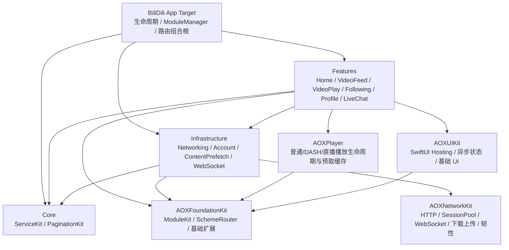

# BiliDili 架构审计与落地修复路线

日期：2026-07-10
审计基线：`b09fa08`
范围：BiliDili 主仓及 AOXFoundationKit、AOXNetworkKit、AOXPlayer、AOXUIKit 四个本地子仓

## 1. 结论

BiliDili 已经具备可运行的模块化 iOS 客户端骨架：App Target 负责组合根，Feature 通过 ServiceKit、Router、Repository 与基础设施交互，本地 Package 承载通用能力。当前没有发现 Feature 反向进入 Core、Infrastructure 直接依赖 Feature、或 Feature 互相 import 的编译期越界。

本轮直播失败不是“服务端没有播放地址”，而是客户端把可恢复情况收窄成了单点失败：只使用首个 CDN、首帧预算过短、失败时重复同一个 URL、把 FLV 误交给 AVPlayer，并且在播放前把账号 Cookie 扩散到 CDN。真实模拟器验证中，首 CDN 确实出现首帧超时；修复后的客户端自动切换下一镜像并成功输出画面，证明多线路恢复是必要路径，而不是理论优化。

截至 2026-07-11，两轮提交与最终竞态审查已经覆盖直播 HLS 候选与并行加载、弹幕认证状态/deadline、WebSocket 真握手与有界背压、Cookie/CSRF 边界、账号会话自然过期、分页游标、播放/预取生命周期、网络去重/缓存/熔断分类、路由冷启动和测试入口。后续增量又落地了可回滚 Keychain 迁移与 WebKit 隔离、DASH 双流音频、AOXNetworkKit 下载/指标状态机、RFC 3986 WBI、Account 依赖反转、App Target Swift 6 complete、Package CI/锁文件和长期架构文档收口。

最终本机门禁已经完成：`BiliDili-Package` 125 passed / 1 skipped / 0 failed，唯一 skip 是 SwiftPM 测试宿主缺少 App Keychain entitlement；Debug 与 Release shared App scheme 均构建通过。覆盖安装到已登录的 iPhone 17 Pro 模拟器后，持久会话被激活、`fetchUserInfo` 成功、推荐 Feed 正常，预加载器在模块注册期完成注入并实际发起 `/x/player/playurl`。仍不能声称通过的是尚未 push 后的 GitHub-hosted CI、远端递归 clean clone，以及 Alembic 自身损坏的 Guard 数据库。

## 2. 当前真实架构

### 主仓职责

| 区域 | 真实职责 | 边界判断 |
|---|---|---|
| `BiliDili/` | App 生命周期、模块注册、路由和导航容器、环境配置 | 正确作为 composition root；不应下沉业务实现 |
| `Sources/Core/ServiceKit` | Cookie、身份、网络状态、账号失效等跨模块协议 | 方向正确；应继续避免引用具体 Infrastructure 类型 |
| `Sources/Core/PaginationKit` | 通用分页状态机 | 合理独立；本轮修复了状态快照与代次竞态 |
| `Sources/Infrastructure/Networking` | B 站 Endpoint、DTO、Repository、签名、认证中间件 | 当前承载较多 DTO 与业务接口；中期需拆清远端 DTO 和领域模型 |
| `Sources/Infrastructure/Account` | Keychain Cookie、用户会话、账号领域模型和资料恢复 | 已移除 Networking DTO 依赖；App 组合根注入远端 fetcher 并映射 AccountUser |
| `Sources/Infrastructure/WebSocket` | AOXNetworkKit WebSocket 到业务协议的适配 | 真握手由 AOXNetworkKit delegate 确认；适配层以 generation 隔离旧连接，业务 auth/heartbeat 仍留在 LiveChat |
| `Sources/Features/**` | SwiftUI 页面/Store、稳定 ViewController 路由外壳和 Feature 内业务编排 | 未发现横向 import；直播页面只桥接 AOXPlayer LiveStreamPlayerView，不再自行持有 AVPlayer 生命周期 |

### 子仓职责与现状

| 子仓 | 定位 | 本轮结果 | 后续重点 |
|---|---|---|---|
| AOXFoundationKit | ModuleKit、ServiceRegistry、SchemeRouter 和基础能力 | 路由 push/present 返回真实结果；递归及日志脱敏 | ServiceRegistry 的 `@unchecked Sendable` 与生命周期约束 |
| AOXNetworkKit | 通用传输、SessionPool、重试、监控、WebSocket、上传下载 | WebSocket 真握手/结构化 close、有界缓冲；DownloadTask 多 waiter/暂停恢复/终态；cache/dedup/circuit/retry 与单次指标修复 | 本地 RFC6455 与更完整 URLProtocol 集成矩阵 |
| AOXPlayer | 普通/DASH/直播播放、分段、AVPlayer 生命周期 | AVPlayerItem/KVO/seek/retry generation；DASH 双轨合成；LiveStreamPlayerView 统一候选/首帧/换源；预取 TTL/LRU/取消和 cid 身份 | 已登录真实 CDN、前后台/音频中断和弱网回归 |
| AOXUIKit | SwiftUI Hosting、异步状态、设计 token、UIKit 基础组件 | Feature 保留稳定 ViewController 路由名称；新增 Dynamic Type/VoiceOver 语义辅助和回归测试 | 真实 VoiceOver 焦点顺序与大字号截断检查 |

## 3. 已验证问题与本轮修复

### P1：直播播放源单点

原实现只读取每个 codec 的第一条 `url_info`，HLS 不可用时还会回退 FLV；AVPlayer 失败后只重试同一 URL。修复后：

- 只从 `http_hls` 构造候选，不再把 FLV 混入 AVPlayer 路径。
- 展开全部 CDN 镜像，按 TS AVC、fMP4 AVC、其他 HLS 的兼容优先级排序并去重。
- 每条线路等待 15 秒，只以 `AVPlayerLayer.readyForDisplay` 作为像素首帧成功；`timeControlStatus` 仅辅助判断传输/缓冲，失败或超时后有界切下一镜像。
- generation 隔离旧 KVO 和 timeout，页面退出或换源后迟到回调不能污染新播放器。
- 候选耗尽显示可点击重试，重新获取短期签名，而不是复用过期 URL。
- 日志只记录质量、封装、编码、镜像和 host，不记录签名 query。

运行证据：已登录模拟器中，第一镜像首帧超时后自动切换第二镜像；再次进入同一房间时第一镜像成功输出真实直播画面。

### P1：账号 Cookie 越界与共享存储污染

原实现用 `domain.contains("bilibili.com")` 保存 Web Cookie，并把完整登录 Cookie 克隆到直播 host、`.bilivideo.com` 和共享 `HTTPCookieStorage`；Bili HTTP Session 也会隐式使用系统共享 CookieStorage。

修复后：

- 登录只接受 `bilibili.com` 根域和严格 `.bilibili.com` 后缀，拒绝 `bilibili.com.evil.example`。
- AuthMiddleware 只向 HTTPS 的 Bilibili 根域/真实子域注入凭证。
- HLS 和弹幕 WebSocket 不再携带或克隆账号 Cookie；HLS 使用签名 URL、UA 和 Referer。
- SessionPool 新增兼容默认值的 CookieStorage 策略；Bili 专用会话选择 `.disabled`，bare、delegate 和 Alamofire Session 保持一致。
- 启动与登出会清理旧版本遗留在 Bilibili/Bilivideo/Acgvideo 域的认证 Cookie 副本。

2026-07-11 增量已完成：认证 Cookie 改存 `kSecAttrAccessibleAfterFirstUnlockThisDeviceOnly` Keychain；旧 UserDefaults 数据采用“Keychain 写入成功才删除明文”的可回滚迁移，写入失败不会发布假登录成功。登录 WebView 使用专用持久 store 并限制 HTTPS Bilibili 主框架，普通 Web 页面使用 non-persistent store；登出清理安全存储、旧明文、共享 Cookie 和 WebKit 认证状态。Cookie 安全存储测试 15 passed / 1 entitlement-only skipped，AccountManager 7/7、Profile 6/6；App entitlement 下覆盖安装保留了真实登录态，冷启动恢复与用户资料加载成功。

### P1：弹幕“假连接”和无限重连

原底层 WebSocket 把 task `resume()` 过早视作传输 connected；原 LiveChatService 又在此时清零重连预算并启动心跳，导致坏 token 或握手异常可能永久重连。

本轮在业务层完成止血：

- 传输 connected 后只发送 auth packet。
- 仅 auth reply `code == 0` 后进入业务 connected、清零重试预算并启动心跳。
- 认证包发出后安装按 connection generation 隔离的 deadline；服务端不回 auth reply 时主动断开并进入既有有界重连，成功、拒绝、断开和换代都会撤销旧 deadline。
- 认证拒绝停止复用同一 token 重连，等待上层重新拉取 danmu info。
- danmu info 失败作为播放的可降级错误，不再拿空 token 建立必失败连接。
- 重试加载用 Task cancellation + generation，旧请求不能覆盖新房间状态。

第二轮已经完成通用传输层收口：

- `URLSessionWebSocketDelegate.didOpen/didClose` 驱动握手和关闭；`connect()` 只在真握手后返回。
- connect/reconnect/receive/send/ping 全部校验 generation，旧 delegate 和迟到回调不能复活连接。
- 重连任务单一持有、可取消、有限预算；ping 与 handshake 都有独立 deadline。
- 每个 AsyncStream 订阅者使用默认 256 条 `bufferingNewest`，丢弃按 2 的幂次记录诊断，避免慢消费者形成无界内存。
- App 适配层在 receive Task 登记和快速握手并发时允许 `.connecting/.connected` 两种合法状态，避免“刚连接即自断”。

AOXNetworkKit 已加入本地 RFC6455 服务，覆盖真实 Upgrade、收发、服务端 close、慢消费者和重连状态；独立 Package 最终 27/27。系统 TLS 拒绝和真实公网服务仍属于发布环境验证，不再由纯状态机测试冒充。

### P1：账号会话状态分裂

- `-412` 风控码不再被误判为登录失效；只有明确的 `-101` 进入会话验证路径。
- ServiceKit 新增 `AccountSessionInvalidating`，Networking 只报告失效，App 组合根调用 Account 清理状态，保持依赖方向。
- `currentUser` 在 MainActor 发布，后台只读取加锁的 mid 快照。
- 登录/登出推进 session generation；旧 nav 响应不能在登出或新登录后写回“幽灵登录态”。
- 冷启动发现有效持久 Cookie 时即激活独立会话边沿并按 SESSDATA expiry 调度复核；即使 nav 离线失败，也会自然推进 revision、发布 `loggedOut` 并清除身份。
- Home 推荐请求使用会话代次门禁；登录/登出发生在请求途中时丢弃旧响应，并在同一任务收尾后强制补跑最新会话刷新。
- 账号和播放 URL 日志完成脱敏。

兼容通知仍有两套，后续应收口成一个 typed session state 流。

### P1：分页与 UI 终态竞态

- `PaginationController.state` 改为锁内复制的只读快照。
- refresh、loadMore、reset 使用 generation；旧任务不能覆盖新数据，也不能清除新任务的 loading 标记。
- Following 在 items 和 error 两条终态都结束 refresh header 与 load-more footer。
- Following 对“服务端仍有下一页、但本页没有视频卡片”的情况有界连续推进 offset；预算耗尽会保留已提交游标并提供从当前位置重试，避免列表因没有新 cell 而永久停止。

### P1：路由冷启动和虚假成功

- SceneDelegate 在 Coordinator 配置导航 provider 后消费冷启动 `connectionOptions.urlContexts`，热启动复用同一路径。
- 一次收到多个 URL 时全部分发。
- SchemeRouter 的 push/present 返回 Bool；所有页面 handler 在没有导航容器时返回 `.noNavigationController`。
- 外部路由日志只记录 module/action 与稳定错误分类；backup、next、无效 URL 不记录 query/fragment。

### P1：列表、详情与预取播放生命周期

- VideoFeed 与 Following 分离 `resolving/applied/failed` 身份并增加 generation；解析失败、快速切条或离页后，旧 AVPlayerItem 不能恢复出声。
- VideoPlay 主链只等待身份解析和播放源，详情/相关推荐并发作为可降级附属内容；SwiftUI task 取消且主源未发布时允许重新进入后加载。
- VideoPlay Store 持有可取消加载 Task 与页面 generation；重试后立即离页时，迟到播放源和附属内容都没有提交权，不能在隐藏页面自动播放。
- VideoPlayerView 对 item KVO、seek completion、首帧、周期进度和延迟重试同时校验 item 身份与 load generation。
- VideoURLPreloader 使用 TTL、LRU、有界条数、取消代次和诊断快照；缓存身份加入 cid，避免同一 BV 不同分 P 串源。
- ContentPrefetch 增加页面 owner token：旧页面的 disappear 只能取消自己的窗口，不能清除新页面刚建立的预取。

### P1：直播加载模块隔离

- `room_init` 得到真实房间号后，roomInfo、playInfo、danmuInfo 并发加载。
- 播放、资料、弹幕各自提交终态；资料或弹幕失败不再阻塞/覆盖播放，播放失败也不抹掉资料。
- 弹幕连接意图可早于 danmuInfo 返回；页面重现、重试和 service 替换均去重连接/断开。
- 重试撤销旧签名播放 URL，同时保留仍可用的旧弹幕 service；无效 realRoomID 在入口即拒绝。
- 2026-07-11 增量把直播 AVPlayer、AVPlayerLayer、KVO、首帧 deadline、候选切换和音频会话集中到 AOXPlayer `LiveStreamPlayerView`；LiveChat 只映射业务候选并通过 SwiftUI `UIViewRepresentable` 桥接宿主。

### P1/P2：网络请求身份与错误分类

- dedup key 包含完整 URL/host、请求正文指纹、签名位和响应类型，避免跨 host/泛型串 Task。
- CacheMiddleware 的请求策略只由真实 leader 注册，并由 `defer` 在成功、失败、取消路径统一清理；GET cache 读写使用同一 query URL。
- 熔断只统计明确的可用性故障；取消、4xx、业务错误和解码错误不消耗预算。
- RetryPolicy 独立遵守幂等方法和 retryLimit，并保留 408 等请求级重试语义，不再复用熔断分类。
- CSRF 按 form/JSON/query 分支注入，不再把 `&csrf=` 拼到 JSON 后破坏正文。
- WBI query 使用 ASCII RFC 3986 unreserved 集合逐字节编码，不再依赖会放过额外字符的 `urlQueryAllowed`；签名 key 的日志只保留长度和稳定摘要。
- 并发 `-352` 使用 recovery epoch 合并同一旧签名失效波次，不再由后到错误取消先发重试正在进行的 nav key fetch。
- AsyncRxBridge 只在锁内认领订阅状态，任意 observer 回调均在锁外；跨线程 dispose 不会与 `onNext` 互锁，且仍抑制 completion/迟到终态。
- AOXNetworkKit DownloadTask 对多 waiter、pause/resume generation、显式取消和终态缓存进行统一状态管理；NetworkEventMonitor 通过对象身份 gate 保证一个逻辑 DataRequest 只记录一条最终指标。

## 4. 测试与验证基线

第一轮 `BiliDili-Package` 共 56 个 XCTest，覆盖主仓跨模块状态机；四个本地 Package 也各有独立测试入口：

- `PaginationKit/Following/Home`：refresh/loadMore 代次、服务端游标终态、推荐/feed 分流与预取阈值。
- `Networking/Account`：HLS 候选、认证域、JSON/form CSRF、session 代次、cache/dedup/circuit/retry 分类。
- `VideoFeed/Following/VideoPlay/AOXPlayer`：旧媒体拒绝、详情两阶段加载、分 P 预取身份、TTL/LRU/取消。
- `LiveChat/WebSocket`：auth/heartbeat、直播三路并发与部分失败、握手 gate、close 合并、有界消息流。
- AOXFoundationKit 独立测试 NetworkMonitor start/stop generation；AOXNetworkKit 覆盖 WebSocket/Download/指标状态机；AOXPlayer 覆盖 item generation、DASH 与直播；AOXUIKit 覆盖无障碍纯函数策略。

验证门：

1. BiliDili shared scheme 在 iOS Simulator 完整构建。
2. `BiliDili-Package` scheme 运行全部 SwiftPM XCTest。
3. 已登录模拟器安装覆盖升级，确认数据未清除。
4. 深链进入真实直播间，确认首帧、线路切换、登录守卫和弹幕连接状态。
5. `git diff --check`、模块 import 扫描和 Alembic Guard。

最终证据：iPhone 17 Pro / iOS 26.4.1 模拟器上 `BiliDili-Package` 125 passed / 1 Keychain entitlement-only skipped / 0 failed；shared App scheme 的 Debug、Release 均构建通过。四个独立 Package 分别为 AOXFoundationKit 3/3、AOXNetworkKit 27/27、AOXPlayer 19/19、AOXUIKit 5/5。覆盖安装保留登录态；首页真实数据和推荐接口可见，播放源预取请求真实发出。直播修复阶段进入当前开播房间时，首线路 15 秒未出首帧后自动切换第二镜像并输出真实画面；弹幕凭证请求失败时仅弹幕降级，播放未被阻塞。

## 5. 2026-07-11 推进与验证快照

### 已落地且有定向验证

| 范围 | 已落地行为 | 已发生验证 |
|---|---|---|
| 两轮五仓提交 | 主仓 SwiftUI/可靠性收口与四个 Package 生命周期修复 | 第二轮最终提交：Foundation `f3ada9f`、Network `a664537`、Player `44cd424`、UIKit `b8e15c8`、主仓 `25b1279` |
| AOXPlayer / LiveChat | DASH 视频/音频轨合成、直播候选/首帧/换源下沉、取消代次与 AVPlayerItem 接入 | DASH 阶段 Package 10/10，LiveStream 状态 4/4，独立 build/analyze 与 LiveChat target build 通过 |
| AOXNetworkKit | DownloadTask 多等待者/暂停恢复/取消/终态，WebSocket close 诊断与单次指标、本地 RFC6455 集成 | Package 27/27，独立 build 通过 |
| 账号与 WebKit | Keychain 回滚迁移、Cookie 域/URL 边界、自然过期、session generation/single-flight/typed stream、登录/普通 Web store 隔离 | Cookie 15 passed / 1 entitlement-only skipped；AccountManager 7/7；Profile 6/6；已登录覆盖安装恢复成功 |
| Following | 连续空视频页有界前进、保留游标重试、可见区域播放身份 | 定向 5/5 |
| WBI / AsyncRx | RFC 3986 canonical encoder、并发恢复 epoch、脱敏诊断与锁外 observer 投递 | 定向测试通过，随后纳入 125 项全量门禁 |
| AOXUIKit / 页面无障碍 | 语义字体、辅助字号单列布局、44pt 点击区、VoiceOver label/hint 与统一策略 | AOXUIKit 5/5；受影响 Feature 已完成编译，最终 App 链接以主线收口后的全量 build 为准 |
| 工程入口 | 主/子仓 README、Package manifests、5 份 CI、锁文件与共享 Package workspace | 5 个 `swift package dump-package` 通过；5 个 Xcode scheme 可发现；锁定解析参数可用；5 份 workflow YAML 解析通过 |

上表的定向数字来自不同测试入口，可能包含主 Package 中的重复用例，不能简单相加。第二轮全部合并后的最终口径是主 Package 125 passed / 1 skipped / 0 failed，以及四个独立 Package 的 3、27、19、5 项全通过。

### 最终本机复验已完成

- App Target Debug/Release 使用 Swift 6.0 complete concurrency；全部最新源码完成主 Package tests 与两种配置 shared scheme build。
- Account 的 `AccountUser` 与远端 fetcher 在组合根映射，import 扫描未发现 Core/Infrastructure 反向依赖 Feature；冷启动恢复在已登录模拟器成功。
- 全局 ATS 收窄为 `NSAllowsArbitraryLoadsForMedia`，HTTPS API 与媒体预取在模拟器可用；直播阶段已验证 HLS 镜像切换。
- 首页、全屏视频、关注、详情、作者、个人中心、评论、直播和 Web 页面均以 SwiftUI hosting 为主；最终首页截图确认共享顶部 tab、内容延伸至浮动底栏后的布局正常。
- README、`docs/Architecture.md`、`docs/LaunchFlow.md`、`CONTRIBUTING.md` 已与真实目录、四 Tab、10 条路由、NetworkClient/Repository 和 SwiftUI hosting 调用方对齐。

### 必须在外部或发布后环境验证

1. **GitHub-hosted CI**：workflow 固定 macOS 15 / Xcode 16.4、Swift 6、iPhone 16 Pro 和 locked resolution；本机只有另一套 Xcode，且本轮未获得 push 授权，因此尚未发生远端 Actions 运行。
2. **递归 clean clone**：五仓首轮 commit 当前均尚未发布到 origin，后续新 commit 也会先存在本地。必须先发布 AOXFoundationKit/AOXNetworkKit/AOXPlayer/AOXUIKit，再发布主仓 gitlink，之后从空目录运行 `git clone --recursive`；在此之前不能声称远端 clean clone 已通过。
3. **真实 Keychain 升级**：SwiftPM unsigned test host 无完整 App Keychain entitlement。需要保留旧版本登录态覆盖安装，确认迁移后重启仍登录，并确认登出后 Keychain、UserDefaults、共享 CookieStorage 和 WebKit 均无认证 Cookie。
4. **真实直播与弱网**：需要已登录、可联网模拟器验证 HTTP/HTTPS HLS、DASH 音频、首帧、线路/画质切换、前后台和弹幕服务端 close；单元测试不证明 CDN 与系统媒体栈行为。
5. **并发诊断**：Thread Sanitizer 与长时间快速进出/内存压力回归尚未形成最终证据；若工具链与 Swift Concurrency 组合不支持某项诊断，必须记录具体限制而不是写成通过。
6. **Alembic Guard**：`alembic_status` 显示项目知识库 ready，但显式文件 Guard 连续两次返回 `database disk image is malformed`。按仓库边界没有在 BiliDili 内修 Alembic 产品状态；代码验收采用源码审查、125 项测试、双配置构建和模拟器证据，Guard 数据库需由 Alembic 运行时维护方修复后补跑。

## 6. 剩余风险与真实推进路线

### Wave 2：凭证与会话完整收口（P1，核心迁移已落地）

1. 已完成 Keychain 设备绑定存储与可回滚 `BDCookieStorage` 迁移。
2. 已完成登录/普通 Web data store 隔离和登录主框架域约束。
3. 已完成 Account、WK CookieStore、历史 HTTPCookieStorage 和用户快照清理。
4. 已新增 `AccountSessionEventProviding` 有界 typed AsyncStream，Home/Profile/AppCoordinator 不再依赖字符串通知；兼容通知暂保留给外部调用方。仍需补服务端撤销、离线、风控、重复登录和快速登出再登录的 App 级回归。

验收：升级不丢登录；登出后四类存储均无认证 Cookie；伪域无法固定会话；无凭证请求不会被误登出。

### Wave 3：WebSocket 集成收口（核心已完成，保留外部环境项）

1. 已增加本地 RFC6455 测试服务，覆盖 Upgrade、服务端 close、慢消费者和重连预算；系统 TLS 拒绝保留给外部网络环境。
2. 直播音频 session 已随播放器下沉到 AOXPlayer，移除了页面静态 `nonisolated(unsafe)` 标志；DanmakuDisplayHelper 也改为 MainActor 值快照，不再把非 Sendable Relay 伪装成 unsafe 后跨线程写入。
3. 通用 transport close code/reason 已显式桥接到 App 事件；本地服务已证明 close 与重连预算，真实公网 TLS/代理差异仍需发布环境观察。

验收：DNS 失败、TLS 拒绝、Upgrade 403、无效 token、服务端 close、快速进出 100 次均为有限重试且内存有界。

### Wave 4：网络韧性与公共 Package（P1/P2，状态机已落地）

1. 已完成 AOXNetworkKit DownloadTask 多 waiter、pause/resume generation、终态缓存和取消传播。
2. 已完成 canonical request identity、cache query、dedup 泛型冲突、pending policy 清理和 circuit/retry 分类；真实 URLProtocol/本地服务矩阵仍需扩充。
3. 已完成 WBI RFC 3986 canonical encoder 与 CSRF form/json/query 边界。
4. 已完成 NetworkEventMonitor 一次逻辑请求只记一条最终指标。

验收：URLProtocol/本地服务覆盖 timeout、503、429、取消、重复读取、暂停恢复和不同 Response 类型。

### Wave 5：模块边界与 Swift 6（P2，源码迁移已落地）

1. 已完成 Account 领域用户模型/远端 fetcher，由 App 组合根注入 Networking 实现并移除 Account → Networking DTO 依赖。
2. DASH 双轨已回收到 AOXPlayer；直播候选、首帧、换源和 AVPlayer 生命周期的最终下沉以本轮合并结果与 build 为准。
3. App Target 已升到 Swift 6 complete；最终 Debug/Release build 已在源码稳定后通过，未使用命令行覆盖冒充迁移。
4. 四个本地 Package 已增加独立 CI；有远端依赖的三个 Package 提交锁文件，AOXPlayer/AOXUIKit 的 sibling AOXFoundationKit workflow ref 显式固定。

验收：Debug/Release effective settings 均为预期；全量 Simulator build、测试和 Thread Sanitizer 回归通过；依赖图无反向边。

### Wave 6：产品与工程质量（P2，工程文档与 ATS 已落地）

- 已收口 README、长期 Architecture/LaunchFlow/CONTRIBUTING 中的旧 BD* 路径、四 Tab、10 条真实路由与 SwiftUI hosting 文档。
- README 已明确递归拉取子模块；CI 校验 submodule revision、Swift/Xcode 基线和 locked Package resolution。
- 直播已增加 qn 有界降级和候选耗尽后的自动刷新预算，并以 `AVPlayerLayer.readyForDisplay` 作为首帧门；真实 CDN/弱网行为待模拟器复验。
- 全局 ATS 任意放开已收窄为媒体加载例外；真实 HTTP HLS 与 API/WebKit 隔离仍需模拟器回归。
- 增加无障碍标签、Dynamic Type、弱网/离线/前后台/音频中断/内存压力回归。

## 7. 决策边界

- 本轮没有删除、空壳化或降级任何产品能力。
- 没有把 BiliDili 代码移入 Alembic 产品仓库，也没有改变 Core → Infrastructure → Feature 的依赖方向。
- Keychain、ATS、Swift 6、Account 依赖反转和 AOXPlayer 直播重构属于独立迁移，必须分别带兼容策略、测试和回滚点推进。
- Alembic ProjectContext 对部分 SwiftPM 关系仍为 partial；架构结论以 Package.swift、Xcode effective settings、源码调用链、构建和真实运行证据为准。
