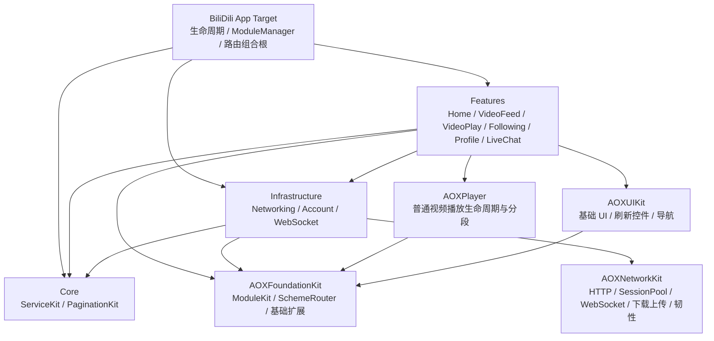

# BiliDili 架构审计与落地修复路线

日期：2026-07-10
审计基线：`b09fa08`
范围：BiliDili 主仓及 AOXFoundationKit、AOXNetworkKit、AOXPlayer、AOXUIKit 四个本地子仓

## 1. 结论

BiliDili 已经具备可运行的模块化 iOS 客户端骨架：App Target 负责组合根，Feature 通过 ServiceKit、Router、Repository 与基础设施交互，本地 Package 承载通用能力。当前没有发现 Feature 反向进入 Core、Infrastructure 直接依赖 Feature、或 Feature 互相 import 的编译期越界。

本轮直播失败不是“服务端没有播放地址”，而是客户端把可恢复情况收窄成了单点失败：只使用首个 CDN、首帧预算过短、失败时重复同一个 URL、把 FLV 误交给 AVPlayer，并且在播放前把账号 Cookie 扩散到 CDN。真实模拟器验证中，首 CDN 确实出现首帧超时；修复后的客户端自动切换下一镜像并成功输出画面，证明多线路恢复是必要路径，而不是理论优化。

第一批已落地修复覆盖直播 HLS 候选、弹幕认证状态、Cookie 边界、账号会话竞态、分页竞态、路由冷启动、依赖声明和测试入口。剩余高风险项主要集中在 Keychain 迁移、WebSocket 真握手、Swift 6 App Target 收口、AOXNetworkKit 下载/缓存状态机和 Account 依赖反转，不能用一次大改混在直播热修中完成。

## 2. 当前真实架构

### 主仓职责

| 区域 | 真实职责 | 边界判断 |
|---|---|---|
| `BiliDili/` | App 生命周期、模块注册、路由和导航容器、环境配置 | 正确作为 composition root；不应下沉业务实现 |
| `Sources/Core/ServiceKit` | Cookie、身份、网络状态、账号失效等跨模块协议 | 方向正确；应继续避免引用具体 Infrastructure 类型 |
| `Sources/Core/PaginationKit` | 通用分页状态机 | 合理独立；本轮修复了状态快照与代次竞态 |
| `Sources/Infrastructure/Networking` | B 站 Endpoint、DTO、Repository、签名、认证中间件 | 当前承载较多 DTO 与业务接口；中期需拆清远端 DTO 和领域模型 |
| `Sources/Infrastructure/Account` | Cookie 持久化、用户会话和资料恢复 | 目前仍依赖 Networking.UserInfo，是待反转边界 |
| `Sources/Infrastructure/WebSocket` | AOXNetworkKit WebSocket 到业务协议的适配 | 方向正确；真握手、背压和 actor 隔离仍未完成 |
| `Sources/Features/**` | 页面、ViewModel、Feature 内业务编排 | 未发现横向 import；LiveChat 仍直接持有 AVPlayer，是已知架构债务 |

### 子仓职责与现状

| 子仓 | 定位 | 本轮结果 | 后续重点 |
|---|---|---|---|
| AOXFoundationKit | ModuleKit、ServiceRegistry、SchemeRouter 和基础能力 | 路由 push/present 返回真实结果；递归及日志脱敏 | ServiceRegistry 的 `@unchecked Sendable` 与生命周期约束 |
| AOXNetworkKit | 通用传输、SessionPool、重试、监控、WebSocket、上传下载 | 增加统一 CookieStorage 策略，Bili 会话可显式禁用共享 Cookie；日志脱敏 | WebSocket didOpen 真握手、DownloadTask、cache/dedup/circuit 状态机 |
| AOXPlayer | 普通视频播放、分段、AVPlayer 生命周期 | 本轮未改，普通视频继续走既有封装 | 将直播播放状态机逐步回收，避免页面控制器长期持有播放细节 |
| AOXUIKit | Base UI、导航、刷新控件等 | 本轮未改；调用侧补齐刷新/加载更多终态 | 可访问性、Dynamic Type、通用错误态组件 |

## 3. 已验证问题与本轮修复

### P1：直播播放源单点

原实现只读取每个 codec 的第一条 `url_info`，HLS 不可用时还会回退 FLV；AVPlayer 失败后只重试同一 URL。修复后：

- 只从 `http_hls` 构造候选，不再把 FLV 混入 AVPlayer 路径。
- 展开全部 CDN 镜像，按 TS AVC、fMP4 AVC、其他 HLS 的兼容优先级排序并去重。
- 每条线路等待 15 秒，以真正进入 `.playing` 作为首帧成功；失败或超时后有界切下一镜像。
- generation 隔离旧 KVO 和 timeout，页面退出或换源后迟到回调不能污染新播放器。
- 候选耗尽显示可点击重试，重新获取短期签名，而不是复用过期 URL。
- 日志只记录质量、封装、编码、镜像和 host，不记录签名 query。

运行证据：已登录模拟器中，第一镜像首帧超时后自动切换第二镜像；再次进入同一房间时第一镜像成功输出真实直播画面。

### P1：账号 Cookie 越界与共享存储污染

原实现用 `domain.contains("bilibili.com")` 保存 Web Cookie，并把完整登录 Cookie 克隆到直播 host、`.bilivideo.com` 和共享 `HTTPCookieStorage`；Bili HTTP Session 也会隐式使用系统共享 CookieStorage。

修复后：

- 登录只接受 `bilibili.com` 根域和严格 `.bilibili.com` 后缀，拒绝 `bilibili.com.evil.example`。
- AuthMiddleware 只向 HTTPS 的 Bilibili 根域/真实子域注入凭证。
- HLS 和弹幕 WebSocket 不再携带或克隆账号 Cookie；HLS 使用签名 URL、UA 和 Referer。
- SessionPool 新增兼容默认值的 CookieStorage 策略；Bili 专用会话选择 `.disabled`，bare、delegate 和 Alamofire Session 保持一致。
- 启动与登出会清理旧版本遗留在 Bilibili/Bilivideo/Acgvideo 域的认证 Cookie 副本。

尚未完成：Cookie 仍以 UserDefaults 持久化；必须单独做可回滚 Keychain 迁移，不能在没有登录恢复测试的情况下直接替换。

### P1：弹幕“假连接”和无限重连

底层 WebSocket 仍把 task `resume()` 过早视作传输 connected；原 LiveChatService 又在此时清零重连预算并启动心跳，导致坏 token 或握手异常可能永久重连。

本轮在业务层完成止血：

- 传输 connected 后只发送 auth packet。
- 仅 auth reply `code == 0` 后进入业务 connected、清零重试预算并启动心跳。
- 认证拒绝停止复用同一 token 重连，等待上层重新拉取 danmu info。
- danmu info 失败作为播放的可降级错误，不再拿空 token 建立必失败连接。
- 重试加载用 Task cancellation + generation，旧请求不能覆盖新房间状态。

尚未完成：AOXNetworkKit 需要基于 `URLSessionWebSocketDelegate.didOpen/didClose` 实现真实传输握手、超时、背压和单一重连所有权。

### P1：账号会话状态分裂

- `-412` 风控码不再被误判为登录失效；只有明确的 `-101` 进入会话验证路径。
- ServiceKit 新增 `AccountSessionInvalidating`，Networking 只报告失效，App 组合根调用 Account 清理状态，保持依赖方向。
- `currentUser` 在 MainActor 发布，后台只读取加锁的 mid 快照。
- 登录/登出推进 session generation；旧 nav 响应不能在登出或新登录后写回“幽灵登录态”。
- 账号和播放 URL 日志完成脱敏。

兼容通知仍有两套，后续应收口成一个 typed session state 流。

### P1：分页与 UI 终态竞态

- `PaginationController.state` 改为锁内复制的只读快照。
- refresh、loadMore、reset 使用 generation；旧任务不能覆盖新数据，也不能清除新任务的 loading 标记。
- Following 在 items 和 error 两条终态都结束 refresh header 与 load-more footer。

### P1：路由冷启动和虚假成功

- SceneDelegate 在 Coordinator 配置导航 provider 后消费冷启动 `connectionOptions.urlContexts`，热启动复用同一路径。
- 一次收到多个 URL 时全部分发。
- SchemeRouter 的 push/present 返回 Bool；所有页面 handler 在没有导航容器时返回 `.noNavigationController`。
- 外部路由日志只记录 module/action 与稳定错误分类；backup、next、无效 URL 不记录 query/fragment。

## 4. 测试与验证基线

本轮新增四个 SwiftPM 测试目标，最终共 14 个 XCTest：

- `PaginationKitTests`：旧 refresh、reset、loadMore 与新 generation 的交错完成顺序。
- `NetworkingTests`：HLS 镜像展开、排序、FLV 排除、畸形 URL、签名连接符、认证域边界、SessionPool CookieStorage 策略。
- `AccountTests`：Bilibili Cookie 域白名单与伪后缀拒绝。
- `LiveChatTests`：auth 前不启动心跳、auth 成功后的状态、认证拒绝后不复用旧 token 重连、WS 请求无 Cookie。

验证门：

1. BiliDili shared scheme 在 iOS Simulator 完整构建。
2. `BiliDili-Package` scheme 运行全部 SwiftPM XCTest。
3. 已登录模拟器安装覆盖升级，确认数据未清除。
4. 深链进入真实直播间，确认首帧、线路切换、登录守卫和弹幕连接状态。
5. `git diff --check`、模块 import 扫描和 Alembic Guard。

## 5. 剩余风险与真实推进路线

### Wave 2：凭证与会话完整收口（P1）

1. 新建 Keychain 存储，使用设备绑定的可访问级别；从 `BDCookieStorage` 一次性迁移，迁移成功后删除明文副本。
2. 登录 WebView 使用隔离 data store；普通 Web 页面不能复用登录容器。
3. 登出同时清理 Account、WK CookieStore、历史 HTTPCookieStorage 和用户快照。
4. 合并旧/新登录通知为一个 typed session state；覆盖服务端撤销、离线、风控、重复登录和快速登出再登录。

验收：升级不丢登录；登出后四类存储均无认证 Cookie；伪域无法固定会话；无凭证请求不会被误登出。

### Wave 3：WebSocket 与并发状态机（P1）

1. AOXNetworkKit 使用 delegate didOpen/didClose，建立可取消、可超时的真实握手。
2. 传输 open、业务 auth、heartbeat、reconnect 分层建模；只保留一层重连所有权。
3. WebSocket adapter、HeartbeatScheduler 和 LiveChatService 收口到 actor/generation，删除 `nonisolated(unsafe)`。
4. AsyncStream 使用有界 `bufferingNewest` 并记录丢弃计数；UI/Rx 投递统一 MainActor。

验收：DNS 失败、TLS 拒绝、Upgrade 403、无效 token、服务端 close、快速进出 100 次均为有限重试且内存有界。

### Wave 4：网络韧性与公共 Package（P1/P2）

1. 修复 AOXNetworkKit DownloadTask 多 waiter、pause/resume generation、终态缓存和取消传播。
2. 统一 canonical request identity，修复 cache query、dedup 泛型冲突、pending policy 清理和 circuit error 分类。
3. WBI 使用 RFC 3986 canonical encoder；CSRF 只在明确的 form/json schema 层注入。
4. NetworkEventMonitor 一次逻辑请求只记一条最终指标。

验收：URLProtocol/本地服务覆盖 timeout、503、429、取消、重复读取、暂停恢复和不同 Response 类型。

### Wave 5：模块边界与 Swift 6（P2）

1. Account 定义领域用户模型和 RemoteDataSource 协议，由 App 组合根注入 Networking 实现，移除 Account → Networking DTO 依赖。
2. 将直播播放器候选、首帧、换源和 AVPlayer 生命周期回收到 AOXPlayer 或明确的 LivePlayback 模块。
3. 修复 unchecked/unsafe 并发点后，把 App Target 从 Swift 5 effective setting 升到 Swift 6 complete；不能用命令行全局覆盖第三方依赖来冒充迁移验证。
4. 为各本地 Package 增加独立测试和 CI 门，补齐 lockfile/依赖可复现策略。

验收：Debug/Release effective settings 均为预期；全量 Simulator build、测试和 Thread Sanitizer 回归通过；依赖图无反向边。

### Wave 6：产品与工程质量（P2）

- 收口 README、旧 BD* 命名、四 Tab 与真实路由文档。
- README 明确递归拉取子模块；CI 校验 submodule revision 和 Package resolution。
- 直播增加画质降级和候选耗尽后的自动刷新预算，并以 `AVPlayerLayer.readyForDisplay` 补充像素级首帧指标。
- 移除全局 ATS 放开前先盘点真实 HTTP HLS；若服务端仍只给 HTTP，改为最小域例外，不能直接删除导致直播回归。
- 增加无障碍标签、Dynamic Type、弱网/离线/前后台/音频中断/内存压力回归。

## 6. 决策边界

- 本轮没有删除、空壳化或降级任何产品能力。
- 没有把 BiliDili 代码移入 Alembic 产品仓库，也没有改变 Core → Infrastructure → Feature 的依赖方向。
- Keychain、ATS、Swift 6、Account 依赖反转和 AOXPlayer 直播重构属于独立迁移，必须分别带兼容策略、测试和回滚点推进。
- Alembic ProjectContext 对部分 SwiftPM 关系仍为 partial；架构结论以 Package.swift、Xcode effective settings、源码调用链、构建和真实运行证据为准。
