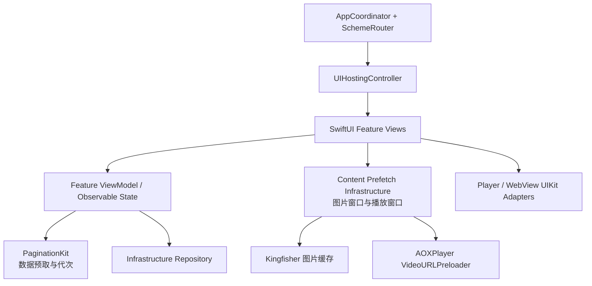

# BiliDili 视频预取与 SwiftUI 迁移需求

日期：2026-07-10
状态：已完成（Alembic Guard 外部服务传输降级，见执行记录）
适用范围：BiliDili 主仓、AOXPlayer、AOXUIKit，以及相关 SwiftPM 测试目标

## 1. 背景与现状

BiliDili 当前以 UIKit + RxSwift 的 MVVM 页面为主，App 通过 `AppCoordinator`、`ModuleManager` 和 `SchemeRouter` 组合各 Feature。播放器生命周期集中在 AOXPlayer，账号、网络和 WebSocket 位于 Infrastructure，分页状态位于 PaginationKit。

现有实现并非从零开始：

- VideoFeed 已调用 AOXPlayer 的 `VideoURLPreloader`，但预加载窗口、取消、资源预算、指标和图片预取仍分散在页面控制器。
- Home、Following 和 Author 已有临近底部加载更多，但触发条件由各页面分别判断，没有统一的分页预取语义。
- Profile、Author 已使用 SwiftUI + `UIHostingController`；Home、VideoFeed、Following、VideoPlay、CommentList、LiveChat、LiveRoom 仍以 UIKit 视图树为主。
- WebLogin 和视频/直播播放器依赖 `WKWebView`、`AVPlayerLayer` 等 UIKit/AVFoundation 能力，可以作为 SwiftUI 的受控适配器继续存在。

本需求不是建立空壳或视觉演示，而是在保持真实接口、登录态、路由、分页、播放、弹幕和错误语义的前提下，把预取做成可复用基础设施，并完成用户可见页面的 SwiftUI 组合迁移。

## 2. 目标

### 2.1 视频内容三级预取

1. 列表数据：在接近当前页尾部时提前加载下一页，复用 PaginationKit 的代次、去重和取消边界。
2. 展示资源：按可见位置预取封面和头像，离开窗口、内存警告或策略降级时取消无效任务。
3. 播放资源：继续由 AOXPlayer 预取完整播放源，支持去重、过期、取消、窗口收缩和可观测快照。

### 2.2 前端页面 SwiftUI 化

所有用户可见页面的布局、加载态、空态、错误态、交互入口和可访问性语义由 SwiftUI View 表达。AppCoordinator、SchemeRouter 和 UINavigationController 可以继续作为应用导航外壳。

允许保留的 UIKit 适配器仅限：

- AOXPlayer 的播放器视图与 AVPlayerLayer。
- 直播播放器的 AVPlayerLayer，迁移后应由明确的播放适配器持有。
- WKWebView 登录/通用网页容器。
- 系统分享、系统 sheet 和 UIKit 导航桥。

不接受以 `UIViewControllerRepresentable` 包裹整个旧页面来宣称迁移完成；适配器必须收敛到播放器、WebView 或系统能力边界。

## 3. 非目标

- 不删除或降级首页、视频流、详情、关注、个人页、直播、弹幕、登录和路由能力。
- 不在本需求中重写 B 站 API、账号存储、WebSocket 协议或 AOXNetworkKit 网络栈。
- 不实现 HLS/DASH 分片磁盘离线缓存；播放预取以短时播放源和播放器准备为边界。
- 不把 Feature 业务状态迁入 SwiftUI View 的局部控件状态；View 只持有短生命周期展示状态。
- 不把 Feature 互相直接依赖，跨 Feature 导航继续使用 SchemeRouter 或服务协议。

## 4. 架构与模块边界

依赖方向必须保持：

- Feature → Infrastructure / Core / Packages。
- Infrastructure → Core / Packages。
- Core 不依赖 Infrastructure、Feature、UIKit 或具体业务模型。
- 播放 URL、缓存和 AVPlayer 生命周期留在 AOXPlayer 或明确的播放适配层。
- 图片预取不得引入 AOXPlayer → Kingfisher 或 AOXPlayer → Feature 的反向依赖。

## 5. 功能需求

### 5.1 列表数据预取

- `PF-DATA-01` PaginationKit 提供纯状态判断 API，根据当前已展示下标和配置阈值判断是否应预取下一页。
- `PF-DATA-02` refresh、loadMore、reset 继续使用 generation，旧结果不能覆盖新页面状态。
- `PF-DATA-03` 同一页最多存在一个 loadMore；无更多数据、刷新中或加载中时必须短路并记录可诊断原因。
- `PF-DATA-04` Home 每个分类保留独立分页状态；切换分类不能取消其他分类已经成功的数据。
- `PF-DATA-05` SwiftUI `onAppear` 可能重复触发，ViewModel 必须去重，不能依赖 View 恰好只出现一次。

默认阈值：Home 4 项、Following 6 项、VideoFeed 3 项、Author 6 项。阈值必须在分页配置中声明，不能散落为页面魔数。

### 5.2 图片预取

- `PF-IMAGE-01` 根据当前焦点建立有界窗口；普通双列列表预取后续 8 项，视频流预取前 1 项和后 2 项。
- `PF-IMAGE-02` 预取封面与头像使用与真实 View 相同的 BiliImageURL 缩略图规格，避免预取原图而展示缩略图造成双份缓存。
- `PF-IMAGE-03` 窗口变化时停止不再需要的图片预取任务，但不主动清空 Kingfisher 已完成缓存。
- `PF-IMAGE-04` 内存警告、进入后台、低数据策略或不可达网络下停止新增图片预取。
- `PF-IMAGE-05` 图片预取失败不能阻止列表数据展示或播放，只记录 host、资源种类和终态，不记录签名 query。

### 5.3 播放源预取

- `PF-PLAY-01` AOXPlayer 继续通过 `PlaybackSourceFetching` 获取 `PreloadedPlaybackSource`，不得依赖 Networking DTO。
- `PF-PLAY-02` 默认播放窗口为前 1 项、后 2 项；当前项由播放链路实时获取或命中缓存，不重复发起相同请求。
- `PF-PLAY-03` 相同视频播放源请求必须去重；窗口收缩、页面退出、登出或内存警告时可以取消未完成任务。
- `PF-PLAY-04` 已取消或已被新代次取代的请求即使迟到完成，也不能写入缓存。
- `PF-PLAY-05` 缓存保留 TTL、最大条数和确定性淘汰；命中时更新最近使用顺序。
- `PF-PLAY-06` 暴露只读快照：缓存数、在途数、命中、未命中、成功、失败、取消、淘汰和过期计数。
- `PF-PLAY-07` 直播地址不进入点播播放源预取器，继续使用直播候选线路和短期签名刷新状态机。

默认预算：播放源缓存 12 条、TTL 30 分钟、预取窗口最多 3 条。策略可以由宿主配置，但页面不能自行扩大为无界请求。

## 6. SwiftUI 页面需求

| 页面 | 当前基线 | 完成定义 |
| --- | --- | --- |
| Profile | 已是 SwiftUI | 接入统一设计 token、状态容器与可访问性 |
| Author | 已是 SwiftUI | 接入统一分页预取、图片预取和错误态 |
| Home | UIKit | 分类切换、双列卡片、刷新、加载更多、骨架/空态全部 SwiftUI |
| Following | UIKit | 既有通栏列表、刷新、加载更多、登录状态和预取全部 SwiftUI |
| VideoFeed | UIKit | 全屏分页、播放容器、封面、操作栏、分享/评论/作者入口全部 SwiftUI；播放器仅作为适配器 |
| VideoPlay | UIKit | 播放器、视频信息、作者、简介、相关推荐和评论入口由 SwiftUI 组合 |
| CommentList | UIKit | 既有只读一级评论列表、分页、加载/错误/空态由 SwiftUI 组合；不在迁移中新增写操作或楼中楼交互 |
| LiveChat | UIKit | 弹幕列表、连接状态、重试和自动滚动由 SwiftUI 组合 |
| LiveRoom | UIKit | 直播播放器适配器、直播信息、弹幕、线路状态和重试由 SwiftUI 组合 |
| WebLogin/Web | UIKit | 页面外壳、加载/错误/完成状态由 SwiftUI 组合，WKWebView 保留适配器 |

通用要求：

- `UI-SWIFT-01` iOS 16 使用 `ObservableObject` / `@StateObject` / `@Published`；不依赖 iOS 17 Observation。
- `UI-SWIFT-02` ViewModel 和 UI 状态写入明确位于 MainActor；网络和解析异步执行。
- `UI-SWIFT-03` 既有 RxSwift ViewModel 可以在迁移阶段通过单一 Store 桥接，不允许每个子 View 单独订阅 Rx。
- `UI-SWIFT-04` 路由 URL、参数、登录守卫、push/present 语义和 Tab 顺序保持兼容。
- `UI-SWIFT-05` 所有列表具备加载、空、错误、重试和分页终态，不出现永久刷新指示。
- `UI-SWIFT-06` 支持 Dynamic Type、VoiceOver 标签、深色模式、安全区和旋转后的合理布局。
- `UI-SWIFT-07` 页面离开时取消页面拥有的 Task、订阅和预取窗口；共享播放器按既有规则暂停或迁移。

## 7. 分阶段交付

### Phase 0：需求、基线与门禁

- 新建本需求文档和页面迁移矩阵。
- 记录现有 SwiftUI 页面、预加载调用链、构建命令和登录模拟器环境。
- 建立每阶段 `git diff --check`、SwiftPM 测试、Xcode build、模块 import 扫描和 Alembic Guard 门禁。

### Phase 1：三级预取底座

- PaginationKit 增加预取判断与测试。
- AOXPlayer 完成任务取消、代次、LRU、快照和策略配置。
- 新增跨 Feature 的图片/播放窗口协调器及 App 组合根注册。
- Home、Following、VideoFeed、Author 接入统一入口，移除页面内重复窗口算法。

### Phase 2：SwiftUI 基础与低风险页面

- AOXUIKit 增加 SwiftUI 设计 token、通用加载/空/错误态和 Hosting 容器。
- 收口 Profile、Author。
- 迁移 Home、Following，并验证分页、图片预取、路由和登录态。

### Phase 3：点播页面

- 迁移 VideoPlay、CommentList。
- 迁移 VideoFeed，保持共享播放器、进度、首帧海报、快速滑动取消和页面返回恢复。

### Phase 4：直播与登录页面

- 迁移 LiveChat、LiveRoom 的 SwiftUI 组合，保留既有直播换源与弹幕认证状态机。
- 迁移 WebLogin/Web 页面外壳，保持 Cookie 域边界和登录成功回调。

### Phase 5：收口与验收

- 删除已无真实调用方的旧 UIKit 页面视图与 Cell；播放器/WebView 适配器除外。
- 完成模块隔离、并发、资源预算、错误终态和敏感日志扫描。
- 在保留登录数据的模拟器覆盖安装，逐页走通真实路由和播放流程。

## 8. 验收标准

### 自动化

1. BiliDili-Package 全量 XCTest 通过，至少覆盖分页预取阈值、重复触发、取消迟到、缓存 TTL/LRU 和策略降级。
2. BiliDili shared scheme 在可用 iOS Simulator 构建通过。
3. `git diff --check` 通过；Feature 无横向 import，Core 无反向依赖，Infrastructure 无 Feature 依赖。
4. Alembic Guard 对所有变更文件无阻断问题。

### 可见流程

1. Home 三分类可切换、刷新、预取下一页并打开视频或直播。
2. VideoFeed 快速连续滑动时只有当前视频播放，下一项能命中预取，返回页面遵守手动暂停意图。
3. Following、Profile、Author、VideoPlay、CommentList 路由和登录守卫行为不变。
4. LiveRoom 可播放、线路失败可恢复、弹幕认证后连接，退出页面无后台声音或无限重连。
5. WebLogin 登录成功后回到目标页面；普通 Web 页面不误触发登录完成。
6. 前后台、内存警告、断网恢复、空数据和接口错误均有有限终态。

### 质量指标

- 预取窗口有界，页面退出后在途播放源任务归零。
- 同一视频在同一代次只有一个播放源请求。
- 列表下一页不因重复 `onAppear` 被重复追加。
- 不新增包含 Cookie、token、完整播放签名 query 或设备标识的日志。
- SwiftUI 迁移后用户可见功能与现有版本等价或增强，不以删除功能换取迁移完成。

## 9. 回滚与兼容

- 每个 Phase 独立构建与验收，先接入新入口再删除旧实现。
- AppCoordinator 与 SchemeRouter 的公共类型名和路由保持稳定，避免跨 Phase 破坏 App Target。
- 预取策略可在宿主组合根关闭；关闭后回到按需加载，不影响正确性。
- SwiftUI 页面迁移中保留同名 ViewController 作为 Hosting 外壳，使现有路由无需一次性改写。
- 任何播放器或登录回归优先回退对应页面的 SwiftUI 组合改动，不回退已验证的 Cookie、直播线路和分页代次修复。

## 10. 执行记录

| 阶段 | 状态 | 证据 |
| --- | --- | --- |
| Phase 0 | 完成 | 完成主仓和 4 个本地 Package 基线、真实构建入口、路由、登录模拟器与页面矩阵扫描；需求和回滚边界已冻结 |
| Phase 1 | 完成 | PaginationKit 统一预取阈值；新增 ContentPrefetch；AOXPlayer 完成取消代次、TTL、LRU、缓存预算与诊断快照；网络昂贵/受限、后台和内存警告策略已接入 |
| Phase 2 | 完成 | AOXUIKit 新增设计 token、异步状态容器和 Hosting 基座；Home、Following、Profile、Author 已以 SwiftUI 为根，并接入分页与资源预取 |
| Phase 3 | 完成 | VideoFeed、VideoPlay、CommentList 已迁移；共享播放器、分段播放、续播、快速切换取消、进度拖动、评论/作者/分享路由保持兼容 |
| Phase 4 | 完成 | LiveChat、LiveRoom、WebLogin/Web 已迁移；直播候选切换、首帧超时、弹幕认证、Cookie 域白名单和 SESSDATA 判定保持不变；AVPlayer/WKWebView 仅作为适配器 |
| Phase 5 | 完成（Guard 降级） | 删除 3 个无调用方 UIKit 列表视图/Cell；23 项 XCTest 全部通过；shared scheme 严格构建通过；主仓及 3 个变更 Package 的 diff check 通过；Feature/Core/Infrastructure import 扫描无反向依赖；在保留登录态的 iPhone 17 Pro 模拟器覆盖安装，实测 Home、VideoFeed 首帧、Following、Profile、VideoPlay、LiveRoom 首帧与实时弹幕；Alembic Guard 和 status 重试均返回 `Transport closed`，未取得外部 verdict，需服务恢复后补跑 |

### 10.1 最终自动化结果

- BiliDili-Package：23 项测试，0 失败；包含 AOXPlayer 3、Account 1、ContentPrefetch 4、LiveChat 4、Networking 6、PaginationKit 5。
- BiliDili shared scheme：iPhone 17 Pro / iOS 26.4 Simulator 构建成功；仅剩 Xcode 对未使用 AppIntents 的系统级提示。
- SwiftPM manifest、主仓与变更 Package 的 `git diff --check` 均通过。
- 删除扫描确认 `HomeCategoryView`、`VideoCoverCell`、`FollowingVideoCell` 已无外部调用方；Feature 业务控制器均以 AOXHostingController/SwiftUI 为根。

### 10.2 模拟器回归中发现并修复的边界

- 关注列表遇到竖图封面时，图片固有尺寸会撑高 SwiftUI 卡片；已改为固定 16:9 GeometryReader 裁剪容器。
- 相关推荐按钮会按每行固有宽度居中，导致封面横向漂移；已强制每行铺满并左对齐。
- 覆盖安装后登录身份、Profile 用户信息、受登录保护的 Feed/Following/LiveRoom 路由均保持有效。
