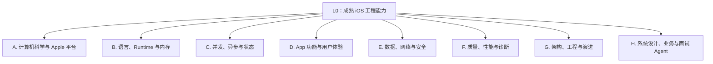
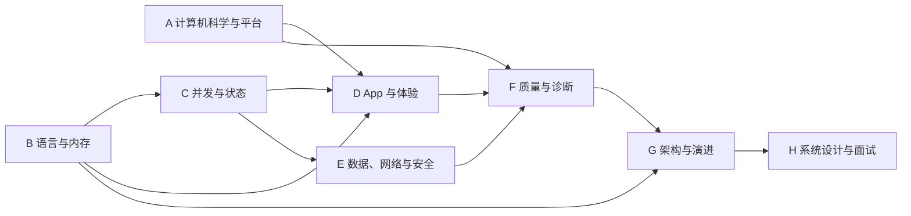

# iOS 面试全景知识体系

本文是整个知识库的权威总图。其他文档不是并列的“文章合集”，而是这棵知识树的展开。

## 0. 分层规则

知识体系统一使用五层：

```text
L0 目标：一个成熟 iOS 工程师要解决什么问题
└─ L1 领域：从哪些大方向建立能力
   └─ L2 能力域：该方向包含哪些相对独立的能力
      └─ L3 主题：需要掌握的机制、技术或方法
         └─ L4 检查点：能否解释、设计、实现、诊断和验证
```

每个节点使用稳定编号，例如：

```text
B2.3.2
││ │ └─ L4：Existential 与类型擦除
││ └─── L3：协议与泛型
│└───── L2：Swift
└────── L1：语言与 Runtime
```

面试掌握不以“看过”为准。一个 L4 节点至少能完成：

1. **解释**：用准确术语说明结论和机制；
2. **比较**：说明替代方案与取舍；
3. **实现**：给出关键接口、状态和调用链；
4. **诊断**：从失败现象定位到具体层；
5. **验证**：给出测试、工具、指标或线上证据。

## 1. L0：顶层目标

完整的 iOS 能力不是某一门语言或框架，而是持续完成六类工作：

| L0 编号 | 顶层能力 | 核心问题 |
| --- | --- | --- |
| L0.1 | 理解平台 | App 如何在 Apple 系统中启动、运行、展示和被管理 |
| L0.2 | 正确编程 | 如何用 Objective-C / Swift 表达安全、可维护的程序 |
| L0.3 | 构建产品 | 如何实现 UI、网络、数据、安全和系统能力 |
| L0.4 | 保证质量 | 如何证明正确、稳定、流畅、安全、可观测 |
| L0.5 | 设计演进 | 如何划分架构、模块、依赖并持续迁移交付 |
| L0.6 | 沟通决策 | 如何在面试和协作中解释结论、权衡与证据 |

## 2. L1：八大领域



八个方向的关系不是线性课程：

- A 是平台约束；
- B 是表达和运行语义；
- C 是跨线程、跨任务的状态规则；
- D/E 构成用户可见产品；
- F 证明产品是否可靠；
- G 让复杂度可长期演进；
- H 把前面能力用于真实业务决策和面试验证。

## A. 计算机科学与 Apple 平台系统

### A0. 计算机科学基础

- **A0.1 数据结构**
  - A0.1.1 Array、Linked List、Stack、Queue；
  - A0.1.2 Hash Table、Set、冲突与扩容；
  - A0.1.3 Tree、Heap、Trie；
  - A0.1.4 Graph、拓扑、最短路径；
  - A0.1.5 选择结构时的局部性、内存和并发成本。
- **A0.2 算法**
  - A0.2.1 时间/空间复杂度、摊销分析；
  - A0.2.2 sort、binary search、two pointers、sliding window；
  - A0.2.3 recursion、divide-and-conquer、backtracking；
  - A0.2.4 greedy、dynamic programming；
  - A0.2.5 先定义输入和不变量，再选择算法。
- **A0.3 操作系统**
  - A0.3.1 process、thread、scheduler、context switch；
  - A0.3.2 virtual memory、page、mmap、copy-on-write；
  - A0.3.3 lock、condition、semaphore、deadlock；
  - A0.3.4 file descriptor、I/O、IPC；
  - A0.3.5 user/kernel boundary 与 system call。
- **A0.4 网络与分布式基础**
  - A0.4.1 DNS、IP、TCP/UDP/QUIC；
  - A0.4.2 TLS 与证书信任；
  - A0.4.3 HTTP、缓存、代理、CDN；
  - A0.4.4 timeout、retry、idempotency；
  - A0.4.5 consistency、ordering、clock、partial failure。
- **A0.5 数据库**
  - A0.5.1 relational model、key、index；
  - A0.5.2 transaction 与 ACID；
  - A0.5.3 isolation、并发写入、锁；
  - A0.5.4 schema、migration、query plan；
  - A0.5.5 本地数据库与服务端数据库边界。
- **A0.6 编译与链接**
  - A0.6.1 preprocess / compile / assemble / link；
  - A0.6.2 symbol、static/dynamic link；
  - A0.6.3 module、ABI、API；
  - A0.6.4 optimization、debug/release；
  - A0.6.5 code signing 与可执行产物。

### A1. App 进程与可执行文件

- **A1.1 构建产物**
  - A1.1.1 Mach-O、架构切片、符号；
  - A1.1.2 静态库、动态库、Framework、XCFramework；
  - A1.1.3 Code Signing、Entitlement、Provisioning；
  - A1.1.4 App Bundle、资源与本地化产物。
- **A1.2 装载与启动**
  - A1.2.1 dyld 映射、依赖装载、重定位；
  - A1.2.2 Objective-C 类注册和静态初始化；
  - A1.2.3 `main` / `@main` / `UIApplicationMain`；
  - A1.2.4 冷启动、温启动、热恢复；
  - A1.2.5 首帧、首屏、可交互的不同完成点。

### A2. 生命周期与资源治理

- **A2.1 App 生命周期**
  - A2.1.1 launch、active、inactive、background、suspended；
  - A2.1.2 `UIApplicationDelegate`；
  - A2.1.3 终止回调不保证；
  - A2.1.4 状态保存和恢复。
- **A2.2 Scene 生命周期**
  - A2.2.1 Scene 连接、前后台、断开；
  - A2.2.2 多窗口和 Scene 级状态；
  - A2.2.3 App 级与 Scene 级依赖边界。
- **A2.3 后台执行**
  - A2.3.1 background task；
  - A2.3.2 background URLSession；
  - A2.3.3 后台刷新、处理、推送和系统调度；
  - A2.3.4 时间、能耗和权限约束。
- **A2.4 系统资源**
  - A2.4.1 memory warning 与 jetsam；
  - A2.4.2 CPU、磁盘、网络和能耗预算；
  - A2.4.3 前后台优先级；
  - A2.4.4 thermal state 与降级。

### A3. 事件、Run Loop 与系统调度

- **A3.1 Run Loop**
  - A3.1.1 Source、Timer、Observer、Block；
  - A3.1.2 Mode 与 common modes；
  - A3.1.3 休眠、唤醒和一次迭代；
  - A3.1.4 线程与 Run Loop 的关系。
- **A3.2 事件系统**
  - A3.2.1 系统事件到 UIApplication/UIWindow；
  - A3.2.2 hit-testing；
  - A3.2.3 UIResponder 响应链；
  - A3.2.4 Gesture Recognizer 状态与冲突。
- **A3.3 调度边界**
  - A3.3.1 main thread 与 main queue；
  - A3.3.2 Run Loop 与 Dispatch Queue；
  - A3.3.3 Timer 精度、容差和生命周期；
  - A3.3.4 主线程卡顿观察的证据边界。

### A4. 图形与渲染系统

- **A4.1 UI 对象**
  - A4.1.1 UIView、CALayer、View Controller；
  - A4.1.2 布局、绘制、动画、合成的边界；
  - A4.1.3 Core Graphics、Core Animation、Metal 的职责。
- **A4.2 一帧的生命周期**
  - A4.2.1 事件与状态更新；
  - A4.2.2 layout / display / commit；
  - A4.2.3 Render Server / GPU 合成；
  - A4.2.4 hitch、hang、掉帧与输入延迟。
- **A4.3 渲染成本**
  - A4.3.1 图层树和过度绘制；
  - A4.3.2 图片解码、尺寸与上传；
  - A4.3.3 离屏渲染与混合；
  - A4.3.4 动画和刷新率适配。

### A5. 系统边界

- **A5.1 沙盒与文件容器**；
- **A5.2 隐私权限与目的字符串**；
- **A5.3 Extension、App Group 与进程间边界**；
- **A5.4 Deep Link、Universal Link 与 Handoff**；
- **A5.5 推送、通知与系统唤醒**。

对应展开：

- [01-computer-science-foundations.md](01-computer-science-foundations.md)
- [01-ios-system-fundamentals.md](01-ios-system-fundamentals.md)

## B. 语言、Runtime 与内存

### B1. C / ABI 基础

- **B1.1 内存布局**：栈、堆、全局区、对齐、指针；
- **B1.2 函数与调用**：调用约定、符号、链接；
- **B1.3 数据表示**：整数溢出、浮点、大小端、结构体；
- **B1.4 Unsafe 边界**：缓冲区、生命周期、未定义行为；
- **B1.5 Apple ABI**：只依赖公开合同，不绑定私有实现。

### B2. Objective-C

- **B2.1 对象模型**
  - B2.1.1 instance / class / metaclass；
  - B2.1.2 `isa`、方法列表和缓存；
  - B2.1.3 selector、IMP、消息发送。
- **B2.2 动态机制**
  - B2.2.1 动态方法解析；
  - B2.2.2 快速与完整消息转发；
  - B2.2.3 Category、Extension、关联对象；
  - B2.2.4 Method Swizzling；
  - B2.2.5 `+load` 与 `+initialize`。
- **B2.3 内存管理**
  - B2.3.1 ARC 所有权；
  - B2.3.2 strong / weak / copy / assign；
  - B2.3.3 Autorelease Pool；
  - B2.3.4 Block 捕获与引用环；
  - B2.3.5 Core Foundation 桥接。
- **B2.4 Cocoa 动态能力**
  - B2.4.1 KVC；
  - B2.4.2 KVO；
  - B2.4.3 Delegate / Notification / Target-Action；
  - B2.4.4 NSProxy 与消息代理。

### B3. Swift

- **B3.1 类型系统**
  - B3.1.1 struct / class / enum；
  - B3.1.2 值语义、引用语义与 identity；
  - B3.1.3 Optional、Error、Result；
  - B3.1.4 access control 与 module。
- **B3.2 内存与所有权**
  - B3.2.1 ARC 与闭包捕获；
  - B3.2.2 COW；
  - B3.2.3 独占访问；
  - B3.2.4 borrowing / consuming / `~Copyable`；
  - B3.2.5 UnsafePointer 与资源生命周期。
- **B3.3 协议与泛型**
  - B3.3.1 protocol requirement / extension；
  - B3.3.2 associated type；
  - B3.3.3 generic constraint / specialization；
  - B3.3.4 `some` opaque type；
  - B3.3.5 `any` existential / type erasure。
- **B3.4 运行与派发**
  - B3.4.1 静态派发；
  - B3.4.2 vtable；
  - B3.4.3 witness table；
  - B3.4.4 Objective-C 消息派发；
  - B3.4.5 内联、去虚化与优化级别。
- **B3.5 语言抽象**
  - B3.5.1 property wrapper；
  - B3.5.2 result builder；
  - B3.5.3 macro；
  - B3.5.4 Codable；
  - B3.5.5 Collection、Sequence、String 与复杂度。

### B4. 混编与迁移

- **B4.1 Nullability 与 Optional 导入**；
- **B4.2 Lightweight Generics**；
- **B4.3 Bridging Header 与 Module**；
- **B4.4 `@objc` / `dynamic` / NSObject 边界**；
- **B4.5 OC→Swift 渐进迁移和兼容合同**。

对应展开：

- [02-objective-c-runtime-and-memory.md](02-objective-c-runtime-and-memory.md)
- [03-swift-language-and-runtime.md](03-swift-language-and-runtime.md)

## C. 并发、异步与状态

### C1. 基础执行模型

- **C1.1** 并发、并行、异步、线程、队列、Task；
- **C1.2** 调度、上下文切换、线程池；
- **C1.3** QoS 与优先级反转；
- **C1.4** 取消、超时、背压和限流。

### C2. GCD 与 Operation

- **C2.1** serial / concurrent queue；
- **C2.2** sync / async 与等待图；
- **C2.3** group / barrier / semaphore / source；
- **C2.4** Operation 状态、依赖、取消；
- **C2.5** 线程爆炸与阻塞式反模式。

### C3. 同步与一致性

- **C3.1** lock、condition、atomic；
- **C3.2** 数据竞争、竞态条件、死锁、活锁、饥饿；
- **C3.3** 锁顺序、临界区、回调边界；
- **C3.4** 版本号、generation、幂等；
- **C3.5** 单写者、状态机与不可变快照。

### C4. Swift Concurrency

- **C4.1** async/await 与 suspension；
- **C4.2** structured concurrency、`async let`、Task Group；
- **C4.3** `Task` / detached / priority / Task Local；
- **C4.4** cooperative cancellation；
- **C4.5** Actor、reentrancy、global actor；
- **C4.6** `MainActor`；
- **C4.7** `Sendable` / `@Sendable` / `@unchecked`；
- **C4.8** Continuation 与旧 API 桥接。

### C5. 数据流

- **C5.1** callback、delegate、notification；
- **C5.2** Combine publisher/subscriber；
- **C5.3** AsyncSequence；
- **C5.4** 冷/热流、订阅生命周期、背压；
- **C5.5** UI 状态与事件的单向流动。

对应展开：[04-concurrency.md](04-concurrency.md)。

## D. App 功能与用户体验

### D1. UIKit

- **D1.1** View Controller 生命周期与容器；
- **D1.2** UIView 层级、layout、drawing；
- **D1.3** Auto Layout、intrinsic size、优先级；
- **D1.4** Table/Collection 复用、diffable data source；
- **D1.5** Navigation、presentation、transition；
- **D1.6** text input、keyboard、rotation、trait。

### D2. SwiftUI

- **D2.1** View value、identity、lifetime；
- **D2.2** dependency graph 与 body 更新；
- **D2.3** State、Binding、Environment；
- **D2.4** Observation / ObservableObject；
- **D2.5** Navigation、List、Layout、Animation；
- **D2.6** UIKit 互操作和生命周期。

### D3. 体验完整性

- **D3.1** Accessibility；
- **D3.2** localization、时区、数字与复数；
- **D3.3** Dynamic Type、深色模式、不同尺寸；
- **D3.4** 错误、空态、加载、重试与降级；
- **D3.5** 输入反馈、动画语义和可取消交互。

### D4. 媒体与设备能力

- **D4.1** 图片管线；
- **D4.2** 音视频播放、缓冲、时钟与中断；
- **D4.3** 相机、相册与权限；
- **D4.4** 定位、蓝牙、传感器；
- **D4.5** Widget、Live Activity、Extension。

对应展开：[05-ui-uikit-swiftui.md](05-ui-uikit-swiftui.md)。

## E. 数据、网络与安全

### E1. 网络基础

- **E1.1** DNS、TCP、TLS、HTTP/1.1/2/3；
- **E1.2** request / response / status / header / body；
- **E1.3** REST、GraphQL、WebSocket、SSE 的边界；
- **E1.4** 弱网、超时、重试、幂等、熔断；
- **E1.5** 指标：成功率、延迟分位、流量和错误分类。

### E2. Apple 网络栈

- **E2.1** URLSession / task / configuration / delegate；
- **E2.2** default / ephemeral / background session；
- **E2.3** URLCache 与 HTTP cache semantics；
- **E2.4** authentication challenge、TLS 与 ATS；
- **E2.5** Network framework 与连接状态。

### E3. 数据建模与持久化

- **E3.1** DTO、domain model、view state；
- **E3.2** UserDefaults、Keychain、File；
- **E3.3** SQLite、Core Data、SwiftData；
- **E3.4** schema migration 与兼容；
- **E3.5** cache、source of truth 和一致性。

### E4. 离线与同步

- **E4.1** cache-first / network-first / stale-while-revalidate；
- **E4.2** 本地写队列、幂等 key、重试；
- **E4.3** 冲突检测和解决策略；
- **E4.4** 增量同步、游标、删除墓碑；
- **E4.5** 多设备和服务端权威。

### E5. 安全与隐私

- **E5.1** sandbox、entitlement、最小权限；
- **E5.2** Keychain 与 Data Protection；
- **E5.3** TLS、ATS、证书信任；
- **E5.4** token 生命周期与日志脱敏；
- **E5.5** App Attest / DeviceCheck；
- **E5.6** 隐私清单、目的声明、SDK 数据治理；
- **E5.7** 威胁建模与服务端验证。

对应展开：[06-network-storage-security.md](06-network-storage-security.md)。

## F. 质量、性能与诊断

### F1. 正确性与测试

- **F1.1** unit / integration / UI / contract / snapshot；
- **F1.2** test double、clock、scheduler、network stub；
- **F1.3** async test、超时、flaky test；
- **F1.4** property-based / fuzz / boundary；
- **F1.5** performance baseline 与回归门槛。

### F2. 性能

- **F2.1** launch；
- **F2.2** responsiveness / hang；
- **F2.3** animation hitch；
- **F2.4** CPU / memory / allocation；
- **F2.5** I/O / network；
- **F2.6** energy / thermal；
- **F2.7** binary size / build time。

### F3. 稳定性

- **F3.1** crash、exception、signal；
- **F3.2** symbolication、dSYM、调用栈；
- **F3.3** jetsam / watchdog / OOM；
- **F3.4** deadlock / race；
- **F3.5** 数据损坏和恢复。

### F4. 工具

- **F4.1** Instruments：Time Profiler、Allocations、Leaks、Hangs、Hitches、Network、Energy；
- **F4.2** Memory Graph；
- **F4.3** ASan / TSan / UBSan / Main Thread Checker；
- **F4.4** LLDB、View Debugger、Network Link Conditioner；
- **F4.5** Organizer、MetricKit、os_log、signpost。

### F5. 线上可观测性

- **F5.1** crash-free、hang、launch、memory；
- **F5.2** 网络与业务漏斗；
- **F5.3** 日志、trace、correlation ID；
- **F5.4** 采样、隐私、成本；
- **F5.5** 告警、灰度、回滚、事后复盘。

对应展开：[07-performance-debugging-testing.md](07-performance-debugging-testing.md)。

## G. 架构、工程与演进

### G1. 架构原则

- **G1.1** 关注点分离、单一职责、依赖反转；
- **G1.2** source of truth 与状态所有权；
- **G1.3** side effect 边界；
- **G1.4** 可测试性、可替换性、可观测性；
- **G1.5** 架构服务于变化，不以模式数量为目标。

### G2. 应用分层

- **G2.1** UI / presentation；
- **G2.2** domain / use case；
- **G2.3** data / repository；
- **G2.4** infrastructure / platform；
- **G2.5** composition root / dependency injection。

### G3. 架构模式

- **G3.1** MVC / MVVM；
- **G3.2** MVP / VIPER；
- **G3.3** Redux / unidirectional data flow；
- **G3.4** Clean Architecture；
- **G3.5** Coordinator / Router；
- **G3.6** 组合使用和过度设计风险。

### G4. 模块化与依赖

- **G4.1** feature / layer / capability 切分；
- **G4.2** public API、SPI、资源边界；
- **G4.3** dependency graph 与循环依赖；
- **G4.4** SPM / Framework / XCFramework；
- **G4.5** build cache、增量编译、代码生成。

### G5. 演进与迁移

- **G5.1** Objective-C → Swift；
- **G5.2** UIKit → SwiftUI；
- **G5.3** callback/GCD → async/await；
- **G5.4** 单体 → 模块化；
- **G5.5** 数据 schema 和 API 版本迁移；
- **G5.6** feature flag、灰度、回滚、双写/影子验证。

### G6. 交付与协作

- **G6.1** Git、code review、branch / trunk strategy；
- **G6.2** CI、自动测试、签名与发布；
- **G6.3** 依赖和供应链安全；
- **G6.4** 技术债、ADR、文档和 ownership；
- **G6.5** 事故响应、复盘和改进闭环。

对应展开：[08-architecture-and-system-design.md](08-architecture-and-system-design.md)。

## H. 系统设计、业务与面试 Agent

### H1. 系统设计方法

- **H1.1** 澄清用户、规模、SLO、边界和非目标；
- **H1.2** 数据流、状态机、接口和依赖；
- **H1.3** 正常路径、失败路径、恢复路径；
- **H1.4** 缓存、一致性、安全、性能和成本；
- **H1.5** 指标、测试、灰度和演进。

### H2. 典型业务

- **H2.1** Feed / 图片列表；
- **H2.2** 即时通信；
- **H2.3** 音视频播放；
- **H2.4** 电商与支付前端；
- **H2.5** 地图与轨迹；
- **H2.6** 离线优先笔记；
- **H2.7** 多账号、多 Scene；
- **H2.8** 端侧 AI / Agent 客户端。

### H3. 职级能力

- **H3.1** 初级：正确实现局部功能；
- **H3.2** 中级：独立闭环模块和故障；
- **H3.3** 高级：跨模块设计、指标和迁移；
- **H3.4** 资深：业务目标、组织边界、长期演进；
- **H3.5** Lead：技术方向、人才培养和风险治理。

### H4. 面试表达

- **H4.1** 结论—机制—边界—方案—验证；
- **H4.2** 项目故事：背景—目标—行动—结果—反思；
- **H4.3** 用量化证据代替形容词；
- **H4.4** 区分事实、推断、选择和未知；
- **H4.5** 不会时建立可验证的推理路径。

### H5. 面试 Agent

- **H5.1** 候选人画像与难度校准；
- **H5.2** 从知识树选题；
- **H5.3** 由结论追问到机制、边界和验证；
- **H5.4** 评分量表与证据；
- **H5.5** 防提示答案、防幻觉和版本提示；
- **H5.6** 复盘、薄弱节点和下一轮计划。

对应展开：

- [09-interviewer-agent-playbook.md](09-interviewer-agent-playbook.md)
- [10-question-bank.md](10-question-bank.md)
- [11-study-and-mock-plan.md](11-study-and-mock-plan.md)

## 3. 关键依赖关系



典型学习顺序不是把 A 全学完才开始 B，而是沿真实调用链纵向切片：

```text
列表图片加载
→ D1 列表复用
→ E2 URLSession
→ C4 Task 取消与 Actor
→ B3 ARC/闭包/Sendable
→ A4 图片解码与一帧
→ F2 Hitches/Memory 验证
→ G2 分层与缓存依赖
```

## 4. 全景覆盖矩阵

| 真实问题 | 必须覆盖的节点 |
| --- | --- |
| App 冷启动慢 | A1.2、B2.2.5、F2.1、F4.1、G5 |
| 列表错图/卡顿 | C3.4、C4.4、D1.4、D4.1、A4、F2.3 |
| 偶现数据覆盖 | C3.2、C3.4、C4.5、E4、F4.3 |
| OC 内存泄漏 | B2.3、B2.4、F2.4、F4.2 |
| Swift 6 并发迁移 | B3.2、C4、B4、G5.3、F1 |
| 弱网体验差 | E1.4、E2、E4、D3.4、F5.2 |
| 大型 App 模块化 | G1、G2、G4、G5、G6 |
| UIKit → SwiftUI | D1、D2、B3、C4.6、G5.2、F1/F2 |
| 端侧 AI Agent | H2.8、E5、C4、F5、G2、D3.4 |

## 5. 面试验证标准

针对任意节点，面试 Agent 按五级深度追问：

| 深度 | 问法 | 通过标准 |
| --- | --- | --- |
| 1 定义 | “它是什么？” | 术语和用途正确 |
| 2 机制 | “为什么会这样？” | 说清对象、状态和调用链 |
| 3 边界 | “什么时候失效？” | 能指出失败、版本和生命周期 |
| 4 设计 | “你会怎样实现？” | 有接口、状态、依赖和取舍 |
| 5 验证 | “怎样证明？” | 有工具、测试、指标和反例 |

一个高级候选人不必背完所有叶子，但应能从顶层定位问题、沿依赖下钻，并在不确定时给出验证路径。

## 6. 维护原则

- 新知识先归入现有 L1/L2；无法归类时才讨论新增顶层方向；
- 专题文档必须回链本总图；
- 版本敏感事实集中在 [references.md](references.md) 复核；
- 不把私有 Runtime 细节当稳定合同；
- 每个重要主题最终应有：原理、代码、失败案例、诊断和题库；
- 题库使用节点编号，避免“题很多但不知道覆盖了什么”。
