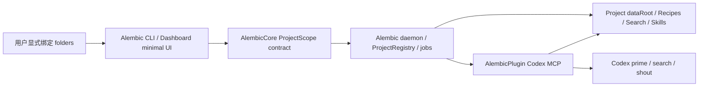

# Requirement Design: Multi Root Project Scope

日期：2026-05-24
状态：已确认，进入 Wave 1
维护窗口：AlembicWorkspace

## 原始计划书

- 原始计划书：[original-plan-2026-05-24.md](original-plan-2026-05-24.md)
- 原始计划书确认状态：已确认
- 用户确认时间：2026-05-24 21:56 CST
- 代码实现依赖调研：[code-implementation-dependency-research-2026-05-24.md](code-implementation-dependency-research-2026-05-24.md)

## 用户需求

用户当前最急迫的需求是让 `AlembicWorkspace` 下的 Alembic 系列多仓库能作为一个抽象 Alembic Project 被自身使用：

```text
Plugin 在某一个文件夹启动，我们的后台会确认这个文件夹本身为项目（从 Plugin 确认），用户可以选择，主动说明哪些文件夹是同一个项目，来做绑定，用户不讲就算了，我们做的是一个文件夹数组，支持添加；然后 Alembic 主体通过前端或者终端命令来配置多个文件夹；我们说的项目是抽象，文件夹是实体，一对多，现有的多项目切换也是抽象层面的；
```

用户后续确认：

```text
可以包含，可能需要用特别字段吧，因为不能放在数组里；可以；可以；

Ghost 才应该是默认的形态，旧的标准把所有文件都放在真实项目目录下的做法被抛弃；把 Ghost 模式做成标准模式，不再支持转回项目目录的操作，避免与多文件夹冲突；

标准模式也不需要做兼容，按照新的逻辑做一致性闭环，不要做降级和分叉。
```

总控解释为：

- `AlembicWorkspace` 根目录可以作为控制 / 协作入口，但不能放入源码 `folders[]`。
- 第一版 CLI 优先，Dashboard 做最小展示 / 添加。
- Plugin 在没有本地 Alembic 增强底座时，继续使用单 folder Project 自洽路线。
- Ghost dataRoot 是唯一标准形态；旧 standard / project-root 写入不保留兼容、迁移、降级或分叉语义，不再支持切回项目目录。

## 需求明确性检查

- 用户场景：Codex 窗口打开 `Alembic`、`AlembicCore`、`AlembicAgent`、`AlembicDashboard` 或 `AlembicPlugin` 任一子仓库时，AlembicPlugin 能识别这些 folder 同属一个 Alembic Project，并使用同一 Project 知识库。
- 完整功能闭环：用户显式绑定多个 folder → Alembic 持久化 ProjectScope → daemon / health / resident service 输出 ProjectScope → Plugin 解析当前 folder 到同一 Project → cold-start / search / prime / skill 使用 Project 级 dataRoot 并保留 folder 级证据。
- 输入：当前 Codex folder、用户通过 CLI / Dashboard 添加的 folder 列表、可选 controlRoot、Project 级 Ghost storage、cold-start / prime / search 请求。
- 输出：ProjectScope registry、Project dataRoot、folders summary、跨 folder Recipe / Guard / search results、可读 evidence / sourceRef、project skill runtime export target。
- 状态 / 数据变化：ProjectRegistry 从“path -> entry”升级为“projectId -> project descriptor + folder membership”；单 folder 项目也走同一套 Ghost-only ProjectScope；旧 standard 不再兼容、迁移或切回。
- 生产方：`AlembicCore` 提供 contract；`Alembic` 生产绑定、daemon status、cold-start / rescan 项目数据。
- 消费方：`AlembicPlugin` 消费绑定并驱动 Codex prime/search/skill；`AlembicDashboard` 展示和最小管理；`AlembicAgent` 在 cold-start / rescan 中消费 folder context；`AlembicTest` 复测。
- 验证方式：Core unit、Alembic CLI / API / job tests、Plugin single-folder baseline + resident integration tests、Dashboard contract/check、AlembicTest 使用 AlembicWorkspace 做 smoke。
- 完成定义：多 folder 绑定后，任一绑定 folder 中的 Codex Plugin 都能使用同一 Project 级知识库，且证据能区分来源 folder；未绑定时保持单 folder 行为。
- 已确认边界：第一版不包含 folder remove / disable，只做 add/list/resolve；remove / disable 作为后续安全清理项。

## 调研范围

- 必读仓库：`AlembicCore`、`Alembic`、`AlembicPlugin`、`AlembicDashboard`、`AlembicAgent`。
- 观察仓库：`AlembicTest`。
- 暂不纳入仓库：真实测试项目源码、BiliDili 产品源码。
- 关键入口文件：
  - `AlembicCore/src/shared/ProjectRegistry.ts`
  - `AlembicCore/src/shared/WorkspaceResolver.ts`
  - `Alembic/lib/daemon/ProjectRuntimeControl.ts`
  - `Alembic/bin/daemon-server.ts`
  - `Alembic/lib/workflows/cold-start/internal/InternalColdStartWorkflow.ts`
  - `AlembicPlugin/lib/external/mcp/CodexMcpServer.ts`
  - `AlembicPlugin/lib/service/resident/AlembicResidentServiceClient.ts`
  - `AlembicPlugin/lib/external/mcp/handlers/task.ts`
  - `AlembicPlugin/lib/codex/ProjectSkillDelivery.ts`
  - `AlembicDashboard/src/types.ts`
  - `AlembicDashboard/src/api.ts`
  - `AlembicAgent/src/tools/v2/types.ts`
- 关键测试 / 脚本：等待具体 wave 执行计划按仓库补齐。

## 外部调研判断

- 是否需要联网：当前不需要。
- 判断理由：本需求核心是 Alembic 现有单 root project identity 与多 folder ProjectScope 的本地重构，代码证据足以支撑设计。
- 若需要，优先来源：后续涉及 Codex project skill runtime 的正式 discover / install 规则时，单独查询 OpenAI 官方文档。
- 若不需要，说明原因：外部通用 multi-root workspace 经验不能替代当前 ProjectRegistry、WorkspaceResolver、resident service、MCP 和 Dashboard 的真实连通性。

## 真实代码事实摘要

详见 [code-implementation-dependency-research-2026-05-24.md](code-implementation-dependency-research-2026-05-24.md)。关键摘要：

### AlembicCore

- 已有能力：ProjectRegistry、WorkspaceResolver、Ghost dataRoot、daemon runtime contracts。
- 关键文件：`ProjectRegistry.ts`、`WorkspaceResolver.ts`、`ProjectRuntimeContracts.ts`、`RuntimeContracts.ts`、`ResidentServiceContracts.ts`、`ProjectIntelligenceRunner.ts`。
- 缺口：ProjectEntry 不含 folders；WorkspaceFacts 不含 ProjectScope；runtime contracts 不含 folder map；project intelligence 只接受单 projectRoot。

### Alembic

- 已有能力：ProjectRuntimeControl、daemon server、HTTP projects API、cold-start / rescan jobs、file change collector。
- 关键文件：`ProjectRuntimeControl.ts`、`routes/projects.ts`、`daemon-server.ts`、`InternalColdStartWorkflow.ts`、`DaemonFileChangeCollector.ts`。
- 缺口：daemon 和 ProjectRuntimeControl 都按单 root 启动；HTTP 无 folder 绑定接口；cold-start 只扫单 root；file monitor 只 watch 单 git worktree。

### AlembicPlugin

- 已有能力：Codex MCP project root resolver、prime/search、resident service route、project skill runtime export、single-folder baseline。
- 关键文件：`CodexMcpServer.ts`、`AlembicResidentServiceClient.ts`、`search.ts`、`PrimeSearchPipeline.ts`、`task.ts`、`ProjectSkillDelivery.ts`、`ProjectRootResolver.ts`。
- 缺口：Plugin 上下文只有单 projectRoot；resident search / jobs 不带 project scope；project skill export 只有一个 `codexSkillRoot`；single-folder baseline 不知道多 folder 绑定。

### AlembicDashboard

- 已有能力：projects snapshot、runtime boundary、project action API client、ModuleExplorer 目录扫描 UI。
- 关键文件：`types.ts`、`api.ts`、`App.tsx`、`ModuleExplorerView.tsx`。
- 缺口：Dashboard project scope summary 无 folders/controlRoot；ModuleExplorer folders 是临时 scan target，不是 ProjectRegistry source of truth；cache key 按 projectRoot。

### AlembicAgent

- 已有能力：internal AI runtime、code / terminal tools、单 root 安全边界。
- 关键文件：`ToolContext`、`code.ts`、`terminal.ts`、`AgentRuntimeBuilder.ts`。
- 缺口：工具上下文只有单 `projectRoot`；一次跨 folder 读取代码需要新的 allowed roots contract。第一版建议 per-folder scan + aggregation，不直接扩张工具权限。

### AlembicTest / 真实项目验证

- 是否纳入：设计阶段只观察，执行阶段需要。
- 理由：multi-root 自用闭环必须用 AlembicWorkspace 自身 smoke；真实项目仍只通过 `AlembicTest` 操作。
- 目标项目：第一版优先 AlembicWorkspace 下 Alembic 系列仓库；不改 BiliDili 产品源码。

## 代码实现依赖调研

- 是否需要单独调研附件：是。
- 调研附件：[code-implementation-dependency-research-2026-05-24.md](code-implementation-dependency-research-2026-05-24.md)
- 关键生命周期：
  1. Plugin / CLI 给出当前 folder。
  2. Core ProjectRegistry 解析 folder -> ProjectDescriptor。
  3. Alembic daemon 按 ProjectDescriptor 初始化 dataRoot、health、resident service、jobs。
  4. cold-start / rescan 读取 folders 并按 folder 聚合。
  5. Recipe / search / prime / skill 使用 project-level dataRoot，输出 folder-level evidence。
  6. Dashboard 展示 ProjectScope，并提供最小 folder 添加。
- 共享状态 / 持久化位置：ProjectRegistry v2 写入全局 registry；Project dataRoot 固定使用 Ghost 作为唯一标准；源码 folder 不写运行数据；controlRoot 只作为协作入口；旧 standard 不进入新逻辑。
- producer / consumer 硬依赖：Core contract 是 Alembic / Plugin / Dashboard / Agent 的上游；Alembic CLI/API/daemon 是 Plugin resident 消费的上游；Dashboard 和 AlembicTest 等待上游 contract。
- 不能提前消费的边界：Plugin 不能猜 folders；Dashboard 不能用 localStorage folder scan 替代 registry；Agent 不能直接开放多 root 工具读写。
- 是否需要外部资料：当前否。

## 目标能力设计

### 最终能力

Alembic 支持一个抽象 `Project` 拥有多个实体 `Folder`。用户显式绑定后，AlembicWorkspace 的多个子仓库能作为一个项目被 Alembic 自身使用；Plugin 在任一绑定 folder 中运行时，都能通过 Alembic resident service 获取同一 Project 级知识库，并在 prime/search/skill 中保留 folder 级证据。新 ProjectScope 的 dataRoot 固定走 Ghost 标准，不把运行数据写回任一源码 folder。

### 用户体验

第一版面向开发者的体验：

1. 用户在 `AlembicWorkspace` 或任一子仓库中启动 Alembic。
2. 用户通过 CLI 添加 folder：
   - `Alembic`
   - `AlembicCore`
   - `AlembicAgent`
   - `AlembicDashboard`
   - `AlembicPlugin`
3. `AlembicWorkspace` 根目录被记录为 `controlRoot`，不作为源码 folder 扫描。
4. 用户打开任一子仓库 Codex 窗口，Plugin 先确认当前 folder；如果 local Alembic 报告该 folder 属于 multi-folder Project，则使用同一 ProjectScope。
5. `alembic_task prime` 能拿到跨仓库 Recipe / Guard，并由 Codex 呐喊摘要；证据留给 Codex 后续验证。
6. `alembic_search` 能返回跨 folder 知识，并能指出来自哪个 folder。
7. 冷启动 / rescan 输出写到 Project dataRoot，不污染任何源码仓库。
8. 不再提供 Ghost 转回项目目录写入的操作；旧 standard 不作为兼容、迁移或降级输入。

### 功能闭环



### 模块边界

- `AlembicCore`：ProjectScope contract、registry v2、folder resolution、单 folder Ghost-only resolution、sourceRef / evidenceRef 结构建议。
- `Alembic`：ProjectScope 的本地增强生产方，负责 CLI、HTTP/API、daemon health、ProjectRuntimeControl、cold-start / rescan 多 folder 聚合、resident service 输出。
- `AlembicPlugin`：Codex host agent 入口，负责当前 folder 解析、resident scope 消费、单 folder baseline、prime/search/project skill 使用 ProjectScope。
- `AlembicDashboard`：消费 Alembic API 展示 ProjectScope，提供最小 add/list folder，不做 Plugin 控制台。
- `AlembicAgent`：保持单 root tool context 安全边界，第一版以 per-folder scan + aggregation 消费 ProjectScope。
- `AlembicTest`：做 multi-root smoke，不直接改产品实现。

### 数据 / 状态模型

推荐 ProjectDescriptor：

```ts
interface ProjectDescriptor {
  schemaVersion: 2;
  projectId: string;
  displayName: string;
  storageMode: 'ghost';
  dataRoot: string;
  dataRootSource: 'ghost-registry';
  primaryFolderId: string | null;
  controlRoot?: ProjectControlRoot | null;
  folders: ProjectFolderDescriptor[];
  createdAt: string;
  updatedAt: string;
}

interface ProjectControlRoot {
  path: string;
  realpath: string;
  role: 'coordination' | 'workspace-control';
  includeInSourceScan: false;
}

interface ProjectFolderDescriptor {
  folderId: string;
  path: string;
  realpath: string;
  displayName: string;
  role: 'source' | 'core' | 'plugin' | 'dashboard' | 'agent' | 'test' | 'docs' | string;
  status: 'active' | 'missing';
  include?: string[];
  exclude?: string[];
  addedAt: string;
}

interface ProjectScopeResolution {
  project: ProjectDescriptor;
  currentFolderId: string | null;
  resolution: 'bound-folder' | 'single-folder-project' | 'unregistered-folder';
}
```

字段语义：

- `folders[]` 只放源码 / 实体 folder。
- `controlRoot` 表示 workspace 根目录、协作文档根或用户希望作为控制入口的目录，不进入 source scan。
- `projectRoot` 在旧 API 中继续表示当前 folder root，不再作为完整 Project 唯一身份。
- `dataRoot` 是 Project 级数据根；新 ProjectScope 固定为 Ghost，不再支持转回 project-root 写入。
- `projectId` 是 Project 稳定身份，后续允许 displayName 变化但不影响隔离。

### API / contract

Core contract：

- `ProjectRegistry.resolveProjectScope(inputFolder)`
- `ProjectRegistry.registerSingleFolderProject(folder, options)`，新建时必须使用 Ghost storage。
- `ProjectRegistry.addFolder(projectIdOrFolder, folder, options)`
- `ProjectRegistry.setControlRoot(projectId, controlRoot)`
- `WorkspaceResolver.fromProjectScope(resolution)`
- 旧 `ProjectRegistry.inspect(projectRoot)` 可作为旧参数入口保留，但返回新 ProjectScope 语义；旧 `setWorkspaceMode(..., 'standard')` 必须从新 ProjectScope 产品入口移除，不保留 standard 分叉。

Alembic CLI / HTTP：

- CLI 第一版：
  - list Project folders。
  - add folder。
  - set / show controlRoot。
- HTTP 第一版：
  - `/api/v1/projects` summary 增加 `folders` / `controlRoot`。
  - `/api/v1/projects/:projectId/folders` list / add。
  - daemon health 增加 project scope summary。

Plugin resident service：

- `AlembicResidentServiceClient` probe 读取 health 中的 `projectScope`。
- search / jobs 请求携带 `projectId` / `serviceScopeId` / `currentFolderId` 或由 daemon token state 已绑定的 ProjectScope 推断。
- 没有 local Alembic 时不报“失败”，而是明确 `resident multi-folder enhancement unavailable; using single-folder baseline`。

Evidence / sourceRef：

- 第一版结果可以继续接受字符串 sourceRef。
- 新增结构化 metadata：

```ts
interface ProjectSourceRef {
  folderId: string;
  folderDisplayName: string;
  path: string;
  line: number | null;
}
```

### UI / handoff

Dashboard 第一版：

- Project runtime card / project list 展示 folder count、controlRoot 和 folder 列表。
- 提供 add folder 的最小入口。
- 不把 ModuleExplorer folders tab 的 custom folder localStorage 当作持久 ProjectScope。
- 不做完整多项目切换 UI 重设计。

Plugin handoff：

- `alembic_codex_status` / diagnostics 显示当前 folder 是否属于 multi-folder Project。
- prime / search 不把 folder map 全塞给开发者；Codex 需要时可用 evidenceRefs / searchMeta 验证。
- project skill export 应按 ProjectScope 管理多个 Codex skill roots，但只在用户授权后写。

### 安装 / 发布 / artifact

- 不需要新发布物类型。
- Core contract 变更会影响 Alembic / Plugin / Dashboard / Agent，需要按 producer / consumer 顺序提交。
- Plugin 刷新 / marketplace 缓存更新应在实现 wave 验收后再做。

## 禁止的伪实现

- 不做只有 `folders: string[]` 但没有 registry / resolver / dataRoot / consumer 的空字段。
- 不做 Plugin 自己维护多 folder 项目控制台。
- 不做 Dashboard localStorage custom folder scan 伪装成 ProjectScope。
- 不做只改 type 不让 cold-start / prime / search 真实消费的“薄连接”。
- 不把 `AlembicWorkspace` 根目录当源码 folder 扫描。
- 不提供 Ghost 转回 standard / 项目目录写入的操作。
- 不把 file monitor / evolution 主线混进第一版造成巨大阻塞。

## 差距分析

| 能力 | 当前状态 | 缺口 | 归属窗口 | 风险 |
| --- | --- | --- | --- | --- |
| Project / Folder contract | Core 只有 path-keyed v1 registry | 需要 ProjectDescriptor、ProjectFolder、controlRoot、旧参数解析 | `AlembicCore` | 所有下游依赖该 contract |
| ProjectScope 持久化 | `ProjectRegistry` 只记录单 root，且仍有 standard mode | 需要 v2 registry、Ghost-only ProjectScope、移除 standard 分叉 | `AlembicCore` | 继续支持切回 project-root 会与 multi-folder 冲突 |
| Project control | Alembic 只按 projectRoot/projectId select/start | 需要 folder add/list/controlRoot CLI + API | `Alembic` | 下游不能猜 folder 绑定 |
| Daemon / health | health 只输出单 root runtime identity | 需要 projectScope summary 和 serviceScope | `Alembic` / `AlembicCore` | Plugin resident 无法发现绑定 |
| Cold-start / rescan | 只扫单 root | 需要按 folders 扫描并汇总到 Project dataRoot | `Alembic` / `AlembicCore` / `AlembicAgent` | 多仓库自用闭环无法成立 |
| Prime / search | Plugin 可 resident search，但上下文是单 root | 需要 current folder -> Project resolution | `AlembicPlugin` | 未连接 Alembic 时保持单 folder 自洽路线 |
| Project skill export | 单 root `.agents/skills` | 需要多 target skill roots 和 managed marker | `AlembicPlugin` / `AlembicCore` / `Alembic` | 覆盖用户 skill 风险 |
| Dashboard | project summary 单 root；folders tab 是临时 scan | 需要最小 ProjectScope 展示 / add folder | `AlembicDashboard` | 不能把 UI 临时目录当 source of truth |
| Agent tool context | 单 root 安全边界 | 第一版 per-folder scan；后续再多 root tools | `AlembicAgent` | 直接放开会引入路径安全风险 |
| Smoke 验证 | 无 multi-root smoke | 需要 AlembicWorkspace 自用验证 | `AlembicTest` | 测试耗时，需要 test mode / targeted |

## TODO / Backlog

| ID | 状态 | 类型 | 严重度 / 优先级 | 归属 | 事项 / TODO | 影响目标 / 派发 | 依赖 / 触发 | 推荐窗口 |
| --- | --- | --- | --- | --- | --- | --- | --- | --- |
| GTODO-2026-05-24-036 | 主线 | multi-root project scope | P0 | 全仓库 | 支持一抽象 Project 对多实体 Folder，第一版以 AlembicWorkspace 自用闭环为硬门禁。 | 是 | 当前需求主线 | `AlembicWorkspace` 先确认阶段 |
| GTODO-2026-05-24-030 | 并入主线 | project skill export | P2 | `AlembicPlugin` / `AlembicCore` / `Alembic` | 多 folder Project 下，同一 Project 的 generated skills 需要导出到多个 Codex 可见 project skill roots，且保持 managed marker。 | 是 | 依赖 ProjectScope data model | 第二或第三阶段 |
| GTODO-2026-05-24-037 | 等待 | intent knowledge route | P1 | `AlembicPlugin` / `Alembic` / `AlembicCore` | Plugin 意图同步和意图下知识注入 / 检索。 | 是 | 依赖 ProjectScope 归属 | 后续主线 |
| GTODO-2026-05-24-038 | 等待 | file monitor evolution | P1 | `Alembic` / `AlembicCore` / `AlembicDashboard` | Alembic 多 folder file monitor 和知识进化。 | 是 | 依赖 ProjectScope folders[] | 后续主线 |
| GTODO-2026-05-24-039 | 等待 | plugin no-monitor evolution | P1 | `AlembicPlugin` / `AlembicCore` | Plugin 无 file monitor 时的机会式知识进化。 | 是 | 依赖 ProjectScope + intent route | 后续主线 |
| MRPS-TODO-1 | 后续 | folder lifecycle | P2 | `AlembicCore` / `Alembic` / `AlembicDashboard` | folder remove / disable / restore 的安全策略。 | 否 | 第一版 add/list/resolve 通过后再做 | 待定 |
| MRPS-TODO-2 | 后续 | agent multi-root tools | P2 | `AlembicAgent` / `AlembicCore` | internal AI 一次工具调用跨 folder 安全读取的 allowedFolders contract。 | 否 | 只有 per-folder scan 不够时启动 | 待定 |

## 后续拆分候选方向

| 阶段 | 目标 | 生产窗口 | 消费窗口 | 完成判断 |
| --- | --- | --- | --- | --- |
| 1 | Core ProjectScope contract | `AlembicCore` | `Alembic` / `AlembicPlugin` / `AlembicDashboard` / `AlembicAgent` | registry 能表达 Project / folders / controlRoot，单 folder 与 multi-folder 都走同一 Ghost-only storage |
| 2 | Alembic ProjectScope producer | `Alembic` | `AlembicPlugin` / `AlembicDashboard` / `AlembicTest` | CLI/API/daemon health 能 list/add folders，并输出 ProjectScope |
| 3 | Plugin current folder -> Project consumption | `AlembicPlugin` | Codex / Alembic resident | local Alembic 存在时 Plugin 使用 ProjectScope；不存在时单 folder baseline |
| 4 | Multi-folder cold-start/search/prime self-use | `Alembic` / `AlembicCore` / `AlembicPlugin` / `AlembicAgent` | `AlembicTest` | AlembicWorkspace 多 repo 生成 / 搜索 / prime 跨仓库知识，证据保留 folder |
| 5 | Dashboard minimal management + project skill multi-target | `AlembicDashboard` / `AlembicPlugin` | `AlembicTest` | UI 可看 folder map / add folder；project skill 可按 ProjectScope export |
| 6 | Smoke / 归档 | `AlembicTest` / `AlembicWorkspace` | 用户 | AlembicWorkspace 自用闭环通过，文档归档 |

## 待确认问题

本需求已足够进入任务级目标阶段确认。建议确认时只让用户判断阶段路线和第一波启动窗口，不再扩大问题面。

仍建议保留一个默认判断：

- 第一版暂不实现 folder remove / disable；只做 add/list/resolve 和必要的错误提示。若添加错 folder，可以通过后续安全清理波处理。

## 进入 Wave 执行

- 目标阶段确认文档：`docs/workspace/current/multi-root-project-scope-goal-stage-confirmation-2026-05-24.md`
- Wave 1 执行文档：`docs/workspace/current/multi-root-project-scope-wave-1-2026-05-24.md`
- 是否已经完成代码实现依赖调研：是。
- 第一波窗口：`AlembicCore`。
- 明确不派发窗口：`Alembic`、`AlembicPlugin`、`AlembicDashboard`、`AlembicAgent`、`AlembicTest` 等待上游 contract 或处于观察。
