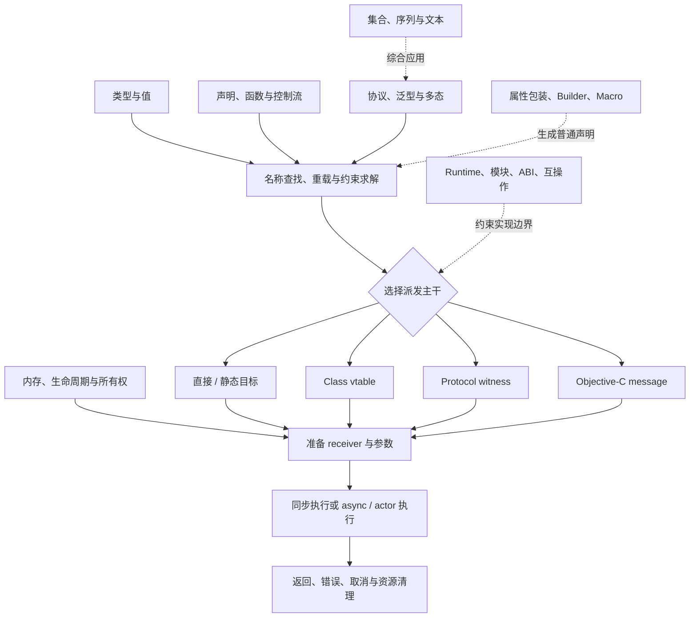
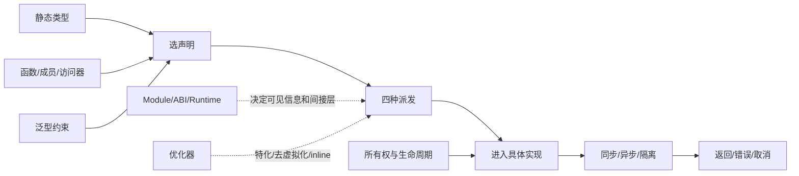

# Swift 语言全景：从四条方法派发主干理解实现

## 1. Swift 是怎样的一门语言

Swift 是一门编译型、静态类型、多范式语言。它同时支持：

- 值类型与引用类型；
- 面向协议、泛型和面向对象；
- 函数是一等值；
- 自动引用计数；
- 类型安全和内存安全检查；
- 结构化并发与 Actor 隔离；
- 与 C、Objective-C、C++ 及平台 Runtime 互操作。

“静态类型”不表示所有调用都在编译期直接确定；“自动内存管理”不表示没有生命周期问题；“async”也不表示自动创建线程。这些误解分别需要方法派发、所有权和并发模型来解释。

## 2. 从源代码到运行

一段 Swift 源代码大致经过：

```text
Source
→ 解析语法
→ 名称查找与类型检查
→ 确定重载、泛型约束和可见声明
→ 生成 Swift Intermediate Language（SIL）
→ 所有权与性能优化
→ LLVM IR / 机器码
→ 链接模块和 Runtime
→ 在目标平台执行
```

这条链解释了三个重要边界：

1. 有些选择发生在类型检查阶段，例如重载解析；
2. 有些行为保留到运行时，例如可重写类方法或 Objective-C 消息；
3. 编译器可以在不改变语义的前提下内联、特化或去虚化。

## 3. 一条主干与九组支撑基石

这套文档不把 Swift 写成十个互不相干的章节。方法派发位于中间，展开为四条主要
执行线路；其他方向为调用提供输入、约束、运行环境或退出路径。



### 3.1 类型与值

回答：

- `Int`、`String?`、`(Int, String)`、函数和 metatype 分别是什么类型；
- `struct`、`enum`、`class`、`actor` 和 `protocol` 表达什么；
- 值语义、引用语义与对象身份有什么区别；
- 类型推断如何从上下文约束表达式；
- Optional、tuple、function type 和 existential 如何组合。

### 3.2 声明、函数与控制流

回答：

- 名称、作用域和访问级别如何建立程序结构；
- 函数如何成为值并捕获上下文；
- `if`、`switch`、pattern、loop 如何控制求值；
- 初始化如何保证值在使用前完整；
- extension、subscript、operator 如何增加表达能力。

### 3.3 方法派发

这是全景的主干，先回答：

- 调用前如何先完成名称查找与重载解析；
- 什么时候可以直接调用一个已知实现；
- 类的 override 如何按动态类型选择实现；
- 协议 requirement 如何通过 conformance 选择实现；
- protocol extension-only 方法为什么可能按静态类型选择；
- `dynamic` 如何强制进入 Objective-C Runtime；
- 泛型特化和去虚化为什么是优化，而不是源代码语义。

然后把相关知识挂回四条线路：

- [直接 / 静态派发](03-method-dispatch/01-direct-dispatch.md)：值类型、函数值、
  extension、`final`、所有权和 inline；
- [Class vtable 派发](03-method-dispatch/02-class-vtable-dispatch.md)：引用身份、
  继承、override、ARC、初始化和 resilience；
- [Protocol witness 派发](03-method-dispatch/03-protocol-witness-dispatch.md)：
  requirement、conformance、泛型、`some` / `any` 和 existential；
- [Objective-C 消息派发](03-method-dispatch/04-objective-c-message-dispatch.md)：
  `@objc`、`dynamic`、selector、KVO 和 Runtime 互操作。

### 3.4 内存、生命周期与所有权

回答：

- `let` 固定的是绑定还是对象；
- class 实例如何由 ARC 管理；
- 闭包如何捕获；
- `weak`、`unowned` 分别表达什么生命周期；
- 值复制与 Copy-on-Write 如何共存；
- `inout`、独占访问、borrowing、consuming 和 noncopyable types 如何表达所有权。

### 3.5 协议、泛型与多态

回答：

- 协议 requirement 与默认实现的关系；
- generic parameter 怎样保留具体类型关系；
- associated type 和 `Self` 为什么重要；
- `some P`、`any P`、`T: P` 各由谁选择具体类型；
- existential 的灵活性为什么可能带来间接层；
- 类型擦除解决什么，又隐藏了什么。

### 3.6 同步、异步与并发

回答：

- 同步/异步描述的是调用与结果的时间关系；
- 阻塞/非阻塞描述执行资源是否等待；
- 串行/并发描述任务能否交错；
- 并行描述是否真的同时执行；
- async function 如何挂起而不是阻塞线程；
- Task、Task Group、Actor、Sendable 和 cancellation 如何组成结构化并发。

### 3.7 错误、取消与资源

回答：

- Optional、`throws`、`Result` 各表达哪类失败；
- typed throws 怎样保留错误类型；
- `defer` 和 `deinit` 如何关闭资源；
- assertion、precondition 和 fatal error 的合同不同；
- Task cancellation 为什么是协作式；
- 每条提前返回和异常路径怎样保持资源不变量。

### 3.8 集合、序列与文本

回答：

- `Sequence` 与 `Collection` 的能力差异；
- Array、Set、Dictionary 的语义和复杂度；
- lazy operation 的求值时机；
- String 为什么不使用整数下标；
- Unicode grapheme cluster 如何影响“字符”；
- Codable、Hashable、Comparable 等标准协议如何连接类型系统。

### 3.9 Runtime、模块、ABI 与互操作

回答：

- module 和 access control 怎样形成编译边界；
- metadata、vtable、witness table 在常见实现中承担什么；
- API、ABI、module stability 和 library evolution 的区别；
- Swift 名称如何 mangling；
- `@objc`、selector、Objective-C message dispatch 如何工作；
- C/Objective-C/C++ 类型怎样跨边界；
- `Any`、`AnyObject`、dynamic cast 和 Mirror 的边界。

### 3.10 语言扩展机制

回答：

- property wrapper 如何重写属性存储和访问的表达；
- result builder 如何把闭包中的语句变成结构；
- macro 如何在编译期生成受类型检查的代码；
- `dynamicMemberLookup` / `dynamicCallable` 如何有控制地引入动态语法；
- 抽象何时减少重复，何时隐藏重要控制流。

## 4. 基石怎样附着到派发主干



这张图强调：

- 类型和声明决定“有哪些合法候选”；
- 四种派发决定“多态实现如何被选中”；
- 所有权决定“值如何跨过调用边界”；
- 同步、异步和隔离决定“实现如何随时间推进”；
- Runtime、ABI 和优化决定“保留哪些间接层”，但不能改写语言语义。

实际代码通常先沿一条派发主干纵向深入，再横穿多个支撑基石。

## 5. 用一次调用贯穿全景

```swift
let users = try await repository.loadUsers(limit: 20)
```

这行代码至少包含：

1. `repository` 有一个静态类型；
2. 编译器根据名称、参数标签和类型选择 `loadUsers(limit:)` 声明；
3. 具体调用使用哪种派发，取决于 class、protocol、generic、existential、`final`、`dynamic` 等上下文；
4. `limit` 的值被传入，参数所有权遵守函数合同；
5. 当前 Task 在 `await` 处可能挂起；
6. 挂起期间线程可以执行其他工作；
7. Actor 隔离可能要求一次 executor hop；
8. 函数可能抛错，`try` 将错误传播给外层；
9. Task 取消可能让底层操作提前失败；
10. 返回的数组具有值语义，底层实现可以使用 Copy-on-Write；
11. 编译器可能特化泛型、内联或去虚化，但不能改变可观察语义。

## 6. 四组必须分开的概念

### 6.1 重载解析与方法派发

- 重载解析：编译器选择“调用哪个声明”；
- 方法派发：已选中声明后，调用“哪个具体实现”。

### 6.2 值语义与存储位置

- 值语义：复制后两个值的可观察状态彼此独立；
- 栈/堆：编译器选择的存储实现。

值类型不保证永远在栈，引用类型也不应被简化为“所有内容都在堆”。

### 6.3 async 与并行

- `async` 函数允许挂起；
- 并行需要运行时和硬件真的同时执行多个工作。

一个 async 函数完全可能没有并行工作。

### 6.4 `@objc` 与 `dynamic`

- `@objc` 使声明可以用 Objective-C 表示和访问；
- `dynamic` 强制该成员通过 Objective-C Runtime 动态派发，并要求它能表示为 Objective-C。

暴露给 Objective-C 不等于所有 Swift 调用都必须使用 Objective-C 消息派发。

## 7. 语言、标准库和平台库

| 层 | 例子 | 本质 |
| --- | --- | --- |
| Swift 语言 | type、function、actor、async/await、macro | 编译器理解的语法和语义 |
| Swift 标准库 | Array、String、Sequence、Result | 随语言工具链提供的核心类型和协议 |
| Swift Runtime | metadata、ARC 支持、动态转换等 | 生成程序运行所需支持 |
| 平台库 | Foundation、Dispatch、Objective-C Runtime | 操作系统/平台提供的额外能力 |
| UI/业务框架 | SwiftUI、UIKit、Combine 等 | 在语言之上构建的领域能力 |

“DispatchQueue 的 async”和“Swift async function”名字相似，但位于不同层，必须分别理解。

## 8. 稳定语义与实现细节

### 可以依赖

- `final` 成员不可被 override；
- `dynamic` 成员使用 Objective-C Runtime 动态派发；
- protocol requirement 的具体实现由 conformance 满足；
- Actor 隔离保护其隔离状态；
- Task cancellation 是协作式；
- ARC 管理 class 实例的引用生命周期。

### 不能无条件依赖

- 某个值一定在栈上；
- 某次泛型调用一定完成特化；
- 某个非 `final` 调用一定保留 vtable 间接调用；
- 某个闭包一定或绝不会分配；
- 某个标准库类型的私有内存布局；
- 不同 Swift 版本下完全相同的优化结果。

## 9. 推荐学习顺序

第一阶段先建立主干所需的静态语义：

```text
类型与值
→ 函数与控制流
→ 名称查找与重载解析
```

第二阶段连续走完四条派发线路：

```text
直接派发
→ Class vtable
→ Protocol witness
→ Objective-C message
→ 四路线横向对比
```

第三阶段补齐横切执行语义：

```text
内存与所有权
→ 协议与泛型
→ 同步/异步与并发
→ 错误、取消与资源
```

第四阶段理解库和二进制边界：

```text
集合与文本
→ Runtime/模块/ABI/互操作
→ 属性包装/Builder/Macro
```

语言版本和一级资料入口见 [资料、研究方法与版本边界](references.md)。
