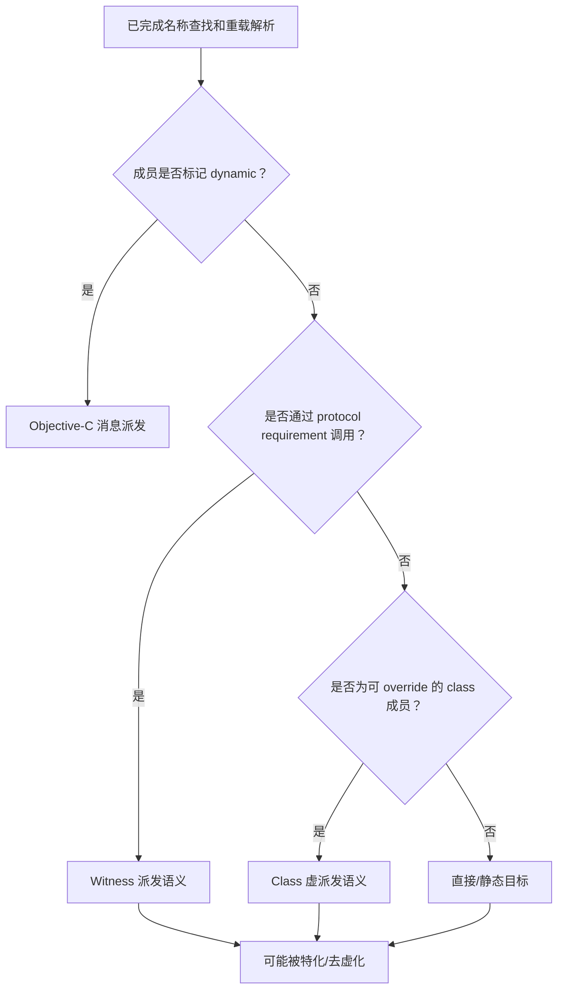

# 方法派发：四条调用线路

方法派发回答的不是“这个名字指向哪个声明”，而是：

> 当编译器已经确定调用的是某个函数、方法、属性或 subscript 声明后，程序最终执行哪个具体实现？

Swift 中最有解释力的四条线路是：

1. [直接/静态派发](01-direct-dispatch.md)；
2. [Class 虚表派发](02-class-vtable-dispatch.md)；
3. [Protocol Witness Table 派发](03-protocol-witness-dispatch.md)；
4. [Objective-C 消息派发](04-objective-c-message-dispatch.md)。

它们是四种运行线路模型，不是四个互斥的语法关键字。同一份源代码经过泛型特化、去虚化或跨语言边界后，机器码的具体形态可能变化，但必须保持语言允许观察到的行为。

## 0. 为什么以这四条线路作为知识主干

方法派发位于 Swift 多组核心概念的交汇点。沿着一次真实调用向前追踪，会自然遇到
类型检查、重载和泛型；向后追踪，会遇到对象布局、conformance、Runtime、所有权
和并发。

```text
                         ┌─ 值类型 / final / 自由函数 ───────→ 直接线路
源码 → 类型系统 → 声明 ─┼─ class / override / 动态类型 ─────→ vtable 线路
                         ├─ protocol / conformance / any ────→ witness 线路
                         └─ @objc / selector / Runtime ──────→ 消息线路
                                      │
                                      ├─ 参数所有权与生命周期
                                      ├─ throws / async / actor isolation
                                      └─ module / ABI / 优化
```

四条线路分别挂载如下知识：

| 知识层 | 直接线路 | Class vtable 线路 | Protocol witness 线路 | Objective-C 消息线路 |
| --- | --- | --- | --- | --- |
| 类型模型 | concrete value / known function type | 静态 class 类型 + 动态对象类型 | concrete conformer、generic、opaque、existential | Objective-C 可表示的 class/object |
| 声明模型 | 自由函数、值类型成员、`static`、`final` | 可 override 的实例成员或 `class` member | protocol requirement + conformance | `@objc dynamic` member、`@objc` protocol requirement |
| 多态来源 | 无运行时替换点 | subclass override | 同一 requirement 的不同 witness | receiver class 对 selector 的响应 |
| 运行载体 | 已知符号或函数值 | class metadata / vtable / dispatch thunk | type metadata / conformance / witness table / thunk | receiver / selector / Objective-C Runtime cache 与 method list |
| 所有权关联 | 值复制、借用、消费、COW | 引用身份、ARC、`weak` / `unowned` | 泛型值操作、existential inline buffer 或 box | ARC 与 Objective-C ownership convention、bridging |
| 模块关联 | body 可见性、`@inlinable` | `open`、resilience、class dispatch thunk | conformance 可见性、resilient witness layout | Runtime 名字与 selector 形成动态兼容边界 |
| 优化方向 | inline、常量传播、generic specialization | devirtualization 后 inline | specialization / existential opening 后去间接 | `dynamic` 访问保留 Runtime 派发 |

这张表是导航，不是把每个语言特性硬塞进一个格子。一个调用可以同时跨越多层。
例如“class 对 Swift protocol 的 async requirement 的实现”会同时涉及：

1. class 引用的 ARC 生命周期；
2. conformance 的 witness 选择；
3. witness 可能转接到可 override 的 class 方法；
4. async 函数进入后的挂起与 executor 语义。

## 1. 一次调用的四个阶段

```text
名称查找
→ 重载解析
→ 方法派发
→ 优化与代码生成
```

### 1.1 名称查找

确定当前作用域、类型、extension、module 中有哪些同名声明可见。

### 1.2 重载解析

根据参数标签、静态类型、泛型约束和上下文，在编译期选择一个声明。

```swift
func render(_ value: Int) {}
func render(_ value: String) {}

render(1) // 在编译期选择 Int 重载
```

### 1.3 方法派发

如果所选声明允许多个实现，例如 class override 或 protocol requirement，运行时需要根据对象动态类型或 conformance 选择实现。

### 1.4 优化与代码生成

编译器可以：

- inline；
- generic specialization；
- devirtualization；
- constant propagation；
- dead-code elimination。

这些优化可以消除原本的间接调用，但不能改变源语言语义。

## 2. 四条线路总览

| 线路 | 语义上的选择依据 | 常见运行结构 | 典型来源 |
| --- | --- | --- | --- |
| 直接派发 | 编译期已知且不可被运行时替换的目标 | 直接调用符号或已知地址 | 自由函数、值类型成员、`final`、`static` |
| Class 虚表派发 | receiver 的动态 class 类型 | class metadata 中的 vtable slot | 可 override 的 class 成员 |
| Protocol Witness 派发 | 某个类型对 protocol requirement 的 conformance | witness table entry | generic constraint、`any P`、protocol requirement |
| Objective-C 消息派发 | receiver 的 Objective-C class 与 selector | `objc_msgSend`、method cache/list | `dynamic`、KVO、target-action、Runtime 互操作 |

“vtable”和“witness table”是 Swift 当前实现及 ABI 模型中非常有用的解释工具。公开语言首先保证 override 和 protocol conformance 的可观察行为，不要求所有未来工具链都生成完全相同的表布局。

## 3. 用同一个行为展示四条线路

### 3.1 直接派发

```swift
struct DirectRenderer {
    func render() {
        print("direct")
    }
}

DirectRenderer().render()
```

成员不可被 subclass override，目标由静态类型确定。

### 3.2 Class 虚表派发

```swift
class BaseRenderer {
    func render() {
        print("base")
    }
}

final class ImageRenderer: BaseRenderer {
    override func render() {
        print("image")
    }
}

let renderer: BaseRenderer = ImageRenderer()
renderer.render() // image
```

声明由静态类型 `BaseRenderer` 提供，具体实现由动态类型 `ImageRenderer` 决定。

### 3.3 Protocol Witness 派发

```swift
protocol Rendering {
    func render()
}

struct TextRenderer: Rendering {
    func render() {
        print("text")
    }
}

func draw<T: Rendering>(_ renderer: T) {
    renderer.render()
}
```

`render()` 是 protocol requirement，`TextRenderer: Rendering` 的 conformance 提供实现。

### 3.4 Objective-C 消息派发

```swift
import Foundation

class RuntimeRenderer: NSObject {
    @objc dynamic func render() {
        print("runtime")
    }
}

RuntimeRenderer().render()
```

`dynamic` 要求调用通过 Objective-C Runtime 动态派发。

## 4. 决策线路



这是一棵解释树，不是编译器源码的完整算法。还要考虑：

- `super` 调用；
- `final`；
- protocol extension-only 成员；
- generic、opaque 和 existential 上下文；
- module resilience；
- `@objc` 但非 `dynamic`；
- 属性 getter/setter 和 subscript；
- 编译优化。

## 5. 横向比较

| 维度 | 直接 | Class vtable | Protocol witness | Objective-C message |
| --- | --- | --- | --- | --- |
| 是否支持 class override | 否 | 是 | 可由 class conformance 间接结合 | 是，按 ObjC Runtime |
| 是否依赖 protocol conformance | 否 | 否 | 是 | 可用于 `@objc protocol` |
| 主要输入 | 静态目标 | 动态 class 类型 | concrete type + conformance | receiver + selector |
| 可否被 Swift 优化器去虚化 | 已是已知目标 | 条件允许时可以 | 特化后可能可以 | `dynamic` 明确禁止内联/去虚化该访问 |
| 跨语言动态性 | 低 | Swift class 模型 | Swift protocol 模型 | 高 |
| 常见成本来源 | 调用与代码体积 | 一次表间接 | conformance/表间接、可能的 existential 容器 | selector 查找/cache、动态边界 |
| 最重要风险 | 把实现细节当“零成本” | 忽略动态类型 | 混淆 requirement 与 extension-only 成员 | 混淆 `@objc` 与 `dynamic` |

性能不能只按这张表排序。一次间接调用通常不是系统瓶颈；泛型特化可能增加代码体积；Objective-C 动态能力可能是框架合同所必需。应从语义正确性开始，再基于目标工具链测量。

## 6. 最容易混淆的边界

### 6.1 `static` 与 `class`

- `static` class member 不允许 override；
- `class` member 允许 override，除非再加 `final`。

### 6.2 `@objc` 与 `dynamic`

- `@objc`：让声明能以 Objective-C 形式表示；
- `dynamic`：要求对该成员的访问使用 Objective-C Runtime 动态派发。

`@objc` 本身不等于“所有 Swift 调用都必须发 Objective-C 消息”。

### 6.3 Protocol requirement 与 extension-only 成员

```swift
protocol P {
    func requiredMethod()
}

extension P {
    func helper() {}
}
```

- `requiredMethod()` 进入 conformance 的 requirement 线路；
- `helper()` 只是 extension 提供的成员，调用选择强烈依赖静态类型和可见约束。

### 6.4 Generic 与 Existential

```swift
func generic<T: P>(_ value: T) {}
func existential(_ value: any P) {}
```

二者都可以调用 protocol requirement，但保留的类型关系不同：

- generic 中 `T` 是一个具体但参数化的类型；
- existential 容器在运行时容纳某个符合类型；
- generic specialization 可能把 witness 调用优化为已知实现；
- existential 需要保留运行时类型与 conformance 信息。

## 7. 如何观察而不误判

可以使用：

```bash
swiftc -emit-sil source.swift
swiftc -O -emit-sil source.swift
swiftc -emit-ir source.swift
```

观察：

- `function_ref`；
- `class_method`；
- `witness_method`；
- Objective-C entry/thunk；
- 优化前后是否 inline 或 devirtualize。

输出只证明这个编译器、这个构建参数、这个 module 边界下的结果，不自动成为语言永久保证。

## 8. 阅读顺序

建议先读四条线路，再回到本页比较：

```text
直接派发
→ Class vtable
→ Protocol witness
→ Objective-C message
→ 横向决策树
```

读每一条线路时，不要只记“查哪张表”，而要沿下面的固定问题继续：

```text
静态类型允许看到什么声明？
→ 编译器为何选中它？
→ 什么语义允许或禁止替换实现？
→ 运行时携带了什么身份与元数据？
→ 参数和 receiver 如何跨过调用边界？
→ throws / async / isolation 怎样叠加在实现上？
→ module 与 ABI 边界阻止了哪些假设？
→ 优化器最后能证明并消除什么？
```

## 9. 四种派发之外的正交轴

### 9.1 函数值与闭包

把方法写成 `object.method` 而暂不调用，会形成一个捕获 receiver 的函数值。后续调用
的是这个函数值，但“捕获时应保留哪种动态语义”仍由原成员和上下文决定。闭包还增加：

- 捕获值还是引用；
- escaping 与 nonescaping；
- 捕获上下文的生命周期；
- `@Sendable` 和 actor isolation。

因此“闭包调用”不是第五种与四条主干同级的方法派发；它是函数值调用，并可能包住
四条线路之一。

### 9.2 `async` 与 `throws`

`async` 和 `throws` 改变函数的类型与控制流，不单独决定成员实现：

```swift
import Foundation

protocol Loader {
    func load() async throws -> Data
}
```

`load` 的具体实现先由 witness 语义确定；随后异步状态机、错误路径、取消检查和
executor 才决定执行如何推进。详见
[同步、异步与并发](../06-sync-async-concurrency/README.md)。

### 9.3 属性、下标与初始化器

派发对象不只包括普通 `func`：

- computed property 的 getter / setter；
- `_read` / `_modify` 等访问协程的实现层模型；
- subscript accessor；
- 可继承 class 的初始化过程；
- Objective-C 可见属性生成的 selector。

源码表面不同，分析时仍要还原为“选声明—选实现—传递值—返回或退出”。

### 9.4 `callAsFunction`、operator 与语法糖

`instance(...)`、`a + b`、`value[index]` 等语法会先由类型检查映射到声明。映射完成后，
声明本身仍落到四条主干之一。语法看起来像函数，并不自动说明采用直接派发。

## 10. 总结：不要背“类型对应派发方式”

错误背法：

```text
struct = 静态
class = vtable
protocol = witness
NSObject = objc_msgSend
```

更准确的分析：

```text
一个具体调用表达式
→ 其静态上下文选择了哪个声明
→ 该声明保留了哪种可观察的替换机制
→ 当前执行需要哪种运行时信息
→ 优化器是否能在不改变语义的前提下消除间接层
```

四条线路是解释 Swift 实现逻辑的主干；类型、继承、协议、泛型、所有权、并发和 ABI
是决定线路走向或影响线路成本的知识节点。
