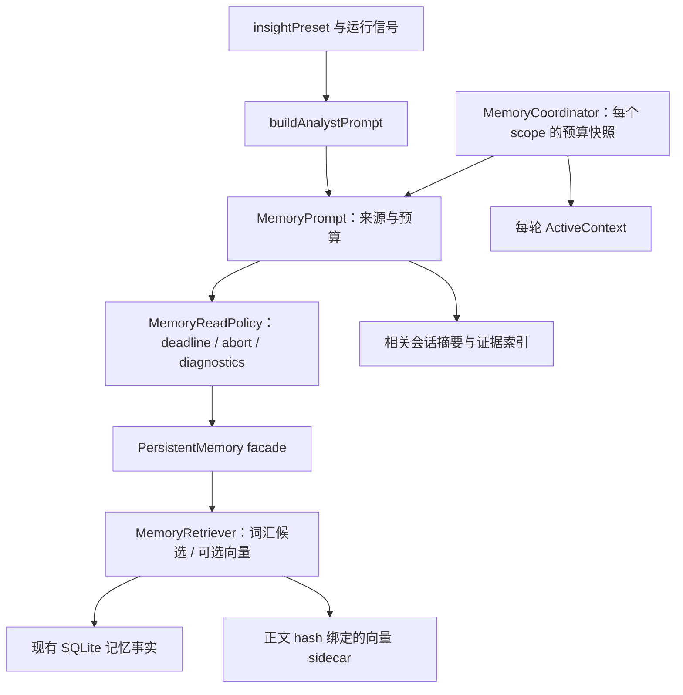

# AlembicAgent 架构优化与测试整合

本轮已完成从项目研究、方案选择到实现和验证的闭环。在上一轮未提交工作区上增量修改 27 个文件：新增 6、修改 13、删除 8。没有修改相邻 Alembic 仓库或 TencentDB 参考项目，没有新增 npm 依赖。

最终 `npm run check` 通过：**65 个测试文件、766 项测试全部通过**；公共签名仍为 **15 个精确入口、451 个导出绑定**，真实宿主 strict consumer 和公开包导入检查通过。

## 研究事实与取舍

研究了本地 TencentDB-Agent-Memory 的 MemoryCore 和 MemoryProxy，固定版本 `06414ac10766b9bd61e4a69f3cf0ea414afb6d4f`；读后工作区仍干净。完整链路、36 处源码定位和未采用部分见 [本地研究记录](reviews/tencent-memory-study.json)。

| 一手来源 | 借鉴内容 | 本轮落点 |
| --- | --- | --- |
| [TencentDB-Agent-Memory](https://github.com/TencentCloud/TencentDB-Agent-Memory)；本地 `MemoryProxy/src/injection/index.ts:324`、`:346` 与 `injectors/tdai-profile-memory-injector.ts:25` | 当前 Proxy 采用会话级 L3 内容、L2 路径/摘要索引及按需工具；旧每轮 L1 injector 已不注册。不能将遗留文件当作默认链路。 | SessionStore 先呈现相关维度与来源索引，复用现有 evidence 检索；不会机械复制整套 L0–L3 服务。 |
| [Tencent MemoryCore](https://github.com/TencentCloud/TencentDB-Agent-Memory/tree/feat/server_team/MemoryCore)；本地 `src/core/hooks/auto-recall.ts:92`、`:638`、`:835` | 召回有截止时间、词汇/向量分支及预算投影。其底层取消和部分吞错路径并不完善。 | 实现请求级期限、取消传播、明确降级和迟到结果丢弃；保留现有评分策略，不在 Agent 复制 Core 的 RRF/索引引擎。 |
| [LangGraph Memory](https://docs.langchain.com/oss/javascript/concepts/memory) | 短期状态与跨会话记忆职责不同；作用域、存储和写入时机应有明确边界。 | Coordinator 预算按 scope 隔离，异步请求携带自身快照；不引入新的后台服务或租户系统。 |
| [Anthropic Context Engineering](https://www.anthropic.com/engineering/effective-context-engineering-for-ai-agents) | 上下文有限；稳定内容与按需检索结合，减少无关内容和重叠工具。 | 统一 section 预算，防重复 reflection，优先当前任务相关历史；维持静态 prompt 与每轮动态工作记忆分离。 |
| [Mem0 How it works](https://github.com/mem0ai/mem0/blob/main/docs/core-concepts/how-it-works.mdx) | 事实数据、向量检索及查询范围承担不同职责。 | SQLite 继续是事实源；向量 sidecar 绑定正文版本，不能凭旧向量覆盖当前事实。 |

这些是设计依据，不是性能成绩。本轮未运行真实模型质量 benchmark，也没有把参考项目的评测数字作为 Alembic 的效果证明。

## 实现方案

### 1. 有边界的记忆读取

新增 `MemoryReadPolicy`，统一 timeout、绝对 deadline、abort 与诊断；`MemoryPrompt` 统一分层预算和 section 投影。没有把各层存储合成一个新的大接口。

embedding 失败或超时保留词汇结果，取消则不采用迟到输出。非法时间值回到有界默认值；批量回填共享同一 deadline。真正注入或返回的记忆才计访问，预算丢弃项不会获得虚假热度。

### 2. 实际 Analyst 接线与 scope 隔离

真实调用链 `insightPreset → buildAnalystPrompt → PersistentMemory → MemoryRetriever` 已接入预算和取消；不是只增加无人调用的 Coordinator 方法。实际 preset 的超时、取消及诊断转发有行为测试。

`taskContext` 进入相关性查询；持久层失败不再屏蔽会话层。SessionStore 对普通 findings 和蒸馏 findings 使用相同排序依据，先投影相关维度；reflection 不重复添加。

预算分配、CJK 估算和裁剪说明使用共用口径。每次组合读取固定起始预算；并行 scope 的结果、余量和全局重配置不再扩大已开始请求的额度。Runtime 依据实际分析/生产阶段选择预算模式。

### 3. 向量缓存的一致性与资源生命周期

向量 sidecar 新格式保存正文 hash，旧格式仍可读取。实际召回验证当前正文；query embedding 等待后重新取得活跃事实，回填写入前复核整个批次。观察回调若触发取消，最终写入仍会停止。

读写复制数组并校验数值，防止绕过 dirty 状态修改缓存。直接文件和 WriteZone 路径均使用临时文件/rename；写失败保留 dirty，允许重试。增加显式 dispose，清理本组件的计时器，不关闭借入的数据库或宿主资源。

### 4. 代码与测试整合

Coordinator 与 SessionStore 不再维护两份重复缓存排除列表，code.read/search 缓存资格由 SessionStore 一处决定。公共 facade 和旧调用方式保留，删去重复 token 估算、裁剪实现与过时局部接口壳。

| 测试整合 | 保留的验证 |
| --- | --- |
| 7 个 provider/transport 小文件合为 `provider-facades.test.ts`、`transport-protocols.test.ts` | 39 项协议与配置接线用例，原 describe-local hooks 保持隔离。 |
| recipe parity 合入现有 flatten 文件 | 24 项用例；真实 wrapper→Core、路径标签等价、waiver 单源引用均保留。 |
| durable semantic review 的 3 段新进程装配抽 helper | 20 项用例及各拓扑、签名和新进程 consume/assert 边界保留。 |

上述整合组前后 **83 个运行用例的完整名称多重集合相同**。迁移文件、原/新行号及测试名称映射见 [整合记录](reviews/test-consolidation-study.json)。新增记忆边界回归使全套测试从 740 增加到 766，文件从 71 减少到 65；没有降低 validation-floor 或删除独立失败场景。

## 验证与复审

- 初始 `npm run check`：71 文件、740 用例通过。
- 召回、装配、相关投影、sidecar、等待期间事实变化及回调取消均有针对性 RED/GREEN 记录；详见 `evidence/`。
- 新格式引入后，原 sidecar 序列化断言同步检查 v2；另有 v1 读取和内容感知回填测试，没有删除旧格式兼容验证。
- NaN 边界先由独立源代码探针发现，修复后的自动回归通过；不能把随后同文件中其它失败伪称为该项的 RED。
- M1/M2 的无效时间、并发重配置、蒸馏排序三项复审反馈全部闭合：[复审](reviews/read-policy-review.json)、[闭合证据](reviews/read-policy-closure.json)。
- sidecar 的读取旧快照和最终回调取消两项反馈全部闭合：[复审记录](reviews/sidecar-review.json)。
- 最终 Node 22.23.2 下完整 check 退出 0；typecheck、Biome、所有边界/层级/契约、clean build、公共签名、真实 strict consumer、validation floor、766 项 Vitest 和 retired-symbol 均通过。Biome 留有 17 个既存的脚本 console / 字面 fixture 提示。
- 额外 public import smoke：15 个允许入口、11 个禁止入口验证通过；`git diff --check` 通过。

[门禁摘要](evidence/full-check-summary.log) · [机器验证记录](verification.json) · [本轮增量与哈希](reviews/final-increment.json)

## 兼容边界与后续维护

- 当前宿主的单参数 embeddingFn 不一定转发 AbortSignal。Agent 已保证及时结束等待、拒绝迟到结果；不宣称已取消底层 HTTP。完整网络中断需要宿主将可选 signal 转发给 embedding adapter。
- 内容 hash 不代表 embedding 模型身份。同维度模型切换需宿主 `clear()` 并回填；本轮不新增缺少真实消费方的模型身份协议。
- v2 是可重建缓存格式。旧程序回滚后可能需要重新生成缓存，SQLite 事实不受影响。短任务退出前由创建者调用 flush/dispose。
- 未发真实 provider 请求，未运行线上模型 benchmark，未发布包或启动参考项目服务。性能收益只声明为可验证的期限、预算和去重行为。
- 用户原有 AGENTS.md、CLAUDE.md 改动经哈希确认保留。未创建提交：本轮继续已有可审阅工作区修改，未把前轮及用户改动混成一个自动提交。

使用说明已落到产品文档 `docs/memory-runtime.md`。后续优化应继续沿真实运行 trace 和质量评估推进；数据库/租户服务迁移、大规模 PCV 重组及新的检索算法不是本轮凭参考项目相似性自动引入的需求。
