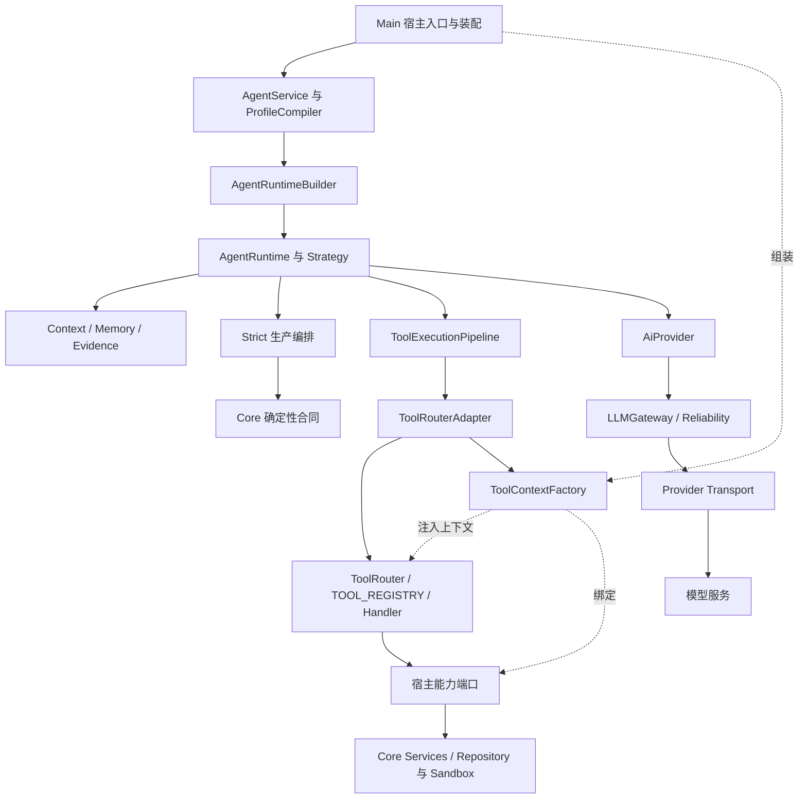

# 接口对接层研究与整理方案

后续补充：[成熟 LLM 实现接入方案](../llm-integration-study-2026-09-20/architecture-addendum.md)（以 Agent `94df98f` 重新核对，包含 AI SDK / LiteLLM / LangChain 比较与迁移前置验证；本页保留原研究时点）。

2026-09-20。研究基线：AlembicAgent `69ee567`，Main `4dc86fb`，Core `4a0b277`，本地TencentDB-Agent-Memory `06414ac`。本轮目标是形成架构与迁移判断；没有修改产品源码或提交实现。Main/Core/Tencent只读，所有示例使用内存fixture。

## 判断

优先收敛**接口定义的来源、装配位置、状态作用域和转换职责**。本仓库已有正确的主要依赖方向，新增统一框架的收益有限。高价值工作是让同一项能力只有一个有效合同、一个确定的装配入口和一组真实消费者测试。

当前工具系统已经是`tools/kernel + tools/runtime`的一条执行链。旧`tools/core`和`tools/v2`路径是历史命名；它们保留的公共合同不能被误判为另一套现存执行器。旧V1退役约束、实际使用者和发布兼容证据仍需核对。

## 当前模块层级

以下展示主要调用与注入关系：实线表示调用，虚线表示装配。编译依赖规则另由layer-contract约束。

| 层 | 当前主入口 | 责任 |
| --- | --- | --- |
| 宿主装配 | Main AgentModule、ToolContextFactory、AiModule | 实例生命周期、凭据来源、真实Core服务、进程/文件系统sandbox、HTTP/DAG入口身份 |
| 应用用例 | AgentService、runs、profiles、coordination | 输入验证、profile编译、任务分区、runtime创建和统一run结果 |
| 执行 | AgentRuntime、strategies、policies | 模型/工具循环、阶段、预算、取消、权限与执行诊断 |
| 状态与证据 | context、memory、evidence | 对话视图、记忆、会话计数、证据台账及回执投影 |
| 工具合同/执行 | tools/kernel、runtime/registry、router、handlers | 请求/结果合同、单源可执行工具定义、参数与依赖边界、真实工具调用 |
| 模型接入 | AiProvider、Gateway、Transport、ModelRegistry | 使用者API、模型能力与可靠性、供应商wire协议 |
| 确定性能力 | @alembic/core公开入口 | 知识生产/服务、持久化、项目事实、日程与回执裁决 |
| 底层辅助 | shared | path、序列化、并发、取消等无业务依赖函数 |

本轮扫描为63条跨area运行时依赖、24条type-only桥。主要方向为`agent → ai/tools/shared`、`ai → shared`、`tools → shared`，root承担公开聚合。Agent自己的规划、策略、memory与执行循环继续保留。

## 对接现状与可复查事实

### 1. 主调用链已闭合，重依赖合同仍偏松

Main的AgentModule明确创建RuntimeCapabilityCatalog、ToolRouterAdapter、AgentRuntimeBuilder和AgentService。ToolContextFactory负责提供服务与sandbox，Adapter把外部ToolCallRequest转换为handler所需ToolContext。

但ToolContext的knowledgeRepo、searchEngine、projectGraph、sandboxExecutor等仍是unknown，handler再各自断言局部Like类型。TypeScript断言不会在运行时检查方法是否存在；它不能证明服务真正接通。[TypeScript官方说明](https://www.typescriptlang.org/docs/handbook/2/everyday-types.html#type-assertions)

已核对的接线问题：

- knowledgeRepo实际注入Core原始repository；`findById`与Agent所需`getById`不同，repository也不等价于包含update/reject/score/validate语义的管理服务。上一轮Agent已拒绝越权字段并返回缺端口诊断，完整服务接线仍属于宿主工作。
- Main factory设`projectGraph:null`且未注入codeEntityGraph；registry里存在graph schema，并不能证明此宿主可执行图谱能力。
- schema查询、可用性、权限是三个概念。Adapter.explain主要判断名称存在；直接HTTP/DAG与runtime入口经过的guard不同，需要核对Main全局中间件后才能判断安全后果。

关键文件：`Alembic/lib/injection/modules/AgentModule.ts`、`Alembic/lib/tools/ToolContextFactory.ts`、`AlembicAgent/src/tools/kernel/registry.ts`、`AlembicAgent/src/tools/runtime/adapter/ToolRouterAdapter.ts`。

### 2. 生命周期合同需要先于缓存合并

真实Main ToolContextFactory的受控内存probe使用两个不同sessionId、agentId、dimensionScopeId：两份context仍共享SessionStore和DeltaCache，第二份context能recall第一份fixture，第二份首次缓存读取返回unchanged。

这证明该装配点没有按这些身份分区，不等于已证明运行中产品发生跨用户泄露。它足以要求重新定义缓存和会话状态的owner。DeltaCache自己描述的是同会话增量读取；“文件版本已缓存”和“当前模型已看过全文”也须区分。

建议的生命周期：

| 生命周期 | 可复用对象 | 约束 |
| --- | --- | --- |
| 宿主/项目服务 | Core客户端、不可变registry、provider连接池、provider级并发门 | 明确dispose与配置刷新，避免每次调用重建限流器 |
| 显式父会话/协作组 | 跨维度去重集合、共享证据目录 | 共享必须由父scope明确授权与持有 |
| 运行/上下文视图 | SessionStore、已见内容的delta状态、tracker、诊断 | 同scope保持引用，跨scope隔离；覆盖阶段重置/分段读取语义 |
| 单次调用 | callId、子signal、剩余预算、attempt诊断 | 结束即清理，迟到结果不能重开终态 |

### 3. 多份上下文投影已有行为差异

真实AgentService→PipelineStrategy的受控RuntimeLike probe显示：仅填写`AgentRunInput.context.sharedState`时，Pipeline的reactLoop未获得该状态；填写`context.strategyContext.sharedState`时获得原引用。Main当前通常同时提供多份投影，因此该probe不代表所有Main run都丢失状态。

此外，Main的AgentRunInputBuilders和DimensionRuntimeBuilder各有一个`compactBootstrapSystemRunContext`；独立AST比较两段正文完全相同。它们是可明确合并的重复实现。

整理目标是一次解析有效上下文、一次兼容投影，并明确优先级。不要把有独立语义的StrictAnalysisContextProjection、PromptContext和可变RunState强行变成同一个对象；普通chat也不应被迫依赖完整bootstrap SystemRunContext。

### 4. Catalog名称相似，职责不同

- TOOL_REGISTRY：可执行action、handler、schema、cache/concurrency/risk的来源。
- RuntimeCapabilityCatalog：给runtime/provider投影内置工具schema；多个公开查询方法委托同一生成逻辑。
- UnifiedToolCatalog：Main注册Dashboard/Skill manifest等元数据，也有公开model/lazy兼容能力。
- CapabilityRegistry：场景名称到Capability实例，承载prompt/context/hooks。

建议统一schema查询port和action allowlist定义，让可见schema与实际执行限制消费同一事实。保留上述数据与生命周期职责，不能把元数据声明当作已绑定执行器或授权通过。

### 5. AI主链已统一，合同位置与配置入口仍可收敛

Main经AiModule/Manager给runtime注入具体Provider；内置Provider调用实例级Gateway，Reliability负责排队/限流/重试，Transport执行单次HTTP尝试。Transport运行时依赖AiProvider内的缺key错误工厂，AiProvider又加载Gateway/Transport，现通过lazy import避环；DTO与错误叶子化有明确收益。

配置默认值和env读取在Factory、Provider、Gateway、Transport分布，各入口并非完全等价。需要保留Ollama身份与OpenAI wire协议的区别，以及各厂商消息格式、重试默认、thinking/toolChoice差异。usage的宿主持久账本和单次run预算是两个实际消费者，不能合并掉其中一个。

取消的现状也有区别：chat/chatWithTools主链已透传到HTTP；structured/embed旧入口尚不能承诺相同的底层取消能力。整理共同options必须逐入口验收，新增取消能力要作为独立行为改动，不计作纯搬移。

## 合并、保留与迁移决定

| 接口族 | 建议 | 必须保持 |
| --- | --- | --- |
| Handler局部Like/unknown服务字段 | 把真实消费的最小接口集中到低层contract；已有Core port直接复用公开类型 | 由真实宿主adapter提供方法和语义，不能仅用as转换 |
| 重复上下文compact/project/expand | 明确一次解析点；合并两份等价Main compactor；旧平铺字段由一个兼容投影提供 | scope、ledger、Set、会话盒引用与字段优先级 |
| Schema query与action allowlist | 一个查询合同、一个allowlist词汇；旧五个方法委托并逐步迁移消费者 | absent/null/空数组语义、model/lazy差异、Capability hooks |
| ToolCallRequest / ParsedToolCall | 保留外部身份信封和内部action语法；复用纯parser片段 | runtime专属alias的入口范围及执行时重新授权 |
| ToolResult / Envelope / OrdinaryOutput | 分类与diagnostics映射单源；保留业务、调用协议、展示三种职责 | Core已确认写入、partial/unknown、cancel/timeout及脱敏规则 |
| AI公共DTO与错误类型 | 移到AI低层contract，旧AiProvider路径重导出；切断transport依赖上层facade的环 | 旧构造器/方法和MissingApiKeyError识别 |
| AI配置和协议转换 | 明确effective config解析点；先合并同一transport内部的chat/tool body/parse重复 | vendor私有字段、原生/兼容路径、调用级usage与取消 |
| 旧公开兼容接口 | 记录真实消费者、弃用理由和清除门槛，暂保留薄wrapper | 15包入口、451现有绑定及未枚举到的外部消费者 |

## 目标边界

不再创建一套Host/Tool/Provider总框架。围绕现有入口形成以下归属：

1. **消费者拥有需要的port。** Agent定义其执行所需的最小宿主能力；Core继续拥有其确定性合同。
2. **宿主在一个装配点提供具体adapter。** Core服务实例、可信身份、sandbox与资源生命周期在Main组合。通用的Core语义转换如需在Agent复用，必须是接收真实Core服务的适配器，不能内建数据库或服务容器。
3. **一次调用有明确的有效scope。** 服务依赖、运行状态、模型输入、调用signal分别有owner；模型参数不能覆盖身份/权限。
4. **转换只解决该边界的问题。** provider协议codec、工具语法解析、业务结果、展示脱敏分别保留；转换函数可合并，语义边界不丢失。

这是对Ports & Adapters“按交互目的定义端口”和显式依赖的本仓应用判断。[原始Ports & Adapters论文](https://alistair.cockburn.us/hexagonal-architecture)、[Microsoft依赖倒置与显式依赖原则](https://learn.microsoft.com/en-us/dotnet/architecture/modern-web-apps-azure/architectural-principles)

## 业界与腾讯项目的采用判断

| 参考 | 采用 | 限制 |
| --- | --- | --- |
| Fastify依赖装配 | 启用能力前检查必要依赖；请求状态按scope创建 | 不引入Fastify，也不把可用性当权限 |
| Anthropic agent实践 | 保持可组合小边界，围绕真实tool接口与评估迭代 | 不增加没有消费者的新抽象 |
| Tencent HostAdapter / runner factory | 用窄方法描述宿主需求，在装配点选择实现 | 其Core仍覆盖注入factory，不能照搬反向依赖 |
| Tencent AgentAdapter / ProtocolAdapter | 客户端行为与模型wire协议分别适配 | codec必须实测原生字段保真 |
| Tencent createSkillTools | 可信身份与服务绑定在执行closure，schema只给业务参数 | Alembic现有权限和结构化回执继续保留 |
| Tencent同接口观测decorator | 观测能力可集中包装并保持结果 | 不采用共享lastUsage侧信道代替逐调用usage |

Fastify明确在启动前检查依赖，并提醒共享可变请求对象会跨请求影响；这支持本方案的装配与scope验收。[Fastify Decorators](https://fastify.dev/docs/latest/Reference/Decorators/)

Anthropic强调简单可组合流程及清晰、经过测试的工具接口；这里据此选择收敛现有层次。[Building Effective Agents](https://www.anthropic.com/engineering/building-effective-agents)

腾讯读码和纯codec probe还发现：OpenAI未知content block会变成custom壳，Anthropic单system block会丢cache_control；OpenClaw runner未完整转发公共参数。因此“同一个TypeScript接口”与“行为可替换”要分别验证，不能因参考项目有统一接口就直接复制。

## 可执行顺序与验收

### A. 当前Agent仓可独立开始

1. Schema查询port + action allowlist统一定义，接到真实AgentRuntime；保留旧公开wrapper。验证null/absent/[]/未知action、model/lazy、schema与执行限制一致。
2. AI DTO/错误叶子化，真实Gateway/Transport消费，旧入口重导出。验证循环依赖、公开导入、错误类别和所有现有provider调用形态。
3. 同一transport内合并消息/body/parse重复，再单独收敛配置解析。对chat/tools/structured、abort、usage、native扩展字段逐项表征。

每步都必须让已有消费者使用新实现，不能只交一个新interface。

### B. 优先的跨仓完整闭环

先选knowledge detail/update/review这条已知有接线证据的链，联合Agent与Main：明确query/production/management端口，Main调用真实Core受控服务；检查必要能力再暴露schema；缺失仍明确失败。随后修scope装配，再迁移其他graph/terminal等能力。

scope迁移先固定同scope复用、不同scope隔离，以及父会话显式共享；同时处理有效上下文解析和重复compactor。验收包括：两会话recall隔离、不同视图首次读取全文、读前写门不借用别的运行历史、共享去重/账本身份不丢、结束清理不损坏并发run。

该阶段需要Main范围的明确授权。只改Agent的type定义无法完成宿主服务接线。

### C. 结果语义与退役

结果矩阵覆盖成功、拒绝、确认请求、取消、timeout、partial、业务duplicate、Core confirmed-write-after-abort与STATE_DIVERGENCE。拒绝时真实executor次数为0；已确认写入不因observer失败或取消而变成未写入。模型usage与结果逐调用绑定；协议round-trip保留tool IDs、签名/缓存等私有字段，私有数据不进入普通输出。

删除旧alias/interface的门槛：全部已知生产消费者迁移、包级合同通过、原替代入口已接通、发布/退役条件满足。Node exports可固定公共边界，但不能直接删除旧入口期待消费者自动迁移。[Node Packages](https://nodejs.org/api/packages.html#package-entry-points)

## 验证范围与交付状态

本轮完成源码/消费者扫描、现有layer census、两个受控内存probe、Main compactor AST等价检查、腾讯codec probe与官方资料核对。探针所用5个Agent dist模块与当前源码转译AST一致，Main相关装配文件无未提交差异。没有运行真实模型、sandbox命令或线上数据库，也没有把前轮938项全量通过当成本轮新执行的测试。

产品实现保持69ee567，原AGENTS.md/CLAUDE.md修改保留；no-commit原因是本轮为调研与迁移方案，长期研究文档按仓库规则归入ledger。
