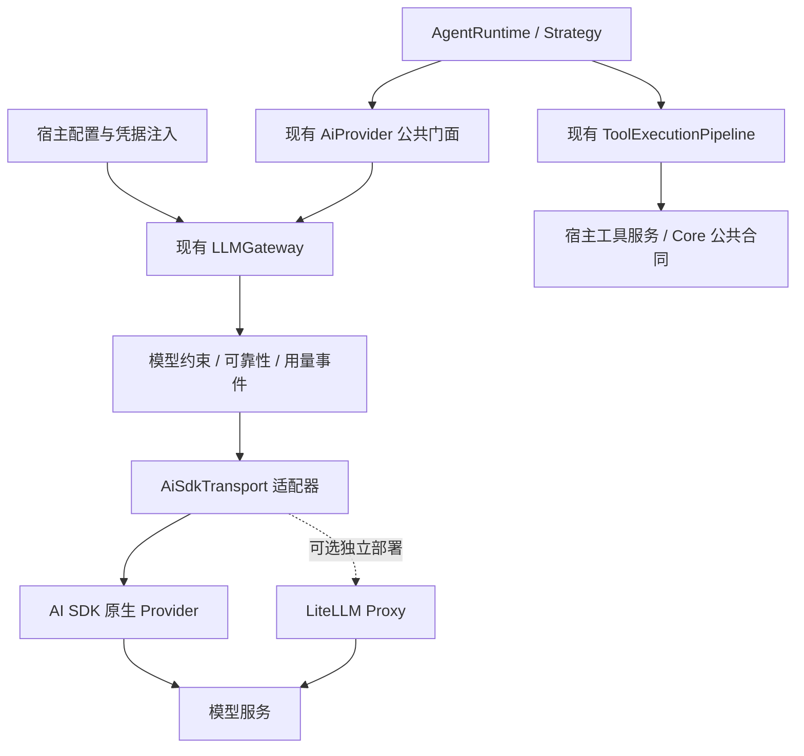

# LLM 成熟实现接入：架构补充方案

2026-09-20。接续[接口对接层研究](../interface-study-2026-09-20/architecture.md)。研究基线：AlembicAgent `94df98fcffb8b57b8e9913fc4e2377ff730951d6`；本地 TencentDB-Agent-Memory `06414ac10766b9bd61e4a69f3cf0ea414afb6d4f`。

用户已接受此前架构建议，本次要求补充成熟 LLM 项目的接入经验。尚未收到指定目标仓库，以下是基于现有调用链的选型建议，不代表已经安装依赖、替换 Provider 或决定采用外部服务。

## 推荐结论

优先验证 **Vercel AI SDK 的模型与原生 provider 适配能力**，从现有 `LLMTransport` 接缝接入，逐步减少自维护的厂商 HTTP 编解码。Alembic 保持 Agent 执行循环、工具权限与执行、运行预算、上下文与证据、Strict 知识生产语义的所有权。

| 候选 | 适合承担的责任 | 对本仓库的判断 |
| --- | --- | --- |
| Vercel AI SDK | 进程内模型调用、原生 provider 协议、结构化输出、流事件与用量映射 | 首选验证对象；TypeScript/Node 适配直接，本地腾讯已有实际采用；只引入需要的能力 |
| LiteLLM Proxy | 多宿主统一凭据、费用、模型路由、限流与故障转移 | 出现集中治理需求时作为外部可选服务；增加部署与网络边界，由宿主管理 |
| LangChain JS 模型包 | 按 provider 使用模型调用、消息、tool calling 与结构化输出 | 可行备选；现有需求尚未体现出同时引入第二套消息/Runnable 抽象的收益 |
| 腾讯 standalone runner | 宿主注入、runner factory 与 SDK 装配参考 | 学习接入边界；其自动工具循环、字符串结果和共享 usage 旁路不直接迁入 |

这些项目属于不同层级，不能按“支持多少模型”直接互相替代。AI SDK 的原生 provider 可以直接调用模型服务；采用它不要求部署到 Vercel。LiteLLM 的 Python SDK 与 Proxy 是不同消费方式，本仓若采用后者只消费 HTTP。[AI SDK provider 管理](https://ai-sdk.dev/docs/ai-sdk-core/provider-management)、[LiteLLM Proxy 定位](https://docs.litellm.ai/docs/proxy/quick_start)、[LangChain 模型层](https://docs.langchain.com/oss/javascript/langchain/models)

## 核实版本与证据范围

本次查询 npm 官方 registry，并下载以下已发布包到 ignored `tmp/`，只读审查源码，逐包验证 SHA-512 与 registry integrity 相同。没有运行第三方安装脚本或模型请求。

| 发布包 | 本次核实版本 | 用途 |
| --- | --- | --- |
| `ai` | `7.0.107` | 单次生成封装、重试默认值、工具处理与 mock 接口 |
| `@ai-sdk/provider` | `4.0.17` | `LanguageModelV4`、结果合同与 SDK 错误类型 |
| `@ai-sdk/openai` | `4.0.71` | 原生模型适配与请求取消 |
| `@ai-sdk/google` | `4.0.76` | thought signature 与消息回传 |
| `@ai-sdk/anthropic` | `4.0.58` | 内容块、缓存标记与厂商选项 |

这些版本声明 Node >=22、Apache-2.0；`ai` 与上述 provider 包的 Zod peer 范围为 `^3.25.76 || ^4.1.8`。这是研究快照，实施时需固定兼容组合和 lockfile，不使用漂移的 `latest`。

腾讯本地 `MemoryCore/package.json:102` 声明 `ai ^6.0.164` 与 `@ai-sdk/openai ^3.0.53`，不能把它当成 SDK 7 的迁移模板。官方已发布 [AI SDK 7](https://vercel.com/blog/ai-sdk-7)；当前包源码使用 `LanguageModelV4`、`instructions`、`MockLanguageModelV4`，同时存在部分旧 API 兼容。搜索索引仍有 V3 示例，因此本方案以发布包源码为核验基准。[V4 模型合同](https://github.com/vercel/ai/blob/main/packages/provider/src/language-model/v4/language-model-v4.ts)

复查材料见 [evidence.json](evidence.json)、[包完整性记录](package-integrity.json)和[本仓内存探针结果](local-probe.json)。LiteLLM、LangChain 仅核对官方文档/源码定位，未完成同深度运行兼容性验证；这里没有声称任何候选已经通过 Alembic 接入验收。

## 接入位置与职责

`AiSdkTransport` 是建议新增的实现，当前尚不存在。第一阶段保留 `AiProvider → LLMGateway → Transport`，不再加一个对外 ProviderFacade，也不并行维护两套模型能力注册表。现有 `ModelRegistry` 继续提供 Alembic 有效能力和策略；SDK provider factory 只负责具体模型对象的构造。

| 位置 | 收敛方式 | 真实消费要求 |
| --- | --- | --- |
| `src/ai/AiProvider.ts` | DTO/错误迁往 AI 底层合同模块，旧路径重导出；保持既有方法和公共类 | Gateway、Transport 和调用者实际改用同源合同，解除 Transport 向上引用缺 key 错误工厂的环 |
| `src/ai/gateway/LLMGateway.ts:120` | 保留模型选择、参数策略、可靠性与用量事件；在 transport 构造点接 SDK adapter | 每个配置明确选择一个实现；无失败后偷偷切换旧 transport 的隐式分支 |
| `src/ai/transport/` | 逐 provider 替换 wire 编解码，由 SDK 负责厂商协议 | Alembic adapter 仍负责本地合同转换、错误与 metadata 保真，不能只是 `return result.text` |
| Factory / Provider / Gateway 配置 | 先表征原优先级，再一次解析有效配置 | 区分逻辑 provider、协议、endpoint、模型、凭据引用；Ollama 使用兼容协议仍是 Ollama 身份 |
| AgentRuntime / ToolExecutionPipeline | 保持唯一的业务执行和工具授权入口 | SDK 返回 tool-call 建议，真实执行仍走现有权限、可用性、预算和回执链 |

AI SDK 支持集中 provider 注册，但本仓已有相应事实来源，第一阶段只借用模型对象。源码 `ai/src/model/resolve-model.ts` 表明裸字符串模型会走全局默认 provider；因此 adapter 应显式传入受宿主配置约束的 native model 对象，避免改变现有 endpoint 和凭据路由。

## 必须明确的合同

1. **单次调用与业务循环分开。** SDK 只承担一次模型生成。采用 `generateText` 时显式设 `maxRetries: 0`、单步停止条件，只提供 function tool 的 schema，不传 `execute`、自动工具修复回调或 provider 执行工具。未知工具、无效参数仍需成为可审计的失败建议，不能丢掉后伪装成普通文本成功。采用 SDK 的 Agent/Workflow/Harness 另属运行架构选择，不在本次接入范围。
2. **网络重试只有一个 owner。** 第一阶段由现有 Gateway reliability 负责，SDK 重试关闭。当前 Gateway 默认重试 3 次；SDK `generateText` 默认 2 次；若叠加且失败持续可重试，一次调用最多会变成 `(3+1)×(2+1)=12` 次尝试，业务层再次调用还会继续消耗预算。Proxy 若启用内部重试/故障转移，必须重新分配所有权和总 deadline。[AI SDK 调用选项](https://ai-sdk.dev/docs/reference/ai-sdk-core/generate-text)、[LiteLLM 可靠性配置](https://docs.litellm.ai/docs/proxy/reliability)
3. **取消覆盖所有入口和等待阶段。** chat、tools、structured、embedding、probe，以及排队、退避、HTTP、body/stream 消费都接同一调用级 signal；区分用户取消、单次请求超时与总预算超时。SDK 停止等待、Proxy 断连、上游推理停止是不同事实，结果中不能据此推断“没有产生费用/副作用”。
4. **可回放 payload 与活跃资源分开。** 请求内容、模型选择、schema 和必要调用标识可记录；AbortSignal、连接池、凭据和宿主服务放调用上下文。按 call/attempt 返回 usage、实际模型、finish reason、diagnostics；未知用量保持未知，不伪造成零。
5. **厂商扩展有受控出口。** 保留 tool-call ID、DeepSeek reasoning 回传、Gemini thought signature、已有缓存用量等；扩展字段用 provider 命名空间保存并验证。当前合同没有支持的多模态块、签名和原生工具能力不能仅因 SDK 支持就宣称已交付。持久化/上下文压缩后的往返同样要验收。[Google adapter 源码](https://github.com/vercel/ai/blob/main/packages/google/src/convert-to-google-messages.ts)、[LangChain 消息元数据](https://docs.langchain.com/oss/javascript/langchain/messages)
6. **结构化结果分三种路径。** 原生 schema、JSON mode、文本容错提取必须可区分；本地仍执行业务输出验证。解析修复要有诊断，Strict 生产入口不能将修补成功等同于业务有效。策略未经明确允许时，不自动降级到更弱约束。[LiteLLM 结构化输出](https://docs.litellm.ai/docs/completion/json_mode)
7. **错误先归一化，再进入 policy。** SDK `APICallError` 使用 `statusCode/responseHeaders/isRetryable`，现有 classifier 使用 `status/retryAfterMs`。映射 HTTP 状态、Retry-After、取消来源、超时阶段和可重试性；原始 body、请求 URL 中的敏感字段不直接进入日志。
8. **Embedding 保持独立语义。** 明确 unsupported、failed、cancelled 与真实空输入；保留输入顺序、维度、模型身份及每批完成状态。批次失败不重跑已确认完成批次；切换 embedding 模型不能在同一 Core 索引中无记录混用向量。数据库与索引迁移继续属于 Core。

上游 `ai@7.0.107` 已提供带 `invalid` 的工具调用结果、单步生成默认值和 V4 mock；本仓仍需验证自己的映射。SDK warnings（参数不支持、协议兼容处理等）必须进入 Alembic diagnostics，不能只输出到不可追踪的 console。

## 本次确认的迁移前置问题

以下是现状观察，不是已经修复的结论。源码、probe 输入和观察结果已归档。

| 观察 | 证据 | 对迁移的影响 / 修复方向 |
| --- | --- | --- |
| Structured facade 无 signal 合同/转发；直接 Gateway 支持 | `AiProvider.ts:136,501`；同一预取消 signal：chat 发 0 次 fixture fetch、structured facade 发 1 次、直接 Gateway 发 0 次 | 为公开入口增加兼容的取消选项并贯通；不能只测 SDK 自己的取消 |
| `abort(new Error(...))` 可误计服务端失败 | `shared/reliability.ts:53,234` 与 `errorClassify.ts:65`；排队取消 executor=0，却 failures=1、threshold=1 时 OPEN | 根据有效 signal 和错误来源识别取消，保留原 cause；取消不改变服务端熔断计数 |
| Structured 当前做 JSON 提取，不验证 schema | `LLMGateway.ts:187`；带 required 字段的请求仍接受 fixture `{"wrong":true}` | 分离解析与 schema/业务验证；旧兼容入口行为变化要单独表征与说明 |
| SDK 错误形状直接传入会错分 | `errorClassify.ts:59`；401 `statusCode` fixture 被读成 status=0 且 isServerError=true | 在 SDK adapter 建立明确错误映射，覆盖 400/401/403/429/5xx、网络、取消与超时 |
| Embedding 入口无 signal，失败被转空数组；Google 内部分批却由外层整次重试 | `AiProvider.ts:519`、`LLMGateway.ts:200`、`GoogleTransport.ts:116` | 修复取消和失败可见性；先定义部分批次结果及重试粒度，再接 SDK 批处理 |
| Ollama 的兼容 transport 仍以 openai 作为底层 tag | `LLMGateway.ts:383`、`OpenAiTransport.ts:31` | 代理选择、错误身份与观测使用逻辑 provider，协议选择单独表达 |

前四项由本轮主任务独立内存探针复核；后两项为静态调用链分析，尚未声称完成专用运行复现。结构化取消探针通过 JS 额外传字段观察丢失点，**不表示当前 TypeScript 公开合同已经承诺接受该字段**。schema 探针展示的是 AI 层能力边界，也不代表所有下游业务都缺少验证。

## 腾讯项目的采用与舍弃

`MemoryCore/src/adapters/standalone/llm-runner.ts:304` 实际构造 AI SDK provider，`:340` 调用模型，`:330` 合并 caller signal 和 timeout。这支持将通用 LLM 协议维护交给成熟依赖，同时由宿主控制参数与生命周期。

不能直接复制的部分：

- runner 把 SDK 多步工具循环一起交出去（`:346`），只返回 string（`:439`），usage 放实例 `lastUsage`；Alembic 需要逐调用结构化结果和自己的执行权限链。
- `params.tools={}` 在 enableTools 开启时仍可能装配默认工具（`:292`）；Alembic 的空 allowlist 必须继续表示无工具。
- OpenClaw runner wrapper 只转发部分字段，遗漏每调用工具与取消（`MemoryCore/src/adapters/openclaw/llm-runner.ts:43`）；同一接口不能代替真实接线验收。
- 此前协议 probe 与本轮辅助复查发现未知/多模态块、单 system cache 标记等损失；统一字符串上下文会削弱原协议能力。SDK adapter 应保留所需结构，不能再经过有损通用文本 codec。

本地 checkout 没有找到 LLM runner/protocol adapter 的对应测试源码；package 的测试命令不能作为已验证接入的证据。腾讯提供设计参考，不提供本仓验收结论。

## 实施顺序与清理门槛

| 阶段 | 具体交付 | 完成依据 |
| --- | --- | --- |
| A：固定合同与行为 | AI DTO/错误叶子化；记录配置优先级、逻辑 provider；取消、schema、embedding 问题分开修复 | 保持公共导出兼容；新增行为有真实入口回归；禁止只加未接入 interface |
| B：首个真实 adapter | 固定 AI SDK 版本；让现有 OpenAI facade 经 Gateway 使用 AiSdkTransport，覆盖当前 chat/responses/tools/structured/embedding 消费面 | mock model + fake HTTP 双层证据；请求次数、权限 executor 次数、旧结果合同、配置与代理路由全部验证 |
| C：逐 provider 迁移 | Google、Claude、DeepSeek、Ollama 按实际消费者与差异 fixture 逐个切换 | 各自原生字段、限制、错误路径、取消、用量与现有业务链通过；未通过者保留旧实现并有明确差距 |
| D：删冗余 | 删除已无消费者的自维护 codec、重复 wrapper 和测试；保留必要兼容入口 | 调用者扫描、替代入口、迁移说明、回归证据齐全；不按文件数或行数决定删除 |

单个 provider 切换应按明确配置进行，可回退到上一个已验证配置；同一调用中禁止自动重放工具或已经收到部分结果的任务。SDK 版本升级与 provider 迁移分开提交，便于定位回归。

完整流式事件、更多多模态能力、远端 Proxy 的部署运维属于本轮发现的扩展建议，尚不自动提升为必须实现的新功能。当前 `ModelDef.streaming` 仅有能力标记，不能据此认定 Alembic 已存在完整流式调用合同。接入现有能力后若实施 streaming，需要 end-to-end 的取消、部分结果、背压和终态测试。

## 测试精简方案

保留三类证据，不复制上游 SDK 全套单元测试：

| 测试层 | 本仓负责的断言 |
| --- | --- |
| 共享合同套件 | 配置映射；公共 facade；schema 结果；错误/取消/超时；usage 与 call 绑定；empty tool allowlist |
| 真实 adapter + fake HTTP | URL/apiStyle/auth 注入、厂商字段往返、Retry-After、错误 body、中断和部分结果；不需要真实 API key |
| 少量业务纵向测试 | Runtime → SDK adapter → 返回 tool call → 现有权限管道 → 回传 → 最终结果；拒绝时真实 executor=0，允许时恰好执行一次，确认写入后取消不伪报未写入 |

共享矩阵至少涵盖：成功；400/401/403；429/5xx/连接错误；入队前/排队中/退避中/请求中取消；请求超时与总 deadline；非法 JSON/不符 schema；工具未知/参数错误/拒绝；reasoning/签名/缓存字段往返；embedding 多批部分失败；并发 usage 不串号。未来 stream 另增加收到部分内容后断流及 cancel。

`test/reliability.test.ts`、`provider-facades.test.ts`、`LLMGateway.test.ts`、`transport-protocols.test.ts`、`transport-proxy.test.ts` 已有真实边界用例。迁移后用共享参数化合同合并重复测试；仅为自维护 codec 内部实现而存在的测试，在该 codec 退出且替代证据通过后再删。公开 API、业务权限和 provider 差异用例保留。

## 本轮完成情况

- 完成官方资料、固定发布包源码、现有调用链和腾讯 runner 的交叉核对。
- 34 个本仓 AI 模块的当前源码转译 AST 与 dist 一致后，执行 7 项内存观察；发现问题的断言通过，含义是“现状可复现”，不是“问题修复通过”。
- 5 个上游发布包完整性匹配；没有安装到产品依赖、请求模型、使用真实 API key、修改 Core 或其他产品仓库。
- 只新增研究材料与 ignored 探针；原 `AGENTS.md` / `CLAUDE.md` 修改保留。no-commit 原因：本轮产物属于 workspace ledger，产品源码与 lockfile未变化。
- 下一步最小落点是阶段 A 的 AI 合同及取消/错误归一化；首个 adapter 以本矩阵完成兼容验证后才宣告接入。SDK 主版本和具体 provider 组合仍需在实施版本中锁定。
