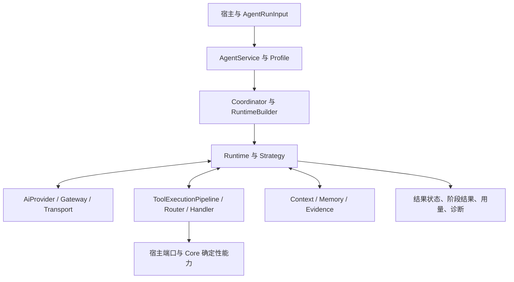

# AlembicAgent 逐文件审查、修复与精简

本轮以 `00a27d7` 为代码基线，按用户直接交办的仓库范围完成源码、调用链、测试、脚本、配置和产品文档审查。覆盖起始 352 个 tracked 文件及 8 个新增文件，共 360 条处置记录；生成依赖元数据和历史报告按结构、来源与消费方核验，不将它们伪称为逐行源码阅读。

产品改动仅在 AlembicAgent。相邻 Core 和宿主仓库用于只读核对接口、消费者和验证；没有接管当前其他 Wakeflow 计划。用户原有 AGENTS.md、CLAUDE.md 的修改保持原样。

## 阅读入口

- [逐文件清单](file-review.md)：每个文件职责、保留/修改/删除去向；完整发现、测试及当前 SHA-256 在 [CSV](file-review.csv) 和 [JSON](file-review.json)。
- [问题处置表](issue-disposition.md)：原始审查及复审 ID、问题、修复依据；同一缺陷的补充分支保留原 ID，不虚计为独立 bug 数。
- [测试精简决策](test-review-decisions.md)：已合并、已删除内容以及保留各层测试的原因。
- [验证与限制](verification.md)：基线、最终命令、结果、环境差异及发布前提。
- `reviews/`：五组模块全文审查、修改复核与最终处置原始材料。原始报告是发现时快照，最终结论以处置表和本轮验证为准。

## 当前功能链路

宿主通过 `AgentRunInput` 调用 `AgentService`，编译 profile，按需由 Coordinator 分维度执行；Builder 注入 provider、工具服务、context 与 policy，构造 Runtime。Runtime 驱动策略与 ReAct 循环，组合消息、计算预算、执行工具、收集证据和诊断。工具层把请求经过权限、schema、调度和 handler 后归一为 envelope；AI 层负责 provider、gateway、transport、重试与协议转换。知识生产围绕证据台账、Analyst 发现、候选提交、独立评审和 Core 持久化端口运行。

输入校验、profile 编译及装配错误仍可能在执行前抛错。候选是否真实入库、readiness 是否达标、管线是否完成和运行是否取消是不同事实；本轮修复了将它们混算成 success 的多处接线。

## 主要修复

| 模块 | 现在的行为 |
| --- | --- |
| Runtime、Service、策略 | 主动取消传到在途 provider，拒绝迟到成功回复；正确执行单轮预算；透传 per-run timeout；等待阻断 hook；后续阶段尊重取消。恢复成功不再被历史 timeout 判失败，明确取消优先于旧诊断。 |
| Coordinator、事件和预算 | 子结果保持输入身份顺序；保留 blocked/timeout；请求不会把自身当响应；无 ContextWindow 也正确计算配额；模型输入不重复计量。 |
| Tool Router、catalog、安全 | 修正全局独占与排队取消；注册/注销状态一致；校验实际参数形状与基础类型；运行前执行声明式 SafetyPolicy 和 capability 命令约束。 |
| 文件与终端 | 合并真实路径约束，拒绝越根和符号链接绕过；显式范围补读可执行；缓存完整查询参数；堵住只读命令的换行、变量展开、子执行及写入选项。 |
| 工具输出与压缩 | 普通 text/structuredContent 同时清理私有字段；JSON 凭证整值脱敏；pytest 失败计数、Git 冲突不再丢失；并发首次加载共享 parser Promise。 |
| Provider | 尊重零重试；并发首请求共享 gateway；正确区分预取消与 deadline；传播 usage、JSON/schema 及超时设置；embedding 能力与实际实现一致；fallback 排除实际主 provider。 |
| 上下文与记忆 | 保留工具 call/result 配对；重置阶段清除旧压缩状态；批量裁剪不污染原结果；会话 ID 校验；旧摘要不覆盖新追加消息；缓存键、证据恢复、嵌套 schema、事务回滚及中文预算修正。 |
| 证据与知识生产 | 使用实际显示行号；正常 Error/failed 源码不再被丢弃；深度槽和 evidenceRefs 路径贯通；RECORD/Producer 可读取已采集证据；只有持久化成功的候选计为提交；风格修复后重建 profile hash。 |
| 评估与构建 | 使用当前 createOrStage/readiness 端口；缺失及无效 sources 不导致整批报告丢失；构建清理旧 dist 且不跟随符号链接；codemod 规划可见、相对引用按新位置改写且不会级联替换。 |
| CI、发布和文档 | CI 接入其 Agent/Core checkout 可执行的完整门禁；实际宿主 strict probe 保留本地 check；中英文 README 随包发布；更新目录、行为边界和已解决例外。 |

## 接口与冗余收敛

- JSON 提取、项目路径校验、稳定序列化及工具业务结果判定各形成一处内部实现。旧 AI JSON 入口保留转导出，公开演化收集入口保留委派。
- `SessionStore` 共用缓存项、TTL/LRU 与序列化逻辑；恢复过程不再构造多余实例和计时器。
- 移除 Evolution 重复结果分类、ContextWindow 不可达分支、已废弃图重试常量、未用解析器常量及测试辅助代码。
- 工具基础契约、adapter、WorkflowRegistry、公开 barrel 经真实宿主消费扫描后保留。未将仍有消费者的接口当作死代码删除。
- 为共享 JSON 实现显式允许 `ai → shared` 依赖；`shared` 保持基础层，工具层仍不能反向依赖 Agent。15 个 package exports 及 451 个导出绑定通过冻结快照。
- 没有重写 Core 的确定性能力，没有引入第二套完整 JSON Schema 权威，也没有改变宿主负责 sandbox 注入、PCV observe-only 等现有产品边界。

## 交付状态

修复与清理保留为可审阅工作区 diff，未创建提交。No-commit 理由：本轮以审查和验证后的修改供用户审阅，且工作区已有用户管理文件变更；未把那些变更混入提交。基线 hash、验证命令、结果、风险和下一步均在本目录归档。

后续接入使用现有公开入口即可；正式发布需要相邻 Core 达到脚本要求的干净状态和明确来源 commit，再运行 release staging。本轮不发布包，也不修改相邻仓来消除该前提。
