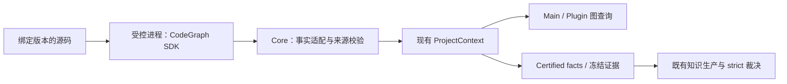

# CodeGraph 接入 Alembic：讨论方案

状态：只读研究与设计建议，未安装依赖、启动 CodeGraph、修改产品源码或执行迁移。方向是让成熟 CodeGraph 承担源码事实提取与图计算，Alembic 继续拥有项目边界、证据版本、知识生命周期与裁决。本文中的接入结构是建议，不是已实现接口。

## 研究对象与版本

研究主线为腾讯实际采用的 [colbymchenry/codegraph](https://github.com/colbymchenry/codegraph)。已在线确认 GitHub 最新发布为 [v1.6.0（2026-08-26）](https://github.com/colbymchenry/codegraph/releases/tag/v1.6.0)，同时检查 main 的 ba3c21e50d9129d2f5f3843ec3728868ae6d47a1。PoC 应固定发布版本及平台包，不能因 main 的 package.json 仍写 1.6.0 就把它与发布产物等同。npm registry 元数据请求超时，本轮不声明 npm 实际安装版本。

腾讯本地版本为06414ac10766b9bd61e4a69f3cf0ea414afb6d4f；AlembicCore 为516e05a。腾讯只声明依赖范围 ^1.2.0，未发现有关锁文件或本地安装，因此不是可直接复用的版本锁定样板。[腾讯 package.json](https://github.com/TencentCloud/TencentDB-Agent-Memory/blob/06414ac10766b9bd61e4a69f3cf0ea414afb6d4f/MemoryKnowledge/package.json)

## 腾讯接入链的实际经验

其链路是：CodeGraph资产 → BuildQueue → HTTPS clone/fetch/reset 的自有副本 → CodeGraph索引 → instancePool → ToolHandler → HTTP文本结果 → Proxy注入的工具调用指引。不是直接读取用户当前未提交的工作树。

可借鉴的是引擎桥接、构建worker注入、管理与查询分开，以及 pending/processing/ready/failed 状态。需要独立设计的是资源所有权、等待初始化、删除时的任务排空和真实全局并发预算。

当前桥接通过平台包内部路径加载 ToolHandler，并只取 MCP content[0].text / isError；这不适合作为 Alembic 的结构化事实入口。见 [bridge.ts](https://github.com/TencentCloud/TencentDB-Agent-Memory/blob/06414ac10766b9bd61e4a69f3cf0ea414afb6d4f/MemoryKnowledge/src/engines/code/bridge.ts)。

静态复核还发现：normalize.ts 没有生产调用；lazy open 未合并进行中的打开；覆盖实例未关闭旧句柄；调度器的并发数主要限制入队而非整个构建；server停机未统一等待索引和关闭pool。这些是源码可见限制，未运行复现，不能泛称该项目资源管理已经通过验证。细节入口为 module.ts:92/119/240、store/code-graph-service.ts:198/277、store/auto-sync-scheduler.ts:281、server.ts:130。

## Alembic 当前有多条分析链

| 链路 | 当前事实来源 | 建议 |
| --- | --- | --- |
| Main SourceGraph | SourceGraphIndexer → source_graph_*；证据注入另受feature flag控制 | 后续委托索引/解析/邻接计算；保留scope与generation语义 |
| Plugin alembic_graph | ProjectContext fileSymbols/fileFlow → certified projection | 首先接入这条真实消费链 |
| StrictFactExecution | 冻结源码 → 内部授权backend → execution receipt | 后续建立真实CodeGraph producer，保留hash与裁决 |
| Guard | 内联文本、enclosing context、Recipe规则 → AST检查 | 图数据不等同全部语法检查，按查询能力单独迁移 |
| ASTChunker | parseToTree → 遍历语法节点 → 有预算源码块 | 仍需完整语法跨度，不能仅用函数列表替换 |
| KnowledgeGraph | Recipe/知识之间的语义关系 | 属于知识域，继续由Alembic管理 |

Main真实入口：Alembic/lib/recipe-pipeline/generate/execution/AiDimensionPreparation.ts:179；Plugin真实图投影：AlembicPlugin/lib/service/project-knowledge-context/project/ProjectGraphProvider.ts:536。Core SourceGraphIndexer.ts:545 的 JS/TS 是符号/导入正则，非JS受支持语言走AST符号提取且暂不产生边；默认inventory也不是所有AST语言的完整扩展名集合。替换这个Indexer不能自动覆盖Plugin图。

ProjectContextService支持handler注入，但 module/module.ts:61/77 等内部直接调用默认file handler，不能只替换顶层registry就宣布全部接通。CallGraphAnalyzer在本次四仓生产检索中没有实例化消费者，不适合作为第一条迁移成功证据。

## 接入层次

建议对外继续用现有 ProjectContext 与 SourceGraph DTO。Core 的内部事实适配负责字段、身份、来源和错误映射；宿主装配负责启动/停止受控CodeGraph进程、工作目录与资源预算。第三方SDK类型留在适配实现内，MCP格式化留在宿主工具出口。

选择官方SDK而不是MCP文本转译。进程隔离便于控制native/WASM内存、超时与终止；普通 worker thread 能改善事件循环占用，但不等同进程级故障隔离。引擎只有一个实例所有者，打开任务共享Promise；先停止接受新任务，排空/取消在途任务，再close。CodeGraph同步close自身不等于等待所有索引任务结束，适配所有者需要承担这一步。

运行时须明确Node版本：官方SDK使用宿主Node，需要22.5+；CLI自带运行时不能证明SDK在任何Node版本上可用。Alembic当前engines允许22.0，因此应在试验中决定提高最低版本或提供受控worker运行时，不能暗中改变兼容范围。[SDK入口](https://github.com/colbymchenry/codegraph/blob/v1.6.0/scripts/npm-sdk.js)

## 第一条迁移切片可以很小

v1.6.0的公开实例方法 extractFromSource(filePath, source) 返回结构化提取结果且不落图数据。它适合直接接收 Core 捕获的文本，初期不必把整个目录索引与冻结快照迁移绑在一起。对应公开入口同时提供语言准备方法。[SDK实现](https://github.com/colbymchenry/codegraph/blob/v1.6.0/src/index.ts#L1129)

建议顺序：

1. 在隔离目录固定版本进行SDK能力探针：用dataRoot下的scratch实例、index:false、明确语言准备，验证传入字符串而不是读到旧磁盘内容；检查平台包、结构化返回和close。
2. 迁移TS/TSX/JS的file-symbols事实提取，输出映射为现有ExtractedFileSymbol，继续经过normalizeFileSymbols/ref与Foundation capture/store。验证Plugin的实际alembic_graph符号视图（工具名为alembic_graph），并修正内部绕过注入的调用缝隙。
3. 扩展file-flow与跨文件索引。对同一文件内容复用一次底层提取，区分未解析引用和已解析关系；再迁移SourceGraph的真实查询和增量路径。
4. StrictFactExecution单独接入新授权factory：使用实际CodeGraph producer/version/config/fixture身份，仍读取冻结bytes并核验inspectedBlobHash。Guard与chunker按所需AST能力验证后迁移。

每阶段达到同一组语义验收后，删除已无人消费的旧实现。只在迁移验证期允许双实现对照；长期不保留两套独立更新的源码全图。Core仍可保存业务所需的冻结事实、版本目录和审计，这与复制一套活动图数据库不同。

## 五个必须设计清楚的接入点

### 身份

CodeGraph内部node id受文件、kind、名称和行号影响，插入行就可能变化，不能作为永久Recipe引用。保留provider id作索引内标识，Alembic引用继续绑定scope/repository/folder/worktree、内容版本、范围与既有canonical ref。[ID实现](https://github.com/colbymchenry/codegraph/blob/v1.6.0/src/extraction/tree-sitter-helpers.ts#L16)

### 内容与可信度

live图用于探索，certified结果用于可重放事实；每次结果都必须能证明它对应哪份源内容。Git HEAD不足以区分dirty/untracked文件和不同worktree。记录engine/config版本与内容清单，性能耗时和updatedAt不进入语义hash。调用边的provenance、confidence/resolvedBy和unresolved保留，启发式推断不能升级成确定事实。[类型](https://github.com/colbymchenry/codegraph/blob/v1.6.0/src/types.ts)

### 存储位置

当前SDK默认把.codegraph放在projectRoot下，CODEGRAPH_DIR仅接受单个目录名，不支持任意dataRoot路径。完整图阶段需要确定sourceRoot/indexRoot分离：优先争取公开的indexDirectory支持；也可对冻结分析采用dataRoot中的内容副本并映射回原source refs。不要依靠反射调用私有constructor、伪造环境变量路径或偷偷改变现有数据根规则。[目录实现](https://github.com/colbymchenry/codegraph/blob/v1.6.0/src/directory.ts)

首个字符串提取切片可在dataRoot下的scratch实例进行，不向真实源码目录创建索引。这只是首片建议，未运行验证。

### 完整性与失败语义

适配必须把未就绪、锁占用、部分解析、取消、失败和正常空结果区分。v1.6.0的sync获取不到文件锁会返回全零结果；不能凭changed=0标fresh。公开OpenOptions声明readOnly，但已检查的open实现没有向数据库打开传递该值，冻结读取不能单靠此选项保证。[打开与同步源码](https://github.com/colbymchenry/codegraph/blob/v1.6.0/src/index.ts#L318)

SDK不会自动继承MCP层的新鲜度提示。由Alembic统一事件/同步入口、检查索引状态并保留旧可用generation；不要同时启动Alembic watcher和另一个未经协调的CodeGraph watcher争写同一索引。

### 能力范围

库提供Rust提取路径，也保留WASM回退；接入CodeGraph不意味着WASM和资源生命周期问题天然消失。符号、关系图和完整syntax Tree是不同能力。ASTGuard的上下文谓词、协议检查、复杂度与chunker的树遍历须逐项映射，保留明确unsupported/unknown，不用空数组伪造成功。[提取路由](https://github.com/colbymchenry/codegraph/blob/v1.6.0/src/extraction/tree-sitter.ts#L6440)

## 试验通过标准

- 文本绑定：同一路径磁盘A、输入文本B时确实得到B；dirty/untracked、无Git目录、同commit不同worktree可区分；冻结后改源码，旧事实仍能重放。
- 字段覆盖：TS/TSX/JS首片完整；随后验证Swift、ObjC/ObjC++、Kotlin、Dart等真实项目。验证声明容器、重载、匿名符号、行列单位、Unicode/CRLF，而非仅统计语言名称。
- 增量：A→B，改名/删除/恢复B时，未改动A的边保持正确；全量与增量结果收敛，扫描失败不当作删除。
- 完整性：解析错误、超限、锁冲突、取消、进程退出和索引版本变化可观察，不发布虚假fresh或空成功。
- 资源：反复初始化/同步/查询/关闭的RSS、句柄和worker数量；最后重跑Alembic现有跨仓证据与strict集成，不只跑CodeGraph自带测试。

性能与语言准确率本轮未实测。成熟度判断应由固定版本在上述样本上的结果支撑，README的速度、token节省和“永不过期”描述不替代本仓验收。

## 本轮交付边界

没有源码提交：用户请求讨论，当前交付为可评审方案与来源记录。未安装CodeGraph、未执行其安装脚本、未修改用户项目或腾讯项目；因此无需产品构建。保留现有未提交文件，文档链接/格式与git diff --check单独验证。下一步建议是第1–2项的隔离SDK探针和file-symbols真实消费链验证。
