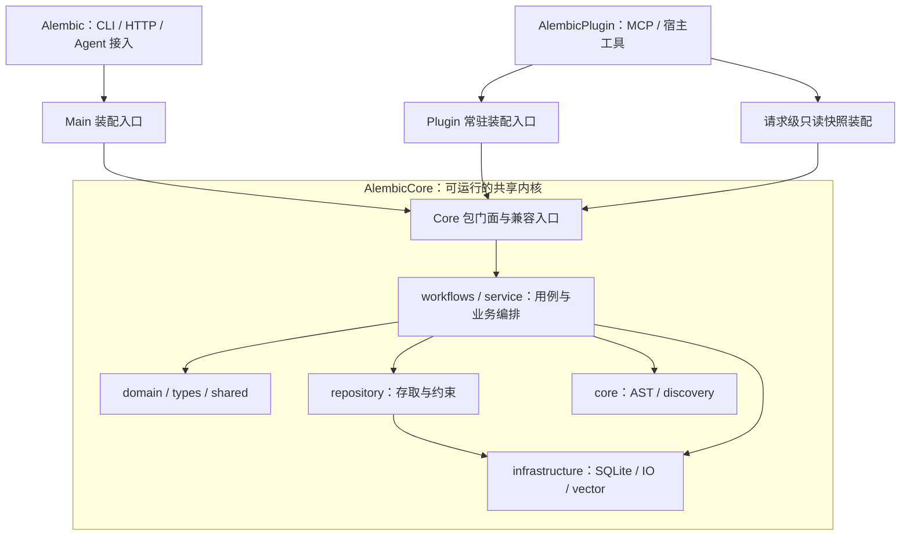

# 接口接线层：现状、参考实现与整理方案

日期：2026-09-20。结论：现有 Core 与宿主分工已经建立，下一步应优先消除过宽的内部依赖、重复的数据投影和不准确的类型承诺，再清理纯路径转发。保留各宿主的装配入口、资源所有权和真实行为差异，避免引入更大的总接口。

本轮交付是源码研究与整理建议，没有修改产品源码、测试、exports 或依赖，也没有创建产品提交。以下迁移顺序与验收条件是建议，不代表实现已完成或测试已通过；不更新其他 Wakeflow 需求、计划或控制状态。

## 1. 基线与研究范围

| 仓库 | 读取版本 | 纳入静态盘点的生产文件 | Core 引用位置 | 不同 Core 导入路径 |
| --- | --- | ---: | ---: | ---: |
| AlembicCore | `4a0b27786775f7c8568a21823a6ef6217d9146b9` | 590 | — | — |
| Alembic | `4dc86fbb95ae67a86ddf215406ae4767901f3dd8` | 214 | 422 | 36 |
| AlembicPlugin | `e0deb9ad0d69f402d2ef52d4c308b465ba324241` | 206 | 251 | 36 |
| TencentDB-Agent-Memory | `06414ac10766b9bd61e4a69f3cf0ea414afb6d4f` | 按链路阅读，不作全仓计数 | — | — |

两宿主当前均通过 `@alembic/core: file:../AlembicCore` 消费 Core。统计由 [AST 脚本](inventory-interfaces.mjs) 与 [完整清单](interface-inventory.json)支持，纳入 Git 已跟踪的 Core `src/`、宿主 `lib/` 和 `bin/`；测试和脚本只用于追加消费者扫描。引用数包括类型引用，不代表运行次数。

“纯转发”仅指文件的有效语句全部为 `export ... from '@alembic/core...'`，不涵盖所有语义适配器。静态扫描识别字面量 import/export/import type/dynamic import 和本地别名，不能证明计算路径加载、外部使用者或发布包深路径不存在。Core AST 插件与数据库 migration、宿主 SkillHooks 等计算导入已单列在 JSON 的 `computedImports` 中。

早期 [baseline.json](baseline.json) 的 sourceFiles 使用磁盘目录计数，包含未跟踪文件或未纳入宿主 bin，与上表口径不同；架构数量结论统一以上述 AST 清单为准。590 个 Core 文件做了接口静态盘点，业务阅读集中于向量检索、知识写入、装配和资源生命周期，不宣称逐行审完全部文件。

## 2. 当前模块层级

| Core 区域 | 文件数 | 实际职责与边界 |
| --- | ---: | --- |
| `workflows/` | 72 | 可复用用例流程、session、briefing、planning、persistence；不实现宿主 Agent 或工具协议 |
| `service/` | 213 | 知识、生命周期、质量、Guard、搜索与向量编排；不能按文件大小直接裁成空接口 |
| `repository/` | 36 | 存取契约、数据映射和仓储实现；SQL/FK 约束由该层承担 |
| `infrastructure/` | 60 | SQLite、IO、缓存、向量后端、事件等技术实现 |
| `domain/`、`types/`、`shared/` | 53 / 13 / 43 | 实体与业务语义、DTO/协议类型、通用计算；类型跨层与运行时依赖分别治理 |
| `core/` | 65 | AST、发现与代码分析叶子能力；目录名称不代表整个产品的中心装配层 |
| `daemon/` | 8 | 共享的后台运行能力；宿主进程入口仍在外层 |
| 根层文件 | 27 | 包入口与跨模块门面等，例如 knowledge、vector、repositories、database |

下图表示主要调用与资源绑定关系，不是完整 import DAG；允许的实际依赖以仓库 layer contract 为准。

宿主负责解析项目/数据根、配置、provider、工具协议、资源创建与关闭。Core 负责确定性业务、持久化策略和可复用流程。已有 `createAlembicRepositories` 从同一个 database handle 创建仓储包；两个宿主分别缓存实例。因此“还有两个 InfraModule”不等于“仓储没有共享”。

`projectRoot` 与 `dataRoot`/Ghost 目录、WriteZone 的职责不同；不能为统一参数而合成全局路径字符串。两套 ServiceContainer 是不同应用的资源所有者。Plugin 还存在每次 Search 独立装配的只读图，不能为了减少构造代码改成复用可写容器。

## 3. 两条真实接线闭环

### 知识写入

`宿主 database/resolver → createAlembicRepositories + KnowledgeFileWriter(dataRoot, WriteZone) → KnowledgeModule → KnowledgeService / sustain 服务 → commitKnowledgeWrite → Markdown → SQLite → 审计、事件、索引维护`。

生命周期晋升、staging 和内容 patch 也已注入同一个 writer；这是避免文件同步恢复旧内容的必要接线。当前没有名为 KnowledgeWriteService 的实现，不应凭空再建一个总写服务。`commitKnowledgeWrite` 是单条异步协调；公开的 `KnowledgeUnitOfWork` 是同步批次文件/数据库协调，契约不同。

文件与 SQLite 不构成跨资源 ACID：文件成功、数据库失败时保留文件真相并归类分歧，由后续 sync/重试恢复。输入校验、实体归一化、仓储约束、生产准入、SQL affected-row 与写后读回证明不同事实；不能当作同一层重复验证删除。详细输入、输出、状态变化和失败边界见 [知识接缝分析](knowledge-seams.md)。

### 向量与检索

常驻链：`KnowledgeModule → HNSW/JSON base store → generation router → VectorService / IndexingPipeline / HybridRetriever → 写入、查询、维护`。VectorService 借用 store，拥有自己的同步协调器；宿主负责等待服务排空后 flush/destroy store。

Plugin 公共 Search 链：`route → 请求快照 → readonly SQLite + snapshot reader → HybridCandidateRetriever → KnowledgeTruthProjector → KnowledgeRetrievalPolicy → Search 返回`。权威行投影、孤儿过滤、region 聚合、排名重建和预算内补召回都在这条链上；它不是 VectorService.hybridSearch 的同名包装。

两端 generation router 的无 active 行为、后端选择、manifest 验证和去重方式不同；legacy HNSW 与 strict JSON 的 filter、错误、量化、排序也有差异。详细比较见 [向量接缝分析](vector-seams.md)。这些差异先固定行为，再判断是否值得统一。

## 4. 接口层应按六种职责整理

| 类别 | 本仓实例 | 整理规则 |
| --- | --- | --- |
| 包兼容入口 | Core exports、根门面、旧导出类型/类 | 稳定导入路径；迁移消费者后再考虑废弃，不能由本地零命中直接删除 |
| 纯路径转发 | 宿主 cache/type/shutdown relay | 无行为且确认非公共路径时可删；有消费者先直接改用现有 Core 入口 |
| 数据投影 | scorer 字段投影、知识真相投影 | 合并完全相同的纯映射；保留调用者增量字段、过滤、排名与空值语义 |
| 能力约束 | VectorIndexReader/Writer、KnowledgeFileStore | 按使用方所需方法收窄；不暴露写入/关闭能力以凑齐总接口 |
| 资源装配 | InfraModule、KnowledgeModule、VectorModule | 宿主绑定身份、配置、ready 与 disposer；共享确定性构造，不将容器搬进 Core |
| 策略与生命周期适配 | generation router、只读快照、文件优先写入 | 视为有行为模块；先写清结果与资源所有权，再讨论共享实现 |

当前 68 个 exports 中，31 个 stable、8 个 provisional、29 个 transitional；61 个精确键，7 个通配键。这里是导出路径数，不是函数数。生产引用中 Main 为 stable 351 / provisional 71 / transitional 0；Plugin 为 209 / 40 / 2，均无未映射引用。

Plugin 仅有的两个生产 transitional 引用来自 `AuditStore.ts` 的 Drizzle singleton/schema。实际 `InfraModule` 已传入 `db.getDrizzle()`，所以它们不能作为生产跨项目错绑数据库的证据。仍有旧构造 fallback；后续需先确认审计存储的共享边界。当前 `/database` 不导出这两个运行时符号，不能只替换 import 路径假装迁移完成。

## 5. 业界与腾讯实现：采用什么、避免什么

以下是原作者资料或项目源码支持的实践，再结合本仓推导落点；不把某项目全部实现称为通用最佳答案。

| 资料 | 可采用的实践 | 在本仓的具体落点 |
| --- | --- | --- |
| [Node.js package entry points](https://nodejs.org/api/packages.html#package-entry-points) | exports 是公共边界；收紧路径可能破坏既有消费者 | 保持现有 Core 路径与运行时类兼容，先整理内部依赖及宿主 relay |
| [Mark Seemann：Composition Root](https://blog.ploeh.dk/2011/07/28/CompositionRoot/) | 在应用入口附近组合依赖；应用拥有装配入口 | Main 与 Plugin 分别装配；Core 保留可复用工厂，不拥有宿主容器 |
| [Martin Fowler：Dependency Injection](https://martinfowler.com/articles/injection.html) | 将配置/装配与依赖的使用分开 | 业务函数接收明确 ports，减少函数深处解析全局容器/项目配置 |
| [LangGraph BaseStore 实现](https://github.com/langchain-ai/langgraph/blob/main/libs/checkpoint/langgraph/store/base/__init__.py) | get/put/search 等便利入口委托到有序 batch/abatch，兼容门面共享执行原语 | 复用已存在的 commit 与纯投影，不为了名称统一再加总服务；不照搬其同步/异步运行机制 |
| [MCP 架构](https://modelcontextprotocol.io/docs/2026-07-28/learn/architecture) | 协议数据层、传输层及宿主职责有明确边界 | tool schema、文本输出、transport 留在 Plugin；本轮不推导为升级现有 SDK/协议的要求 |

本地腾讯代码已追踪 `OpenClaw tool → TypeScript SDK → v2/v3 Gateway → 请求资源解析 → memory search → SQLite FTS/vector → DTO → tool 文本`，版本固定为 `06414ac`。完整路径与行号见 [腾讯代码研究](tencent-reference.md)，代码来源为 [TencentDB-Agent-Memory](https://github.com/TencentCloud/TencentDB-Agent-Memory)。

最值得借鉴的三点是：Gateway 在请求边界绑定已解析的 store/embedding/storage；工厂构造与初始化屏障分别表达；兼容路由共享真实 handler，而不是复制业务实现。Alembic 可对应到“宿主绑定身份与资源 → 窄端口进入 Core → 结构化结果交回宿主”。

参考项目也有需避开的实现：StorePool 在 init 完成前入池，部分 ready 保证由后端自行承担；定时 grace 不是在途操作 lease；某些 embedding 字段以强断言掩盖 optional；rrfMerge 虽有去重注释却未找到生产消费。不能据它的类名或说明，推导出统一初始化、可靠关闭和重复逻辑已经解决。其 provider/tool/HTTP 职责也不适合整体搬入 AlembicCore。

## 6. 建议实施顺序与完成条件

### 第一批：Core 内部依赖与投影

| 顺序 | 文件与具体改法 | 行为兼容与验收条件 |
| --- | --- | --- |
| 1 | `SyncCoordinator.ts`、`RecipeRegionVectorIndex.ts`、`RecipeVectorGeneration.ts`：region 同步依赖收为 listIds/getById/batchUpsert/remove，检查函数仅需前两项；私有 LifecycleVectorStoreBridge 改为方法组合 | 保留 this 绑定、aggregate store 优先于分离 ports、truth remover 与公开配置；验证真实有状态方法调用、region 替换/失败读回及优先级，不改文件格式、排序、阈值 |
| 2 | `ConfidenceRouter.ts` 与 `KnowledgeService.ts`：共享内部纯评分字段投影 | 保留不同 usageGuide fallback，Service 独有 engagement/grounding/steps 等附加字段；比较两个业务入口的完整 scorer 输入、路由和结果；不缓存最终 score，不新增公开门面 |
| 3 | `persistKnowledgeUpdate.ts`：以准确的内部窄 port 替代对 KnowledgeRepositoryImpl 的 Pick 依赖 | 表达 findById/update 的实际 nullable 返回；旧 DB-only 与 file-first 路径、异常分类保持不变；不直接合并两个同名公共 KnowledgeRepository 契约 |

这些切片都有真实调用方，不需要先增加新公共 API 或修改宿主行为。第三项不应为了“独立”手工维护第二份实体 DTO；只声明实际使用的方法和现有实体类型。公共仓储契约一处运行时 class 承诺非 null、一处实现类型可能为 null，后续应单独做兼容迁移，不用强转隐藏差异。

### 第二批：宿主接线与纯 relay

两宿主的 KnowledgeService options 可改为具名变量并使用 `satisfies`，逐项揭示类型差异；保留 Main gateway / Plugin null、动态 source identity、writer 和 awaited vector maintenance 等真实差异。只有已证明完全相同且有多个消费者的构造片段才适合进一步共享。

静态盘点得到 16 个纯 Core relay：5 个有生产消费者，11 个没有发现生产/测试/脚本消费者。下表列出全部 11 个候选与已有替代入口。**它们仍是候选，不是已证明可删除的死代码**；实施前需核对各宿主 exports、打包/发布清单、计算路径及跨仓使用者。

| 宿主 | 候选文件（仓库相对路径） | 现有 Core 入口 |
| --- | --- | --- |
| Main | `lib/infrastructure/cache/CacheService.ts` | `@alembic/core/infrastructure/cache` |
| Main | `lib/infrastructure/cache/GraphCache.ts` | 同上 |
| Main | `lib/types/graph-shared.ts` | `@alembic/core/types/graph-shared` |
| Main | `lib/types/search-wire.ts` | `@alembic/core/types/search-wire` |
| Plugin | `lib/host-runtime/mcp/handlers/TargetClassifier.ts` | `@alembic/core/host-agent-workflows` |
| Plugin | `lib/host-runtime/mcp/handlers/evolution-prescreen.ts` | 同上 |
| Plugin | `lib/infrastructure/cache/CacheService.ts` | `@alembic/core/infrastructure/cache` |
| Plugin | `lib/infrastructure/cache/GraphCache.ts` | 同上 |
| Plugin | `lib/infrastructure/cache/UnifiedCacheAdapter.ts` | 同上 |
| Plugin | `lib/types/graph-shared.ts` | `@alembic/core/types/graph-shared` |
| Plugin | `lib/types/search-wire.ts` | `@alembic/core/types/search-wire` |

其余 5 个 relay 应先迁移实际消费者：Main 的 UnifiedCacheAdapter、shutdown；Plugin 的 coverage-ledger-write、generate-event-types、shutdown。完整消费者文件清单在 inventory 的 `relayFiles` 中。shutdown 还被集成测试消费，不能按生产清单直接批删。

### 第三批：先对齐语义，再决定是否共享

- Main 与 Plugin 的 sourceRef 创建后处理：不可读/ambiguous 状态、512KB 护栏、是否刷新向量、是否等待完成先固定；然后评估消费现有 SourceRefReconciler/RecipeFreshnessService。
- generation routing：先确认无 active、manifest 校验、base/generation 后端和重复 ID 策略；保留终态全代清理的 owner。
- legacy HNSW metadata filter：可评估复用 Core 已有 helper，但保留 Plugin sourcePath 类型保护；strict JSON 的精确键匹配继续独立。
- 知识 update 的准备方式：一处复用已读实体并传 partial patch，一处重新读取并传完整实体；先验证 SQLite 交错写下的文件/DB期望，不能以少一次读取为由直接合并。
- AuditStore：先对照 SQL 映射、schema ownership 和旧构造兼容，再决定是否共用存储实现；现有显式数据库注入无需重复修复。

前三项 Core 整理与 relay 候选属于用户原有架构清理方向。第三批行为对齐是源码研究发现的后续议题，尚未作改变可见行为的产品决定。

## 7. 测试与验证逻辑如何随整理收敛

测试整理按“证明什么事实”分配：Core 测共享业务和持久化语义；宿主测真实注册、参数绑定、初始化/关闭以及协议错误映射。不能仅按同名文件或直接 import Core 判重。

| 应收敛的对象 | 应保留的独有证据 |
| --- | --- |
| 无行为 relay 的逐文件同义断言 | 包入口可加载、类型兼容、真实宿主消费者可运行 |
| 两宿主重复验证同一纯 Core 算法的案例 | 宿主自己的配置选择、writer 注入、资源顺序、返回 DTO/错误映射 |
| 为新增纯映射 helper 单独复制大量测试 | 原业务入口完整输入/输出和特殊 fallback 的回归对照 |
| 重复构造 fixture 与重复排列的同义用例 | SQL abort/ignore、文件拒绝、读回缺失、sync 恢复等不同故障矩阵 |

必须保留 Core 四项边界测试：CoreDeliveryBoundary、CoreToolSystemBoundary、CoreCodexBoundary、CorePackage。知识写入保留真实 SQLite/文件矩阵以及两宿主 KnowledgeModuleFileFirst；只读 Search 保留受限容器能力、文件指纹/单次读取和 StrictPublicationError transport 验证。现阶段没有逐条证明宿主 VectorService/SyncCoordinator 测试与 Core 完全重复，不能先删除这些文件。

实施时每个切片先在已有测试入口固定会受影响的行为，再做改动和定向回归；完成后按仓库要求运行 build:check、test、build、lint 和必要宿主边界检查。发布形态/入口发生变化时再补相应打包检查，避免在无产品变化的研究阶段重跑全部系统。

## 8. 本轮完成证据与限制

已完成 AST 接口盘点、两条真实业务链追踪、本地腾讯实现阅读、原作者/官方资料对照、候选与验证条件归档。`lint:layer-contract`、`lint:public-api-boundary`、`lint:consumer-core-imports` 均通过，详情见 [验证记录](verification.md)。这些结果证明现有静态边界，不证明拟议重构的运行时正确性。

本轮无产品源码改动，因此不需要产品构建或重跑全量测试；没有新 commit。Core/Main/Plugin 原有 AGENTS.md、CLAUDE.md 修改，以及 Core 未跟踪的 coverage/index.ts 均保留。下游当前仍使用既有 file 依赖，无需 vendor 指针或 release 更新。

建议后续从第一批第 1 项开始，按“窄能力替代私有继承桥接 → 业务回归 → Core 提交”的单一切片推进。将净减少的重复实现、真实消费者迁移和保持的行为作为完成依据，不以接口/文件数量下降单独评价结果。
